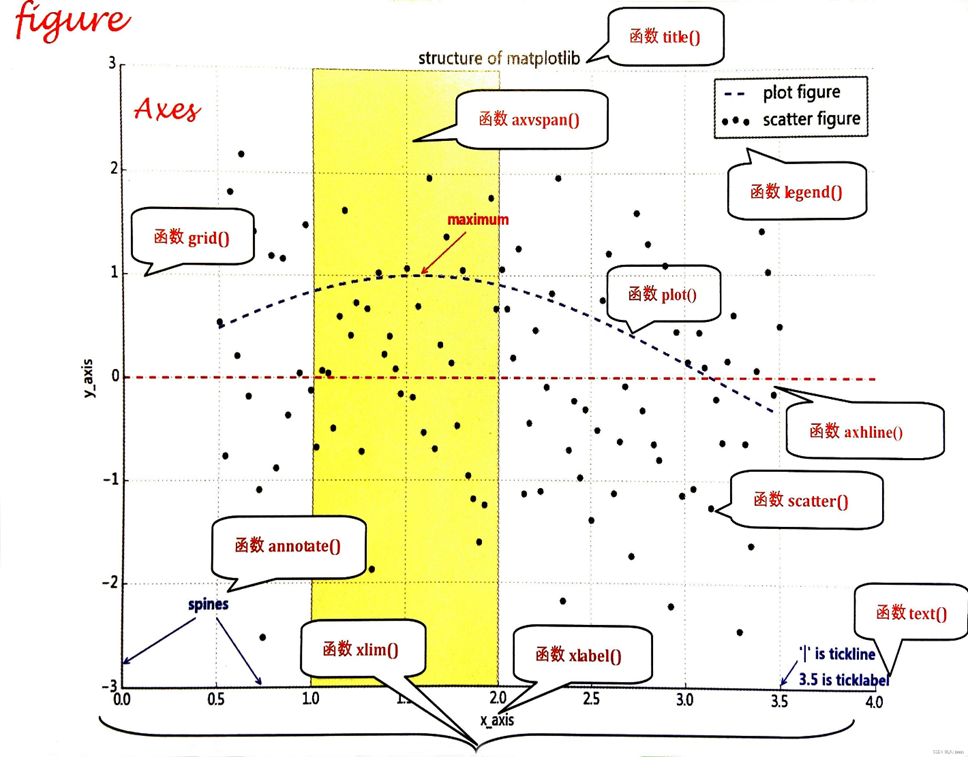
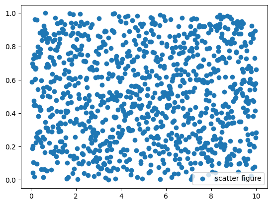
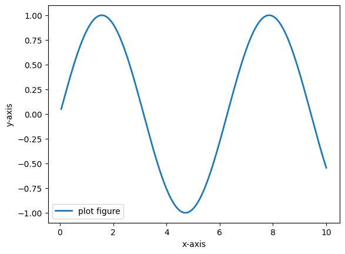
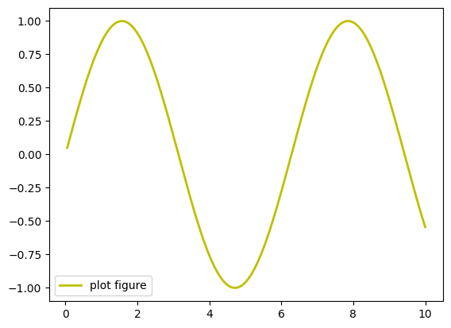
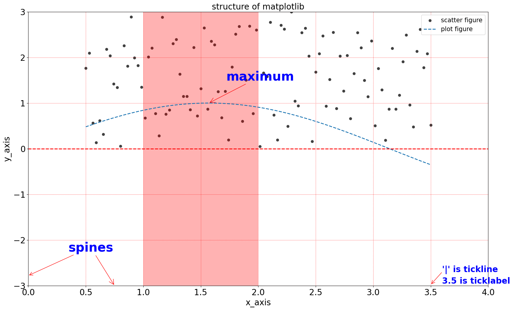
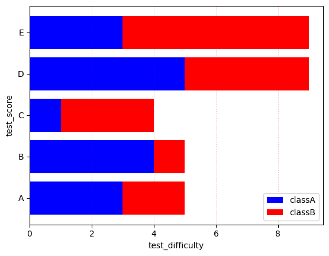
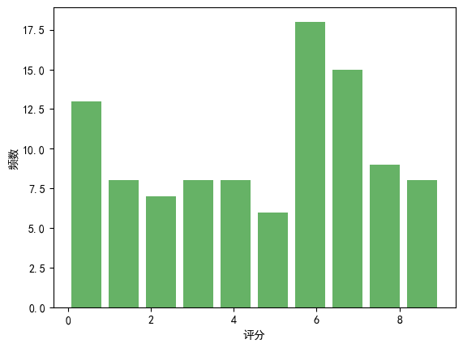
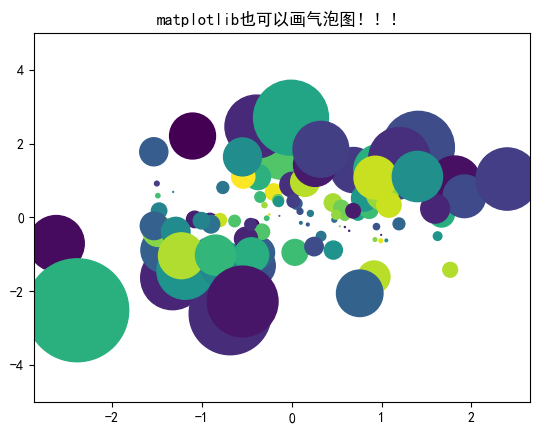
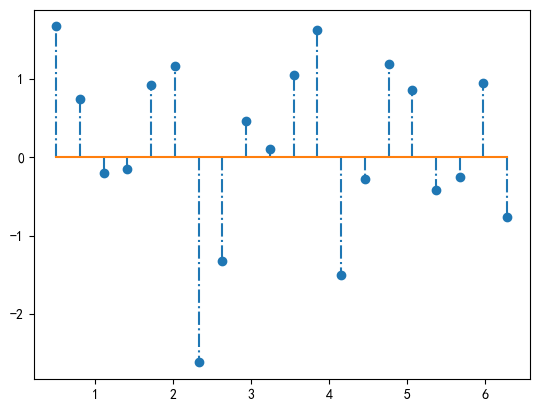
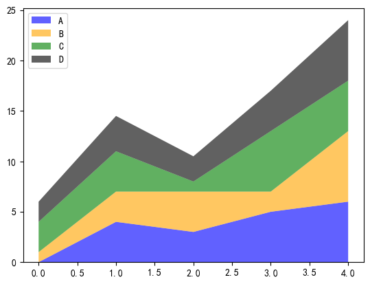

#  Matplotlib

## 1. matplotlib 简介

### 1.1 matplotlib 简介

`matplotlib` 是 `Python` 编程语言及其数值数学扩展包 `NumPy` 的可视化操作界面。它为利用通用的图形用户界面工具包，如 `Tkinter`、`wxPython`、`Qt` 或 `GTK+` 向应用程序嵌入式绘图提供了应用程序接口（`API`）。

此外，`matplotlib` 还有一个基于图像处理库（如开放图形库 `OpenGL`）的 `pylab` 接口，其设计与 `MATLAB` 非常类似。`SciPy` 就是用 `matplotlib` 进行图形绘制。

```python
import matplotlib as mpl              # 导入Matplotlib，用于设置全局样式、参数
import matplotlib.pyplot as plt       # 导入绘图接口，用于画图

# 指定具体中文字体
mpl.rcParams['font.family'] = 'sans-serif'
mpl.rcParams['font.sans-serif'] = ['SimHei'] 

# 不使用unicode_minus模式处理坐标轴轴线为负数的情况    
mpl.rcParams['axes.unicode_minus'] = False       
```

### 1.2 matplotlib 基础函数大全

```python
plot()           # 变量趋势变化
scatter()        # 变量之间关系
xlim()           # x轴数值显示范围
xlabel()         # x轴的标签文本
grid()           # 绘制刻度线的网格线
axhline()        # 绘制平行于x轴的水平参考线
axvspan()        # 绘制垂直于x轴的参考区域
annotate()       # 添加图形内容的指向注释（文本）
text()           # 添加图形内容的非指向文本
title()          # 添加图形内容的标题
legend()         # 标示不同图形的文本标签图例
```

<p align="center"></p>

### 1.3 读入数据

 `pd.read_csv` 函数

1. `!` 后面加 `linux` 命令可以直接在 `notebook` 里面执行
2. `iloc` 方法需要传入行索引（切片）或者列索引（切片），用逗号分隔开

```python
!ls -lr                                          # 列出当前目录内容（按时间逆序）
df = pd.read_csv('./tips_new.csv').iloc[:, 1:]   # 读取CSV文件，并去掉第0列
print(df)                                        # 输出DataFrame内容
```

### 1.4 折线图

`plt.plot` 函数，默认折线图

1. 横纵坐标分别是 `x` 和 `y` 参数（**x，y 长度需一致**）
2. `ls` 代表图线风格，`lw` 代表图线宽度
3. `label` 代表图像标签
4. 因为 `x` 轴数值稠密，所以折线图才会光滑

可以用魔法方法查看 plot 的参数：

| ls     | 效果        | 说明      |
| ------ | --------- | ------- |
| `'-'`  | ───────── | 实线（默认）  |
| `'--'` | ─ ─ ─ ─ ─ | 虚线      |
| `'-.'` | ─ · ─ · ─ | 点划线     |
| `':'`  | ⋯⋯⋯⋯⋯⋯⋯⋯  | 点线（细虚线） |

| lw       | 线条粗细效果  |
| -------- | ------- |
| `lw=0.5` | 很细      |
| `lw=1`   | 默认      |
| `lw=2~3` | 较常用，适中  |
| `lw=5以上` | 很粗，用于强调 |

| c     | 全名          | 颜色  |
| ----- | ----------- | --- |
| `'r'` | `'red'`     | 红色  |
| `'g'` | `'green'`   | 绿色  |
| `'b'` | `'blue'`    | 蓝色  |
| `'k'` | `'black'`   | 黑色  |
| `'y'` | `'yellow'`  | 黄色  |
| `'m'` | `'magenta'` | 洋红  |
| `'c'` | `'cyan'`    | 青色  |
| `'w'` | `'white'`   | 白色  |

| marker | 描述          |
| ------ | ----------- |
| `'.'`  | 点           |
| `','`  | 像素          |
| `'o'`  | 圆圈          |
| `'v'`  | 下三角         |
| `'^'`  | 上三角         |
| `'<'`  | 左三角         |
| `'>'`  | 右三角         |
| `'1'`  | 下三叉         |
| `'2'`  | 上三叉         |
| `'3'`  | 左三叉         |
| `'4'`  | 右三叉         |
| `'s'`  | 方形          |
| `'p'`  | 五边形         |
| `'*'`  | 星形          |
| `'h'`  | 六边形 1       |
| `'H'`  | 六边形 2       |
| `'+'`  | 加号          |
| `'x'`  | 叉号          |
| `'D'`  | 菱形          |
| `'d'`  | 窄菱形         |
| `'_'`  | 横线, 竖线用“\|” |

```python
%matplotlib inline                     # 在Jupyter中内嵌显示图像，否则会弹出窗口

import matplotlib.pyplot as plt
import numpy as np

x = np.linspace(0.05, 10, 1000)         # x = 0.05到10的等间距1000个点
y = np.cos(x)                           # y = cos(x)

# ls=图线风格, lw=图线宽度, label=图像标签
plt.plot(x, y, ls="-", lw="2", label="plot figure")   # 绘制图
plt.legend()                                          # 绘制图例
plt.show()                                            # 显示图像
```

```python
import matplotlib.pyplot as plt
import numpy as np

ypoints = np.array([1,3,4,5,8,9,6,1,3,4,5,2,4])

plt.plot(ypoints, marker = 'd')
plt.show()
```

在 Chrome 中，可以使用 `Ctrl+Shift+右键` 复制图片

<div style="display: flex; justify-content: center; gap: 10px; align-items: center;">
  
  
</div>

### 1.5 绘制 df 数据

1. `plt.figure` 可以预先设置图形大小和清晰度
2. `plt.plot` 可以对 series 绘图，所以使用 df 指定列即可，横轴为 **索引（index）**
3. 图片可以保存，利用 `plt.savefig` 函数

```python
plt.figure(figsize=(30,12), dpi=80)      # 设置图形大小和清晰度
plt.plot(df['tip'], ls="-", lw="2", label="dataframe test")   # 绘制线图
plt.legend()                             # 绘制图例
plt.savefig('image01.png')               # 保存图片
plt.show()                               # 显示图像
```

<p align="center"></p>

### 1.6 绘制散点图

1. `plt.scatter` 函数需要指定横轴和竖轴
2. 同样支持 dataframe 数据

```python
import matplotlib.pyplot as plt      
import numpy as np                   

x = np.linspace(0.05, 10, 1000)      # 生成 0.05 到 10 的等间距 1000 个点
np.random.seed(2024)                 # 设置随机种子
y = np.random.rand(1000)             # 生成 1000 个随机数作为 y

plt.scatter(x, y, label="scatter figure")   # 绘制散点图
plt.legend()                                # 显示图例
plt.show()                                  # 显示图形
```

<p align="center"></p>

### 1.7 设置坐标显示范围

1. 与上一页使用的数据相同
2. 想展示经过筛选的，用 `xlim`/`ylim`
3. `xlim` 是对横轴范围进行筛选，`ylim` 是对纵轴范围进行筛选
4. *比较像裁剪*，显示的圆点可能被切割

```python
import matplotlib.pyplot as plt      # 导入绘图库
import numpy as np                   # 导入数值计算库

x = np.linspace(0.05, 10, 1000)      # 生成 0.05 到 10 的等间距 1000 个点
np.random.seed(2024)                 # 设置随机种子
y = np.random.rand(1000)             # 生成 1000 个随机数作为 y

plt.scatter(x, y, label="scatter figure")   # 绘制散点图
plt.legend()                                # 显示图例

plt.xlim(0, 10.5)                       # 设置横轴范围
plt.ylim(0, 1)                          # 设置纵轴范围

plt.show()                              # 显示图形
```

<p align="center"></p>

### 1.8 坐标轴命名

1. `xlabel` 为横坐标命名， `ylabel` 为纵坐标命名
2. 几乎所有的可视化的最后阶段产出都需要重命名，才能更清晰地表达图形含义

```python
import matplotlib.pyplot as plt    # 导入绘图库
import numpy as np                 # 导入数值计算库

x = np.linspace(0.05, 10, 1000)    # 生成 0.05 到 10 的等间距 1000 个点
y = np.sin(x)                      # 计算 y = sin(x)

plt.plot(x, y, ls='-', lw='2', label='plot figure')   # 绘制折线图
plt.legend()                        # 显示图例

plt.xlabel("x-axis")                # x轴名称
plt.ylabel("y-axis")                # y轴名称

plt.show()                          # 显示图形
```

<p align="center"></p>

### 1.9 网格线

 `grid` 函数

1. `linestyle` 是网格线的格式
2. `color` 是颜色
3. `linewidth` 是线的粗度
4. 可以通过更改参数来获得最满意的搭配网格

```python
import matplotlib.pyplot as plt      # 导入绘图库
import numpy as np                   # 导入数值计算库

x = np.linspace(0.05, 10, 1000)      # 生成 0.05 到 10 的等间距 1000 个点
y = np.sin(x)                        # 计算 y = sin(x)

plt.plot(x, y, ls='-', lw='2', c='y', label='plot figure')   # 绘制折线图（黄色）
plt.legend()                          # 显示图例 

# 设置网格线格式、颜色、粗细（点状线、黑色、细网格线）
plt.grid(linestyle=':', color='k', linewidth=1)   

plt.show()                            # 显示图形
```

<p align="center"></p>

### 1.10 参考线

1. `axhline` 添加水平线，`axyline` 添加竖直线
2. `c` 是颜色，`ls` 是参考线格式，`lw` 是线的粗度，参数 `x` 和 `y` 分别指定位置

```python
import matplotlib.pyplot as plt      # 导入绘图库
import numpy as np                   # 导入数值计算库

x = np.linspace(0.05, 10, 1000)      # 生成 0.05 到 10 的等间距 1000 个点
y = np.sin(x)                        # 计算 y = sin(x)

plt.plot(x, y, ls='-', lw='2', c='y', label='plot figure')   # 绘制折线图（黄色）
plt.legend()                                                 # 显示图例 
plt.axhline(y=0.0, c='b', ls='--', lw='2')                   # 水平线
plt.axhline(x=0.0, c='b', ls='--', lw='2')                   # 竖直线
plt.show()                                                   # 显示图形
```

<p align="center"></p>

### 1.11 高亮区域

1. `axvspan` 代表竖直区域，`axhspan` 代表水平区域
2. `facecolor` 代表了区域的颜色，`xmin`、`xmax`、 `ymin`、`ymax` 代表了区域的范围
3. `alpha` 为透明度

```python
import matplotlib.pyplot as plt      # 导入绘图库
import numpy as np                   # 导入数值计算库

x = np.linspace(0.05, 10, 1000)      # 生成 0.05 到 10 的等间距 1000 个点
y = np.sin(x)                        # 计算 y = sin(x)

plt.plot(x, y, ls='-', lw='2', c='y', label='plot figure')   # 绘制折线图（黄色）
plt.legend()                                                 # 显示图例 
plt.axvspan(xmin=4.0, xmax=6.0, facecolor='g', alpha=0.3)    # 竖直区域（绿色）
plt.axhspan(ymin=0.0, ymax=0.5, facecolor='y', alpha=0.3)    # 水平区域（黄色）
plt.show()                                                   # 显示图形
```

<p align="center"></p>

### 1.12 指向型注释文本

`annotate` 函数

1. `xy` 给出被标记坐标位置，`xytext` 给出文本的位置
2. `color` 文本代表颜色，`weight` 代表是否加粗，`arrowprops` 指定了箭头类型、连接方式和颜色

```python
import matplotlib.pyplot as plt              # 导入绘图库
import numpy as np                           # 导入数值计算库

x = np.linspace(0.05, 10, 1000)              # 生成等间距点
y = np.sin(x)                                # 计算 y = sin(x)

plt.plot(x, y, ls='-', lw='2', c='y', label='plot figure')   # 绘制折线图
plt.legend()                                  # 显示图例

plt.annotate(
    "maximum",                                # 注释文本
    xy=(np.pi/2, 1.0),                        # 被标记点位置
    xytext=((np.pi/2)+1.0, 0.8),              # 文本显示位置
    weight='bold',                            # 文本加粗
    color='r',                                # 文本颜色
    arrowprops=dict(arrowstyle='->',          # 箭头样式
                    connectionstyle='arc3',
                    color='b')                # 箭头颜色
)

plt.show()                                    # 显示图形
```

<p align="center"></p>

### 1.13 非指向型注释文本

`text` 函数

1. 首先给出坐标位置，然后给出文本
2. 颜色用 `color` 来指定
3. `weight` 是指文本是否加粗

```python
import matplotlib.pyplot as plt      # 导入绘图库
import numpy as np                   # 导入数值计算库

x = np.linspace(0.05, 10, 1000)      # 生成等间距点
y = np.sin(x)                        # 计算 y = sin(x)

plt.plot(x, y, ls='-', lw='2', c='y', label='plot figure')   # 绘制折线图
plt.legend()                          # 显示图例

plt.text(3.1, 0.09, 'y=sin(x)',       # 文本位置与内容
         weight='bold',               # 文本加粗
         color='b')                   # 文本颜色

plt.show()                            # 显示图形
```

<p align="center"></p>

### 1.14 图形标题

 `title` 指定文本，会默认绘制在图形上侧

```python
import matplotlib.pyplot as plt      # 导入绘图库
import numpy as np                   # 导入数值计算库

x = np.linspace(0.05, 10, 1000)      # 生成等间距点
y = np.sin(x)                        # 计算 y = sin(x)

plt.plot(x, y, ls='-', lw='2', c='y', label='plot figure')   # 绘制折线图
plt.legend()                          # 显示图例

plt.title('y=sin(x) function')        # 添加图形标题

plt.show()                            # 显示图形
```

<p align="center"></p>

### 1.15 文本标签位置

`plt.legend` 函数

 参数 `loc` 有种选择，按照位置去选择

| loc 值            | 位置            |
| ---------------- | ------------- |
| `'best'`         | 自动选择最不遮挡数据的位置 |
| `'upper right'`  | 右上角           |
| `'upper left'`   | 左上角           |
| `'lower left'`   | 左下角           |
| `'lower right'`  | 右下角           |
| `'center'`       | 正中央           |
| `'center left'`  | 中左            |
| `'center right'` | 中右            |
| `'right'`        | 中右            |
| `'upper center'` | 上中            |
| `'lower center'` | 下中            |

```python
import matplotlib.pyplot as plt      # 导入绘图库
import numpy as np                   # 导入数值计算库

x = np.linspace(0.05, 10, 1000)      # 生成等间距点
y = np.sin(x)                        # 计算 y = sin(x)

plt.plot(x, y, ls='-', lw='2', c='y', label='plot figure')   # 绘制折线图

# plt.legend(loc='upper right')      # 可选位置示例（被注释掉）
plt.legend(loc='best')               # 使用 best 自动选择最优位置

plt.show()                            # 显示图形
```

<p align="center"></p>

### 1.16 组间函数组合应用

1. `plt.figure(figsize=(20,12))` 可以设置图片长宽尺寸
2. `plt.xticks(xlist, fontsize=20)` 可以指定 x 轴的刻度和字体大小

示例：

```python
import matplotlib.pyplot as plt

plt.figure(figsize=(8, 4), dpi=100) # 默认figsize=(6.4, 4.8), dpi=100
plt.xticks([0, 1, 2], ['一月', '二月', '三月'], rotation=45)
```

组合实现复杂功能：

```python
import matplotlib.pyplot as plt        # 导入绘图库
import numpy as np                     # 导入数值计算库
from matplotlib import cm as cm        # 导入matplotlib色图模块并简写为cm

# define data
x = np.linspace(0.5, 3.5, 100)         # 生成 0.5 到 3.5 的等间距 100 个点
y = np.sin(x)                          # 计算 y = sin(x)
np.random.seed(2024)                   # 设置随机种子
y1 = np.random.rand(100) * 3           # 生成 0~3 范围内的100个随机数作为散点y值

plt.figure(figsize=(20, 12))           # 设置图形尺寸

# scatter figure
plt.scatter(x, y1, c='0.25', label='scatter figure')    # 绘制散点图

# plot figure
plt.plot(x, y, ls='--', lw=2, label='plot figure')      # 绘制折线图

# set x,yaxis limit
plt.xlim(0.0, 4.0)                      # 设置x轴范围
plt.ylim(-3.0, 3.0)                     # 设置y轴范围

plt.xticks(np.arange(0, 4.5, 0.5), fontsize=20)   # 设置x轴刻度及字体大小
plt.yticks(np.arange(-3, 3+1, 1), fontsize=20)    # 设置y轴刻度及字体大小

# set axes labels
plt.xlabel('x_axis', fontsize=20)       # 设置x轴标签
plt.ylabel('y_axis', fontsize=20)       # 设置y轴标签

# set x,yaxis grid
plt.grid(ls=':', color='r')             # 设置网格线格式和颜色

# add a horizontal line across the axis
plt.axhline(y=0.0, c='r', ls='--', lw=2)   # 添加水平参考线

# add a vertical span across the axis
plt.axvspan(xmin=1.0, xmax=2.0, facecolor='r', alpha=0.3)   # 添加竖向区域

# set annotating information
plt.annotate('maximum', xy=(np.pi/2, 1.0),                  # 标记最大值点
             xytext=((np.pi/2)+0.15, 1.5), weight='bold', color='b',
             arrowprops=dict(arrowstyle='->', connectionstyle='arc3', color='r'),
             fontsize=30)

plt.annotate('spines', xy=(0.75, -3),                       # 标记spines说明
             xytext=(0.35, -2.25), weight='bold', color='b',
             arrowprops=dict(arrowstyle='->', connectionstyle='arc3', color='r'),
             fontsize=30)

plt.annotate('', xy=(0, -2.78),                             # 指向左下刻度线
             xytext=(0.4, -2.32), weight='bold', color='r',
             arrowprops=dict(arrowstyle='->', connectionstyle='arc3', color='r'),
             fontsize=20)

plt.annotate('', xy=(3.5, -2.98),                           # 指向右下刻度线
             xytext=(3.6, -2.7), weight='bold', color='r',
             arrowprops=dict(arrowstyle='->', connectionstyle='arc3', color='r'),
             fontsize=20)

# set text information
plt.text(3.6, -2.7, "'|' is tickline", weight='bold', color='b', fontsize=20)     # 文本：刻度线说明
plt.text(3.6, -2.95, "3.5 is ticklabel", weight='bold', color='b', fontsize=20)   # 文本：刻度值说明

# set title
plt.title("structure of matplotlib", fontsize=20)       # 设置标题

# set legend
plt.legend(loc='upper right', fontsize=15)              # 设置图例位置及字体大小

plt.show()                                             # 显示图形
```

<p align="center"></p>

## 2. matplotlib 绘图函数

#### 2.1 柱状图

 `bar` 函数

1. 可以通过 `rcparams` 设置字体和中文符号显示
2. `tick_label` 是对横轴进行的重命名
3. `hatch` 是柱状图上的花纹格式
4. `color` 是柱子的颜色，`align` 是指柱子对齐的参数

```python
# some simple data
x = [1, 2, 3, 4, 5, 6, 7, 8]                        # x轴数据
y = [3, 1, 4, 5, 8, 9, 7, 2]                        # y轴数据

# create bar
plt.bar(x, y, align='center', color='r',            # 绘制柱状图
        tick_label=['q', 'a', 'c', 'e', 'r', 'j', 'b', 'p'],  # 横轴标签
        hatch='/')                                  # 柱状图花纹

plt.xlabel("箱子编号")                               # x轴标签
plt.ylabel("箱子重量(kg)")                           # y轴标签
plt.show()                                          # 显示图形
```

<p align="center"></p>

### 2.2 堆积柱状图

1. 大部分设置于普通柱状图相同
2. 区别在于：首先要画 2 次柱状图; 其次第二个柱状图要使用参数 `bottom` 来实现堆积

```python
# some simple data
x = [1, 2, 3, 4, 5]                            # x轴数据
y = [3, 4, 1, 5, 3]                            # 第一组柱状数据
y1 = [2, 1, 3, 4, 6]                           # 第二组柱状数据
tick_label = ['A', 'B', 'C', 'D', 'E']         # 横轴标签

# create bar
plt.bar(x, y, align='center',                 # 绘制第一组柱状图
        color='b', tick_label=tick_label,
        label='classA')

plt.bar(x, y1, align='center',                # 绘制第二组柱状图
        color='r', bottom=y,                  # bottom=y 实现堆积效果，y是一个列表
        tick_label=tick_label,
        label='classB')

plt.xlabel('test_difficulty')                  # 设置x轴名称
plt.ylabel('test_score')                       # 设置y轴名称

# set x-axis grid
plt.grid(axis='y', ls=':', color='r', alpha=0.3)   # 设置网格（仅y轴）

plt.legend()                                   # 显示图例
plt.show()                                      # 显示图形
```

<p align="center"></p>

### 2.3 多系列对比柱状图

1. 多系列柱状图是通过改变 x 轴的值来实现并列和对比效果的，可以设定对比系列间距，参数为 `bar_width`
2. 如果 A 和 B 不想紧挨着，可以在横轴基础上再加上一个小间隔，例如 `0.05`
3. `alpha` 可以设置颜色的饱和度

```python
# some simple data
x = np.arange(5)                                  # 生成 x = [0,1,2,3,4]
y = [3, 4, 1, 5, 3]                               # 第一组柱状数据
y1 = [2, 1, 3, 4, 6]                              # 第二组柱状数据
bar_width = 0.35                                  # 柱状条宽度
tick_label = ['A', 'B', 'C', 'D', 'E']            # 横轴标签

# create bar
plt.bar(x, y, bar_width,                          # 绘制第一组柱状图
        align='center', color='b', label='classA',
        hatch='/', alpha=0.4)

plt.bar(x + bar_width + 0.05,                     # 绘制第二组柱状图（并列显示）
        y1, bar_width,
        align='center', color='r', label='classB',
        hatch='//', alpha=0.6)

plt.xlabel('test_difficulty')                      # 设置 x 轴名称
plt.ylabel('test_score')                           # 设置 y 轴名称

# set x-axis grid
plt.grid(axis='y', ls=':', color='r', alpha=0.3)   # 设置 y 轴网格

# set x-axis ticks and tick_labels
plt.xticks(x + bar_width / 2, tick_label)          # 设置刻度位置与标签

plt.legend()                                       # 显示图例
plt.show()                                         # 显示图形
```

<p align="center"></p>

### 2.4 水平柱状图

1. `barh` 用于绘制 水平柱状图，与 `bar`（垂直柱状图）相对
2. 水平柱状图特别适合类别名称较长、或垂直空间不足的场景

```python
import matplotlib as mpl                     # 导入matplotlib主模块
import matplotlib.pyplot as plt              # 导入绘图库

# 解决matplotlib无法显示中文问题
mpl.rcParams['font.sans-serif'] = ['SimHei']        # 指定中文字体为黑体
mpl.rcParams['axes.unicode_minus'] = False          # 解决负号显示问题

# some simple data
x = [1, 2, 3, 4, 5, 6, 7, 8]                        # y轴对应的类别
y = [3, 1, 4, 5, 8, 9, 7, 2]                        # 每个类别的数值

# create bar
plt.barh(x, y,                                      # 绘制水平柱状图
         align='center',
         color='c',                                 # 青色
         tick_label=['q', 'a', 'c', 'e', 'r', 'j', 'b', 'p'],
         hatch='/')

# set x,y_axis label
plt.ylabel("box_no")                                # y轴标签（仍为竖直方向）
plt.xlabel("box_weight(kg)")                        # x轴标签（仍为水平方向）

plt.show()                                          # 显示图形
```

<p align="center"></p>

### 2.5 水平堆积柱状图

1. 第二个柱状图要使用参数 `left` 来实现堆积效果
2. 其余设置与普通水平柱状图完全相同（如 `color`、`tick_label`、`align`）

```python
# some simple data
x = [1, 2, 3, 4, 5]                               # y轴对应类别
y = [3, 4, 1, 5, 3]                               # 第一组数据
y1 = [2, 1, 3, 4, 6]                              # 第二组数据
tick_label = ['A', 'B', 'C', 'D', 'E']            # 标签

# create bar
plt.barh(x, y,                                     # 第一组水平柱状图
         align='center',
         color='b',
         tick_label=tick_label,
         label='classA')

plt.barh(x, y1,                                     # 第二组水平柱状图
         align='center',
         color='r',
         left=y,                                    # 关键参数：实现水平堆积
         tick_label=tick_label,
         label='classB')

plt.xlabel('test_difficulty')                       # x轴名称
plt.ylabel('test_score')                            # y轴名称

# set x-axis grid
plt.grid(axis='x', ls=':', color='r', alpha=0.3)    # 设置网格线

plt.legend()                                        # 显示图例
plt.show()                                          # 显示图形
```

<p align="center"></p>

### 2.6 多系列水平对比柱状图

1. 多系列水平柱状图是通过控制 y 轴的值（*这里 y 轴的值仍然是列表 x*）来实现并列和对比效果的，可以设定对比系列间距，参数为 `bar_width`
2. 如右图，如果 A 和 B 不想紧挨着，可以在横轴基础上再加上一个小间隔，例如 `0.05`

```python
# some simple data
x = np.arange(5)                              # y轴位置
y = [3, 4, 1, 5, 3]                            # 第一组数据
y1 = [2, 1, 3, 4, 6]                           # 第二组数据
bar_width = 0.35                               # 柱宽
tick_label = ['A', 'B', 'C', 'D', 'E']         # 标签

# create horizontal bar
plt.barh(x, y, bar_width,                      # 第一组水平柱状图
         align='center', color='b',
         label='classA', alpha=0.5, hatch='/')

plt.barh(x + bar_width + 0.05,                 # 第二组水平柱状图
         y1, bar_width, align='center',
         color='r', label='classB', alpha=0.6, hatch='\\')

plt.xlabel('test_difficulty')                  # x轴标签
plt.ylabel('test_score')                       # y轴标签

# set x-axis grid
plt.grid(axis='y', ls=':', color='r', alpha=0.3)   # 网格

# set x-axis ticks and tick_labels
plt.yticks(x + bar_width / 2, tick_label)      # 设置y轴刻度标签

plt.legend()                                   # 图例
plt.show()                                     # 显示图形
```

<p align="center"></p>

### 2.7 直方图

`hist` 函数

1. `bins` 是柱子的个数
2. `rwidth` 是间隔
3. `histtype` 是指直方图的形式
4. `color` 是柱子颜色
5. 更改 `histtype` 参数来决定外观选择
`histtype` 参数值：

| 值              | 描述           |
| -------------- | ------------ |
| `'bar'`        | 传统直方图条形      |
| `'barstacked'` | 堆叠直方图    |
| `'step'`       | 线框直方图    |
| `'stepfilled'` | 填充的线框直方图 |

```python
# 解决matplotlib无法显示中文问题
mpl.rcParams['font.sans-serif'] = ['SimHei']        # 设置中文字体
mpl.rcParams['axes.unicode_minus'] = False          # 解决负号显示问题

# set test scores
np.random.seed(2024)                                # 随机种子
boxWeight = np.random.randint(0, 10, 100)           # 生成0–9的100个随机数
x = boxWeight                                       # 数据

# plot histogram
plt.hist(x, bins=10,                                # 柱子数量
         color='green',                             # 柱子颜色
         histtype='bar',                            # 直方图类型
         rwidth=0.8,                                # 柱子之间的距离，下雨1才会有间隔
         alpha=0.6)                                 # 透明度

# set x,y_axis label
plt.xlabel("box_no")                                # x轴标签
plt.ylabel("box_weight(kg)")                        # y轴标签

plt.show()                                          # 显示图形
```

<p align="center"></p>

### 2.8 饼图

`pie` 函数

1. 指定数据和 `labels`
2. `autopct` 指定百分比的显示形式
3. 可以指定 `colors` 配置
4. `startangle` 第一个扇形的起始角度
5. 主要用于*宏观分析*

```python
# 解决matplotlib无法显示中文问题
mpl.rcParams['font.sans-serif'] = ['SimHei']        # 设置中文字体
mpl.rcParams['axes.unicode_minus'] = False          # 解决负号显示问题

# kinds 数据
# kinds = ['jianyi', 'baowen', 'xingli', 'mifeng']    
kinds = ["简易箱", "保温箱", "行李箱", "密封箱"]      # 标签 
colors = ['green', 'yellow', 'blue', 'red']         # 颜色
soldNums = [0.05, 0.45, 0.15, 0.35]                 # 数据

# pie chart
plt.pie(soldNums,
        labels=kinds,              # 标签
        autopct="%5.2f%%",         # 前面的数字表示往右移动，后面的数字表示小数点位数
        startangle=90,             # x正轴为0度
        colors=colors)             # 颜色

# title
# plt.title("sales_percentage_of_boxes")
plt.title("不同类型箱子的销售数量占比")               # 标题

plt.show()                                          # 显示图形
```

<p align="center"></p>

### 2.9 气泡图

`scatter` 函数

1. 与散点图一样，需要指定两列数据
2. `s` 参数是指定气泡大小，支持用函数表达式
3. `c` 代表颜色
4. `marker` 代表形状

```python
np.random.seed(2024)                          # 设置随机种子
x = np.random.randn(100)                      # 生成 x 数据
y = np.random.randn(100)                      # 生成 y 数据
size_n = np.power(10*x + 20*y, 2)             # 计算气泡大小
# s=np.power(10*x+20*y,2)                     
# colormap:RdYlBu                       

plt.scatter(x, y, s=size_n,                   # 数组的次方，标签size
            c=np.random.rand(100),            # 小数表示灰度，0-1颜色逐渐变浅
            # cmap=mpl.cm.RdYlBu,       
            marker='o')                       # 标签形状

plt.ylim(-5, 5)                               # 设置 y 轴范围
plt.title("matplotlib也可以画气泡图！！！")     # 设置标题
plt.show()                                    # 显示图形
```

> [!hint]
> 气泡大小计算公式：`size_n=(10*x + 20*y)**2`，当 `10*x+20*y≈0` 时，平方后气泡大小非常小，对应点大约落在直线 `y≈-0.5 x` 上，所以看到一条小气泡线

<p align="center"></p>

### 2.10 棉棒图

 `stem` 函数

1. 需要指定坐标 `x`、`y`
2. `linefmt` 是棉棒的样式
3. `markerfmt` 是棉棒末端的样式
4. `basefmt` 是基线（`y=0`）的样式

| 参数          | 值                                                        |
| ----------- | -------------------------------------------------------- |
| `linefmt`   | `'-'` 实线， `'--'` 虚线， `'-.'` 点划线， `':'` 点线， `'r-.'` 红色点划线 |
| `markerfmt` | `'o'` 圆圈， `'s'` 方块， `'^'` 三角， `'*'` 星号， `'ro'` 红色圆圈      |
| `basefmt`   | `'-'` 实线， `'--'` 虚线， `':'` 点线， `'k-'` 黑色实线               |

```python
np.random.seed(2024)                       # 设置随机种子
x = np.linspace(0.5, 2*np.pi, 20)          # x 数据
y = np.random.randn(20)                    # y 数据

plt.stem(x, y,
         linefmt='-.',                     # 竖直线样式
         markerfmt='o',                    # 尾部标记样式
         basefmt='-')                      # 基线样式
# plt.stem(x,y,linefmt='-.',markerfmt='o',basefmt='--')  

plt.show()                                 # 显示图形
```

<p align="center"></p>

### 2.11 堆积折线图

 `stackplot` 函数

1. 需要指定横轴 `x` 和所有的纵轴指标
2. `labels` 是堆积的系列的名字
3. `colors` 是每个指定系列的颜色配置，如果没有配置就按照默认分配

```python
x = np.arange(5)                             # x 轴数据
y = [0, 4, 3, 5, 6]                          # 第一组数据
y1 = [1, 3, 4, 2, 7]                         # 第二组数据
y2 = [3, 4, 1, 6, 5]                         # 第三组数据
y3 = (np.array(y1) + np.array(y2)) / 2       # 第四组数据

labels = ['A', 'B', 'C', 'D']                # 标签
colors = ['b', 'orange', 'g', 'k']           # 颜色

# plt.stackplot(x,y,y1,y2,labels=labels,colors=colors)     
plt.stackplot(x,y,y1,y2,y3,labels=labels,colors=colors,alpha=0.618)  # 绘制堆积折线图
# plt.plot(x,y)                       

plt.legend(loc='upper left')                 # 图例放置在左上角
plt.show()                                   # 显示图形
```

<p align="center"></p>

## 3. matplotlib subplot

### 3.1 Subplot 等分画布绘图

#### 3.1.1 面向对象风格

1. `plt.figure` 创建画布
2. `fig.add_subplot` 添加画布
3. `ax.margins` 画布中留白的大小
4. `ax.plot` 与 `plt.plot` 等价，在小画布上绘图

```python
x = np.linspace(0, 2*np.pi, 100)           # x 数据
y = np.cos(x) * np.sin(x)                  # y 数据

fig = plt.figure()                         # 创建画布

ax1 = fig.add_subplot(1,2,1)              3 # 画布分成 1 行 2 列，取第 1 列
ax1.margins(0.03)                          # 设置数据的空白区域
# ax1.margins(3)                         
ax1.plot(x, y, color='r', alpha=0.8)       # 绘图

ax2 = fig.add_subplot(2,2,2)               # 画布分成 2 行 2 列，取第 2 个
ax2.margins(0.7, 0.7)                      # 设置数据的空白区域
ax2.plot(x, y, color='g')                  # 绘图

ax3 = fig.add_subplot(2,2,4)               # 画布分成 2 行 2 列，取第 4 个
ax3.margins(0.1, 0.1)                      # 设置留白
ax3.plot(x, y, color='b', alpha=0.618)     # 绘图

plt.show()                                 # 显示
```

<p align="center"></p>

#### 3.1.2 pyplot 风格

 `plt.subplot` 函数

1. `subplot(121)` 可理解为 1×2 画布，当前绘制在第一个
2. 整体效果与 `fig.add_subplot` 一致

```python
# 也可以直接使用 plt
plt.subplot(121)                         # 创建 1×2 布局，位置 1
plt.margins(0.03)                        # 留白
plt.plot(x, y, color='r')                # 绘图

plt.subplot(222)                         # 2×2 布局，位置 2
plt.margins(0.3, 0.7)                    # 留白
plt.plot(x, y, color='g')

plt.subplot(2,2,4)                       # 2×2 布局，位置 4
# plt.subplot(4,4,11)                    
plt.plot(x, y, color='b')

plt.show()
```

<p align="center"></p>

### 3.2 Subplot 非等分画布绘图

1. `plt.subplot2grid` 创建画布，`shape` 为形状
2. 每次可以创建不同长度宽度的子画布，实现任意形状组合
3. `colspan` 指定占几列，`rowspan` 指定占几行，`loc` 指定位置
4. `plt.tight_layout(w_pad=0.5, h_pad=1.0)` 分别指定左右、上下的边距

```python
# ## subplot只能等分画布，不能设置不同大小
# ## subplot2grid的`rowspan`,`colspan`可以实现非等分画布
# subplot2grid(shape, loc, colspan, rowspan)
# 实现非等分画布

plt.figure(figsize=(20, 12))  # 创建画布并设置整体大小

plt.subplot2grid((4,4),(0,0), colspan=3)  # 整个画布分均为4行4列，从（0，0）开始，占3列
x = np.linspace(0,4,10)
np.random.seed(2024)
y = np.random.randn(10)
plt.scatter(x,y,c='b')
plt.title('scatter',fontsize=30)
plt.xticks(fontsize=20)
plt.yticks(fontsize=20)

plt.subplot2grid((4,4), (0,3))  # 整个画布分均为4行4列，从（0,3）开始，默认占1行1列
plt.title('empty fig1',fontsize=30)
plt.xticks(fontsize=20)
plt.yticks(fontsize=20)

plt.subplot2grid((4,4),(1,0), rowspan=3,colspan=2)  # 整个画布分均为4行4列，从（1,0）开始，占3行2列
plt.plot(range(10), range(10),color='g')
plt.grid(color='gray',alpha=0.9, linestyle=':')
plt.title('line',fontsize=30)
plt.xticks(fontsize=20)
plt.yticks(fontsize=20)

plt.subplot2grid((4,4), (1,2),colspan=2)  # 整个画布分均为4行4列，从（1,2）开始，占2列
plt.title('empty fig2',fontsize=30)
plt.xticks(fontsize=20)
plt.yticks(fontsize=20)

plt.subplot2grid((4,4), (2,2), colspan=2)  # 整个画布分均为4行4列，从（2,2）开始，占2列
plt.plot(x, np.sin(x), marker='*',c='r',alpha=0.7)
plt.title('sin(x)-1',fontsize=30)
plt.xticks(fontsize=20)
plt.yticks(fontsize=20)

plt.subplot2grid((4,4), (3,2))  # 整个画布分均为4行4列，从（3,2）开始，默认占1行1列
plt.plot(x, np.sin(x), marker='*',c='m')
plt.title('sin(x)-2',fontsize=30)
plt.xticks(fontsize=15)
plt.yticks(fontsize=20)

plt.subplot2grid((4,4), (3,3))  # 整个画布分均为4行4列，从（3,3）开始，默认占1行1列
plt.plot(x, np.cos(x), marker='*',c='k')
plt.title('cos(x)',fontsize=30)
plt.xticks(fontsize=15)
plt.yticks(fontsize=20)

# 整个画布的title
plt.suptitle("非等分画布布局",fontsize=50,color='r',alpha =0.65)  # 设置整体标题
plt.tight_layout(w_pad=0.5, h_pad=1.0)  # 自动调整子图间距
plt.show()  # 显示图形
```

<p align="center"></p>
