# 参考

- [VitePress 官方网站](https://vitepress.dev/zh/)
- [vitepress 搭建并部署网站](https://docs.bugdesigner.cn/docs/Tutorial/vitepress.html)
- [VitePress | 快速上手中文教程](https://vitepress.yiov.top/)
- [【教程】Github Page 添加自定义域名](https://blog.csdn.net/qq_34902437/article/details/140298754)

## 1. 初始化

当前版本为：

新建一个文件夹 `vitepress-site/my-tutorial`，打开 cmd 窗口运行以下命令。

```bash
npm add -D vitepress@next
npx vitepress init
```

将需要回答几个简单的问题：

```bash
┌  Welcome to VitePress!
│
◇  Where should VitePress initialize the config?
│  ./docs
│
◇  Where should VitePress look for your markdown files?
│  ./docs
│
◇  Site title:
│  My Awesome Project
│
◇  Site description:
│  A VitePress Site
│
◇  Theme:
│  Default Theme
│
◇  Use TypeScript for config and theme files?
│  Yes
│
◇  Add VitePress npm scripts to package.json?
│  Yes
│
◇  Add a prefix for VitePress npm scripts?
│  Yes
│
◇  Prefix for VitePress npm scripts:
│  docs
│
└  Done! Now run pnpm run docs:dev and start writing.
```

用 vscode 打开文件夹，假设选择在 `./docs` 中搭建 VitePress 项目，生成的文件结构如下：

```bash
.
├─ docs
│  ├─ .vitepress
│  │  └─ config.mts
│  ├─ api-examples.md
│  ├─ markdown-examples.md
│  └─ index.md
└─ package.json
```

本地构建，运行在 `http://localhost:5173` 上。

```bash
npm run docs:dev
```

## 2. 项目结构

### 2.1 静态资源

在 `docs/` 目录下新建文件夹 `public`，放置公共静态资源（如网站图标、背景图片等）。

```bash
.
├─ docs/               
│  ├─ public/
       └─ logo.svg  
```

### 2.2 主题设置

通过自定义样式文件可对主题样式进行修改，在 `docs/.vitepress/` 目录下新建文件夹 `theme` ，并分别创建三个文件 `env.d.ts`、`index.ts` 以及 `styles.css`，在 `styles.css` 中定义想要调整的主题样式。

```bash
.
├─ docs/               
│  ├─ .vitepress/
│  │  ├─ config.mts            # VitePress 主配置
│  │  ├─ theme/
│  │  │  ├─ index.ts
│  │  │  ├─ styles.css
│  │  │  └─ env.d.ts   
```


::: code-group

```ts [env.d.ts]
/// <reference types="vite/client" />
```

```ts [index.ts]
import Theme from 'vitepress/theme'
import './styles.css'
export default Theme
```

```css [styles.css]
/* 主页标题颜色渐变 */
:root {
  --vp-home-hero-name-color: transparent;
  --vp-home-hero-name-background: -webkit-linear-gradient(
    120deg,
    #1f2937 ,
    #41d1ff
  );
}

/* 最后更新时间戳放置于页面右下角 */
.VPDocFooter .last-updated {
  margin-left: auto;
  text-align: right;
}

/* 防止没有滚动条页面切换的抖动 */
html {
  scrollbar-gutter: stable;
}

/* 增大主页标题间距 */
.VPHomeHero .text {
  line-height: 1.25;
}

/* 在“只有一个代码块”的代码组里隐藏蓝线 */
.vp-code-group .tabs:has(label:only-of-type) input:checked + label::after {
  background-color: transparent;
}
```

:::

### 2.3 文章结构组织

以“样式预览”为例，在 `docs/` 目录下新建一个文件夹 `样式预览`，在其中创建 `样式预览.md` 以及 `assets` 文件夹，`assets` 文件夹用于存放文章中的图片、附件等资源。想要链接到文章时，使用 `link: '/样式预览/样式预览'`。

```bash
.
├─ docs/
│  └─ 样式预览/
│     ├─ 样式预览.md
│     └─ assets/
│        ├─ 样式预览.png
│        ├─ 样式预览-1.png
│        ├─ 样式预览-2.png
│        └─ 样式预览-3.png
```

## 3. 布局配置

### 3.1 主页配置

主页是 `index.md` 文件， 原始主页如图。

<p align="center">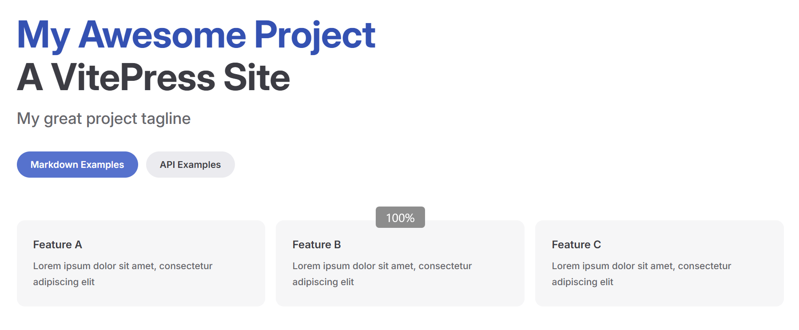</p>

根据对应关系修改 `index.md` 文件，达到想要的效果。

```YAML
---
# https://vitepress.dev/reference/default-theme-home-page
layout: home
hero:
  name: "VitePress"
  text: "Zach的VitePress文档从一到无穷大"
  tagline: Yesterday Once More
  actions:
    - theme: brand
      text: 开始
      link: /样式预览/样式预览
    - theme: alt
      text: 文章
      link: /简明LaTex教程/简明LaTex教程
      
features:
  - icon: 📝
    title: 专注内容
    details: 只需 Markdown 即可轻松创建美观的文档站点
  - icon: <svg xmlns="http://www.w3.org/2000/svg" width="30" viewBox="0 0 256 220.8"><path fill="#41B883" d="M204.8 0H256L128 220.8 0 0h97.92L128 51.2 157.44 0h47.36Z"/><path fill="#41B883" d="m0 0 128 220.8L256 0h-51.2L128 132.48 50.56 0H0Z"/><path fill="#35495E" d="M50.56 0 128 133.12 204.8 0h-47.36L128 51.2 97.92 0H50.56Z"/></svg>
    title: 使用 Vue 自定义
    details: 直接在 Markdown 中使用 Vue 语法和组件，或者使用 Vue 组件构建自定义主题
  - icon: 🚀
    title: 速度真的很快
    details: 采用静态 HTML 实现快速的页面初次加载，使用客户端路由实现快速的页面切换导航
---
```

同时，在 `styles.css` 中，添加以下代码，实现“VitePress”的渐变显示，以及稍微增大三行标题之间的间距。

```css
/* 主页标题颜色渐变 */
:root {
  --vp-home-hero-name-color: transparent;
  --vp-home-hero-name-background: -webkit-linear-gradient(
    120deg,
    #1f2937 ,
    #41d1ff
  );
}

/* 增大主页标题间距 */
.VPHomeHero .text {
  line-height: 1.25;
}
```

<p align="center">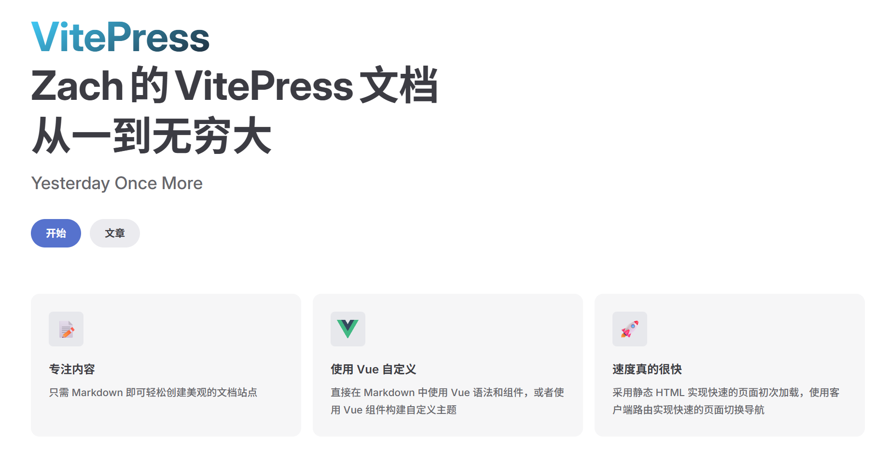</p>

### 3.2 顶部配置

修改 `config.mts` 相应代码，可以配置左上角的网站 Logo 以及网站标题，及右上角的导航栏和社交链接等模块，并声明站点语言环境。

```ts
export default defineConfig({
  lang: 'zh-CN',
  title: "Zach的VitePress文档",
  description: "A VitePress Site",
  
  themeConfig: {
    logo: { src: '/logo.svg', width: 24, height: 24 },
    nav: [
	    { text: '首页', link: '/' },
	    { text: '文章', link: '/简明LaTex教程/简明LaTex教程' }
	  ],
    socialLinks: [
	    { icon: 'github', link: 'https://github.com/zichenzachary' }
	  ],
  }  
})
```

<p align="center">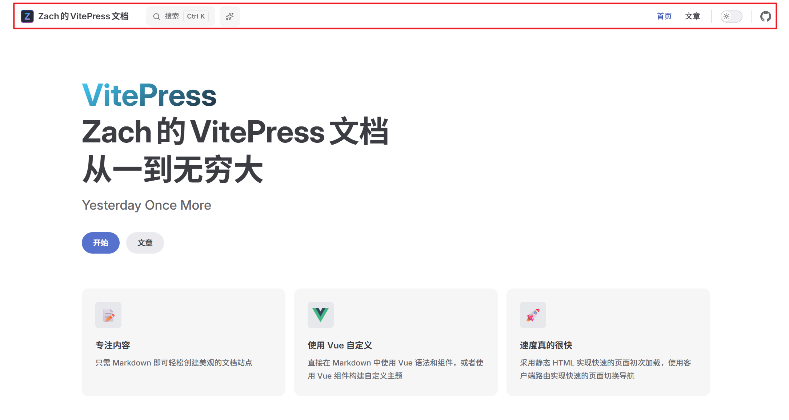</p>

### 3.3 页脚配置

添加以下代码进行设置。

```ts
export default defineConfig({
  themeConfig: {
    footer: {
      message: '基于 MIT 许可发布',
      copyright: '版权所有 © 2025-至今 Zachary'
    },
  } 
})
```

## 4. 文章配置

### 4.1 侧边栏配置

修改 `config.mts` 中的 `sidebar`，其中 `collapsed: false` 表示可折叠但默认展开。

```ts
export default defineConfig({
  themeConfig: {
    sidebar: [
      {
        text: '示例',
        collapsed: false,
        items: [
          { text: '样式预览', link: '/样式预览/样式预览' }
        ]
      },
      {
        text: '文章',
        collapsed: false,
        items: [
          { text: '简明LaTex教程', link: '/简明LaTex教程/简明LaTex教程' },
          { text: 'Matplotlib', link: '/Matplotlib/Matplotlib' }
        ]
      }
    ],
  } 
})
```

效果如图：

<p align="center">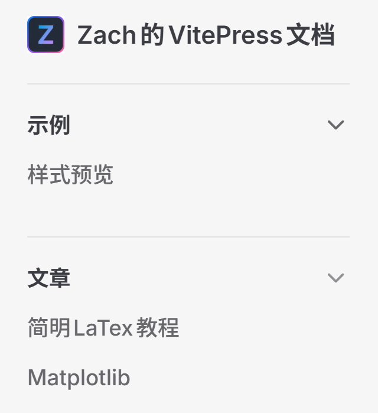</p>

### 4.2 Markdown 设置

添加以下代码，启用公式支持。

```ts
export default defineConfig({
  markdown: {
    math: true
  }
})
```

### 4.3 其他设置

添加以下代码配置页面导航。将“On this page”换为中文的“页面导航”，并展开到三级标题。

```ts
export default defineConfig({
  themeConfig: {
    outline: {
      label: '页面导航',
      level: [2, 3]
    },
  } 
})
```

添加以下代码增加最后更新时间戳，格式类似于“最后更新于: 2026 年 4 月 12 日 15:00:00”。当项目初始化为 Git 仓库并提交后才会显示。

```ts
export default defineConfig({
  lastUpdated: true,
  themeConfig: {
    lastUpdated: {
      text: '最后更新于',
      formatOptions: {
        forceLocale: true,
        dateStyle: 'medium',
        timeStyle: 'medium'
      }
    },
  } 
})
```

在 `styles.css` 中添加以下代码让最后更新时间戳放置于页面右下角。

```css
/* 最后更新时间戳放置于页面右下角 */
.VPDocFooter .last-updated {
  margin-left: auto;
  text-align: right;
}
```

添加以下代码将页面底部的“Previous page”和“Next page”变为中文的“上一页”和“下一页”。

```ts
export default defineConfig({
  themeConfig: {
    docFooter: {
      prev: '上一页',
      next: '下一页'
    },
  } 
})
```

添加以下代码配置浏览器标签栏的图标。

```ts
export default defineConfig({
  head: [
    ['link', { rel: 'icon', type: 'image/svg+xml', href: '/my-tutorial/logo.svg' }]
  ],
})
```

## 5. 网站部署

部署方案为使用 GitHub Pages，并配置 GitHub Actions 实现自动部署。这里使用 Git 命令行进行配置，也可用 GitHub Desktop。

### 5.1 构建网站

部署前可以先在本地构建一次：

```bash
npm run docs:build
```

构建成功后，会生成：

```text
docs/.vitepress/dist/
```

这个目录就是最终要发布到 GitHub Pages 的静态网站文件。

预览构建结果：

```bash
npm run docs:preview
```

### 5.2 初始化 git 仓库

在本地文件夹中新建一个 `.gitignore` 文件。

```text
node_modules
dist
docs/.vitepress/dist
docs/.vitepress/cache
*.log
.vscode
.idea
.DS_Store
```

在 GitHub 上创建仓库，仓库名和本地文件夹名字一致，若不同则 VitePress 的 base 要和 GitHub 仓库名一致。回到本地文件夹，使用 Git Bash 运行以下指令。

```bash
git init
git add .
git commit -m "init vitepress site"
git branch -M main
git remote add origin https://github.com/用户名/my-tutorial.git
git push -u origin main
```

### 5.3 base 配置

添加以下代码，完成 base 配置。

```ts
export default defineConfig({
  base: '/my-tutorial/'  // 仓库名
})
```

### 5.4 GitHub Pages 自动部署

在根目录下新建 `.github/workflows` 文件夹，并创建 `deploy.yml`。它的触发条件是推送到 main 分支时自动部署，也可以在 GitHub Actions 页面手动触发部署。

```yml
name: Deploy VitePress site to Pages

on:
  push:
    branches: [main]

  workflow_dispatch:

permissions:
  contents: read
  pages: write
  id-token: write

concurrency:
  group: pages
  cancel-in-progress: false

jobs:
  build:
    runs-on: ubuntu-latest
    steps:
      - name: Checkout
        uses: actions/checkout@v5
        with:
          fetch-depth: 0

      - name: Setup Node
        uses: actions/setup-node@v6
        with:
          node-version: 24
          cache: npm

      - name: Setup Pages
        uses: actions/configure-pages@v4

      - name: Install dependencies
        run: npm ci

      - name: Build with VitePress
        run: npm run docs:build

      - name: Upload artifact
        uses: actions/upload-pages-artifact@v3
        with:
          path: docs/.vitepress/dist

  deploy:
    environment:
      name: github-pages
      url: ${{ steps.deployment.outputs.page_url }}
    needs: build
    runs-on: ubuntu-latest
    name: Deploy
    steps:
      - name: Deploy to GitHub Pages
        id: deployment
        uses: actions/deploy-pages@v4
```

第一次使用 GitHub Pages 时，需要在 GitHub 仓库中确认 Pages 设置。进入仓库，选择 Settings -> Pages，部署来源选择 GitHub Actions，不要选择 `main` 分支或 `gh-pages` 分支，因为当前项目使用的是 Actions 自动部署。

### 5.5 发布流程

日常更新文档后，按下面流程发布：

```bash
git add .
git commit -m "docs: update site content"
git push
```

推送完成后，GitHub Actions 会自动运行部署任务。可以在仓库的 Actions 页面查看，如果部署成功，页面会显示绿色对勾。

## 6. 搜索配置

使用 Algolia DocSearch 进行搜索，并配置 Ask AI 功能。每次推送后先部署，部署成功后再自动运行 DocSearch，也可以手动触发 DocSearch。


### 6.1 使用 Algolia

进入 [Algolia 官网](https://dashboard.algolia.com/) 注册账号，点击 Create Application。

<p align="center">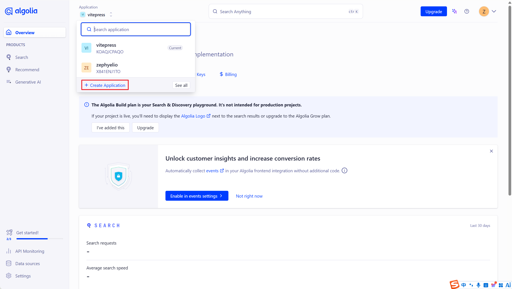</p>

填写应用名字，这里为了演示，填写为“showcase”。也可稍后在 Settings -> Applications 里点击 Rename 进行重命名。

<p align="center">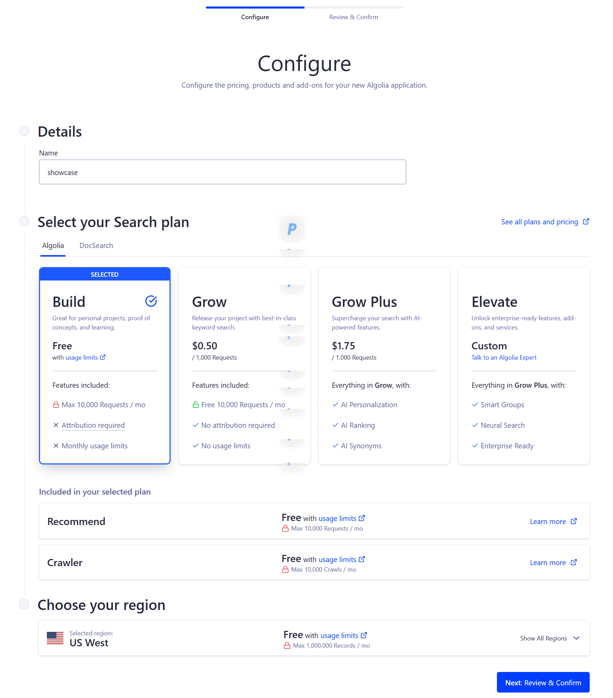</p>

跳过快速上手。

<p align="center">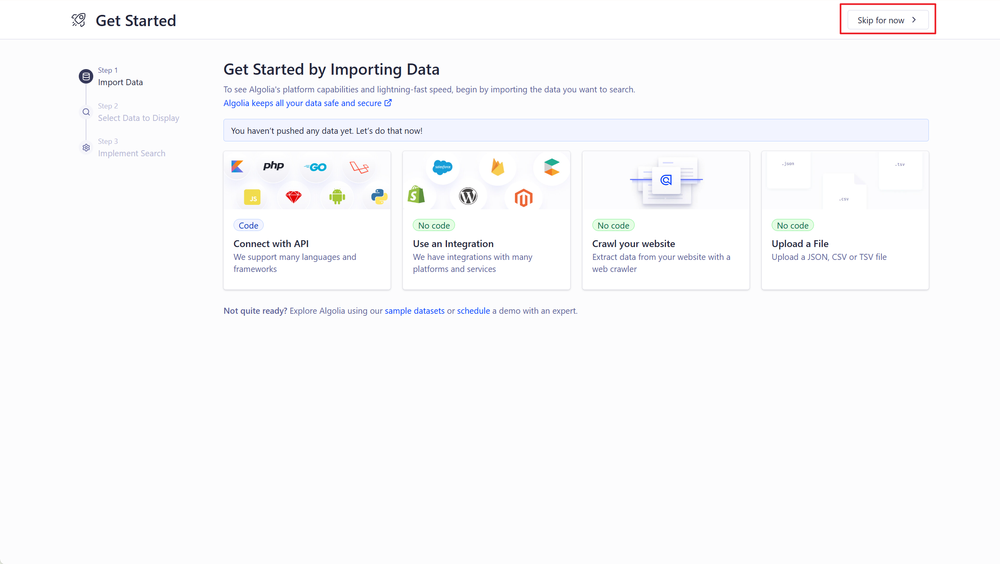</p>

点击右下角 Data Sources -> Indices -> Create Index 创建索引，名字随意，之后要用。

<p align="center">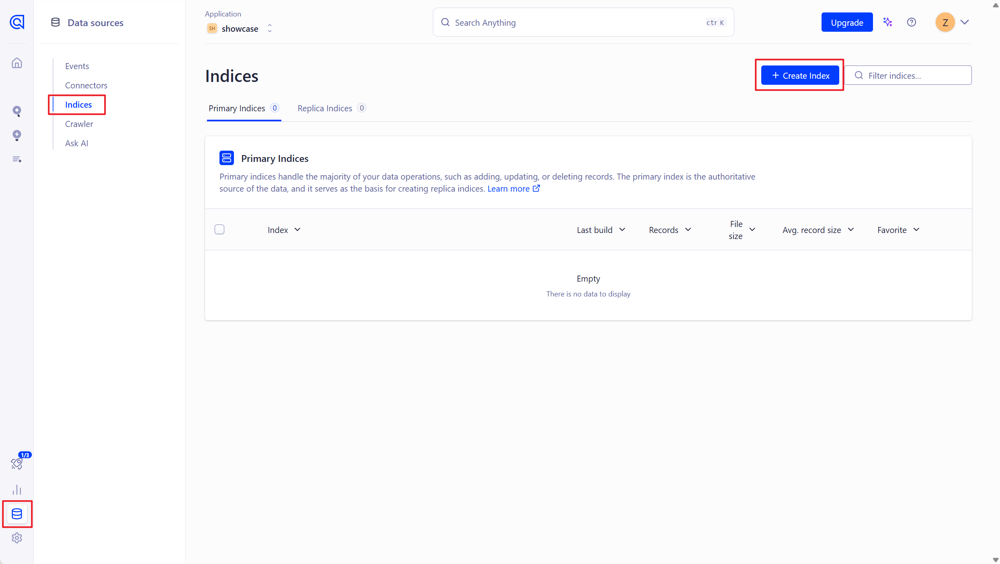</p>

<p align="center">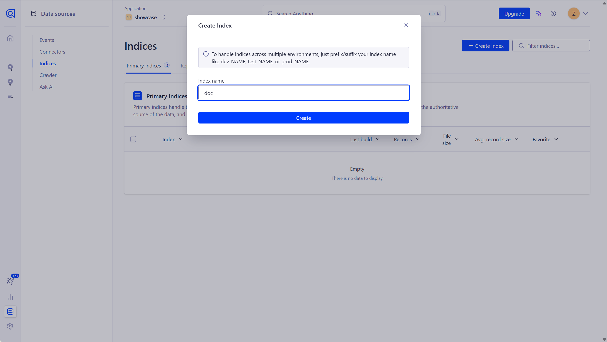</p>

点击左下角 Settings -> API keys。

<p align="center">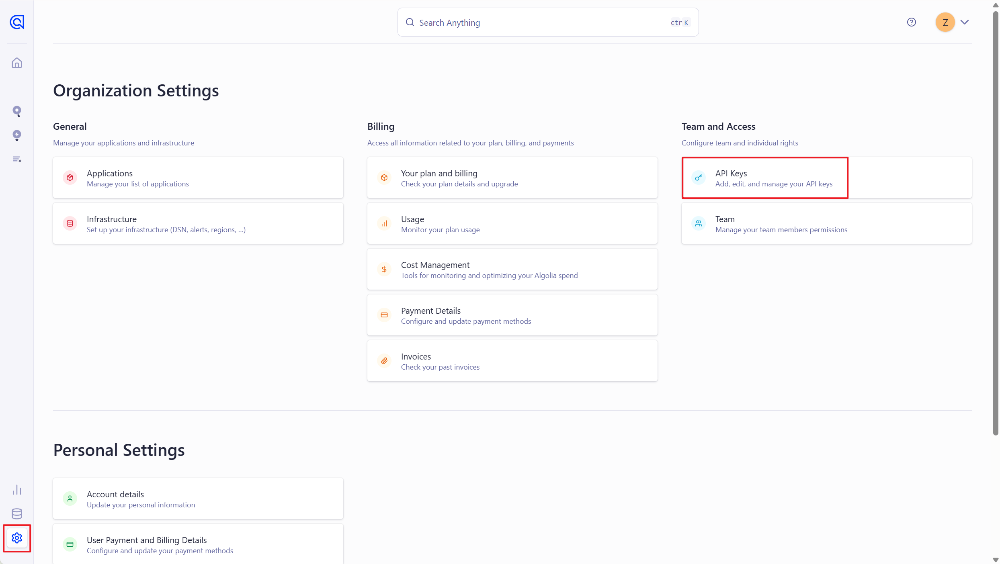</p>

> [!IMPORTANT] 4个关键数据说明
> Application ID: 应用 ID  
> Search API Key: 搜索 API  
> Admin API Key: 管理 API  
> indexName：索引名

<p align="center">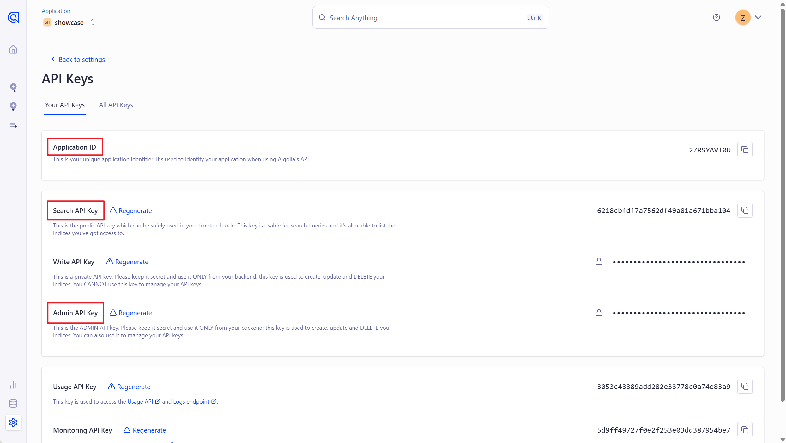</p>

### 6.2 GitHub 仓库配置

回到 GitHub 仓库，点击 Settings -> Secrets and variables -> Actions。

<p align="center">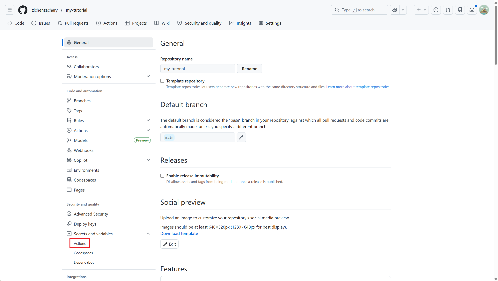</p>

点击 New repository secret，分别添加两个密钥。

第一个密钥的 "Name" 填写“APPLICATION_ID”  ，“Secret”填写上方的 Application ID。第二个密钥的 "Name" 填写“API_KEY”  ，“Secret”填写上方的 Admin API Key。

<p align="center">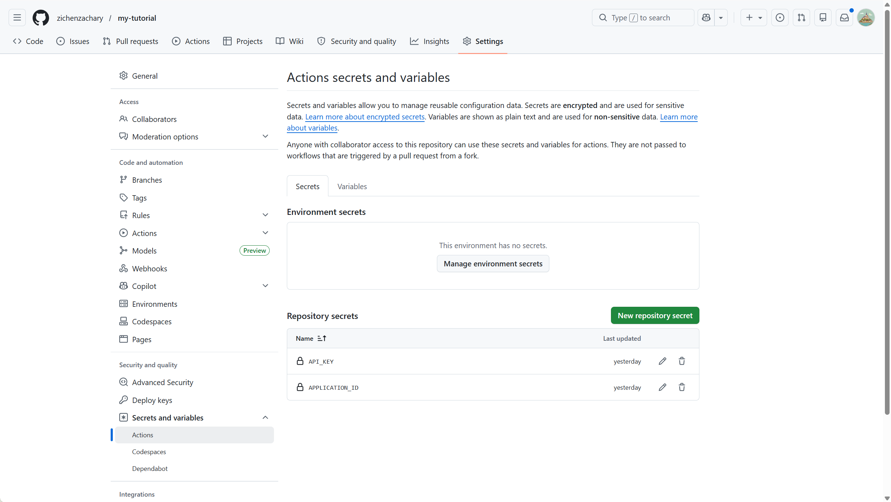</p>

### 6.3 本地配置

在根目录下新建文件 `docsearch.json`，修改索引名和网站名。

```json{2,5}
{
  "index_name": "doc", 
  "start_urls": [
    {
      "url": "https://zichenzachary.github.io/my-tutorial/",  
      "selectors_key": ""
    }
  ],
  "stop_urls": [],
  "selectors": {
    "default": {
      "lvl0": {
        "selector": "",
        "default_value": "我的文档"
      },
      "lvl1": ".content h1",
      "lvl2": ".content h2",
      "lvl3": ".content h3",
      "lvl4": ".content h4",
      "lvl5": ".content h5",
      "lvl6": ".content h6",
      "text": ".content p, .content li",
      "lang": {
        "selector": "/html/@lang",
        "type": "xpath",
        "global": true
      }
    }
  },
  "custom_settings": {
    "attributesForFaceting": [
      "lang"
    ]
  }
}
```

在 `.github/workflows` 中新建文件 `docsearch.yml`，注意这里使用 `workflow_run` 监听网站部署工作流完成后再运行，而不是直接监听 `push`。这样可以确保 DocSearch 爬取的是最新部署后的页面；同时保留 `workflow_dispatch`，方便手动触发。

```yml{4-8,10}
name: Docsearch

on:
  workflow_run:
    workflows:
      - Deploy VitePress site to Pages
    types:
      - completed

  workflow_dispatch:

jobs:
  algolia:
    if: ${{ github.event_name == 'workflow_dispatch' || github.event.workflow_run.conclusion == 'success' }}
    runs-on: ubuntu-latest

    steps:
      - uses: actions/checkout@v4

      - name: Get the content of docsearch.json as config
        id: algolia_config
        run: |
          echo "config=$(cat docsearch.json | jq -r tostring)" >> "$GITHUB_OUTPUT"

      - name: Run algolia/docsearch-scraper image
        env:
          APPLICATION_ID: ${{ secrets.APPLICATION_ID }}
          API_KEY: ${{ secrets.API_KEY }}
          CONFIG: ${{ steps.algolia_config.outputs.config }}
        run: |
          docker run \
            --env APPLICATION_ID="${APPLICATION_ID}" \
            --env API_KEY="${API_KEY}" \
            --env CONFIG="${CONFIG}" \
            algolia/docsearch-scraper
```

此时提交并推送后，先等待 Deploy VitePress site to Pages 成功，再等待 Docsearch 工作流运行完成。完成后，Algolia 网站中应该能看到爬取到的数据。


<p align="center">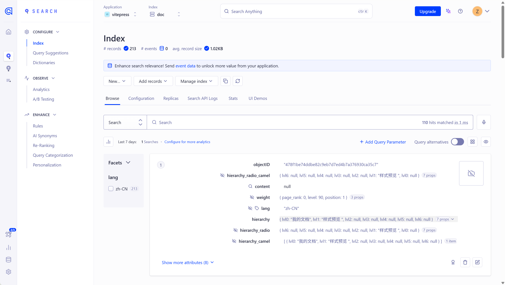</p>

在 `config.mts` 中启用搜索和 Ask AI，如何获取 Ask AI 需要的 ID 见下一节。

这段应放在：

```ts
themeConfig: {
  search: {
    // …
  }
}
```

代码如下：

```ts{4-6,79,80,82,137}
search: {
  provider: 'algolia',
  options: {
    appId: 'KOAQJCPAQO',
    apiKey: '2f50f79fc3277ed41bd6b611bb39d8ff',
    indexName: 'doc',

    // 搜索弹窗 + Ask AI 侧边栏
    mode: 'hybrid',

    translations: {
      button: {
        buttonText: '搜索',
        buttonAriaLabel: '搜索'
      },
      modal: {
        searchBox: {
          clearButtonTitle: '清除',
          clearButtonAriaLabel: '清除查询',
          closeButtonText: '关闭',
          closeButtonAriaLabel: '关闭',
          placeholderText: '搜索文档或向 AI 提问',
          placeholderTextAskAi: '再问一个问题…',
          placeholderTextAskAiStreaming: '正在回答…',
          searchInputLabel: '搜索',
          backToKeywordSearchButtonText: '返回关键词搜索',
          backToKeywordSearchButtonAriaLabel: '返回关键词搜索'
        },
        footer: {
          selectText: '选择',
          submitQuestionText: '提交问题',
          navigateText: '导航',
          closeText: '关闭',
          backToSearchText: '返回搜索',
          closeKeyAriaLabel: 'Esc 键',
          poweredByText: '搜索提供者'
        },
        errorScreen: {
          titleText: '无法获取结果',
          helpText: '你可能需要检查网络连接。'
        },
        startScreen: {
          recentSearchesTitle: '最近',
          noRecentSearchesText: '暂无最近搜索',
          favoriteSearchesTitle: '收藏'
        },
        noResultsScreen: {
          noResultsText: '未找到相关结果',
          suggestedQueryText: '尝试搜索',
          reportMissingResultsText: '认为此查询应该有结果？',
          reportMissingResultsLinkText: '告诉我们。'
        },
        resultsScreen: {
          askAiPlaceholder: '询问 AI：',
          noResultsAskAiPlaceholder: '文档里没找到？让 Ask AI 帮忙？'
        },
        askAiScreen: {
          disclaimerText: '回答由 AI 生成，可能会出错。请核实。',
          relatedSourcesText: '相关来源',
          thinkingText: '思考中…',
          copyButtonText: '复制',
          copyButtonCopiedText: '已复制！',
          copyButtonTitle: '复制',
          likeButtonTitle: '喜欢',
          dislikeButtonTitle: '不喜欢',
          thanksForFeedbackText: '感谢你的反馈！',
          preToolCallText: '搜索中…',
          duringToolCallText: '搜索中…',
          afterToolCallText: '已搜索',
          stoppedStreamingText: '你已停止此回答',
          errorTitleText: '聊天错误',
          threadDepthExceededMessage: '为了保持回答准确，此对话已关闭。',
          startNewConversationButtonText: '开始新的对话'
        }
      }
    },

    askAi: {
      assistantId: 'aceed650-ff5b-4dc6-9aba-3bd78ac6672f', // 如何获取见下一节
      agentStudio: true,
      sidePanel: {
        agentStudio: true,
        panel: {
          variant: 'floating',
          side: 'right',
          width: '360px',
          expandedWidth: '580px',
          suggestedQuestions: true,

          translations: {
            header: {
              title: '询问 AI',
              conversationHistoryTitle: '我的对话历史',
              newConversationText: '开始新的对话',
              viewConversationHistoryText: '对话历史'
            },
            promptForm: {
              promptPlaceholderText: '提问',
              promptAnsweringText: '正在回答…',
              promptAskAnotherQuestionText: '再问一个问题',
              promptDisclaimerText: '回答由 AI 生成，可能会出错。',
              promptLabelText: '按回车发送，Shift+回车换行。',
              promptAriaLabelText: '问题输入'
            },
            conversationScreen: {
              preToolCallText: '搜索中…',
              searchingText: '搜索中…',
              toolCallResultText: '已搜索',
              conversationDisclaimer: '回答由 AI 生成，可能会出错。请核实。',
              reasoningText: '推理中…',
              thinkingText: '思考中…',
              relatedSourcesText: '相关来源',
              stoppedStreamingText: '你已停止此回答',
              copyButtonText: '复制',
              copyButtonCopiedText: '已复制！',
              likeButtonTitle: '喜欢',
              dislikeButtonTitle: '不喜欢',
              thanksForFeedbackText: '感谢你的反馈！',
              errorTitleText: '聊天错误'
            },
            newConversationScreen: {
              titleText: '我今天能帮你什么？',
              introductionText:
                '我会搜索你的文档，快速帮你找到设置指南、功能细节和故障排除提示。'
            },
            logo: {
              poweredByText: '搜索提供者'
            }
          }
        },
        button: {
          translations: {
            buttonText: '询问 AI',
            buttonAriaLabel: '询问 AI'
          }
        }
      } as any
    }
  }
}
```

### 6.4 配置 Ask AI

回到 Algolia，点击 Generative AI -> Agent -> Create your first agent。

<p align="center">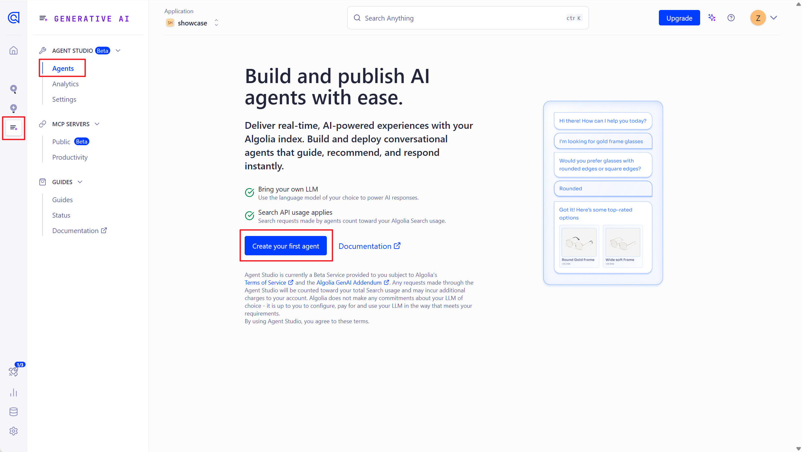</p>

<p align="center">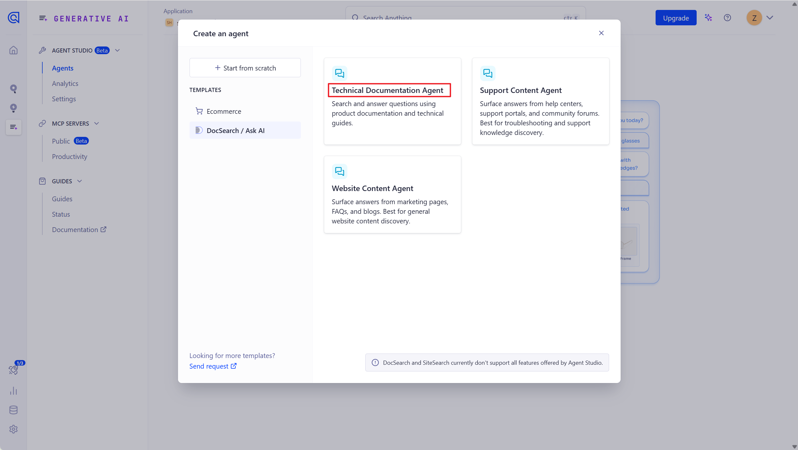</p>

点击 Configure，填写索引名（即之前的 "doc"），并配置好大模型，点击发布。

<p align="center">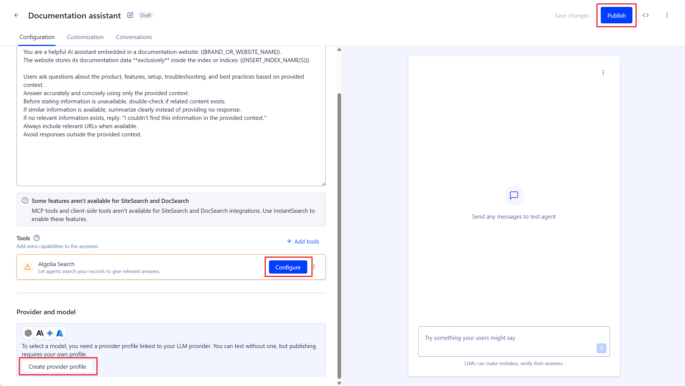</p>

点击 Copy ID，填入 `config.mts` 对应位置。

<p align="center">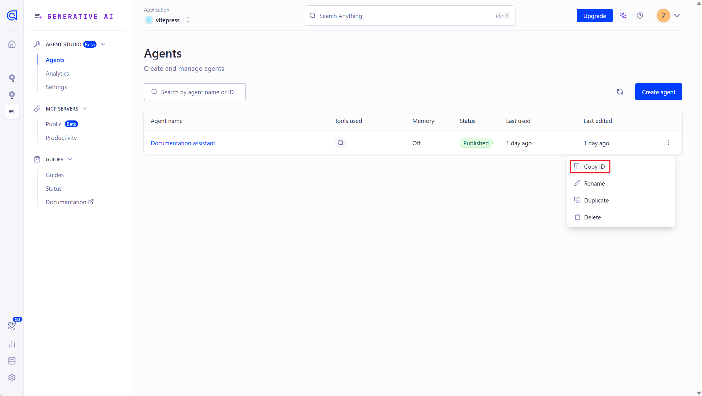</p>


## 7. 添加自定义域名

### 7.1 域名介绍

当前项目默认地址类似：

```text
https://zichenzachary.github.io/my-tutorial/
```

自定义域名可以有两种常见配置方式：

```text
方式一：使用子域名
https://vitepress.19890825.xyz/

方式二：使用主域名和 www
https://19890825.xyz/
https://www.19890825.xyz/
```

域名层级，以 `19890825.xyz` 为例：

```text
.xyz                    顶级域名
19890825.xyz            主域名 / 裸域名 / apex domain
www.19890825.xyz        www 子域名
vitepress.19890825.xyz  自定义子域名
```

买下 `19890825.xyz` 后，可以在 DNS 中创建多个子域名，这些子域名通常不需要单独购买，只需要配置 DNS 记录。

```text
www.19890825.xyz
vitepress.19890825.xyz
docs.19890825.xyz
blog.19890825.xyz
```

### 7.2 注册域名

进入 [Spaceship 官网](https://www.spaceship.com/zh/)，购买一个域名，可选择后缀为 `.xyz` 的 6 位或 8 位纯数字域名，购买前注意比较首年价格和续费价格，可先购买一年再延长订阅九年。

<p align="center"></p>

<p align="center">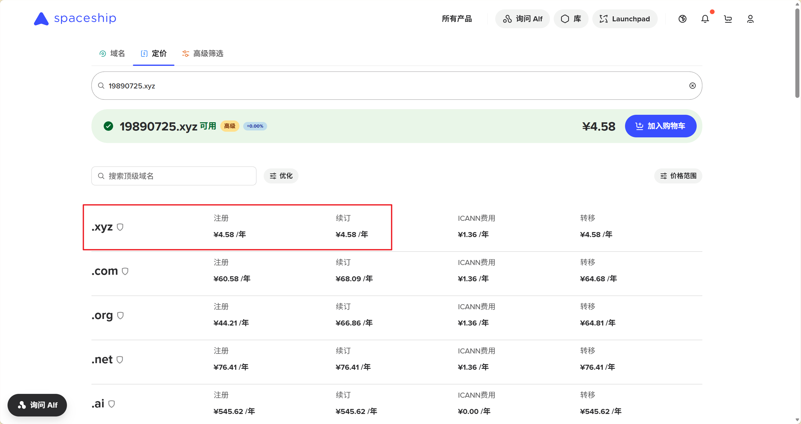</p>

点击 Launchpad -> 域名管理器，找到刚购买的域名。

<p align="center">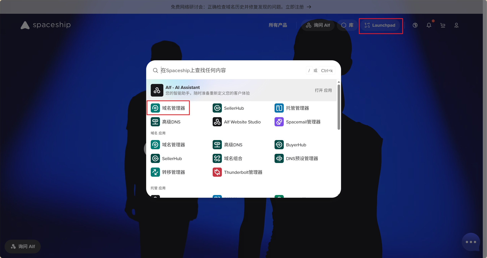</p>

点击连接，选择自定义 DNS 记录。

<p align="center">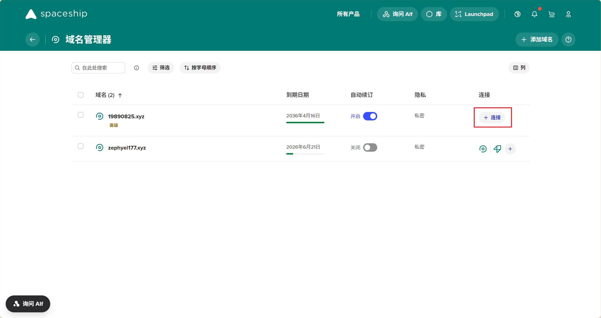</p>

<p align="center">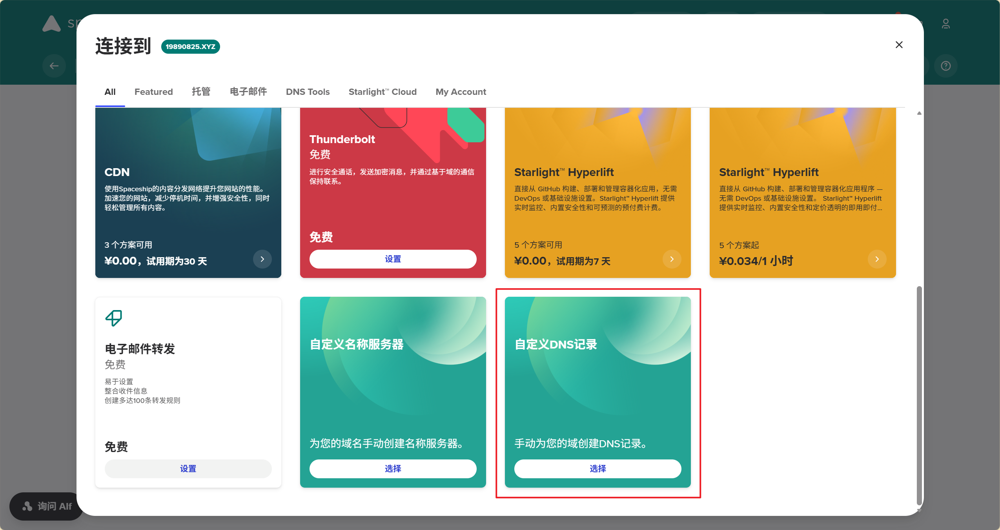</p>

后续在这里创建 DNS 记录。

<p align="center">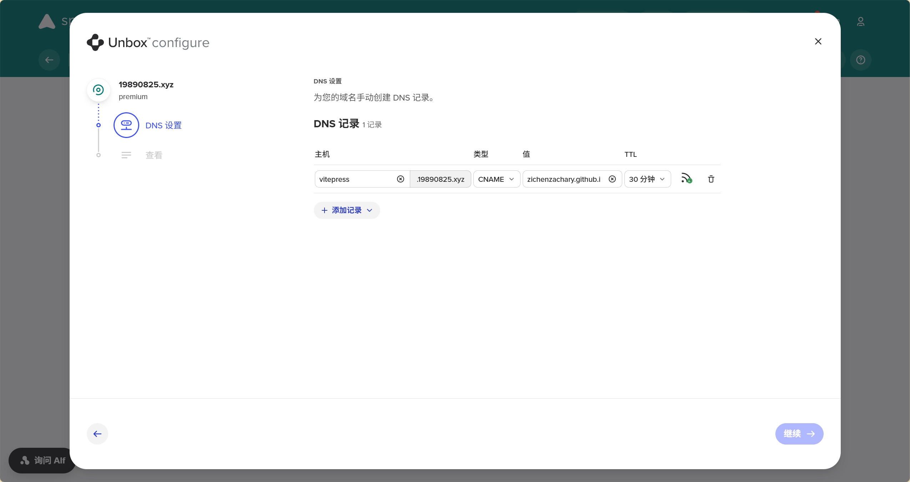</p>

### 7.3 方式一：使用子域名

目标地址：

```text
https://vitepress.19890825.xyz/
```

这种方式不会占用主域名 `19890825.xyz`，适合先试用。

添加一条记录：

```text
类型：CNAME
主机：vitepress
值：zichenzachary.github.io
TTL：默认
```

注意 DNS 只能指向域名或 IP，不能指向 URL 路径。

```text
值只填写 zichenzachary.github.io
不要填写 https://zichenzachary.github.io/my-tutorial/
不要填写 zichenzachary.github.io/my-tutorial
```

进入 GitHub 仓库，Settings -> Pages -> Custom domain，填写：

```text
vitepress.19890825.xyz
```

<p align="center">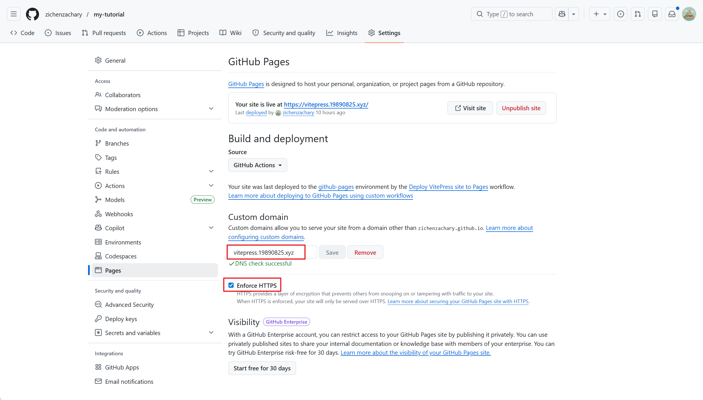</p>

点击保存，等待 DNS check successful，证书签发完成后，勾选 Enforce HTTPS。

回到本地文件夹，修改以下代码。

::: code-group

```ts [config.mts]
export default defineConfig({
  base: '/',
  head: [
    ['link', { rel: 'icon', type: 'image/svg+xml', href: '/logo.svg' }]
  ]
})
```

```json [docsearch.json]
{
  "start_urls": [
    {
      "url": "https://vitepress.19890825.xyz/",
      "selectors_key": ""
    }
  ]
}
```

:::

### 7.4 方式二：使用主域名和 www

目标地址：

```text
https://19890825.xyz/
https://www.19890825.xyz/
```

这种方式适合把整个主域名作为网站入口。

在 DNS 管理中添加 4 条记录：

```text
类型：A
主机：@
值：185.199.108.153
TTL：默认
```

```text
类型：A
主机：@
值：185.199.109.153
TTL：默认
```

```text
类型：A
主机：@
值：185.199.110.153
TTL：默认
```

```text
类型：A
主机：@
值：185.199.111.153
TTL：默认
```

其中 `@` 表示主域名：

```text
19890825.xyz
```

再添加一条 `CNAME` 记录：

```text
类型：CNAME
主机：www
值：zichenzachary.github.io
TTL：默认
```

这表示：

```text
www.19890825.xyz -> zichenzachary.github.io
```

进入 GitHub 仓库，Settings -> Pages -> Custom domain，填写主域名：

```text
19890825.xyz
```

点击保存，等待 DNS check successful，证书签发完成后，勾选 Enforce HTTPS。

如果 DNS 同时配置了主域名和 www，GitHub Pages 通常会根据 Custom domain 中填写的域名，在 `19890825.xyz` 和 `www.19890825.xyz` 之间做规范化跳转。


回到本地文件夹，修改以下代码。

::: code-group

```ts [config.mts]
export default defineConfig({
  base: '/',
  head: [
    ['link', { rel: 'icon', type: 'image/svg+xml', href: '/logo.svg' }]
  ]
})
```

```json [docsearch.json]
{
  "start_urls": [
    {
      "url": "https://19890825.xyz/",
      "selectors_key": ""
    }
  ]
}
```

:::


如果 GitHub Pages 里填的是 `www.19890825.xyz`，这时 `docsearch.json` 建议写：

```json
"url": "https://www.19890825.xyz/"
```

主入口以 GitHub Pages 的 Custom domain 中填写的域名为准，`docsearch.json` 应填写最终浏览器地址栏停留的那个地址。

## 更多

> [!TIP] 一些搭建思路 
> 可以问官方网站的 AI。  
> 下载开源项目，用 Codex/Claude Code 等工具分析配置流程。  
> 迁移文档时格式的转换可以交给 AI 完成。  
