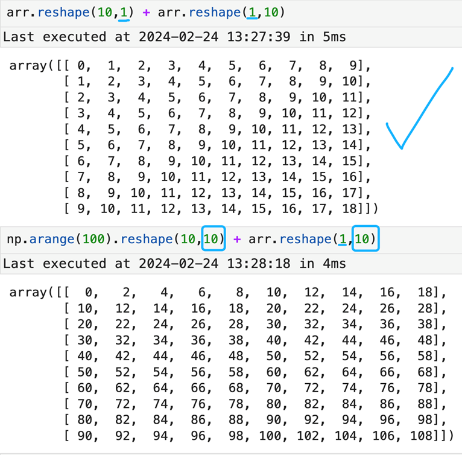

# NumPy

## 1. NumPy 简介与数组基础计算

### 1.1 NumPy 简介

NumPy 库是 Python 的一种开源的**数值计算扩展**，主要用于数组计算。这种工具可用来*存储和处理大型矩阵*，比 Python 自身的嵌套列表 （nested list structure） 结构要高效得多（该结构也可以用来表示矩阵 (matrix)）。在数据处理任务上，NumPy 是 Pandas 一个较好的补充，有更为**丰富的计算函数和更快的计算速度**。NumPy 包含：

- 一个强大的 N 维数组对象 ndarray
- 广播功能函数
- 整合 C/C++/Fortran 代码的工具
- 线性代数、傅里叶变换、随机数生成等功能

NumPy 导入：

```python
conda install numpy # 或 pip3 install numpy
import numpy as np
```

### 1.2 NumPy 数组基础

#### 1.2.1 创建数组

（1） 创建一维数组

1. 打印结果和列表相似
2. 使用 `np.array` 方法生成
3. 一维数组仅需要使用一对 `[]`
4. 该数组的元素数据类型是 `int64`

```python
arr = np.array([1, 2, 3, 4, 5])  
arr = np.array([1, 2, 3], dtype='int64')  # 创建时指定数据类型
```

（2） 创建多维数组

1. 可以认为多维度数组的元素仍然是数组
2. 二维数组的元素是 1 维数组
3. 根据手写的元素和最终打印结果可以判断数组构成形式

```python
arr = np.array([[1, 2], [3, 4]])
```

（3） 快速创建函数

1. `np.ones` 可以生成元素都为 1 的数组
2. `np.zeros` 生成元素都为 0 的数组
3. `np.empty` 生成数组的元素不为空，为随机产生的数据
4. `np.arange` 生成连续整数数组

```python
# 生成元素都为1的数组  
arr = np.ones(12)  
  
# 生成元素都为0的数组  
arr = np.zeros((4, 4))  
  
# 生成数组的元素不为空，为随机产生的数据  
arr = np.empty((2, 3, 4))  
  
# 生成连续整数数组
arr = np.arange(4)                     # 一维
arr = np.arange(8, 15)                 # 一维
arr = np.arange(1, 10, 2)              # 一维
arr = np.arange(10).reshape(2, 5)      # 二维
arr = np.arange(24).reshape(2, 3, 4)   # 三维
```

#### 1.2.2 属性函数

```python
arr.shape             # 数组的形状
arr.ndim              # 数组的维数
arr.size              # 数组元素的个数
arr.itemsize          # 单个元素的字节数
arr.nbytes            # 所有元素的总字节数
```

#### 1.2.3 数据类型大全

常用的有 bool、int、uint、float、complex

| 名称         | 描述                                                  |
| ---------- | --------------------------------------------------- |
| bool_      | 布尔型数据类型 (True 或者 False)                             |
| int_       | 默认的整数类型 (类似于 C 语言中的 long,  int32 或 int64)           |
| intc       | 与 C 的 int 类型一样, 一般是 int32 或 int64                   |
| intp       | 用于索引的整数类型 (类似于 C 的 ssize_t, 一般情况下仍然是 int32 或 int64) |
| int8       | 字节 (-128 to 127)                                    |
| int16      | 整数 (-32768 to 32767)                                |
| int32      | 整数 (-2147483648 to 2147483647)                      |
| int64      | 整数 (-9223372036854775808 to 9223372036854775807)    |
| uint8      | 无符号整数 (0 to 255)                                    |
| uint16     | 无符号整数 (0 to 65535)                                  |
| uint32     | 无符号整数 (0 to 4294967295)                             |
| uint64     | 无符号整数 (0 to 18446744073709551615)                   |
| float_     | float64 类型的简写                                       |
| float16    | 半精度浮点数, 包括: 1 个符号位, 5 个指数位, 10 个尾数位                 |
| float32    | 单精度浮点数, 包括: 1 个符号位, 8 个指数位, 23 个尾数位                 |
| float64    | 双精度浮点数, 包括: 1 个符号位, 11 个指数位, 52 个尾数位                |
| complex_   | complex128 类型的简写, 即 128 位复数                         |
| complex64  | 复数, 表示双 32 位浮点数 (实数部分和虚数部分)                         |
| complex128 | 复数, 表示双 64 位浮点数 (实数部分和虚数部分)                         |

#### 1.2.4 类型转化

1. 类型转化不一定成功
2. 有可能出现无法转化并报错的情况，例如复数（complex）无法转化成整型 (int) 和浮点型 (float)
3. 即使成功了也要注意数据本身的变化，因为未必和预期一致

```python
# 单个字符的转化  
np.float64(42)  
np.int8(127.0)  
np.int8(-128.0)  
np.int8(129.0)  
np.bool_(42)  
np.bool_(0)  
np.bool_(42.0)  
np.float_(True)  
np.float_(False)  
np.arange(7, dtype=np.uint16)  
  
# 数组的转化  
arr = np.array([5.2, 3.2, 9.96, -3.0, -1.9, 10.81])  
arr = arr.astype(np.int32)  # [5,3,9,-3,-1,10]，-1.9先不看负号进行转换后再加上负号
```

#### 1.2.5 字符编码

1. 当需要指定数据类型时，可以通过 **字符编码** 来实现
2. 常用的数据类型包括：整数、浮点数、字符串

| 数据类型       | 字符编码 |
|----------------|----------|
| 整数           | i        |
| 无符号整数     | u        |
| 单精度浮点数   | f        |
| 双精度浮点数   | d        |
| 布尔值         | b        |
| 复数           | D        |
| 字符串         | S        |
| Unicode 字符串 | U        |
| void(空)       | V        |

```python
np.arange(7, dtype='f')  # [0. 1. 2. 3. 4. 5. 6.]
np.arange(7, dtype='D')  # [0.+0.j 1.+0.j 2.+0.j 3.+0.j 4.+0.j 5.+0.j 6.+0.j]
np.dtype(float)          # float64
np.dtype('f')  			 # float32
np.dtype('d')  			 # float64
np.dtype('D')  			 # complex128
np.dtype('f8')  		 # float64
np.dtype('float64')  	 # float64
```

### 1.3 NumPy 数组计算

#### 1.3.1 四则运算

1. `NumPy` 数组可以简单地进行四则运算
2. `NumPy` 数组的幂函数运算可以通过 `**` 来完成
3. 可以通过结果和运算的对比来理解运算的处理逻辑

```python
# 数组与标量的运算
arr = np.array([[1., 1., 2.], [3., 5., 8.]])  # 定义二维数组
print(arr)          # 打印数组

print(arr * arr)    # 元素逐位相乘
print('*' * 90)     # 打印分隔线

print(arr - arr)    # 元素逐位相减
print('*' * 90)     # 打印分隔线

print(1 / arr)      # 元素逐位求倒数
print('*' * 90)     # 打印分隔线

print(arr ** 0.5)   # 元素逐位开平方
```

#### 1.3.2 一维数组索引

1. 索引可以联想 list 列表的索引规则
2. 特别说明：`7:2` 是选中前 7 个元素，从 0 开始每 2 个选一个
3. 可以使用 `slice` 事先写好起始点与步长
4. 如果实在理解困难，可以记住规律，以下三个参数分别为开始位置、结束为止和步长

切片格式：`start : stop : step`

```python
# 一维数组的索引与切片 
a = np.arange(9)           # 生成包含0到8的一维数组
a                          # 打印数组内容

print(a[0])                # 访问索引0的元素
print(a[3:7])              # 获取索引3到6的元素
print(a[:7:2])             # 从头到索引6每隔2个取一个
print(a[::-1])             # 步长为负实现反转

s = slice(3, 7, 2)         # 定义切片对象起点3终点7步长2
print(a[s])                # 使用切片对象取值

s = slice(None, None, -1)  # 定义反向切片对象
print(a[s])                # 使用切片对象反转数组
```

#### 1.3.3 多维数组索引

1. 考虑多维数组索引结果，要分层理解
2. 可参考数组的结构与索引数字来判断结果
3. 建议在 notebook 中交互验证

```python
# 选取数组元素 索引  
a = np.array([[101, 102], [103, 104]])  # 定义二维数组
print(a)  # 打印数组

print(a[0, 0])  # 取第0行第0列
print(a[0, 1])  # 取第0行第1列
print(a[1, 0])  # 取第1行第0列
print(a[1, 1])  # 取第1行第1列

# 多维数组的切片与索引 
b = np.arange(12).reshape(2, 2, 3)  # 创建一个形状为(2,2,3)的三维数组

print(b.shape)  # 打印数组形状
print(b)        # 打印数组内容

print(b[0, 0, 0])  # 取第0块 第0行 第0列
print(b[:, 0, 0])  # 取所有块中 第0行 第0列
```

#### 1.3.4 数组切片

1. 多维数组的索引是按照 `,` 分隔开的
2. `:` 表示选择全部，`::-1` 表示全部选择后逆向
3. `…` 代表省略（省略的维度上选择全部）

```python
b[0]              # 取第一层二维数组
b[0, :, :]        # 同上，完整二维切片
b[0, …]           # 等价于 b[0, :, :]

b[0, 1]           # 取第0层的第1行
b[0, 1, ::2]      # 取第0层第1行，步长为2的列

b[…, 1]           # 取所有二维数组的第1列
b[:, 1]           # 取每个二维数组的第1行
b[:, 1, :]        # 同上，完整行切片
b[0, :, 1]        # 取第0层每行的第1个元素

b[0, :, -1]       # 取第0层每行最后一个元素
b[0, ::-1, -1]    # 第0层的行反向后取最后一列

b[0, ::2, -1]     # 第0层中隔行取最后一列
b[::-1]           # 翻转第一个维度（整体上下翻转）

s = slice(None, None, -1)
b[(s, s, s)]      # 所有维度反向取值（整体翻转）
```

#### 1.3.5 布尔索引

1. 注意数组最后的结果，默认是按行筛选
2. 如果知道了布尔数组的索引，可以写成下面的标准形式
3. 布尔索引更简洁

```python
# 布尔索引
names = np.array(['Bob', 'Joe', 'Will', 'Bob', 'Will', 'Joe', 'Joe'])  # 姓名数组
data = np.random.randn(7, 4)  # 7 行 4 列随机数

print(names)        # 查看 names
print(data)         # 查看 data

# 布尔条件判断
print(names == 'Bob')            # 判断是否等于 'Bob' 得到布尔数组
print(data[names == 'Bob'])      # 使用布尔数组筛选对应行
print(data[(names == 'Bob'), 0]) # 布尔条件筛选行后取第 0 列

# shape 说明
print(data.shape)      # 显示 data 的形状 (7,4)
print(names.shape)     # 显示 names 的形状 (7,)
```

补充说明：

- `shape` 的第一个值都是 `7`，表示有 7 行
- 布尔索引使得数据筛选更灵活简洁

#### 1.3.6 花式索引

1. 行索引和列索引结合，根据结果判断筛选方式
2. 先把布尔值判断的结果赋值，再对数组进行筛选操作

```python
# 花式索引
print(data[names == 'Bob', 2])      # 行用布尔判断筛选 'Bob'，列取第 2 列
print(data[names == 'Bob', 3])      # 行筛选 'Bob'，列取第 3 列

print(names != 'Bob')               # 判断不等于 'Bob'
print(data[~(names == 'Bob')])      # 使用取反 ~ 选择不是 Bob 的行

mask = (names == 'Bob') | (names == 'Will')  # 组合条件：是 Bob 或 Will
print(mask)                                    # 查看布尔掩码
print(data[mask])                              # 使用组合 mask 选择行
```

#### 1.3.7 布尔索引便捷操作

1. 数组与数值的比较结果是元素级的，所以索引也是元素级别的
2. 选中位置后可以直接进行赋值

```python
# 布尔索引便捷操作
data[data < 1] = 100          # 选择所有小于 1 的元素并赋值为 100
print(data)                   # 查看结果

data[names != 'Joe'] = 7      # 所有名字不是 Joe 的行全部赋值为 7
print(data)                   # 查看结果
```

## 2. NumPy 数组形态转换与计算

### 2.1 NumPy 数组创建函数

#### 2.1.1 创建数组序列

1. `np.linspace` 可以创建等差数列形式的 NumPy 数组
2. `np.power(x, y)` 会计算 x 的 y 次方
3. `np.logspace` 与 `np.linspace` 类似，但会增加一个 `base` 参数，用来生成以 base 为底的指数函数数列

```python
arr = np.linspace(1, 10, 10)        # 创建从 1 到 10 的等差数组，共 10 个点
arr                                 # 查看数组

np.power(2, arr)                    # 计算 2 的 arr 次方，每个元素分别计算

arr = np.logspace(1, 10, 10, base=2, dtype='int64')  # 以 2 为底，指数从 1 到 10
arr                                 # 查看指数序列
```

#### 2.1.2 创建一维数组序列

1. `np.random.normal` 会生成正态分布的数组
2. 前两个参数为均值和标准差
3. 如果第三个参数为元组，那么将生成多维数组
4. 生成的二维数组使用 `[:,1]` 索引后，使用 `Series` 绘制密度图发现，确实比较符合正态分布（可见均值在 10 附近）

```python
arr = np.random.normal(10,20,(10000,3))  # 生成正态分布数组
pd.Series(arr[:,1]).plot(kind='kde')  # 绘制密度图
```

#### 2.1.3 创建多维数组序列

（1） np.logspace 创建

`np.logspace` 还可以创建多维数组，会根据不同的 `base` 参数，分别生成以不同 base 为底的指数函数数列，并最终返回多维数组

```python
arr = np.logspace(1, 10, 10, base=[2, 3], dtype='int64')  
# base 为多个值时，分别以 2 和 3 为底生成指数序列，并组合成二维数组

arr  # 查看生成的多维指数数组
```

（2） np.random.randn 创建

1. `np.random.randn` 会生成标准正态分布的数组（均值 0、方差 1）
2. 如果参数为数值，则生成一维数组
3. 如果参数为元组，则生成多维数组
4. 生成的二维数组使用 `[:,0]` 索引后，再用 `Series` 绘制密度图，可看到其分布确实接近标准正态分布（均值约为 0）

```python
arr = np.random.randn(10)        # 生成长度为 10 的标准正态一维数组
arr                               # 查看数组

arr = np.random.randn(10000, 2)   # 生成 10000×2 的二维标准正态分布数组
pd.Series(arr[:, 0]).plot(kind='kde')  
# 取第一列数据并绘制 KDE 密度图，检验正态分布
```

（3） np.random.rand 创建

1. `np.random.rand` 会生成 `[0,1]` 均匀分布的数组
2. 如果参数为数值那么生成一维数组
3. 如果参数为元组那么将生成多维数组
4. 生成的二维数组使用 `[:,2]` 索引后，使用 Series 绘制密度图发现，确实比较符合 `[0,1]` 均匀分布（各组频数接近，且极值为 0 和 1）

```python
# 生成一维均匀分布随机数
arr = np.random.rand(10)
arr

# 生成二维均匀分布随机数
arr = np.random.rand(10000, 3)

# 查看形状
arr.shape

# 使用Series绘制直方图
pd.Series(arr[:, 2]).plot(kind='hist', bins=50, edgecolor='k', color='orange')
```

（4） np.random.uniform 创建

1. `np.random.uniform` 会生成均匀分布的数组
2. 前两个参数为最小值和最大值
3. 如果第三个参数为数字，则生成 1 维数组，如果参数为元组，那么将生成多维数组
4. 生成的一维数组使用 Series 绘制密度图发现，确实比较符合均匀分布（可见最小值、最大值与设定参数相同，且各组频数接近）

```python
# 创建 10000 个服从均匀分布 [176, 192] 的随机数
arr = np.random.uniform(176, 192, size=10000)

# 使用直方图检查分布
pd.Series(arr).plot(               # 将数组转换为Series并开始绘图
    kind='hist',                   # 直方图类型
    edgecolor='k',                 # 直方图边框颜色为黑色
    color='green',                 # 填充颜色为绿色
    bins=25                        # 分成25个柱子
)
```

### 2.2 NumPy 数组形态转换

#### 2.2.1 reshape 函数

1. `reshape` 可以改变数组维度和形状，只要元素 size 不变
2. 根据代码和结果对比来总结规律
3. `ravel` / `flatten` / `reshape(-1)` 是可以生成一维数组的几种方法

```python
b = np.arange(24).reshape(2, 3, 4)   # 创建 0~23 并 reshape 为 2×3×4
print(b)                             # 打印数组
print(b.shape)                       # 查看数组形状 (2,3,4)
print(b.ravel())                     # ravel：返回一维视图（不复制）
print(b.flatten())                   # flatten：返回一维拷贝（复制）
print(b.reshape(-1))                 # reshape(-1)：自动变成一维
```

#### 2.2.2 shape/resize 函数

1. 可以通过 `shape` 命令改变形状
2. `resize` 命令与 `shape` 效果相等
3. 两个命令都会直接修改数组形状

```python
b.shape = (6, 4)      # 改变数组维度为 6×4
print(b)              # 打印数组

b.resize((2, 12))     # resize 修改形状为 2×12
print(b)              # 打印数组
```

### 2.3 NumPy 数组计算

#### 2.3.1 四则运算

1. `np.add(arr1, arr2)` 两个数组形状相同，会按照对应位置元素相加
2. `np.subtract(arr1, arr2)` 会实现相减
3. `np.multiply(arr1, arr2)` 会实现相乘
4. `np.divide(arr1, arr2)` 会实现相除，`arr1 / arr2`
5. `np.floor_divide(arr1, arr2)` 会实现整除，`arr1 // arr2`

```python
arr1 = np.array([[1, 2],        # 定义数组 1
                 [3, 4]])

arr2 = np.array([[5, 6],        # 定义数组 2
                 [8, 11]])

print(np.add(arr1, arr2))        # 对应元素相加
print(np.subtract(arr1, arr2))   # 对应元素相减
print(np.multiply(arr1, arr2))   # 对应元素相乘
print(np.divide(arr1, arr2))     # 对应元素相除（浮点结果）
print(np.floor_divide(arr1, arr2))  # 对应元素整除

print(np.floor_divide(arr2, arr1))  # 交换顺序再整除
```

#### 2.3.2 运算函数

1. `np.negative(arr)` 会对数组元素都取相反数
2. `np.power(arr1, arr2)` 会实现 arr1 的 arr2 次方
3. `np.remainder(arr1, arr2)` 会计算 arr1 % arr2

```python
import numpy as np

arr1 = np.array([[1, 2], [3, 4]])    # 示例数组1
arr2 = np.array([[5, 6], [8, 11]])   # 示例数组2

# 1. np.negative：元素取相反数
print(np.negative(arr1 - arr2))      # 先 arr1-arr2 再取相反数

# 2. np.power：数组元素按次方计算
print(np.power(arr1, arr2))          # arr1 ** arr2
print(np.power(arr2, arr1))          # arr2 ** arr1
print(np.power(arr1, 3))             # arr1 ** 3
print(np.power(2, arr2))             # 2 ** arr2

# 3. np.remainder：取余（模运算）
print(np.remainder(arr1, arr2))      # arr1 % arr2
print(np.remainder(arr2, arr1))      # arr2 % arr1
```

### 2.4 NumPy 数组比较运算

1. `np.equal(arr1, arr2)` 会判断 arr1 和 arr2 每个对应位置的元素是否相等
2. `np.not_equal(arr1, arr2)` 会判断是否不相等
3. `np.less(arr1, arr2)` 会判断 arr1 每个元素是否小于 arr2 对应位置的元素
4. `np.less_equal(arr1, arr2)` 会判断是否小于等于
5. `np.greater(arr1, arr2)` 会判断是否大于
6. `np.greater_equal(arr1, arr2)` 会判断是否大于等于

```python
# 对比 arr1 和 arr2
print(np.equal(arr1, arr2))           # 判断相等
print(np.not_equal(arr1, arr2))       # 判断不相等

print(np.less(arr1, arr2))            # 小于
print(np.less_equal(arr1, arr2))      # 小于等于

print(np.greater(arr1, arr2))         # 大于
print(np.greater_equal(arr1, arr2))   # 大于等于

# np.where 示例
print(np.where(arr1 * 3 > arr2, arr1, arr2))   # 按条件选择
```

### 2.5 NumPy 数组逻辑运算

#### 2.5.1 布尔值索引

1. `(arr1 > 2.5)` 会返回由布尔值组成的数组
2. `arr1[arr1 > 2.5]` 使用布尔值数组对原数组进行筛选
3. `.shape` 可查看数组形状
4. 多维数组同样可以用布尔索引，布尔结果会按元素级比较
5. 布尔索引会将结果展平成一维返回（即使原数组是多维）

```python
(arr1 > 2.5)                  # 比较，生成布尔数组
print(arr1 > 2.5)

arr1[arr1 > 2.5]              # 使用布尔索引筛选元素
print(arr1[arr1 > 2.5])

arr1.shape                    # 查看 arr1 的形状
print(arr1.shape)

arr_3 = np.arange(24).reshape(2, 4, 3)   # 创建 2×4×3 的三维数组
print(arr_3)

arr_3[arr_3 > 2.5]            # 对三维数组使用布尔索引（返回一维筛选结果）
print(arr_3[arr_3 > 2.5])
```

#### 2.5.2 all/any 函数

1. `np.all(axis)` 按照指定的轴去一次计算是否所有元素都为 True，只要有 False 存在，则返回 False，否则返回 True
2. `np.any(axis)` 按照指定的轴去一次计算是否所有元素都为 False，只要有 True 存在，则返回 True，否则返回 False

```python
print(np.all([-1, 4, 5]))                # -1,4,5 都被视为 True → 全为 True → True
print(np.all([-1, 0, 5]))                # 0 为 False → 存在 False → False

arr_3 = np.arange(24).reshape(2, 4, 3)   # 创建 arr_3，形状为 (2,4,3)

print(np.all(np.where(arr_3 > 10, arr_3, 0)))   # 判断整数组是否所有元素都 >10（False）

print(np.all(np.where(arr_3 > 10, arr_3, 0), axis=0))   # 沿 axis=0 判断
print(np.all(np.where(arr_3 > 10, arr_3, 0), axis=1))   # 沿 axis=1 判断
print(np.all(np.where(arr_3 > 10, arr_3, 0), axis=2))   # 沿 axis=2 判断

np.any([-1, 0, 5])                                  # 判断是否存在 True（非零为True）
np.any(np.where(arr_3 > 10, arr_3, 0))              # where：大于10保留，否则为0，再判断是否存在 True
np.any(np.where(arr_3 > 10, arr_3, 0), axis=0)      # axis=0：按列判断是否存在 True
np.any(np.where(arr_3 > 10, arr_3, 0), axis=1)      # axis=1：按行判断是否存在 True
np.any(np.where(arr_3 > 10, arr_3, 0), axis=2)      # axis=2：按最内层维度判断是否存在 True
```

### 2.6 NumPy 数组统计运算

#### 2.6.1 聚合函数

（1） maximum/minimum 函数

1. `max` 是把相同位置上的元素进行比较，取较大值重新组成的数组
2. `min` 是把相同位置上的元素进行比较，取较小值重新组成的数组
3. 计算结果与原数组 `shape` 相同

```python
# 最大值/最小值
x = np.random.randn(8)      # 生成 8 个标准正态分布随机数
y = np.random.randn(8)      # 生成另一个数组
print(x)                    # 打印数组 x
print(y)                    # 打印数组 y

print(np.maximum(x, y))     # 相同位置取最大
print(np.minimum(x, y))     # 相同位置取最小
```

（2） ptp 等函数

1. `np.ptp` = `np.max - np.min`
2. `median` 是计算中位数
3. `np.average` 可以计算带权重的均值，参数为 `weights`，`average` 是计算加权平均的专属；除此之外常用的是 `np.mean`
4. `np.std` 是计算标准差
5. `np.var` 是计算方差

```python
print(np.ptp(x))                  # 极差：max-min
print(np.mean(y))                 # 平均值
print(np.average(y,weights=x))    # 加权平均
print(np.median(y))               # 中位数
print(np.var(y))                  # 方差
print(np.std(y))                  # 标准差
```

（3） argmin/argmax 函数

1. `argmax` 是把元素进行比较，取最大值所在的位置索引
2. `argmin` 是把元素进行比较，取最小值所在的位置索引
3. 经过右侧图片代码验证，索引值正确，不存在比 `argmax` 对应值更大的元素；也不存在比 `argmin` 对应值更小的元素

```python
print(np.argmin(x))          # 计算 x 中最小值的索引
x[3]                         # 访问索引 3 的元素
x[x < x[3]]                  # 过滤比 x[3] 更小的值（验证最小索引正确）

print(np.argmax(y))          # 计算 y 中最大值的索引
y[y > y[np.argmax(y)]]       # 过滤比最大值更大的值（验证最大索引正确）
```

#### 2.6.2 取整拆分函数

1. `np.modf` 函数可以拆分出整数部分和小数部分
2. 注意如果元素是负数，那么拆分出来的小数部分是负数，即拆分出来的整数绝对值不会大于拆分前

```python
arr = np.random.randn(5) * 15      # 随机生成数组并放大
print(arr)                         # 查看原数组
print(np.modf(arr))                # modf：拆分小数部分和整数部分
print(np.modf(arr)[0])             # 小数部分
print(np.modf(arr)[1])             # 整数部分
```

#### 2.6.3 条件判断 np.where

1. 条件判断是数据分析中常用的处理
2. `np.where` 处理逻辑与 sql 中 if else 比较类似
3. 根据最终图片显示结果，可以看到 `np.where` 实现了对应的处理逻辑

```python
# 将条件逻辑表达为数组运算
xarr = np.array([1.1, 1.2, 1.3, 1.4, 1.5])     # x 数组
yarr = np.array([2.1, 2.2, 2.3, 2.4, 2.5])     # y 数组
cond = np.array([True, False, True, True, False])  # 条件布尔数组

# 使用 for 循环实现：c=True 取 x，否则取 y
result = [ (x if c else y) for x, y, c in zip(xarr, yarr, cond) ]  # 列表推导式模拟 where 逻辑

# 将条件逻辑表达为数组运算np.where
result = np.where(cond, xarr, yarr)  # cond=True 取 xarr，否则取 yarr
result

# 另一组例子
arr = np.random.randn(4, 4)             # 生成 4×4 标准正态矩阵
print(arr)
print(np.where(arr > 0, 2, -2))          # arr>0 的位置替换为 2，否则为 -2
print(np.where(arr > 0, 2, arr))         # arr>0 的位置替换为 2，否则保留原值
```

#### 2.6.4 mean 方法

1. `arr.mean()` 计算均值，如果无参数，会计算所有元素均值
2. 如果指定 `axis`，那么就按沿着指定的轴方向去计算
3. 可以看到 `axis=1`，对于二维数组就是沿着列方向把每行求个均值

```python
# 数学与统计计算
arr = np.random.randn(5, 4)    # 生成 5×4 标准正态分布数据
arr                           # 查看数组

# 各种方式计算均值
print(arr.mean())             # 所有元素的均值
print(arr.mean(axis=1))       # axis=1：按行求均值
print(arr.mean(axis=1).mean())# 行均值的再求均值
print(arr.mean(axis=0))       # axis=0：按列求均值
print(arr.mean(axis=0).mean())# 列均值的再求均值
print(np.mean(arr))           # np.mean：与 arr.mean() 等价
print(np.mean(arr, axis=1))   # np.mean 指定 axis
```

#### 2.6.5 累计计算

1. `cumsum` 代表累加，可以按照 axis 轴来规定方向累加
2. `cumprod` 代表累乘，可以按照 axis 轴来规定方向累乘
3. 如果不指定轴 axis，那么数组形状会改变，会让所有元素参加计算

```python
# 各种方式计算求和
print(arr.sum())        # 所有元素求和
print(arr.sum(0))       # 按列求和
print(arr.sum(1))       # 按行求和

# 计算累计求和和累计乘积
arr = np.array([[0, 1, 2],   # 创建示例数组
                [3, 4, 5],
                [6, 7, 8]])

print(arr)               # 查看数组
print(arr.cumsum(0))     # 按列累计求和
print(arr.cumprod(1))    # 按行累计乘积
print(arr.cumprod(0))    # 按列累计乘积
print(arr.cumsum())      # 所有元素累计求和（展平后）
```

#### 2.6.6 唯一化

1. `np.unique` 是把数组进行去重，相同元素只保留一份
2. `np.unique` 与 `set` 有类似的功能，`np.unique` 返回数组，`set` 返回的是集合

```python
# 唯一化以及其他的集合逻辑
names = np.array(['Bob', 'Joe', 'Will', 'Bob', 'Will', 'Joe', 'Joe'])  # 姓名数组
print(np.unique(names))                                           # 唯一化字符串数组

ints = np.array([3, 3, 3, 2, 2, 1, 1, 4, 4])                      # 整数数组
print(np.unique(ints))                                            # 唯一化整数数组

print(sorted(set(names)))                     # 使用 set + sorted 获取唯一值并排序
```

#### 2.6.7 np.in1d 函数

1. 包含关系常用在数据分析抽取数据中的条件判断
2. `invert` 参数：是否取反向结果，`True` 和 `False` 互为反向结果

```python
# 包含关系判断 np.in1d
# np.in1d(a, b, invert=True)

values = np.array([6, 0, 0, 3, 2, 5, 6])     # 原始数组

print(np.in1d(values, [2, 3, 6], invert=0))  # 判断 values 是否在列表中
print(np.in1d(values, [2, 3, 6], invert=1))  # invert=1 表示取反
```

#### 2.6.8 取整函数

1. `np.square` 计算元素的平方
2. `np.sign` 返回数字的符号，正数为 1，负数为 -1，0 为 0
3. `np.ceil` 为向上取整
4. `np.floor` 为向下取整
5. `np.rint` 为四舍五入取整

```python
arr = np.arange(10)               # 创建 0~9 的数组
print(arr)                        # 打印原数组
print(np.square(arr))             # 计算平方
print(np.sign(arr))               # 返回符号
print(np.ceil(np.sqrt(arr)))      # sqrt 后向上取整
print(np.floor(np.sqrt(arr)))     # sqrt 后向下取整
print(np.rint(np.sqrt(arr)))      # sqrt 后四舍五入取整
```

#### 2.6.9 指数/对数函数

1. `np.exp` 为以 e 为底的指数函数
2. `np.log` 为以 e 为底的对数函数
3. `np.log2` 为以 2 为底的对数函数
4. `np.log10` 为以 10 为底的对数函数

```python
print(np.exp(arr))                  # e 的指数函数
print(np.log(arr + 1))              # 以 e 为底的对数，加 1 防止 log(0)
print(np.log2(arr + 1))             # 以 2 为底的对数
print(np.log10(arr + 1))            # 以 10 为底的对数
```

### 2.7 NumPy 数组排序运算

#### 2.7.1 数组排序

1. `np.array.sort()`
2. `sort()` 支持参数指定排序方向
3. 对于二维数组，指定按行还是按列取决于 `axis` 参数

```python
# 排序：1维数组
arr = np.random.randn(8)      # 生成8个随机数
print(arr)                    # 打印原数组             
arr.sort()                    # 对1维数组排序（默认升序）
print(arr)                    # 打印排序后数组

# 排序：2维数组
arr = np.random.randn(5, 3)   # 生成5×3数组
print(arr)                    # 打印原数组

arr.sort(1)                   # 按行排序（axis=1）
print(arr)                    # 打印按行排序后数组

arr.sort(0)                   # 按列排序（axis=0）
print(arr)                    # 打印按列排序后数组，排序后数组已经改变
```

#### 2.7.2 数组排序性能

1. `10w` 随机数组与 `10w` 随机列表排序速度结果对比，数组要快 `1-2` 倍
2. 在涉及到大数量运算的时候，排序次数多，那么 `4-5` 倍的时间是非常大的差距（相当于 `15min vs 1H`）

```python
# 大数组排序耗时
# large_arr = np.random.randn(1000000)
large_arr = np.random.randn(100000)      # 生成10w随机数组
%timeit large_arr.sort()                 # 测试数组排序速度
print(large_arr[int(0.025 * len(large_arr))])   # 取5%分位数

# 大列表排序耗时
# large_arr = np.random.randn(1000000)
large_list = list(np.random.randn(100000))   # 生成10w随机列表
%timeit large_list.sort()                    # 测试列表排序速度
# print(large_list[int(0.025 * len(large_list))])  # 取5%分位数
```

## 3. NumPy 数组广播机制与进阶操作

### 3.1 NumPy 广播机制

#### 3.1.1 广播机制

定义：指不同形状的数组之间执行算术运算的方式

原则：

1. 让所有的输入数组向其中 `shape` 最长的数组看齐，`shape` 中不足的部分通过在前面加 1 补齐
2. 输出数组的 `shape` 是输入数组 `shape` 的各个轴上的最大值
3. 如果输入数组的某个轴和输出数组的对应轴的长度相同或者其长度为 1，则这个数组能够用于计算，否则出错
4. 当输入数组的某个轴的长度为 1 时，沿着此轴运算时使用此轴上的第一个组值

```python
arr = np.array([0, 1, 2, 3, 4, 5, 6, 7, 8, 9])   # 创建示例数组
print(arr)                                      # 打印原始数组
arr + 1                                         # 数组与数字广播计算
arr + np.array([1])                             # shape 不同也能广播计算
np.array([1]).shape                              # 查看 shape：为 (1,)
```

#### 3.1.2 广播报错

Tips:

当两个数组的对应位置的 shape，既不满足相等，也没有任何一个是 1 的时候，那么广播会报错。下方图片显示，两个数组的 shape 是 (10,1) 和 (2,1) 在第一个维度上，shape 分为 10 和 2，不满足广播原则。但是假如两个数组的 shape 是 (10,1) 和 (1,10)，那么可以满足广播原则。

<p align="center"></p>

#### 3.1.3 广播加法和广播乘法

左：广播加法，右：广播乘法

<div style="display: flex; justify-content: center; gap: 10px; align-items: center;">
  
  
</div>

### 3.2 NumPy 数组转置

1. 数组转置变化，即视觉上对称旋转之后为转置
2. 实际上行列互换
3. 体现在索引上是数组的（i，j）元素变成转置数组的（j,i）元素

```python
# 数组转置
arr = np.arange(15).reshape((3, 5))      # 创建 0~14 并 reshape 成 3×5
print(arr)                               # 打印原数组
print(arr.T)                             # 使用 .T 得到转置后的数组

print(arr.transpose())                   # transpose() 方法实现转置                
print(arr.T)                             # 再次打印转置结果
```

### 3.3 NumPy 数组组合

#### 3.3.1 hstack 函数

1. 观察 2 个原始数组
2. `hstack` 代表*左右合并*
3. `hstack` 的一个替代方法是 `concatenate`，然后限定在 `axis=1` 条件下

```python
# 组合数组
a = np.arange(9).reshape(3, 3)    # 创建 0~8 并 reshape 为 3×3
print(a)                          # 打印 a
b = 2 * a                         # b 是 a 的两倍
print(b)                          # 打印 b
print(np.hstack((a, b)))          # hstack 左右合并
print(np.concatenate((a, b), axis=1))   # concatenate 指定 axis=1 也能左右合并
```

#### 3.3.2 vstack 函数

1. 观察 2 个原始数组
2. `vstack` 代表*上下合并*
3. `vstack` 的一个替代方法是 `concatenate`，然后限定在 `axis=0` 条件下

```python
# 组合数组
print(np.vstack((a, b)))
print(np.concatenate((a, b), axis=0))
```

#### 3.3.3 dstack 函数

1. 观察合并后的数组，是在原来的数组基础上，每个元素都进行了*扩展*
2. 所以合并后的数据是在维度上增加了
3. 即 dstack 使 2 个 2 维数组合并后成为了 3 维

```python
# 深度拼接 dstack
print(a)                           # 打印原数组 a
print(b)                           # 打印原数组 b
print(np.dstack((a, b)))           # dstack：在“深度方向”拼接，新增第三维
print(np.dstack((a, b)).shape)     # 查看拼接后数组的 shape
```

#### 3.3.4 row_stack/column_stack

1. `hstack` 与 `column_stack` 方法等价
2. `vstack` 与 `row_stack` 方法等价
3. 根据数组对比结果发现，合并后结果相同

```python
# 用column_stack按列合并a和b
print(np.column_stack((a, b)))                     
# 对比column_stack和hstack是否完全相同
print(np.column_stack((a, b)) == np.hstack((a, b))) 

# 用row_stack按行合并a和b
print(np.row_stack((a, b)))                
# 对比row_stack与vstack是否完全相同
print(np.row_stack((a, b)) == np.vstack((a, b))) 
```

### 3.4 NumPy 数组分割

#### 3.4.1 hsplit 函数

1. `hsplit` 代表按照*左右*切分二维数组，切完后每块的行数不变，只是列被拆开
2. `hsplit` 等价于 `split` 加上 `axis=1` 参数
3. 结合输出结果，对比理解函数的作用逻辑

```python
# 数组的分割
a = np.arange(9).reshape(3, 3)     # 创建3x3数组
print(a)                           # 查看原始数组
print(np.hsplit(a, 3))             # hsplit 将数组按列切成3份
print(np.split(a, 3, axis=1))      # split(axis=1) 与 hsplit 效果相同
```

#### 3.4.2 vsplit 函数

1. `vsplit` 代表按照*上下*切分数组，左右长度不变
2. 使用 `split` 函数时，加上 `axis=0` 参数即可实现同样效果
3. 通过对比结果来理解函数的作用

```python
# 创建示例数组
a = np.arange(9).reshape(3, 3)
print(a)
print(np.vsplit(a, 3))           # 使用 vsplit 进行上下切分（行方向切分）
print(np.split(a, 3, axis=0))    # 使用 split，并指定 axis=0（行方向），等价于 vsplit
print(type(np.split(a, 3, axis=0)))  # 查看 split 返回的数据类型（结果为 list）
```

#### 3.4.3 dsplit 函数

1. `dsplit` 代表在数组的第 3 个维度上进行拆分，即在 `axis=2` 方向切分
2. `dsplit` 适用于至少三维数组，否则会报错
3. 可以根据拆出来的结果理解函数的切分逻辑：每一层是把原来数组在第三维的对应切片取出来形成新数组

```python
c = np.arange(27).reshape(3, 3, 3)  # 创建3×3×3数组
print(c)                           # 打印原数组
print(np.dsplit(c, 3))            # dsplit在第三维拆成3份
print(np.dsplit(c, 3)[0])         # 查看第1块拆分结果
```

### 3.5 NumPy 数组拷贝

#### 3.5.1 数组拷贝（浅拷贝）

1. 用变量赋值的方式直接拷贝数组，那么多个数组都指向同一个对象，其中任意一个改变，全体都会改变
2. 所以右图中四个 array 完全相同
3. 这种拷贝数组的方式也叫做**浅拷贝**，即只是多增加了一个变量名字和内存的对应关系

```python
# 创建初始数组
a_init = np.arange(4)

# 多个变量指向同一个数组（浅拷贝）
b_init = a_init
c_init = a_init
d_init = b_init

# 修改其中一个数组的值
a_init[0] = 11

# 四个变量内容都会被一起修改
print(a_init)  # [11, 1, 2, 3]
print(b_init)
print(c_init)
print(d_init)
```

#### 3.5.2 深拷贝

1. `array.copy()` 代表拷贝一份相同的数组，在另外一处存储
2. 所以其中一个进行改动，另外一份不受影响
3. 要精确区分浅拷贝与深拷贝的异同
4. 实际使用时可根据情况来决定到底使用哪种

```python
# deep copy示例
a_init1 = np.arange(4)        # 创建数组[0 1 2 3]
b_init1 = a_init1.copy()      # 深拷贝一份

print(a_init1, b_init1)       # 两个数组内容相同

a_init1[3] = 44               # 修改a_init1第3个元素
print(a_init1, b_init1)       # b_init1不受影响

b_init1[1] = 52               # 修改b_init1第1个元素
print(a_init1, b_init1)       # a_init1不受影响
```


## 4. NumPy 文件读写

### 4.1 NumPy 读写文件

#### 4.1.1 参数详解

1. 该命令除了读取文本文件，还可以读取生成器
2. `delimiter` 要注意不要遗漏，否则会进行一次错误的读取
3. `usecols`，如果分析仅仅是想取出其中的一些列，那么就指定 `index`
4. `unpack` 可以根据需要和偏好决定

```python
loadtxt(fname, dtype=<class 'float'>, comments='#',
        delimiter=None, converters=None, skiprows=0,
        usecols=None, unpack=False, ndmin=0)

# fname 要读取的文件、文件名、或生成器
# dtype 数据类型，默认 float
# comments 注释
# delimiter 分隔符，默认是空格
# skiprows 跳过前几行读取，默认是 0，必须是 int 型
# usecols 要读取哪些列，例如 usecols=(1,4,5) 将提取第2、第5和第6列
# unpack 如果为 True，将分列读取
```

#### 4.1.2 np.loadtxt

1. 可以读取 csv、txt 等文本数据
2. `unpack` 读取可以一次性生成多个 `array` 方便计算
3. 注意 `np.mean` 与 `np.average`
4. 注意加权平均的计算可以通过 `np.average` 配合 `weights` 参数来完成

```python
# numpy文件io

### 利用NumPy进行历史股价分析
import sys

# 读入文件
c,v = np.loadtxt('data.csv', delimiter=',', usecols=(6,7), unpack=True)

# unpack如果为True 将分别读取
# c表示第6列 v表示第7列

# 计算成交量加权平均价格
vwap = np.average(c, weights=v)
print("VWAP=", vwap)

# 算术平均值函数
print("mean=", np.mean(c))

# 时间加权平均价格
t = np.arange(len(c))
print("twap=", np.average(c, weights=t))
```

### 4.2 NumPy 读取文件案例

案例 1：

1. `np.max` 计算最大值
2. `np.min` 计算最小值
3. `np.ptp` 计算极差（最大值 - 最小值）
4. `np.sort` 可以实现排序

```python
# 寻找最大值和最小值
h, l = np.loadtxt(file_path, delimiter=',', usecols=(4,5), unpack=True)
print("highest =", np.max(h))    # 打印最大值
print("lowest =", np.min(l))     # 打印最小值
print((np.max(h) + np.min(l)) / 2)

# np.ptp 极差计算
print("Spread high price", np.ptp(h))   # 高价极差
print("Spread low price", np.ptp(l))    # 低价极差

# 统计分析
c = np.loadtxt(file_path, delimiter=',', usecols=(6,), unpack=True)
print("median =", np.median(c))  # 中位数
# np.msort(a) 等价于 np.sort(a, axis=0)
sorted_c = np.sort(c, axis=0)    # 排序
print("sorted =", sorted_c)
```

案例 2：

1. `np.diff` 计算差分
2. `np.log` 计算对数
3. `np.where` 条件判断
4. `np.std` 计算标准差
5. `np.sqrt` 计算平方根

```python
# 数组差分
# 股票收益率计算

# 读取收益率数据
c = np.loadtxt('data.csv', delimiter=',', usecols=(6,), unpack=True)

# 计算简单收益率：差分 / 前一日价格
returns = np.diff(c) / c[:-1]
print("Standard deviation =", np.std(returns))  # 计算标准差

# 计算对数收益率
logreturns = np.diff(np.log(c))

# 查找正收益率的位置
posretindices = np.where(returns > 0)
print("Indices with positive returns", posretindices)

# 年化波动率 = 日对数收益率标准差 / 日均值
annual_volatility = np.std(logreturns) / np.mean(logreturns)

# 年化波动率除以 sqrt(1/252)，转换为交易日标准
annual_volatility = annual_volatility / np.sqrt(1. / 252.)

print("Annual volatility", annual_volatility)   # 年化波动率
print("Monthly volatility", annual_volatility * np.sqrt(1. / 12.))  # 月波动率
```

### 4.3 NumPy 保存文件

`np.savetxt` 函数

1. 指定输出对象，文本以及文本的类型
2. `fmt` 为数据类型
3. `delimiter` 默认是逗号
4. 可以针对特定的数组写入文本，更换参数对比结果

```python
savetxt(fname, X, fmt='%.18e', delimiter=' ', newline='\n',
        header='', footer='', comments='# ')

# fname 指定输出对象，文本以及文本的类型
# X      存入文件的数组
# fmt    数据类型（写入文件的格式）
# delimiter 默认是逗号
# newline 换行符
# header 写在文件开头的字符串
# footer 写在文件结尾的字符串
# comments 注释字符，header 和 footer 前会自动加上它
```

### 4.4 NumPy 读写文件案例

1. fmt 是指数据的类型
2. 可以首先执行保存命令
3. 然后观察 3 个文本文件的异同，尝试总结参数对于输出文本的影响

```python
# 保存 array
# 保存logreturns到res.txt，数据格式为整数，逗号分隔
np.savetxt('res.txt', logreturns, fmt="%d", delimiter=",")
# 保存logreturns到res1.txt，默认数据格式，逗号分隔
np.savetxt('res1.txt', logreturns, delimiter=",")
# 保存logreturns到res2.txt，数据格式为浮点数，逗号分隔
np.savetxt('res2.txt', logreturns, fmt="%f", delimiter=",")
```

### 4.5 NumPy 专用文件 IO

#### 4.5.1 np.save /savez 函数

1. `np.save(file 为文件位置, arr 为数组）`
2. `np.savez(file 为文件位置, args, 多个数组, 就连续写数组）`

```python
# 单个数组：一次写 1 个数组
np.save('array_test.npy', logreturns)          # 保存 logreturns 到 .npy 文件

# 多个数组：一次写 2 个数组
np.savez('array_test_full.npz',                # 输出 .npz 文件（压缩包）
         logreturns,                           # 第 1 个数组
         logreturns)                           # 第 2 个数组
```

#### 4.5.2 np.load 函数

`np.load(file 文件位置)`

1. 如果是 npy 格式，则直接返回数组
2. 如果是 npz 格式，则返回一个 NpzFile 数据结构，可以像字典一样，使用提示的 key 去取得对应的数组

```python
np.load('array_test.npy')            # 读取 npy 文件 返回数组

# 判断读取的内容是否等于 logreturns
np.load('array_test.npy') == logreturns    # 返回逐元素比较结果
```

#### 4.5.3 读取压缩文件验证

npz 文件读入后，每一个 key 对应的数组都与写入的数组相同

```python
# 读取压缩文件中的数组
np.load('array_test.npz')['arr_0']      
# 检查 'arr_0' 是否与 logreturns 相同        
np.load('array_test_full.npz')['arr_0'] == logreturns
# 检查 'arr_1' 是否与 logreturns 相同
np.load('array_test_full.npz')['arr_1'] == logreturns  
```

## 5. NumPy 小结 - 功能篇

<p align="center"></p>
