# Pandas

## 1. 常用软件介绍

- `Anaconda`：jupyter notebook 更适合 DS/DA
- `Vscode`：插件丰富
- `Excel`：交互查看数据，传播方便，目前不可替代

## 2. Pandas 基础结构与读写

### 2.1 Pandas 简介

- `Python` 开源的数据分析、处理、可视化库
- `pip3 install pandas` 实现安装

> [!TIP] 为什么需要 pandas
>  - 不但能处理数值型数据，也可以处理字符串、时序等其他数据
>  - 数据的展示
>  - 聚合等丰富的数据处理函数，可实现类 SQL 对应功能

### 2.2 Pandas VS MySQL

| 特性    | Pandas                                  | MySQL                             |
| ----- | --------------------------------------- | --------------------------------- |
| 定位    | **内存中 (In-memory)** 的数据分析库              | **磁盘上 (On-disk)** 的关系型数据库 (RDBMS) |
| 主要用途  | 数据清洗、探索性分析 (EDA)、处理、可视化                 | 数据的持久化存储、管理、高效查询                  |
| 数据规模  | 适用于 **1000 万行以下** (受限于单机内存)             | 可处理海量数据 (TB/PB 级)，性能更优            |
| 灵活性   | **极高**，函数库丰富，处理逻辑可以非常复杂                 | 较高，但受限于 SQL 语法和表结构                |
| 上手速度  | 上手快 (30 分钟)，但 API 庞大，**精通较难**           | SQL 语法学习成本低，但数据库运维 (ETL, 赋权) 复杂   |
| 生态/更新 | 更新快，与 PyData (NumPy, Scikit-learn) 紧密集成 | 相对稳定、成熟                           |

### 2.3 Pandas 数据结构

- `pandas.` 等价于 `pd.`
- `pandas.DataFrame` 和 `pandas.Series` 是 `Pandas` 最重要的两个数据结构
- `pandas.DataFrame` 表格，是常见概念
- `pandas.Series` 序列是新概念，可以理解为一列

<p align="center">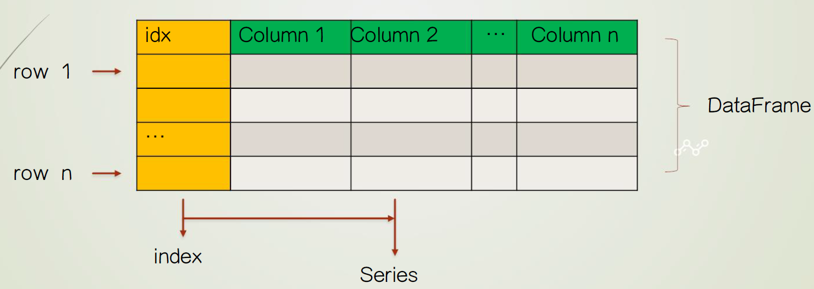</p>

#### 2.3.1 pandas.DataFrame

创建数组 `pandas.DataFrame(data, index, columns)`

1. `index` 定义行索引
2. `columns` 定义列索引
3. `data` 可为 python 列表、字典、或 `numpy` 数组
4. 字典 `keys` 为*列索引名*，可以依旧设置 `columns`
5. 输出列以 `columns` 优先，字典中未定义数据的列填充 `NaN`

#### 2.3.2 pandas.Series

 创建序列 `pandas.Series`

1. `index` 定义序列索引
2. 类似 列表，但索引可自定义
3. `data` 可为 `python` 列表、字典或 `numpy` 数组
4. 注意字典的 `key` 为*行索引值*！

<p align="center"></p>

#### 2.3.3 比较

- `pandas.DataFrame`
    - `df.shape`
    - `df.reshape`
- `pandas.Series`
    - `ds.shape`
- `pandas.DataFrame` or `Series` or `NumPy`
    - `df.values` or `ds.values` → `numpy.ndarray`
    - `df[column]` → `pandas.Series`
    - `pandas.DataFrame(ds)` → `pandas.DataFrame`

#### 2.3.4 描述 DataFrame 和 Series 的信息

1. 基本信息
    - `shape` 形状
    - `dtypes` 数据类型
    - `ndim` 维度
    - `index` 行索引
    - `columns` 列索引
    - `values` 元素值 `numpy` 数组
2. 整体信息
    - `head(n)/tail(n)` ：展示前 n 行 / 后 n 行
    - `df.info()` ：行数、列数、行索引、列索引、数据类型、列非空值个数、占用内存大小
    - `df.describe()`： 计数、均值、标准差、最大值、最小值、四分位数

### 2.4 Pandas 数据读写

#### 2.4.1 Pandas 从文件中读数据

读取支持 `csv`, `excel`, `txt`, `parquet`, `json`, `sql_table`, `sql_query` 等格式 (优点)

函数 `pandas.read_csv(file_path, sep, header, names, index_col)`

1. `sep` 一般为 `','`
2. `header` 取决于数据第一行是否为列名
3. `names` 优先级高于 `header`，定义列索引名
4. `index_col` 决定特定列是否被识别为 `pandas index`

#### 2.4.2 Pandas 写入到文件

写入支持的数据格式与读取的数据格式一一对应

| 读取函数           | 写入函数         | 说明         |
| -------------- | ------------ | ---------- |
| read_csv       | to_csv       | CSV 文本     |
| read_excel     | to_excel     | Excel 文件   |
| read_hdf       | to_hdf       | HDF5 存储    |
| read_sql       | to_sql       | 数据库        |
| read_json      | to_json      | JSON 格式    |
| read_html      | to_html      | 网页表格       |
| read_stata     | to_stata     | Stata 数据   |
| read_clipboard | to_clipboard | 剪贴板        |
| read_pickle    | to_pickle    | Python 序列化 |

➤ 案例 1：读取 3 个 csv 文件并且输出到 1 个 excel 文件

- 需要额外安装 `xlrd` 包
- 三个 `df`，输出到 excel 的三个 sheet
- 代码见 notebook
- 大家可以尝试完成逆操作（1 个 excel 写入到 3 个 csv）

### 2.5 Pandas 数据类型

- `datetime`：日期时间类型（表示具体的年月日、时分秒）
- `timedelta`：时间差类型（表示两个时间之间的差值，例如 3 天、5 小时）
- `category`：分类类型（用于存储有限类别值，例如“男/女”“高/中/低”）

| Pandas dtype | NumPy dtype    | Python type | Usage |
| ------------ | -------------- | ----------- | ----- |
| object       | string_unicode | str         | 字符串   |
| int64        | intx, uintx    | int         | 整数    |
| float64      | floatx         | float       | 浮点数   |
| bool         | bool_          | bool        | 布尔型   |
| datetime64   | datetime64     | NA          | 时间    |
| timedelta    | timedelta      | NA          | 时间差   |
| category     | NA             | NA          | 类别    |

### 2.6 Pandas 基础索引

> [!TIP] 为什么使用索引
> 方便的数据查询
> 性能提升
> 数据对齐
> 更多数据结构

函数：

1. `df[]`
2. `df.index` 或 `df.column_name`
    - 注意当列名与 DataFrame 方法名相同时，无法使用 `df.column_name`
    - 如 `df.min`，但可使用 `df['min']` 取列数据
3. `df.loc[行键索引, 列键索引]`
4. `df.iloc[行计数索引, 列计数索引]`
5. `df.where(条件)`

<p align="center"></p>

#### 2.6.1 Pandas 基础索引 - loc

<p align="center">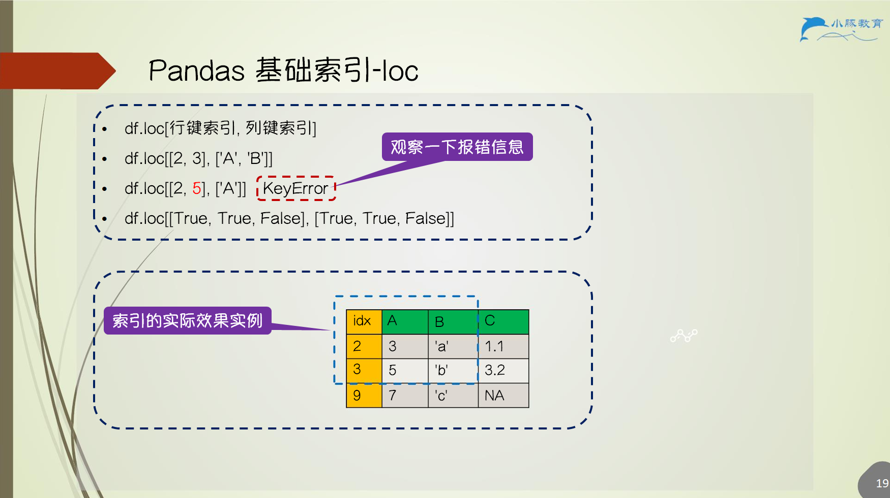</p>

#### 2.6.2 Pandas 基础索引 - iloc

<p align="center"></p>

#### 2.6.3 Pandas 基础索引 - where

<p align="center">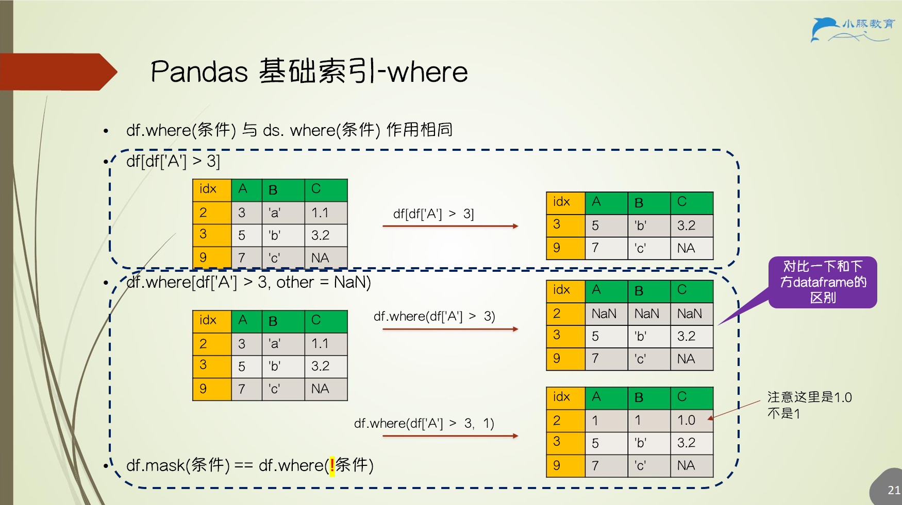</p>

#### 2.6.4 Pandas 基础索引 - 扩展说明

1. `df.where` 与 `numpy.where`
2. `df.where(条件, other)` 不满足条件的填充 `other`
3. `numpy.where(条件, x, y)` 满足条件填 `x`，不满足填 `y`
4. 多重列条件时可用 `numpy.select(条件列表, 填充值列表, default)`

#### 2.6.5 Pandas 基础索引 - query

筛选行

1. `df.query(字符串)`
2. `df[(df['a'] < df['b']) & (df['b'] < df['c'])]`
3. 可改写为 `df.query('a < b and b < c')`
4. 与 `df.query('a < b & b < c')` 相同吗（×）
5. `df.query('b == ["a", "b", "c"]') == df[df['b'].isin(['a', 'b', 'c'])]`

## 3. Pandas 常见函数与数据处理

### 3.1 缺失值操作

<p align="center"></p>

<p align="center">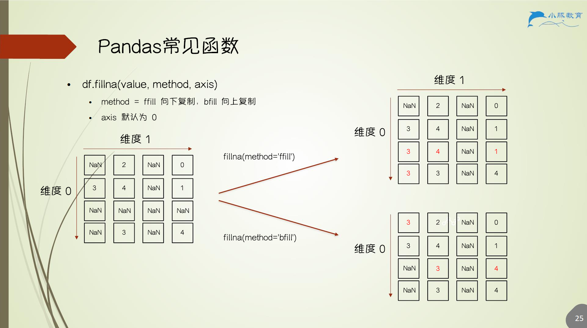</p>

### 3.2 赋值操作

1. 赋值操作
    - `df.loc[] = values`
    - `df.loc[] = df.apply(func, axis)`
        - `df.apply` 返回 `Series`
    - `df.loc[] = df.applymap(func)`
        - 针对 `DataFrame` 每个元素进行函数操作
    - `df.assign(col_name=func)`
        - 返回新的包含更新的 `col_name` 的 `DataFrame`
    - 尽量使用 `df.loc[]`，避免使用 `df[]` 赋值
        
2. `SettingWithCopyWarning`
    - 尝试修改一个从 `DataFrame` 选择出来的引用对象 `view`
    - `df[condition][column] = values` `df.loc[condition, column] = values`

### 3.3 统计函数

1. `df.describe()`
2. `df.info()`
3. `df.min()`
4. `df.max()`
5. `df.mean()`
6. `df.value_counts()`
    - 统计每一行元素数据出现的次数
    - 将列变为 `index`
    - 生成 `Series`
7. `df.corr()`： 数值列之间的*皮尔逊相关系数*
8. `df.cov()`：数值列之间的*协方差*

### 3.4 排序

1. `sort_index(axis, level)`
2. `sort_values(by, ascending)`
    - 依据哪些维度进行升序或降序排序
    - `by` 可以是多个列，`ascending` 对应每一列升降，不同列可以指定不同的顺序
    - 类比 SQL 的 `order by col1 asc, col2 desc`

### 3.5 数据合并

1. `pandas.concat(dfs, axis, join, ignore_index)`
    - 一般用做数据点拼接，行方向数据拼接
    - 列拼接时需要 `index` 对齐
    - `join` 默认 `outer join`，`inner/outer`
    - `ignore_index` `True` 重设 index `0, …, k`，否则按照原 index 拼接
2. `pandas.append`（将废弃）
    - 按行方向的 concat，等价于 `concat(axis=0)`
3. `pandas.merge`
    - 一般用做特征拼接，列方向拼接

#### 3.5.1 concat 函数

<p align="center">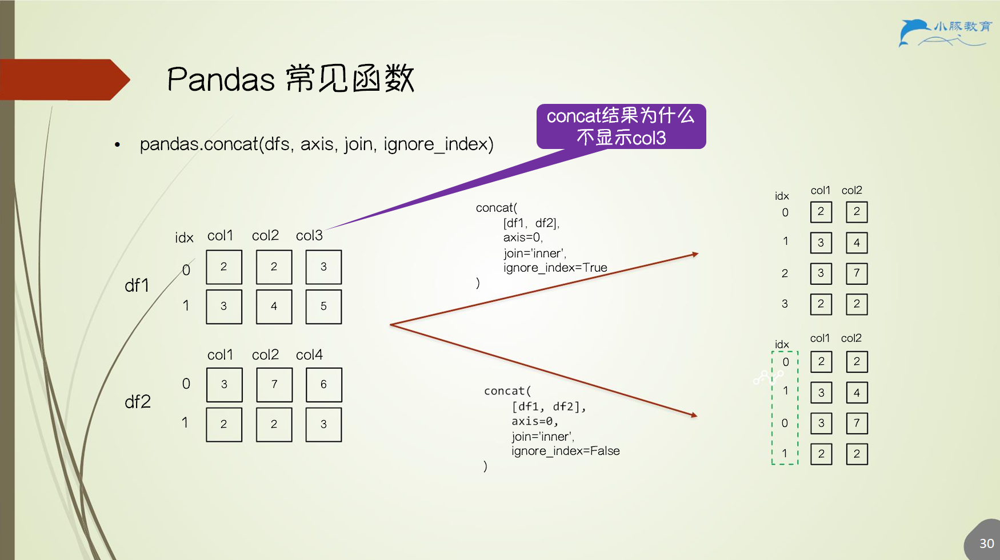</p>

<p align="center"></p>

#### 3.5.2 merge 函数

1. `pandas.merge( left, right, how='inner', on=None, left_on=None, right_on=None, left_index=False, right_index=False, suffixes=('_x','_y') )`
2. `left`, `right`，两个需要拼接的 DataFrame 或 Series
3. `how`，以何种方式拼接，`left/right/outer/inner/cross`
4. `on`，以哪一列为基准对齐拼接，需 left 和 right 均包含该列
5. `left_on`, `right_on`，左侧 DataFrame 以 `left_on` 为基，右侧以 `right_on` 为基
6. `left_index`, `right_index`，左侧 DataFrame 以 `left_index` 为基，右侧以 `right_index` 为基
7. `left_index` 可与 `right_on` 配对，反之亦然
8. `suffixes`，若 DataFrame 重名，则添加后缀

### 3.6 groupby 函数

1. `df.groupby(列名)`
    - 返回 `pandas.core.groupby.generic.DataFrameGroupBy`
    - 可遍历得到每组 DataFrame，`for key, group_df in df.groupby()`
        - 其中 `key` 为分组值，`group_df` 为分组值对应数据
    - 可聚合统计
    - 可多个列同时分组
    - 可以对 `DataFrameGroupBy` 进行取值操作 `df.groupby()[列名]`
2. `agg(func[s]) == aggregate(func[s])`
    - 聚合 `DataFrameGroupBy` 对象
    - 若是 DataFrame 则聚合全部数据
    - 类比 sql `sum` 等聚合函数
    - 若多个聚合函数，列索引将多一级聚合函数的索引

### 3.7 inplace 参数

1. 修改原 `DataFrame` 还是生成新 `DataFrame`
2. Pandas 基本所有数据操作都可以在原 `DataFrame` 上修改数据
3. 默认 `inplace=False`，需明确 `inplace=True` 以修改原数据

### 3.8 Pandas 数据处理案例

案例：100 个日报 csv 文件合并，见 notebook


## 4. Pandas Series 介绍

### 4.1 函数（数值篇）

统计函数

1. `ds.describe()` 总体描述
2. `ds.count()` 计数
3. `ds.min()`
4. `ds.max()`
5. `ds.mean()`
6. `ds.value_counts()`
    - 统计 Series 中每个元素数据出现的次数
    - 将元素变为 `index`，并且生成新 `Series`
7. `ds.quantile()` 分位数
8. `ds.std()` 标准差
9. `ds.median()` 中位数
10. `ds.cumsum()` 累计求和
11. `ds.cumprod()` 累计乘积

其他函数参考 notebook

### 4.2 函数（字符串篇）

1. `ds.str.replace(value1, value2)` 字符串替换
2. `ds.str.contains(value)` 判断字符串是否包含 value
3. `ds.str.split(sep)` 按照分隔符 sep 把字符串分割
4. `ds.str.join()` 字符间填充
5. `ds.str.slice()` 字符串切片
6. `ds.str.count()` 统计 Series 中指定元素数据出现的次数，可以设定位置范围
7. `ds.str.startswith(value)` 判断字符串是否以 value 开头
8. `ds.str.endswith(value)` 判断字符串是否以 value 结尾
9. `ds.str.len()` 返回字符串的长度
10. `ds.str.strip()` 去除字符串的空格
11. `ds.str.lower()` 字符全部小写
12. `ds.str.upper()` 字符全部大写

### 4.3 Series 转成 DataFrame

<p align="center"></p>

### 4.4 apply 自定义函数

<p align="center">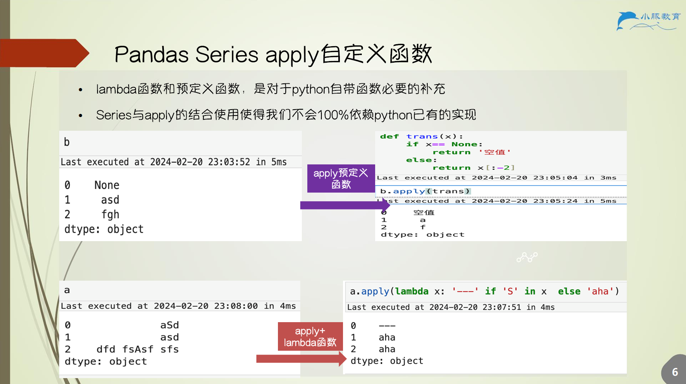</p>

### 4.5 排序

<p align="center"></p>

## 5. Pandas 分组聚合

### 5.1 增加列

<p align="center">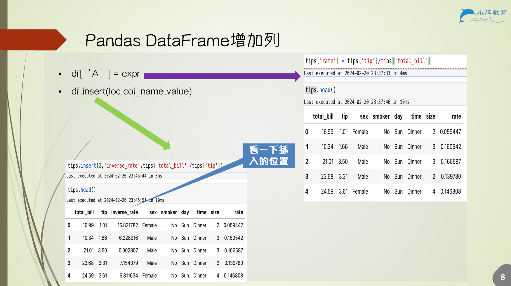</p>

<p align="center">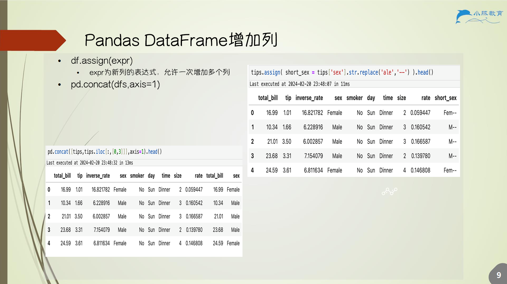</p>

<p align="center">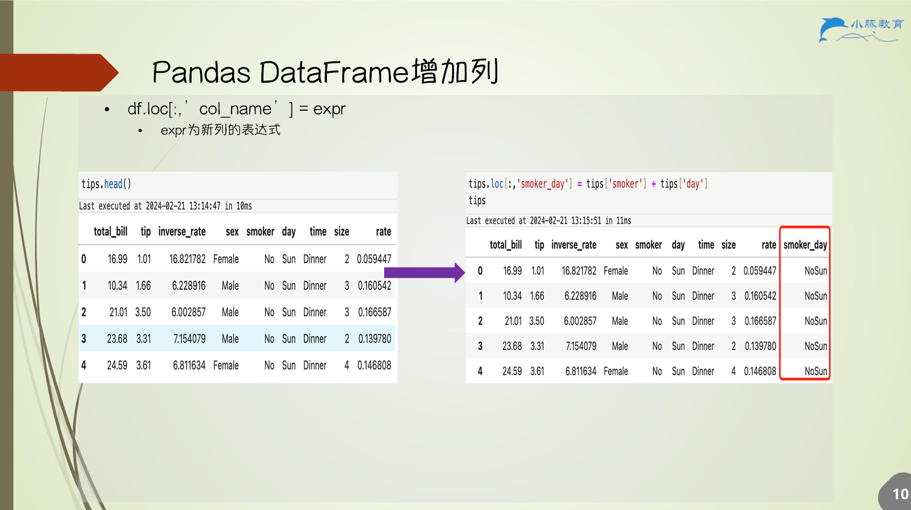</p>

### 5.2 增加行

<p align="center"></p>

### 5.3 删除列

<p align="center"></p>

<p align="center">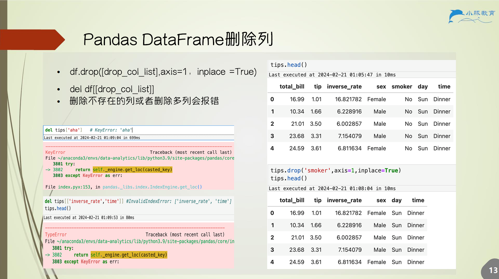</p>

### 5.4 删除行

<p align="center"></p>

### 5.5 排序（单维度）

<p align="center"></p>

### 5.6 排序（多维）

<p align="center">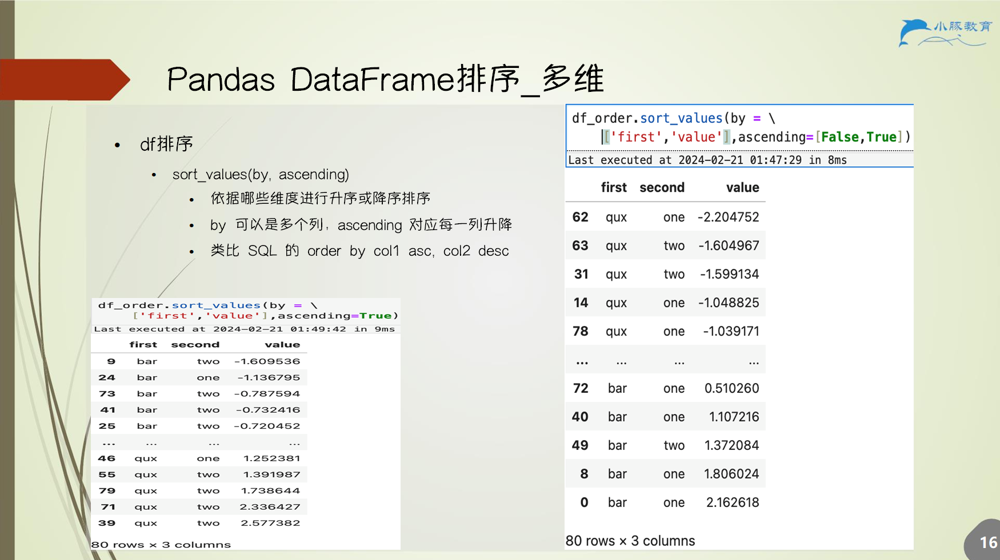</p>

### 5.7 查重与去重

<p align="center"></p>

### 5.8 分类数据（有序）

<p align="center"></p>

### 5.9 分组聚合

#### 5.9.1 函数

1. `df.groupby(列名)`
    - 返回 `pandas.core.groupby.generic.DataFrameGroupBy`
    - 可遍历到每组 DataFrame，`for key, group_df in df.groupby()`
        - 其中 `key` 为分组值，`group_df` 为分组值对应数据
    - 可聚合统计
    - 可多个列同时分组
    - 可以对 `DataFrameGroupBy` 进行列取值操作 `df.groupby()[列名]`
2. `agg(func[s]) == aggregate(func[s])`
    - 聚合 `DataFrameGroupBy` 对象
    - 若是 DataFrame 则聚合全部数据
    - 类比 sql `sum` 等聚合函数
    - 若多个聚合函数，列索引将多一级聚合函数的索引

#### 5.9.2 分组聚合计算效果

<p align="center"></p>

#### 5.9.3 分组聚合 - 索引变列

<p align="center"></p>

### 5.10 Pandas transform

<p align="center">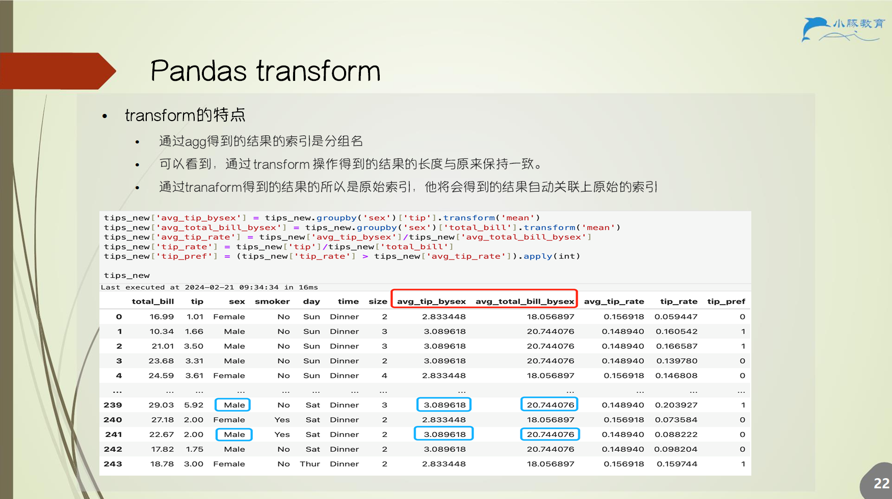</p>

### 5.11 聚合与自定义函数

<p align="center">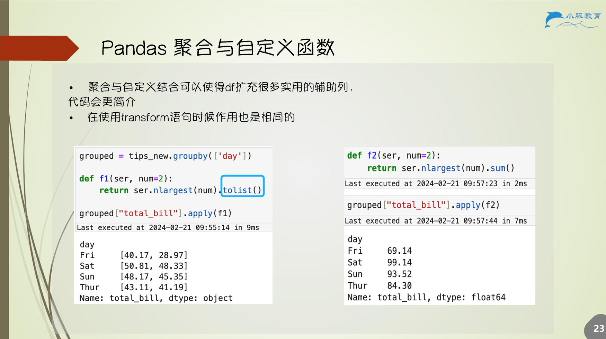</p>

### 5.12 Pandas transform 与自定义函数

<p align="center"></p>

## 6. Pandas 数据变形

### 6.1 long2wide

#### 6.1.1 pivot_table 参数解读

```python
pd.pivot_table(
    data,
    values=None,          # 数值 计算完成应该用来作为取值内容
    index=None,           # 索引 计算完成应该作为行
    columns=None,         # 列名 计算完成应该作为列名
    aggfunc='mean',       # 聚合函数 如果在索引和列的条件下 values 不唯一 可以进行聚合
    fill_value=None,      # 如果有空值 可以填补为设置的参数
    margins=False,        # 是否加入边际计算
    dropna=True,          # 是否去除所有值为空的列
    margins_name='All'    # 在 margins 为 True 的时候 margins 列的名字
)
```

#### 6.1.2 pivot_table 效果展示

<div style="display: flex; justify-content: center; gap: 10px; align-items: center;">
  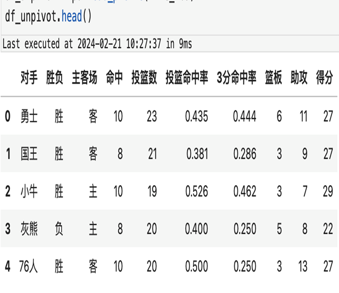
  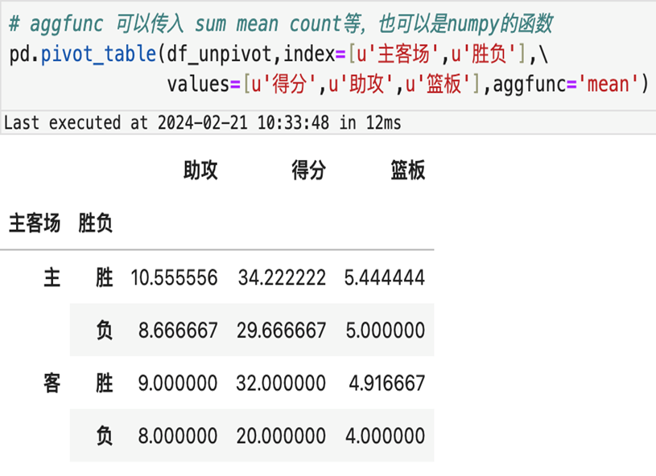
</div>

<div style="display: flex; justify-content: center; gap: 10px; align-items: center;">
  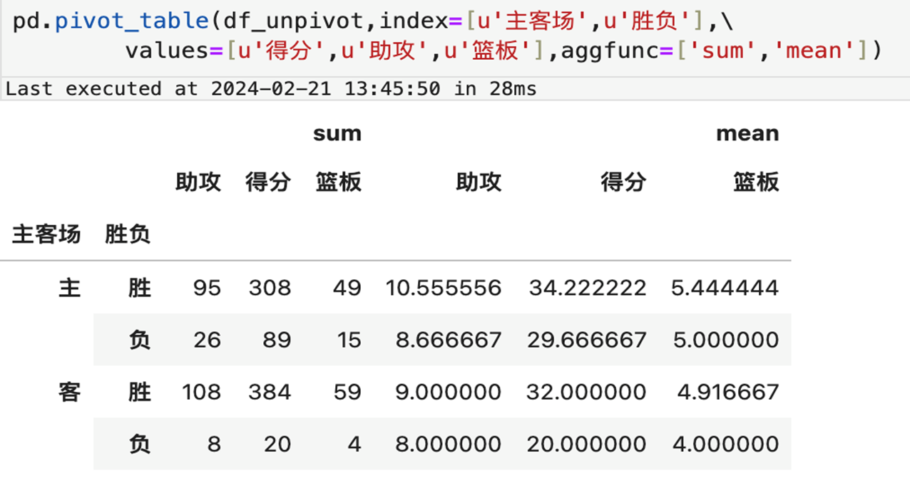
  
</div>

### 6.2 wide2long

#### 6.2.1 melt 参数解读

```python
pd.melt(
    frame,                  # 数据框
    id_vars=None,           # 不参与宽变长（列变行）的列名
    value_vars=None,        # 参与宽变长（列变行）的列名
    var_name=None,          # 列变行后的新列名
    value_name='value',     # 原来所有列的数据被赋予的新列名
    col_level=None          # 列层级（多层列时使用）
)
```

➤ 长数据 VS 宽数据

1. 计算需要，在与其他数据框关联的时候，*至少一个数据框*需要进行长宽变形
2. **长**数据个别的时候可以*节省循环*，在案例中会有体现
3. **长**数据格式更*方便存储*，如果需要写入数据库，建议用长数据
4. **宽**数据更容易*匹配机器学习模型*
5. **宽**数据更容易进行*对比分析*，适合作图

#### 6.2.2 melt 效果展示

<div style="display: flex; justify-content: center; gap: 10px; align-items: center;">
  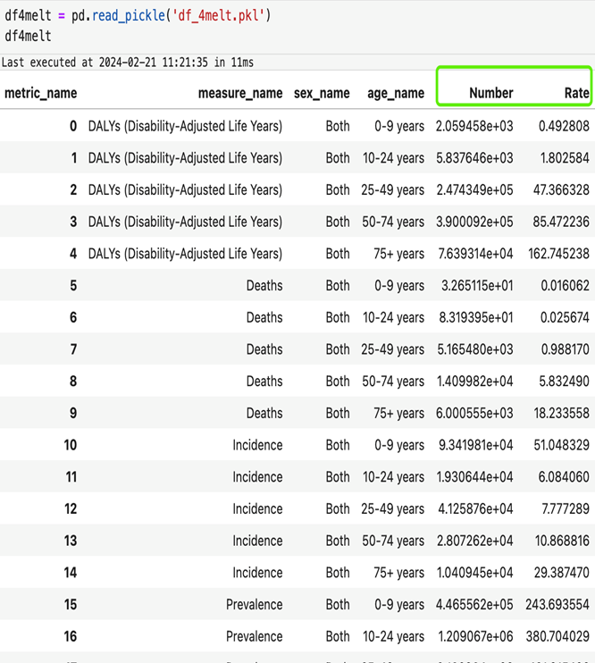
  
</div>

### 6.3 apply 函数

<p align="center">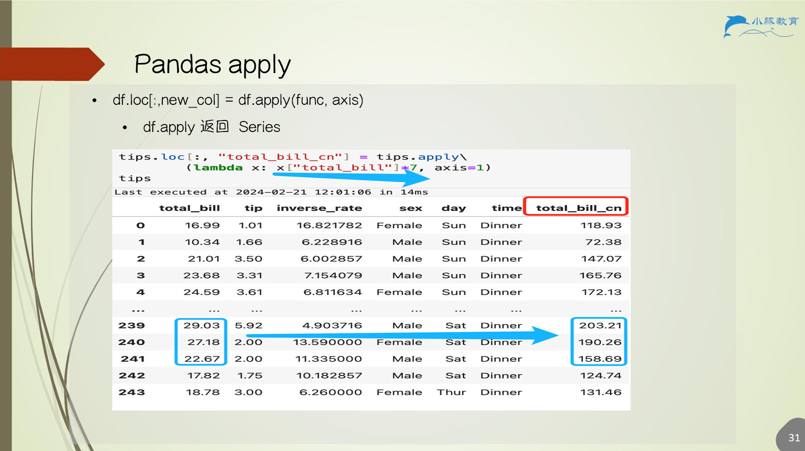</p>

### 6.4 map(applymap)

<p align="center"></p>

### 6.5 df 关联

#### 6.5.1 函数

```python
pandas.merge(
    left,                       # 两个需要拼接的 DataFrame 或 Series
    right,
    how='inner',                # 以何种方式拼接 left/right/outer/inner/cross
    on=None,                    # 以哪一列为基准对齐拼接 需 left 和 right 均包含该列
    left_on=None,               # 左侧 DataFrame 以 left_on 为基
    right_on=None,              # 右侧 DataFrame 以 right_on 为基
    left_index=False,           # 左侧以 index 为基
    right_index=False,          # 右侧以 index 为基
                                # left_index 可与 right_on 配对 反之亦然
    suffixes=('_x', '_y')       # 若 DataFrame 重名 则添加后缀
)
```

#### 6.5.2 df 关联效果

<p align="center">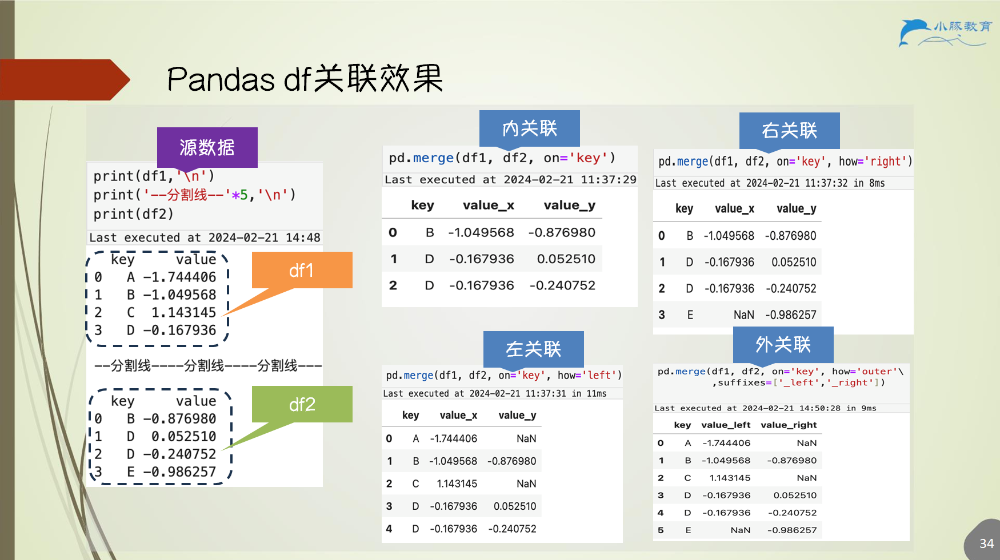</p>

<p align="center">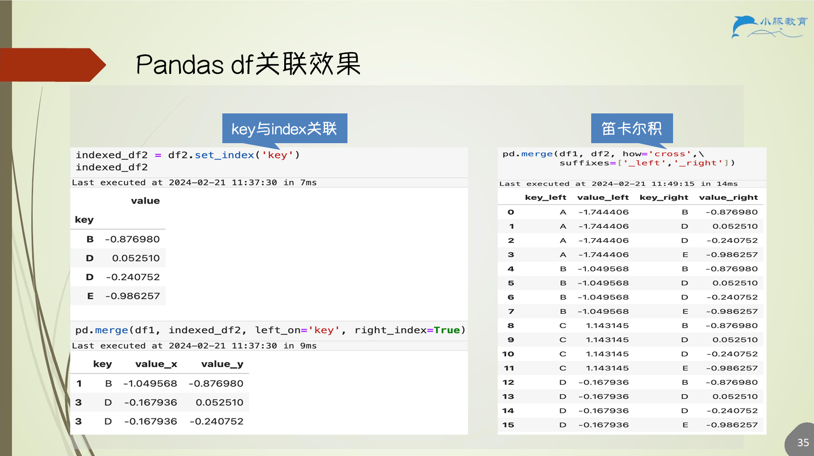</p>

### 6.6 Pandas 数据处理案例

案例 1：葡萄酒感官评分分析

- Pandas 遍历 excel 的 sheet
- 样品感官评分与样本信息关联

案例 2：班级偏科学生查询

- 偏科学生定义
- 方法 1 实现：df 关联
- 方法 2 实现：groupby+transform


## 7. Series 排名函数、位移函数与可视化

### 7.1 排名函数

```python
Series.rank(
    method='average',    # 排名方法 选项 ['average','min','max','first','dense'] 默认 'average'
    na_option='keep',    # 空值处理方式 选项 ['keep','top','bottom'] 默认 'keep'
    ascending=True,      # 是否升序排列 默认 True
    pct=False            # 是否使用百分比排名 默认 False
)
```

<div style="display: flex; justify-content: center; gap: 10px; align-items: center; flex-wrap: wrap;">
  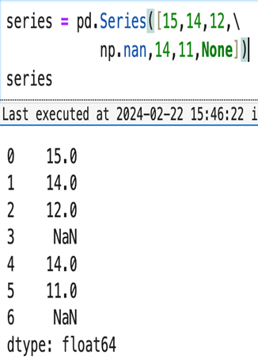
  
  
  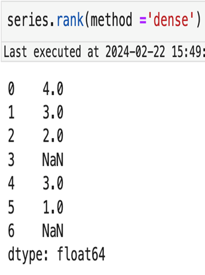
</div>

1. `na_option` 参数为 top 是优先对空值进行排序，`bottom` 是最后对空值进行排序
2. `pct` 为 `True` 则返回百分比排名，否则反馈默认的数值排名，百分比排名的计算公式为排名值/最大排名值

<p align="center">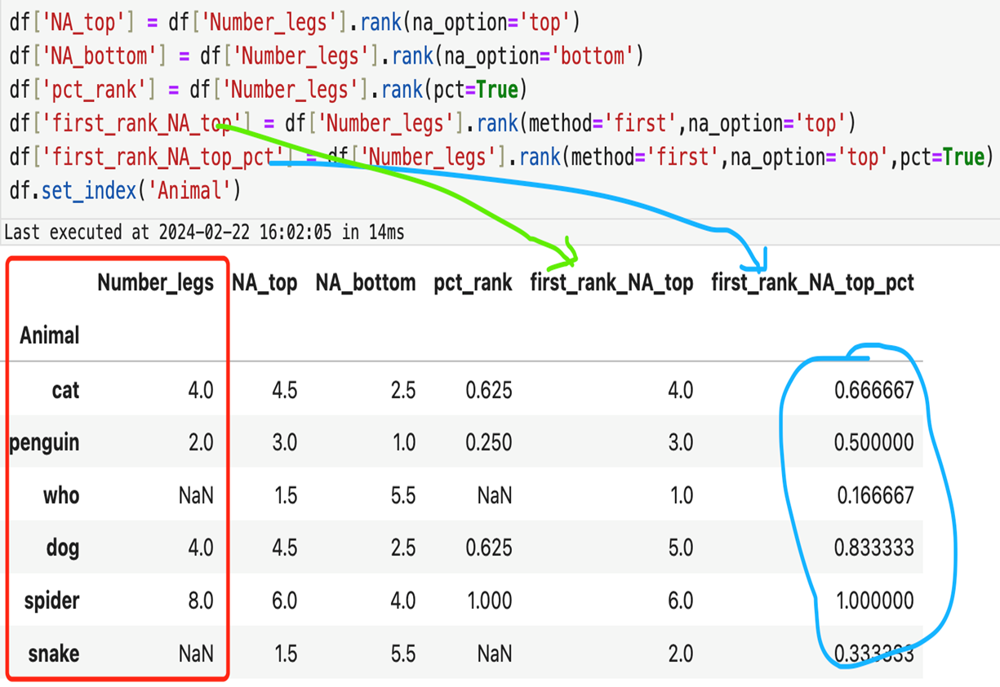</p>

### 7.2 位移函数

```python
Series.shift(
    periods,            # 要移动的周期数 可以是正数或负数
    fill_value=None     # 用于新引入的缺失值的标量值
)

# shift 函数对于处理日期连续行为的数据处理上有着非常高的被引用频率
# 可以说是 Series 的一个明星函数
```

<div style="display: flex; justify-content: center; gap: 10px; align-items: center; flex-wrap: wrap;">
  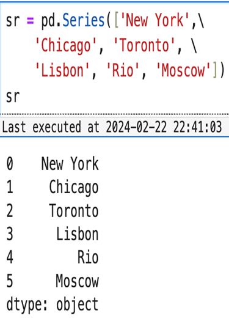
  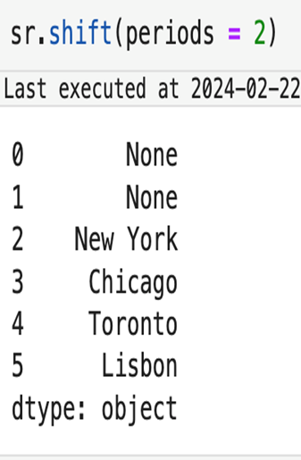
  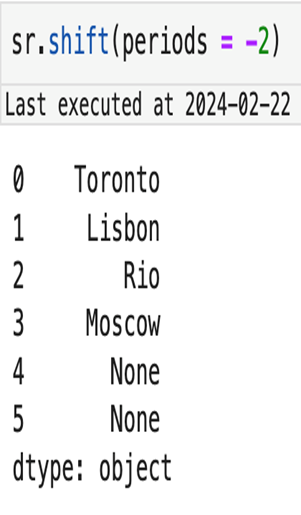
  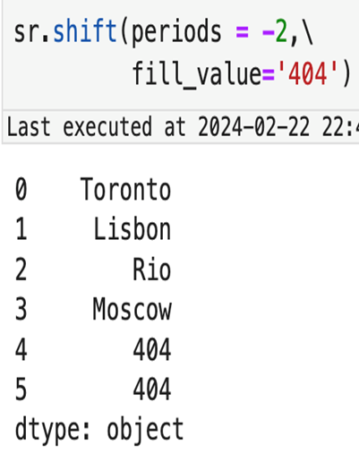
</div>

**注意**：填充缺失值可能会导致*数据类型改变*

<div style="display: flex; justify-content: center; gap: 10px; align-items: center;">
  
  
</div>

### 7.3 画图

#### 7.3.1 plot 简介

`Series.plot` 支持条线图、柱状图、水平柱状图、直方图、箱线图、密度图、饼图、散点图等

```python
Series.plot(
    kind=None,            # 图像样式 核举值在右侧
                          # 'line'：折线图（默认）
                          # 'bar'：柱状图
                          # 'barh'：水平柱状图
                          # 'hist'：直方图
                          # 'box'：箱线图
                          # 'kde'：核密度图
                          # 'density'：同 'kde'
                          # 'area'：面积图
                          # 'pie'：饼图
                          # 'scatter'：散点图
                          # 'hexbin'：六边形图
    figsize=(x, y),       # 图像大小 (长, 宽)
    color=None            # 颜色 例如 'green','orange' 等
)
```

#### 7.3.2 条线图

1. `Series.plot` 默认是条线图
2. 条线图一般是与时间序列为搭配，查看指标趋势
3. `figsize` 参数可以指定图像大小，参考 notebook

<p align="center">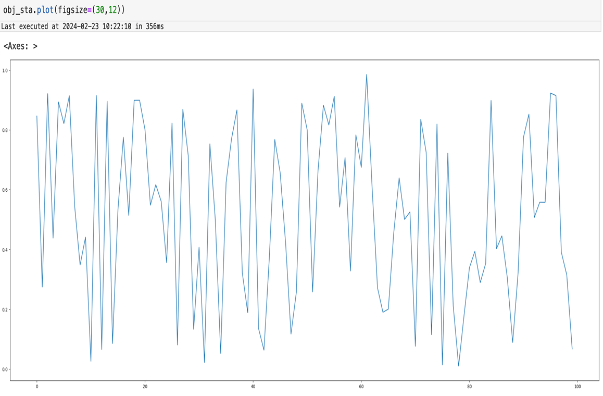</p>

#### 7.3.3 柱状图

1. `Series.plot` 默认为条线图，柱状图参数为 `bar/barh`
2. 一般用于不同系列的对比
3. 在本例子中用柱状图不如用时序图来表达趋势直观

<p align="center">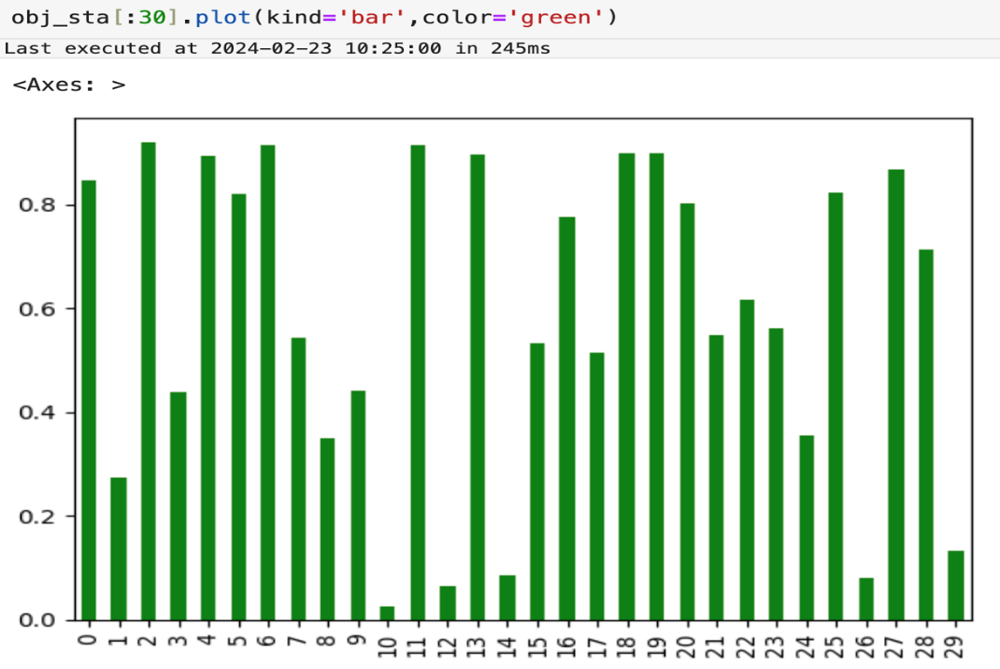</p>

#### 7.3.4 直方图

1. 参数为 `hist`
2. 与柱状图不同的是，这是一个聚合结果的可视化
3. `bins` 是代表分桶数，值越大，每个柱子的区间范围就越小

<p align="center">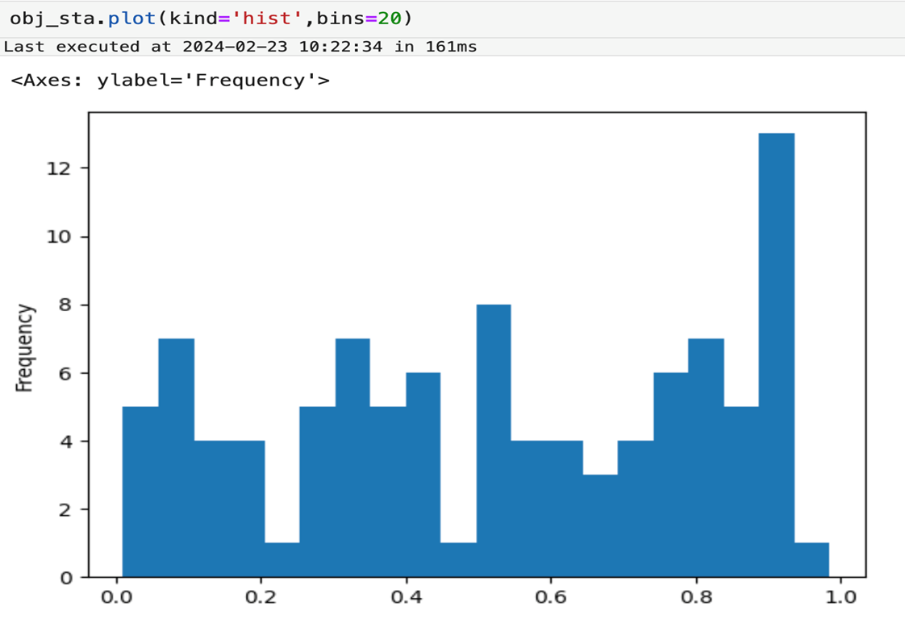</p>

#### 7.3.5 密度图

1. 与直方图类似，但是结果展示是平滑曲线
2. 可以找出集中分布的区域（优于直方图）
3. 横轴可能会溢出枚举值，有时候需要处理，可以加参数 `xlim` 进行约束
4. `kind` 参数值为 `kde`

<p align="center">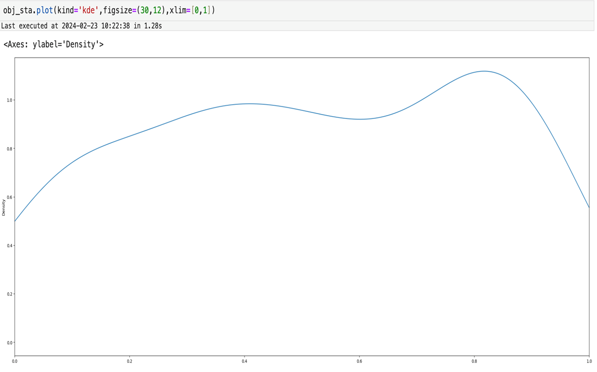</p>

## 8. DataFrame 时间序列处理与可视化

### 8.1 时间序列处理

#### 8.1.1 dt 函数

1. `dt.date` 可以生成短日期形式数据
2. 两个 datetime 类型数据相减，可以利用 `dt.days` 计算日期差

<p align="center">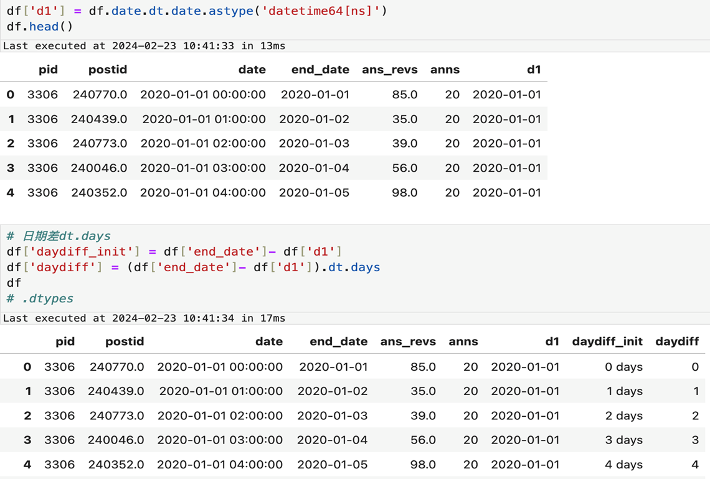</p>

#### 8.1.2 日期转年月周

1. 参考下方示例和代码判断函数作用
2. 日期可以计算年/月/周序号/每周的日序号等
3. 一般在数据分析中很常见把日期转化成*周/月/序号*来聚合分析

<p align="center"></p>

#### 8.1.3 小例子

1. 某个网站某分类每周 7 天的汇总回答人数
2. 可以看到周五是低点，周日，周一是高点，比如举办一些运营活动，不建议在周五举办，用户活跃较差，效果会打折扣

<p align="center">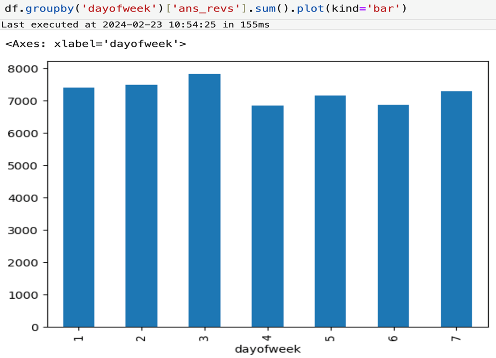</p>

#### 8.1.4 pd.to_datetime()

1. 某个网站某分类每周 7 天的平均回答人数
2. 可以看到周五是低点，周日，周一是高点，比如举办一些运营活动，不建议在周五举办，用户活跃较差，效果会打折扣

<p align="center">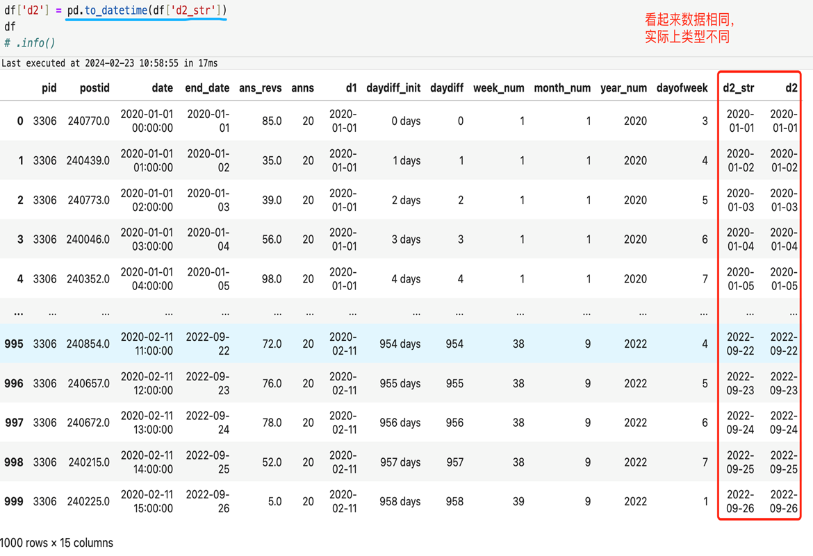</p>

#### 8.1.5 df.resample()

1. 关键参数 `rule`，按照数字 + 单位的规则
2. 必须具有 `datetime` 类似的索引

<div style="display: flex; justify-content: center; gap: 10px; align-items: center;">
  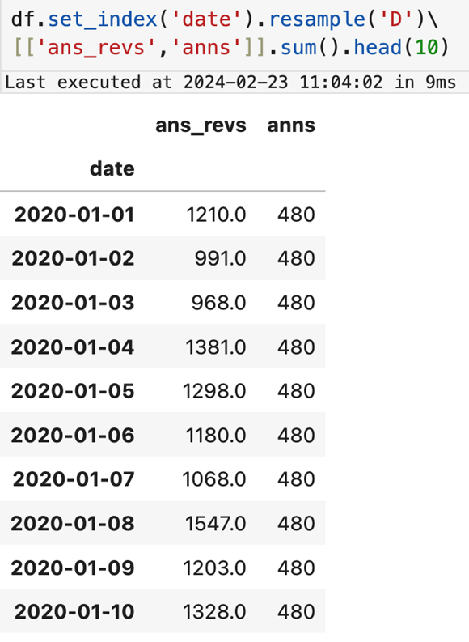
  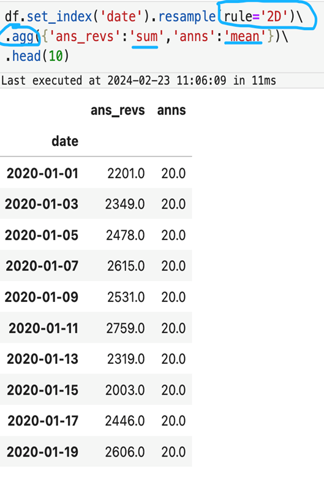
</div>

### 8.2 画图

#### 8.2.1 条线图

1. 参数与 `Series.plot` 比较接近，基本上在 `Series` 中的参数 `df.plot` 都有
2. 指定 `y =` ，是传递要绘制二维图像的纵列
3. `kind = line` 是默认值，也可以不写

<p align="center"></p>

#### 8.2.2 直方图

1. `df.plot` 参数中，需要指定要绘制的系列，例如 `y=`
2. 需要指定 `kind` 参数
3. 其余参数例如调节图像大小等与 `Series.plot` 相似度比较高，可以参考 `Series.plot`

<p align="center"></p>

#### 8.2.3 饼图

1. 饼图适用于对比某个特征下不同枚举值对应的次数分布，一般是聚合后的数据
2. 例如 `df_plot` 中三个 `index` 分别对应统计后的数值
3. 饼图会画出占比的大概情况
4. `plot.pie` 和 `plot` 可以实现相同的效果，pandas 画图的函数并非一一对应，还是比较灵活的

<div style="display: flex; justify-content: center; gap: 10px; align-items: center;">
  
  
</div>

#### 8.2.4 箱线图

1. `df.boxplot` 可以画箱线图
2. 需要指定横轴，通过参数 `by`，这个列的含义是观察 y 的其中一个视角
3. 指定纵轴，通过参数 `column`
4. 对比不同 x 的枚举值下 y 的分布情况，往往会得出结论

<p align="center"></p>

### 8.3 剪切板复制数据

```python
pd.read_clipboard(
    sep=' '   # 分隔符 默认是空格 读取最近复制的内容 解析成 DataFrame
)
```

<div style="display: flex; justify-content: center; gap: 10px; align-items: center;">
  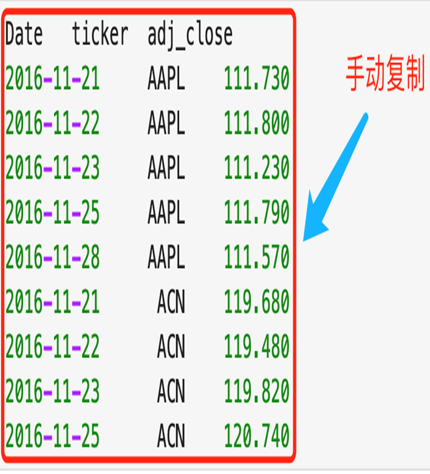
  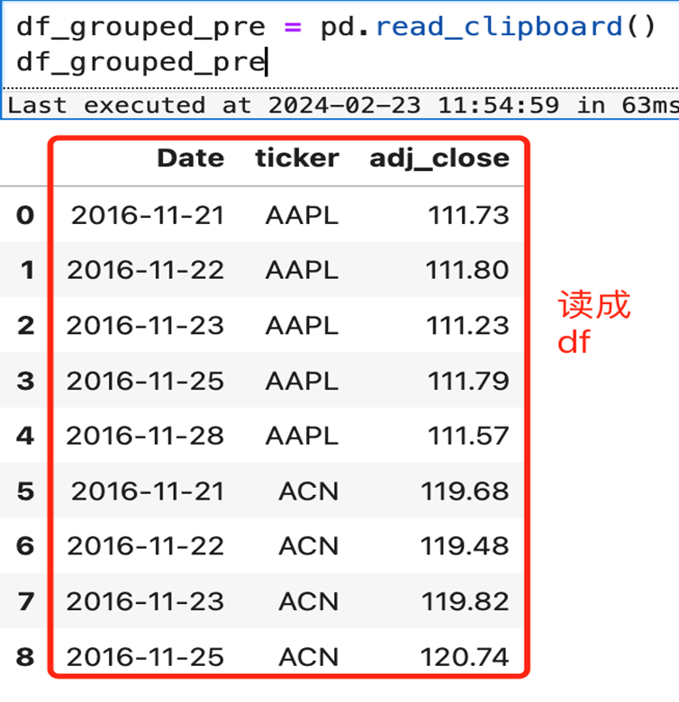
</div>

### 8.4 画图

#### 8.4.1 时间序列图

1. 与折线图接近
2. 区别在于横轴特定为日期
3. 日期可以解析为周，月，年等信息，又可以看出新的解读
4. 指标排查的分析中常用的就是时间序列图

<p align="center"></p>

#### 8.4.2 可视化包学习建议

1. 必须掌握的是 **Matplotlib** 和 **Seaborn** 常见图形的画法
2. **Pyecharts / Bokeh / Plotly / Altair** 是不错的补充，尤其适合 **动态图** 场景
3. 低频工具包，在遇到特定的可视化问题时可参考使用

⭐ 常用工具包：

1. Matplotlib
2. Seaborn
3. Pyecharts
4. Bokeh
5. Plotly
6. Altair

📉 低频使用工具包：

7. ggplot
8. Pygal
9. VisPy
10. NetworkX
11. HoloViews
12. GeoPlotLib
13. Folium
14. Gleam
15. Vincent
16. mpld3
17. python-igraph
18. missingno
19. Mayavi2
20. Leather

## 9. Pandas 小结 - 功能篇

<p align="center"></p>

<p align="center"></p>

案例 1: 利用 pandas 进行直播在线人数可视化

<p align="center"></p>

<p align="center"></p>


