# 1.环境搭建与AI基础

## 1. 课程目标以及重点

> [!NOTE] ✏️ 信息
> - 环境搭建：掌握 Python 开发、AI 编程工具、云服务器相关的环境配置
> - LeetCode 刷题：掌握 LeetCode 刷题的技巧，以 LeetCode top 100 热题进行 1-2 个月的刷题实践
> - 机器学习：掌握常见的机器学习的算法以及对应的评估指标
> - 深度学习：掌握深度学习的建模流程和 CNN 框架的基本流程

## 2. 课后作业

- 完成课上开发环境的熟悉和搭建
- 基于 ModelScope 或者本地开发环境，完成基于 lightgbm 和 xgb 算法对如下的数据集进行二分类任务建模，其中 label 为 stars，去掉 stars 为空的数据后，stars 大于 3 为 1，小于 3 的为 0，具体的数据集如下所示，对数据进行训练集：测试集为 8:2 进行划分，评估训练集和测试集的分类指标：acc，precision，recall。
- 特征提取大家可以自由发挥，必须要有文本特征 + 其他特征

[L1_环境搭建与AI基础.csv](./assets/L1_环境搭建与AI基础.csv)

- 预习一下里面的代码，掌握 PyTorch 的使用

<p align="center">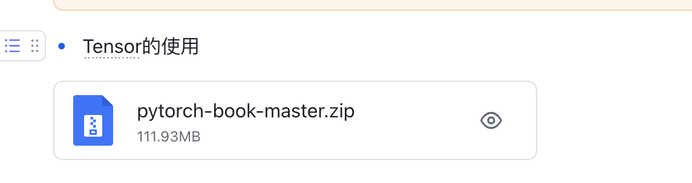</p>

## 3. 环境配置

- 语言：Python
- 本次课程中需要了解和熟悉的环境主要为 Conda 和 Torch 相关的环境，具体的安装如下所示：

### 3.1 Conda 环境安装

- 企业工作和项目中主要用到的环境为个人开发机和云服务器相关的 conda 开发环境，其中相关的 conda 开发环境安装如下所示：

<p align="center">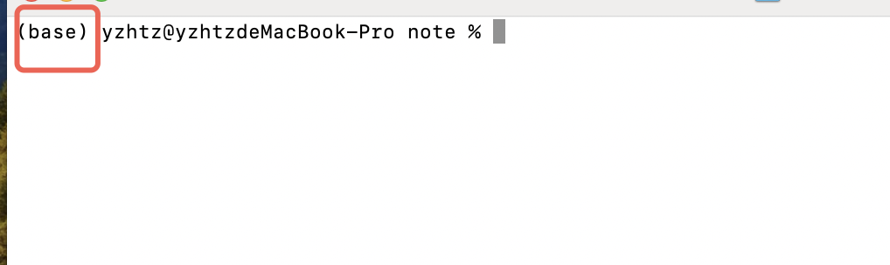</p>

> [!NOTE] ✏️ 信息
> - conda env list
> - conda  create -n 名字 python 版本      具体例子：conda  create -n ml  python=3.13
> - conda activate 环境   具体例子：conda activate base
> - 安装教程：<https://blog.csdn.net/weixin_43712770/article/details/104695344>

### 3.2 Torch 环境

> [!NOTE] ✏️ 信息
> - Torch 是一个与 NumPy 类似的张量（Tensor）操作库，与 NumPy 不同的是 Torch 对 GPU 支持的很好
> - PyTorch 是一个基于 Torch 的 Python 开源机器学习库，用于自然语言处理等应用程序。 它主要由 Facebook 的人工智能研究小组开发。PyTorch 是一个 Python 包，提供两个高级功能：
> - 具有强大的 GPU 加速的张量计算（如 NumPy）
> - 包含自动求导系统的的深度神经网络
> - <https://pytorch.org/get-started/locally/>

- Tensor 的使用

[l1_attachment_02.zip](./assets/l1_attachment_02.zip)

### 3.3 编辑器：VS Code

- <https://code.visualstudio.com/Download>
- 好用插件：

<p align="center"></p>

<p align="center"></p>

### 3.4 模型管理环境

- ModelScope：<https://modelscope.cn/competition>

### 3.5 云服务器

- Autodl：<https://www.autodl.com/console/instance/list?tag_id=&_random_=1764476359560>
- ModelScope：<https://modelscope.cn/>

### 3.6 AI 编程：Cursor

- cursor：<https://cursor.com/cn>

### 3.7 LeetCode

- <https://leetcode.cn/>
- 策略：从 0 到 1，要从 1 到 n

## 4. 机器学习基础

- sklearn：<https://www.bookstack.cn/read/sklearn-0.21.3/1e706cabf087e0c5.md>
- 建模流程
- 哪些阶段会影响最终效果
- 只改变训练集的大小，不改变测试集的大小
- 怎么评估效果
- y=wx+b

### 4.1 建模任务分类

<p align="center">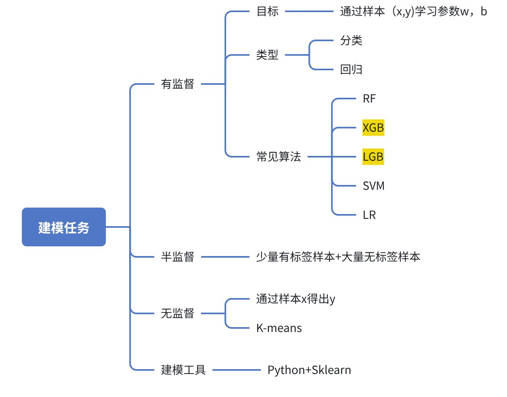</p>

### 4.2 机器学习建模流程

<p align="center">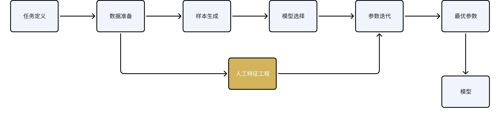</p>

### 4.3 评估指标

- 分类

<p align="center">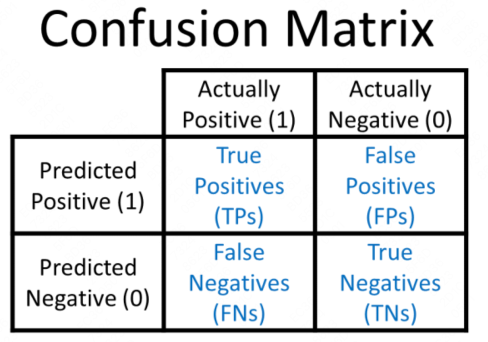</p>

<p align="center">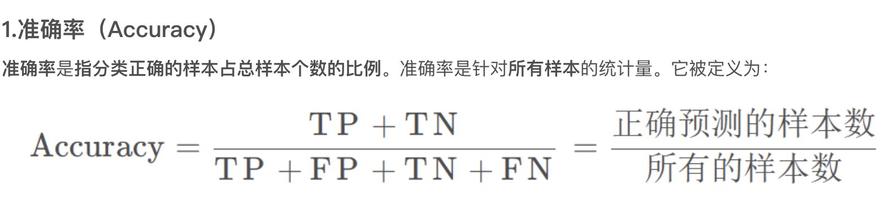</p>

```python
from sklearn.metrics import accuracy_score

# 假设有以下真实标签和预测标签
y_true = [0, 1, 2, 2]
y_pred = [0, 1, 1, 2]

# 计算准确率
accuracy = accuracy_score(y_true, y_pred)
print(f"准确率: {accuracy:.2f}")
```

```text
准确率: 0.75
```

<p align="center">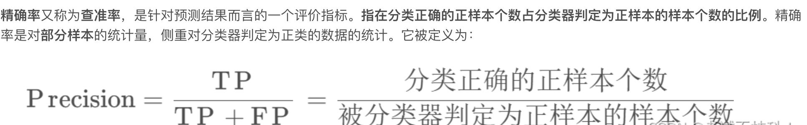</p>

<p align="center">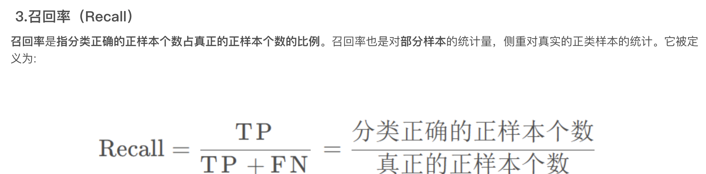</p>

```python
from sklearn.metrics import precision_score, recall_score

# 计算精确率
precision = precision_score(y_true, y_pred, average='macro')
print(f"精确率: {precision:.2f}")

# 计算召回率
recall = recall_score(y_true, y_pred, average='macro')
print(f"召回率: {recall:.2f}")
```

```text
精确率: 0.67
召回率: 0.67
```

- 分类报告：

```python
from sklearn.metrics import classification_report
print(classification_report(y_true, y_pred))
```

- 回归
- MAE: 平均绝对误差：mae 是回归模型中常用的评估指标之一。它用于衡量模型预测结果与真实值之间的平均绝对差异程度，即平均预测误差的绝对值。计算 MAE 的公式如下：

$$
L=\frac{1}{m}\sum_{i=1}^{m}|y_i - \hat{y}_i|
$$

MAE 的值越小，表示模型的预测能力越好。它具有对异常值不敏感的特点，适用于对预测结果的平均误差情况进行评估。在 sklearn 中，可以使用 mean_absolute_error 函数来计算 MAE。

- MSE：均方误差：它用于衡量模型预测结果与真实值之间的均方差，即平均预测误差的平方

$$
L=\frac{1}{m}\sum_{i=1}^{m}(y_i - \hat{y})^2
$$

该方法会放大预测值偏大的，对异常值比较敏感，MSE 的值越小，表示模型的预测能力越好。它在某些情况下比均绝对误差（MAE）更敏感，因为它对预测值与真实值之间的较大误差进行了平方处理。但是 MSE 的值的量纲是原始数据平方，可能不易于直观理解。

- RMSE：均方根误差：均方根误差是 MSE 的平方根，它与原始数据具有相同的单位。

$$
L=\sqrt{\frac{1}{m}\sum_{i=1}^{m}(y_i - \hat{y})^2}
$$

因为使用的是平均误差，而平均误差对异常点较敏感，如果回归器对某个点的回归值很不合理，那么它的误差则比较大，从而会对 RMSE 的值有较大影响，即平均值是非鲁棒的。

- MAPE：平均绝对百分比误差

$$
L=\frac{1}{m}\sum_{i=1}^{m}|\frac{y_i-\hat{y}_i}{y_i}|
$$

> 评价的是相对于真实值的误差比例，但是有一个问题就是，如果真实值为 0 的话，该评价指标无效
>
> 如果预测值小于真实值（低估），如果大于（高估）
>
> 低估: 此时, 即上界为 100;
>
> 高估: 此时, 即上界为无穷大.
>
> 由于高估会带来较大惩罚, 为了最小化 MAPE 值, 算法会倾向低估, 从而导致预测的销量偏低.

- SMAPE: 平均绝对百分比误差

该方法可以处理掉真实值为 0 的情况，但是如果预测值也为 0 的话就会有问题

$$
L=\frac{1}{n}\sum_{i=1}^{m}\frac{|y_i-\hat{y}_i|}{|y_i|+|\hat{y_i}|}
$$

> 在实际的销量预测中, 由于销量的上界通常是有限的 (通过经验可以预估), 因而即使出现 " 高估 " 的情形, 预测销量一般不会超过实际销量的常数倍 (例如不超过 10 倍). 从这个角度来看, 高估时误差的上界一般低于低估时对应的上界. 换句话说, 低估带来的惩罚比高估大. 因此如果使用 SMAPE 作为误差指标, 其预测销量一般会高于实际销量.

- WMAPE: 加权的百分比误差

该方法的好处就是可以处理 mape 这个问题：例如一件卖了 10 件的商品预测值在 5-15 之间和卖了 5000 件的商品预测在 4955-5005 的贡献的 mape 是一样的，但显然两个预测的准确度差异巨大。该方法给销量的商品更大的权重。

$$
L=\frac{\sum_{n}|y_i - \hat{y}_i|}{\sum_{n}y_i}
$$

- 决定系数（R-squared, R²）

决定系数衡量模型捕捉数据可变性的程度。具体的公式如下所示：

$$
r^2=\frac{\sum_{i=1}^{n}(y_i-y'_i)^2}{\sum_{i=1}^{n}(y_i-y_{平均})^2}
$$

```python
from sklearn.metrics import mean_squared_error, r2_score
from sklearn.linear_model import LinearRegression
from sklearn.model_selection import train_test_split
from sklearn.datasets import make_regression

# 生成模拟回归数据
X, y = make_regression(n_samples=100, n_features=1, noise=0.4, random_state=42)

# 划分训练集和测试集
X_train, X_test, y_train, y_test = train_test_split(X, y, test_size=0.2, random_state=42)
```

### 4.4 具体例子

**RF 分类器**

同样的我们通过 sklearn 中自带的莺尾花分类器数据来做为我们实践 tf 模型的基本数据，具体的代码流程如下所示：

```python
from sklearn.datasets import load_iris
from sklearn.model_selection import train_test_split
from sklearn.ensemble import RandomForestClassifier
from sklearn.metrics import accuracy_score

# 加载iris数据集
iris = load_iris()
X, y = iris.data, iris.target

# 划分训练集和测试集
X_train, X_test, y_train, y_test = train_test_split(X, y, test_size=0.2, random_state=42)
# 创建随机森林分类器实例
rf_classifier = RandomForestClassifier(n_estimators=100, random_state=42)

# 训练模型
rf_classifier.fit(X_train, y_train)

# 在测试集上进行预测
y_pred = rf_classifier.predict(X_test)
# 计算准确率
accuracy = accuracy_score(y_test, y_pred)
print(f"准确率: {accuracy:.2f}")
```

**RF 回归器**

同样的我们通过 sklearn 中自带的莺尾花分类器数据来做为我们实践 tf 模型的基本数据，具体的代码流程如下所示：

```python
from sklearn.datasets import make_regression
from sklearn.model_selection import train_test_split
from sklearn.ensemble import RandomForestRegressor
from sklearn.metrics import mean_squared_error, r2_score

# 生成模拟回归数据
X, y = make_regression(n_samples=1000, n_features=10, noise=0.1, random_state=42)

# 划分训练集和测试集
X_train, X_test, y_train, y_test = train_test_split(X, y, test_size=0.2, random_state=42)

# 创建随机森林回归器实例
rf_regressor = RandomForestRegressor(n_estimators=100, random_state=42)

# 训练模型
rf_regressor.fit(X_train, y_train)
# 在测试集上进行预测
y_pred = rf_regressor.predict(X_test)
# 计算MSE和R²
mse = mean_squared_error(y_test, y_pred)
r2 = r2_score(y_test, y_pred)

print(f"均方误差(MSE): {mse:.2f}")
print(f"R²分数: {r2:.2f}")
```

## 5. 深度学习基础

### 5.1 梯度

- 梯度是微积分中的一个基本概念，它在数学、物理学、工程学和机器学习等多个领域中都有广泛的应用。梯度可以被理解为一个函数在某一点上增长最快的方向，或者说是函数值增加最快的方向。在多变量函数的情况下，梯度是一个向量，它的方向指向函数增长最快的方向，而它的大小（模）表示增长的速率。
- 第一部分：什么是梯度？

基础概念：坡度 vs 方向

- **导数 (Derivative)**：就是你脚底下一小段路的**坡度**。
  - 正数 = 上坡
  - 负数 = 下坡
- **偏导数 (Partial Derivative)**：山路很复杂（像图中的马鞍面），前后左右坡度不同。偏导数就是只看“向东走”或“向北走”时的坡度。
- 核心定义：梯度 (Gradient)
- **人话解释**：它是一个**向量（箭头）**。
- **作用**：这个箭头永远指向**上坡最快、最陡**的方向。
- **比喻**：你站在山上，梯度就是指南针，告诉你：“嘿！往这边走，爬升得最快！”

**梯度的应用：梯度下降法**

- 梯度下降是机器学习和深度学习中最常用的优化算法，用于最小化损失函数（Loss Function），找到模型的最优参数。

直观比喻：下山问题

想象你站在山顶，想要最快到达山谷最低点：

1. 观察四周：找到最陡峭的下坡方向（梯度）
2. 迈出一小步：沿着这个方向走一步（学习率）
3. 重复：不断重复，直到到达谷底

- 具体例子

> [!NOTE] ✏️ 信息
> y=wx+b，目标 loss= |y-y1|
> 第一步：w1=1, b1=4
> 第二步：w2 = w1 - 0.01\*1, b2
> 第三步：w3

<p align="center">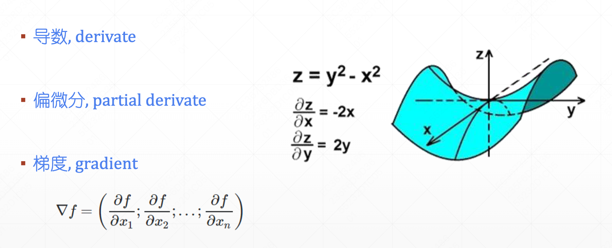</p>

核心逻辑: 怎么找最小值（下山)?

- **目标**：我们要找“最低点”（误差最小）。
- **矛盾**：梯度指向上坡（最快变高）。
- **解法**：**反着走！** 背对着梯度方向，就是下坡最快的方向。
- 核心公式解读

$$
\theta_{t+1} = \theta_t - \alpha_t \nabla f(\theta_t) 
$$

| 符号 | 含义 | 通俗理解 |
|-|-|-|
| $\theta_t$ | 当前位置 | “我现在站在哪” |
| $\nabla f$ | 梯度 | “哪边上坡最陡” |
| **$-$ (减号)** | **方向** | **关键！因为梯度指向上坡，我们要下山，所以必须反着走（减去它）。** |
| $\alpha$ | 学习率 | “步子迈多大” (太大容易跨过山谷，太小走得太慢) |

<p align="center">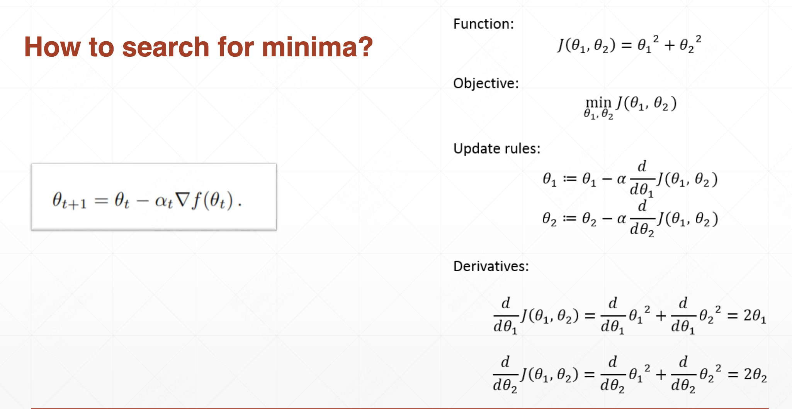</p>

- 总结

> **“梯度就是山坡最陡的方向。我们要找最低点，就拿着指南针（梯度），反着方向（减号），一小步一小步（学习率）往下走，这就叫梯度下降。”**

### 5.2 激活函数

- 激活函数（Activation Function）在神经网络中扮演着至关重要的角色。它们引入了非线性因素，使得神经网络能够学习和执行更复杂的任务。如果没有激活函数，无论神经网络有多少层，其实都相当于一个线性模型，这会大大限制网络的表达能力和学习能力。
- 激活函数的主要作用：

1. 引入非线性：使神经网络能够学习和模拟非线性关系。
2. 控制神经元的激活：决定在给定的输入下神经元是否应该被激活。
3. 帮助反向传播：在训练过程中，激活函数的导数对于反向传播算法中梯度的计算至关重要。

- 常用的激活函数

1. **Sigmoid 函数**:

<p align="center">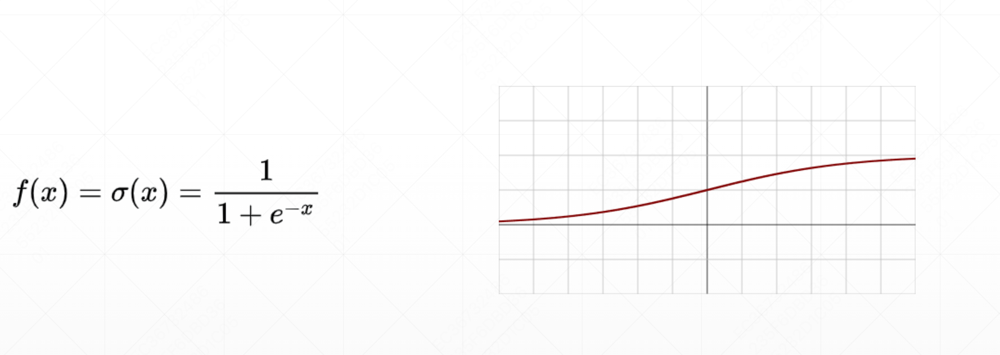</p>

<p align="center">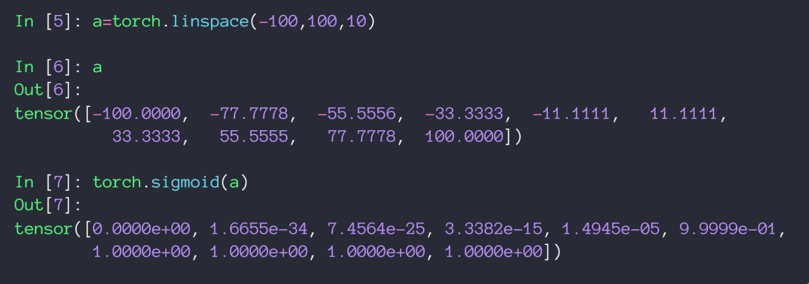</p>

1. **Tanh 函数（双曲正切函数）**:

<p align="center">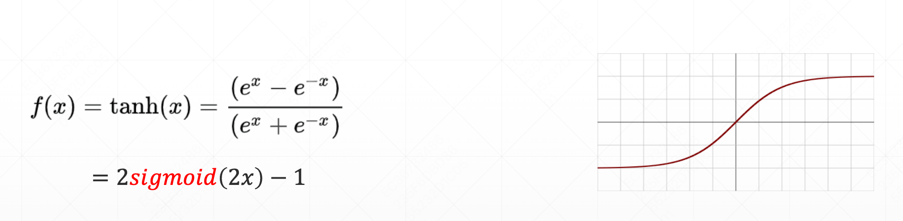</p>

<p align="center">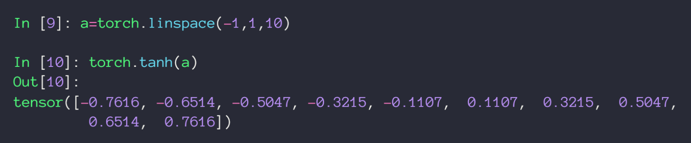</p>

1. **ReLU 函数（Rectified Linear Unit）**:

<p align="center">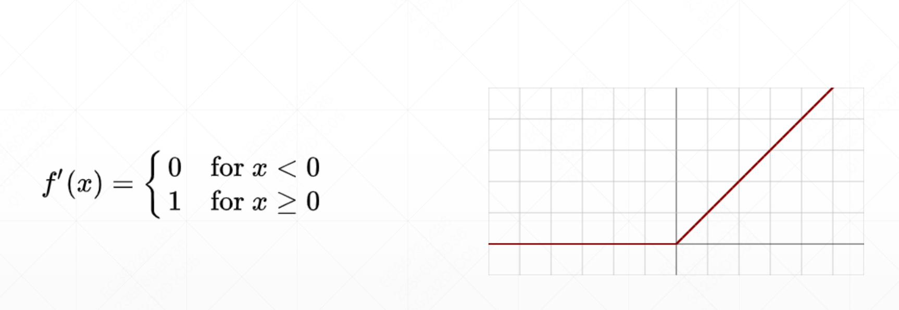</p>

<p align="center">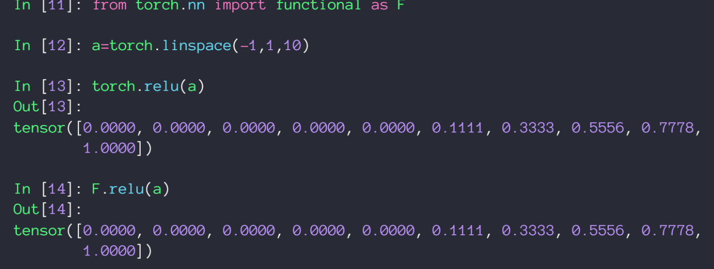</p>

1. **Leaky ReLU 函数**:

$$
\text{Leaky ReLU}(x) =\begin{cases}x & \text{if } x \geq 0 \\\alpha x & \text{if } x < 0\end{cases}
$$

1. **ELU 函数（Exponential Linear Unit）**:

$$
\text{ELU}(x) =\begin{cases}x & \text{if } x \geq 0 \\\alpha (e^x - 1) & \text{if } x < 0\end{cases}
$$

### 5.3 损失函数

- 损失函数（Loss Function），也称为代价函数（Cost Function）或目标函数（Objective Function），是机器学习和统计学中用于评估模型预测值与实际值之间差异的函数。损失函数是模型优化过程中的核心，它定义了优化的目标，即通过调整模型参数来最小化损失函数的值。

**损失函数的主要作用：**

1. **评估模型性能**：提供一种量化的方式来评估模型的预测结果与真实结果之间的差距。
2. **指导模型训练**：在训练过程中，损失函数的值用于指导模型参数的调整，以提高模型的预测准确性。
3. **选择模型**：在模型选择过程中，损失函数的值可以帮助选择或比较不同模型的性能。

**常见的损失函数**

- **均方误差（Mean Squared Error, MSE）**：

$$
\text{MSE} = \frac{1}{n} \sum_{i=1}^{n}(y_i - \hat{y}_i)^2
$$

- MSE 是最常用的回归问题损失函数，其中 $y_i$ 是真实值，$\hat{y}_i$ 是预测值，n 是样本数量。
- **均方根误差（Root Mean Squared Error, RMSE）**：

$$
\text{RMSE} = \sqrt{\frac{1}{n} \sum_{i=1}^{n}(y_i - \hat{y}_i)^2}
$$

RMSE 是 MSE 的平方根，它与原始数据在同一量级上，更易于解释。

1. **交叉熵损失（Cross-Entropy Loss）**：

$$
\text{Cross-Entropy} = -\frac{1}{n} \sum_{i=1}^{n} [y_i \log(\hat{y}_i) + (1 - y_i) \log(1 - \hat{y}_i)]
$$

交叉熵损失常用于二分类和多分类问题，特别是当输出是概率分布时。

1. **对数损失（Log Loss）** 或 \*\* 对数似然损失（Log Likelihood Loss）\*\*：

$$
\text{Log Loss} = -\frac{1}{n} \sum_{i=1}^{n} \sum_{j=1}^{m} y_{ij} \log(\hat{y}_{ij})
$$

其中对数损失在多分类中和 Softmax 激活函数连用， Softmax 输出的是概率，因此可以直接用于交叉熵损失的计算。

<p align="center">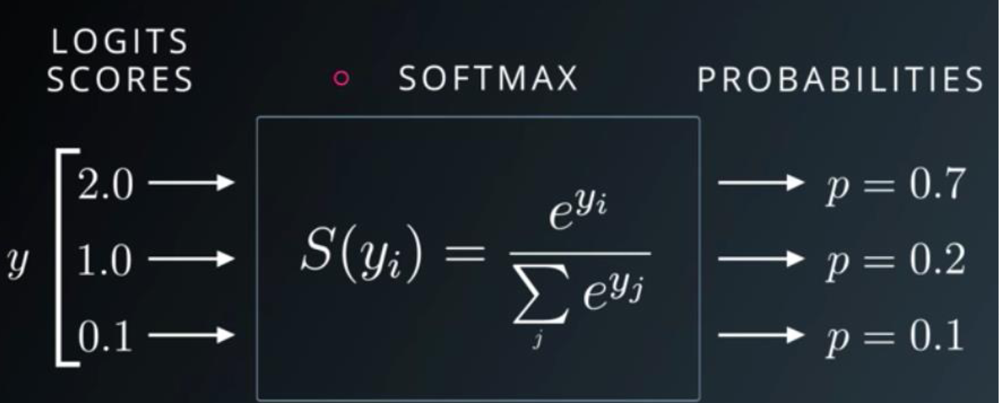</p>

### 5.4 感知机

- 多层感知机是一种前馈人工神经网络，由多个神经元（神经节点）组成，这些神经元按照层次结构排列，包括输入层、隐藏层和输出层，层与层之间的神经元通过权重连接，信息从输入层依次向前传播到输出层，没有反馈连接。
- 过拟合：模型在训练集效果很好，在测试集效果很差
- 欠拟合：模型在训练集和测试集效果都不好

<p align="center">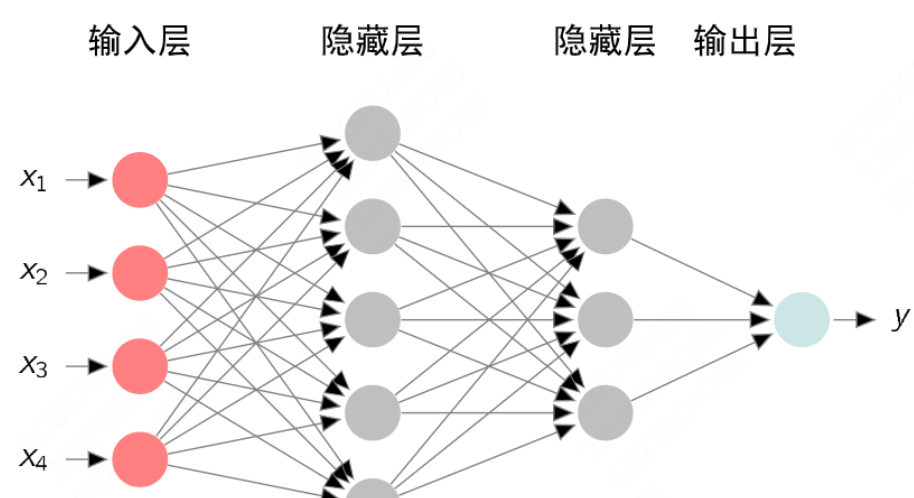</p>

- 通过链式求导进行参数的优化，相关的原理介绍可以参考博客 <https://blog.csdn.net/zhenz0729/article/details/138873711>

### 5.5 卷积神经网络

- 全连接网络参数量巨大，另一方面对于位置信息表现比较差。而今天的卷积神经网络非常重要，可以捕捉输入数据中的位置信息，这使得它在处理具有明显空间结构的数据时如图片表现优异。
- CNN，即 [卷积神经网络](https://zhida.zhihu.com/search?content_id=242261117&content_type=Article&match_order=1&q=%E5%8D%B7%E7%A7%AF%E7%A5%9E%E7%BB%8F%E7%BD%91%E7%BB%9C&zhida_source=entity)（Convolutional Neural Network），是一种深度学习模型，它在 [图像识别](https://zhida.zhihu.com/search?content_id=242261117&content_type=Article&match_order=1&q=%E5%9B%BE%E5%83%8F%E8%AF%86%E5%88%AB&zhida_source=entity)、视频分析和 [自然语言处理](https://zhida.zhihu.com/search?content_id=242261117&content_type=Article&match_order=1&q=%E8%87%AA%E7%84%B6%E8%AF%AD%E8%A8%80%E5%A4%84%E7%90%86&zhida_source=entity) 等领域表现出色。CNN 通过使用卷积层来提取图像数据的局部特征，然后通过池化层（Pooling Layer）来降低特征的空间维度，最后通过全连接层（Fully Connected Layer）进行分类或回归任务。具体的通用架构如下所示：

<p align="center">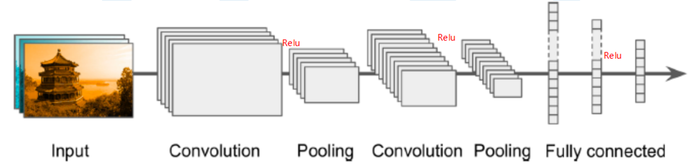</p>

<p align="center">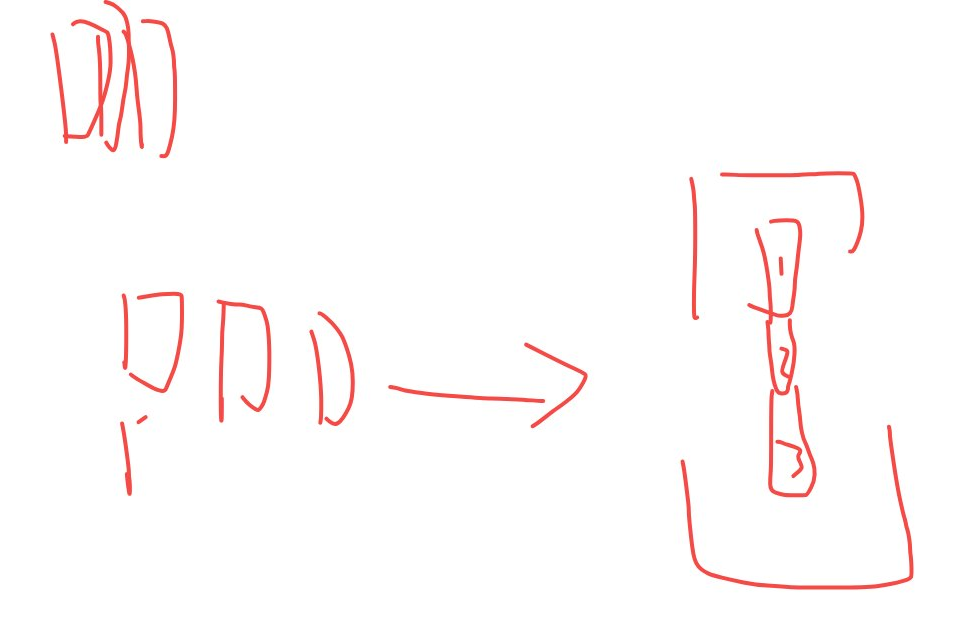</p>

- 各个模块的细节

| 模块 | 细节 |
|---|---|
| 卷积 | 卷积操作可以将输入数据映射为输出数据，同时保留输入数据的空间结构信息，两个向量相乘。<br><br>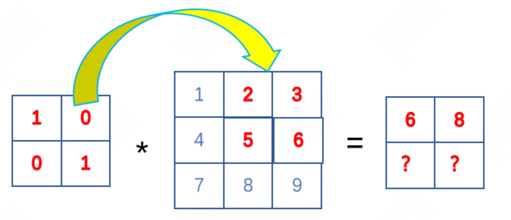<br><br>`1*1+2*0+0*4+1*5 = 6`<br><br>卷积核大小宽度和高度分别为 2、2，卷积核从左到右、从上到下遍历，将输入的图像（3*3）转换为特征图（2*2）。这里得到的矩阵叫做特征图，可以理解为卷积层对于图像自动提取的特征，各种任务都是建立在特征之上的。<br><br>对于给定的任意宽高的卷积核（高 $k_h$，宽 $k_w$），对给定宽高的图像（高 $n_h$，宽 $n_w$）进行卷积操作，输出形状为：$(n_h-k_h+1)*(n_w-k_w+1)$。<br><br>比如上面的例子中，输出形状为：$(3-1+1)\times(3-1+1)=2\times2$。<br><br>为了使卷积效果更好，通常可以使用跨步和填充的方法来改变卷积效果。<br><br>填充：经过卷积之后，输出形状有可能变小。有些时候我们希望输出特征图的形状维持不变，这时候就可以进行边界填充。<br><br>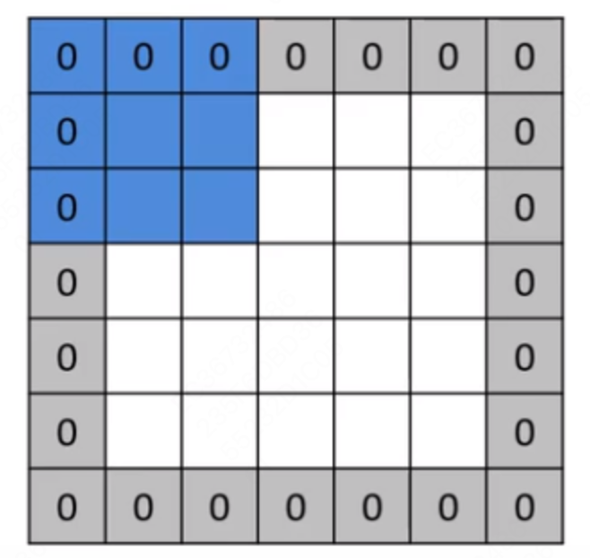<br><br>跨步：有些时候，我们需要降低输出特征图维度，可以指定间隔进行卷积操作，从而降低计算量。<br><br>对于图片输入，通常是 3 通道的 R、G、B，这时候需要构造一个和输入相同通道的卷积核：<br><br>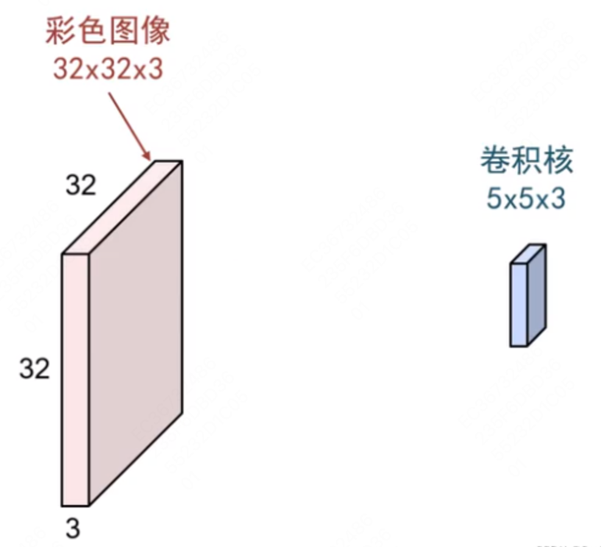<br><br>为了更好地提取图片的不同维度特征，通常会使用多个卷积核，得到多个特征图：<br><br>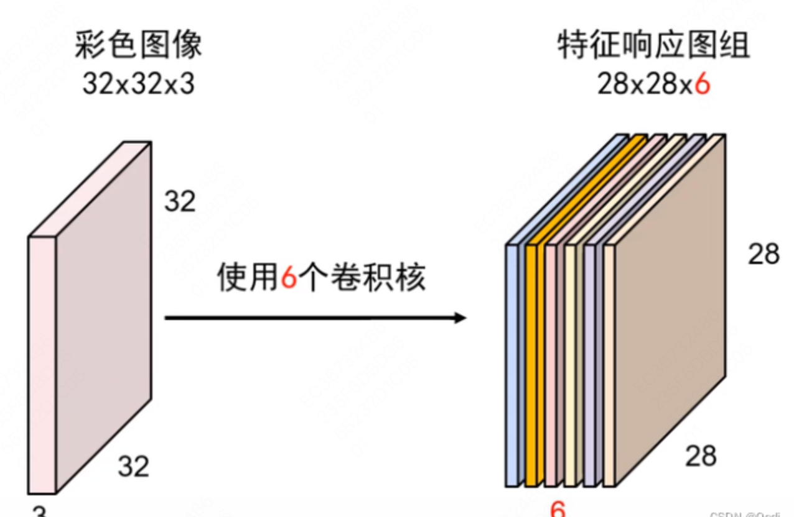 |
| 池化 | 除了步长可以降低参数量，池化也可以降低模型的参数量。常用的池化有最大值池化和平均池化。<br><br>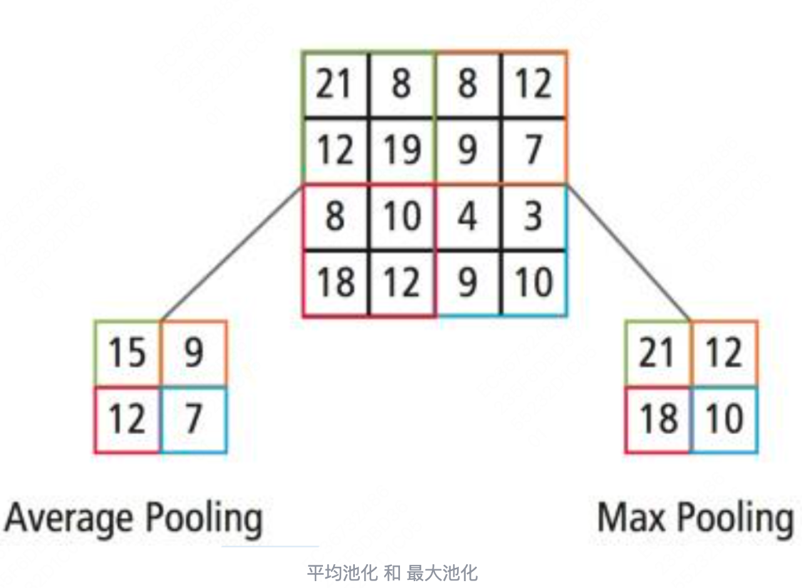 |
| 全连接层 | 在卷积和池化层之后，网络会包含一个或多个全连接层，将卷积层和池化层提取的特征映射到高维空间，以便进行分类。最后一层将学习到的特征映射到最终输出，如分类标签。 |
| 输出层 | 通常是一个 Softmax 层，用于将全连接层的输出转换为概率分布，从而实现多类别分类。 |

### 5.6 经典 CNN 模型

- 下面介绍常用的几种经典的 CNN 网络模型

**AlexNet**

> [!NOTE] ✏️ 信息
> 介绍：
> - 这个网络是为了取得更好的 ImageNet Challenge 成绩而发明的。在 ImageNet LSVRC-2012 challenge 上取得了 84.7% 准确率的成绩，而第二名只有 73.8% 的准确率。这几乎是第一个深层的卷积网络。
> - 它由 5 个卷积层 (conv) 和 3 个全联接层 (fc) 组成，激活函数使用 ReLU，整个网络有 6200 万以上的可训练的参数。
> 可以看到，输入是 227x227x3 的图像，输出是一个 1000 维的向量，对应着每一个分类的概率。
> - 为了减少过拟合的问题，它实现了数据增强，包括剪裁和翻转图片来增加训练集的丰富度。
> - 在第一，第二和第五层卷积后增加了池化层 (maxpool)，它的 Kernel 为 3x3，步长为 2，这样做到重叠 (overlap)，来增强感受野 (receptive fields)。这样的池化层增加了 0.3% 左右的准确率。
> - 在 AlexNet 之前，最常用的激活函数是 sigmoid 和 tanh，这会使得梯度消失的问题尤为严重。改用 ReLU 可以大幅度解决梯度消失的问题，而且计算速度也会更快。
> - 为了解决过拟合问题 AlexNet 使用了 Dropout，也就是说一些链接会被随机丢掉，概率为 0.5。这可以使它逃离局部最小 (local minima) 的一些情况。但迭代的次数要相应的翻

<p align="center">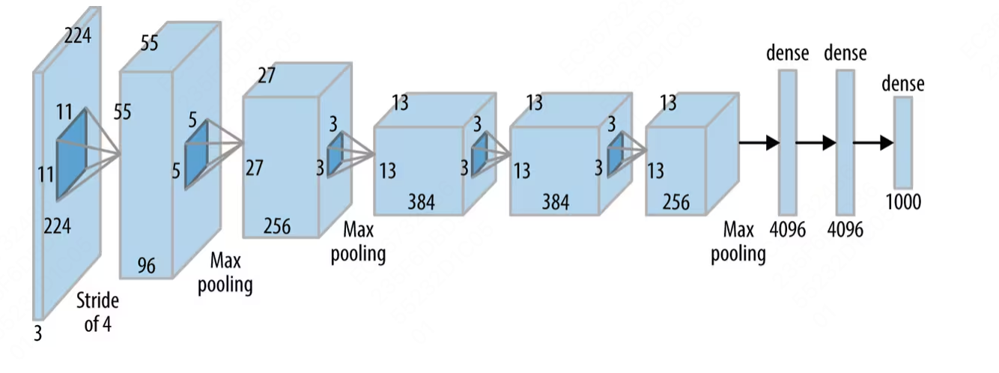</p>

- 对应的参数量变化

<p align="center">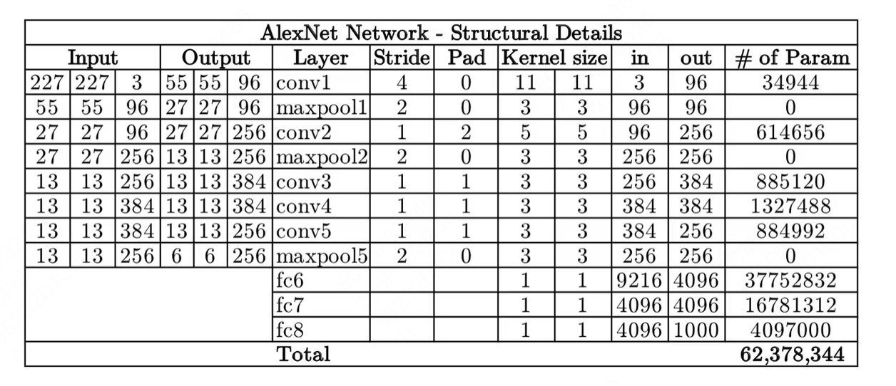</p>

**VGGNet**

> [!NOTE] ✏️ 信息
> VGGNet 有许多的变种，包括 VGG16，VGG19 等，但区别仅在于层数。这个网络结构旨在减少需要训练的参数，减少训练时间。

<p align="center">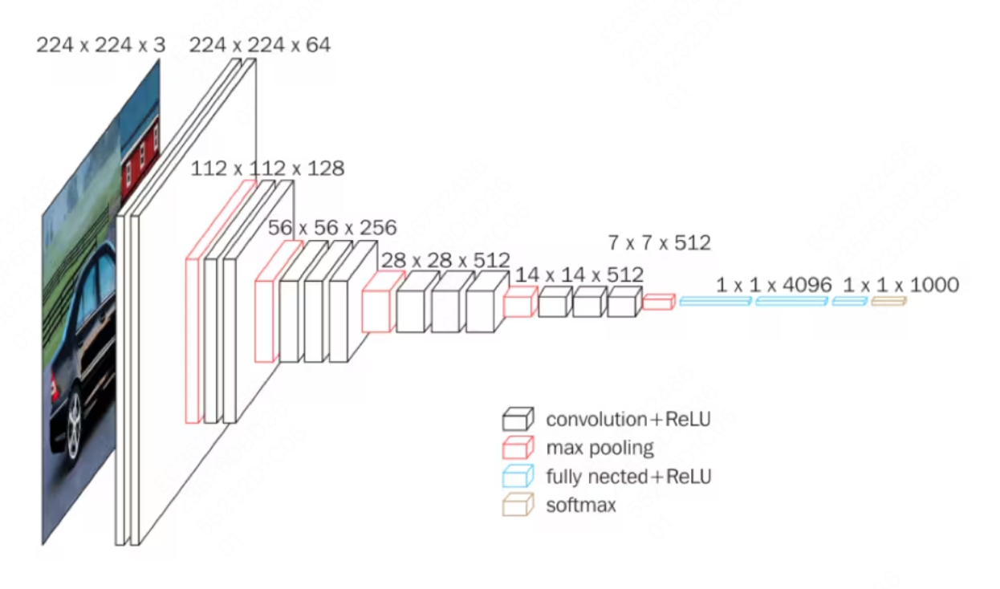</p>

在 VGG16 共有 13800 万参数。注意其中所有的卷积 kernel 都是 3x3 的，而池化层的 kernel 都是 2x2 且步长为 2 的。

- 所有卷积都使用同样的 3x3 卷积核是因为，在 AlexNet 中使用所有可变大小的卷积内核 (11x11, 5x5, 3x3) 都可以使用多个 3x3 内核作为 block 来复制构建。
- 例如，对一个 5x5 的区域使用 5x5 的核将得到 1x1 的输出。如果对 5x5 的区域使用 3x3 的卷积内核将得到 3x3 的输出，对输出再做第二层 3x3 卷积，最终也会得到 1x1 的结果。对于前者，需要训练的是 5x5 的核，也就是 25 个变量。对于后者，则需要训练两个 3x3 的核，也就是 18 个变量。减少了 28% 的冗余。类似的，7x7 的卷积层可以用步长为 1，三层 3x3 卷积代替。减少需要训练的变量以为着更快的学习速度和更健壮，不易过拟合的网络。

**ResNet**

> [!NOTE] ✏️ 信息
> 有些问题的出现使人们对深度网络产生怀疑。例如，如果我们期待一个网络的输出完全等于输出，正确的想法是所有的权重都为 1，bias 都为零。但真的去用神经网络训练的时候，根据反向传播，将产生一个非常复杂的映射。例如，我们期待一个更深层的网络能学到更准确的答案，至少是不低于原本层数网络的准确度，然而我们却发现更深层的网络会带来更错误的答案。这些都是梯度消失带来的问题。

- ResNet 针对这个问题，提出了两种“shortcut connection”：Identity shortcut 和 Projection shortcut。其中残差 shortcut 示意图如下所示：

<p align="center">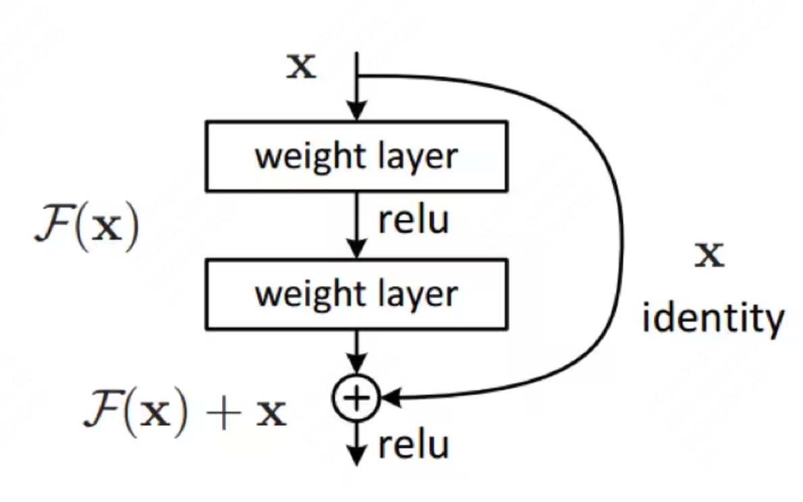</p>

- 什么是恒等映射，即无论什么输入 x ，都会有 f ( x ) = x f(x)=xf(x)=x,就是输出恒等于输入。这就是我们希望网络所能学习到的东西。以下为我自己的理解，就是我们希望网络通过一系列非线性变换，抽象提取出其所蕴含的深层语义信息，其是符合我们所学习的数据的分布的，但是当网络深了之后，其提取的信息是有偏移的，即不是原来数据的分布。因为每一次的非线性变换其是会损失数据信息的，每一层的偏移会导致最后所学习到数据分布是有问题的，从而导致模型的表现不佳。
- 那么我们再来看残差网络做了什么，其实有些人可能会有疑问，明明所进行的操作是从原来的输出 F(x) 变成了 F(x)+x，好像是加法，为什么叫做残差网络呢？其实原本我们所学习到的函数映射为 y=F(x)，即我们希望 F(x) 能够学习到数据 x 的特征，保证其恒等映射，但是我们现在变成了 y=F(x)+x，从而变成了 y-x=F(x)。我们所学习的 F(x) 变成了这样的形式，我们去学习数据 x 的特征容易，还是去让 F(x) 趋向于 0 更容易，当然很显而易见了。所以残差网络为什么叫残差的原因就是体现在这里。
- 可以参考博客：<https://blog.csdn.net/qq_63037719/article/details/147385076>

**Inception**

> [!NOTE] ✏️ 信息
> 在图像分类任务中，显著特征的像素上的大小显然会是不固定的。因此，去决定使用一个较大的 kernel 或是较小的 kernel 会比较难以决定。较大的 kernel 能关注到更 global 的特征，相应的较小的 kernel 则可以关注到具体区域内的特征。为了能识别到可大可小的特征，我们需要不同大小的内核，Inception 网络就是解决这样的问题的。它并不是简单的 go deeper 的网络，而是 go wider。它做到了在同一层中使用到不同大小的核。

- Inception 网络结构由如下多个 Inception 模块结合而成，每一个模块平行的由四种操作组成：1x1conv，3x3conv，5x5conv，max pooling。

<p align="center">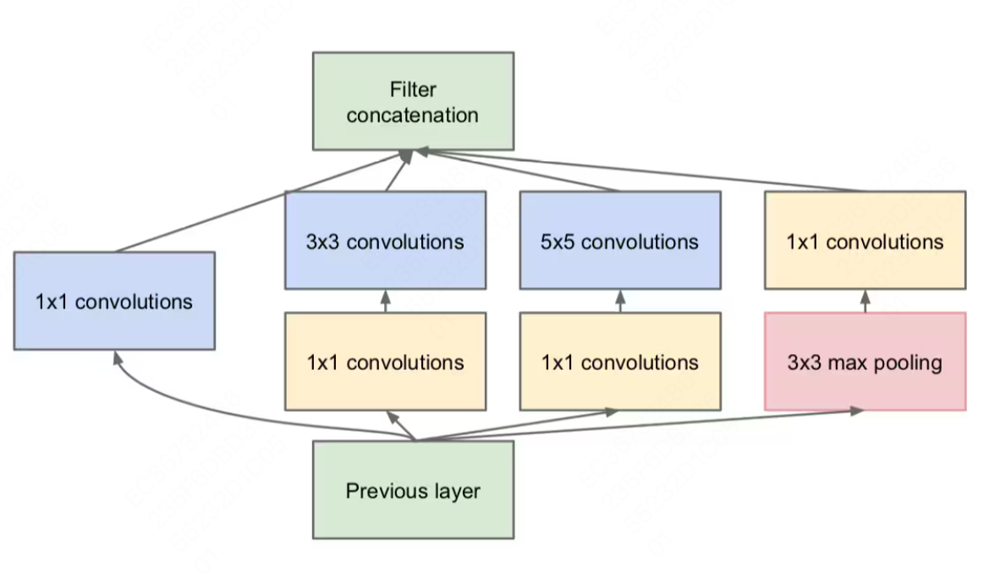</p>

