# 2_图像常用处理技术与实践

## 1. 课程目标以及重点

> [!NOTE] ✏️ 信息
> - 掌握 PyTorch 的基础知识与搭建模型的基本流程
> - 掌握目前常用的图像处理相关的技术
> - 掌握深度学习图像分类技术的常用算法实践
> - 掌握基于 YOLO 的图像检测技术常用算法实践

## 2. 课后作业

- 把分类的数据下载到本地，自己实现数据的定义 class 类，替换分类代码里面的通过 torchvision 的方式进行加载
- 完成分类算法通过课上的其它算法的跑通并与之进行对比
- 完成 YOLO 系列的目标检测算法实践的跑通
- 任务：收集这些经典的论文，提前学习相关的原理
- linux 学习：<https://www.runoob.com/linux/linux-command-manual.html>
- <https://hjfy.top/>
- 课件里面的 32 是怎么算法？
- Transformer：《Attention is all you need》论文阅读：<https://arxiv.org/abs/1706.03762>
- 找一个大一点的目标检测的数据集，通过课件的代码跑一下目标检测任务

## 3. 上节课作业

<a href="./assets/2_attachment_01.py" download="model.py">model.py</a>

## 4. PyTorch 知识总结

- 100，epoch=3，sample=300， batch_size=2，step=150

<p align="center">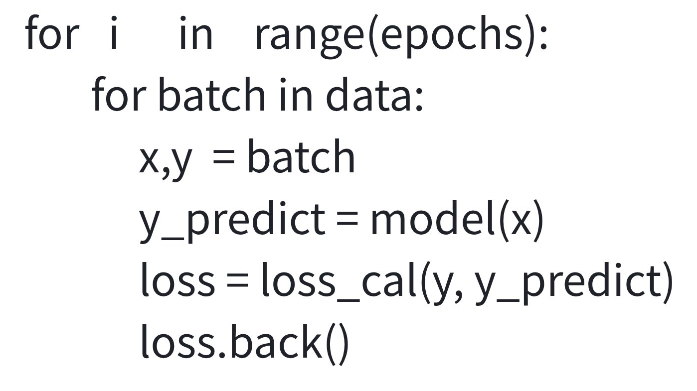</p>

<p align="center">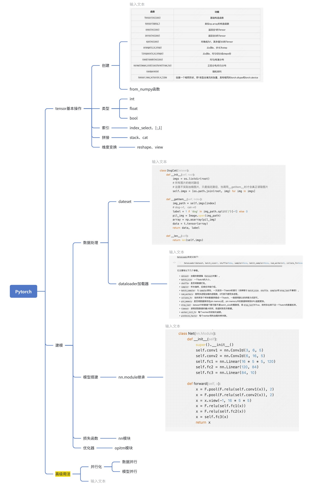</p>

- 相关的代码总结

<a href="./assets/2_attachment_02.ipynb" download="torch_test.ipynb">torch_test.ipynb</a>

## 5. 图像处理常用技术介绍

- 目前图像在各个场景的应用主要可以划分为如下的几个方面：

<p align="center">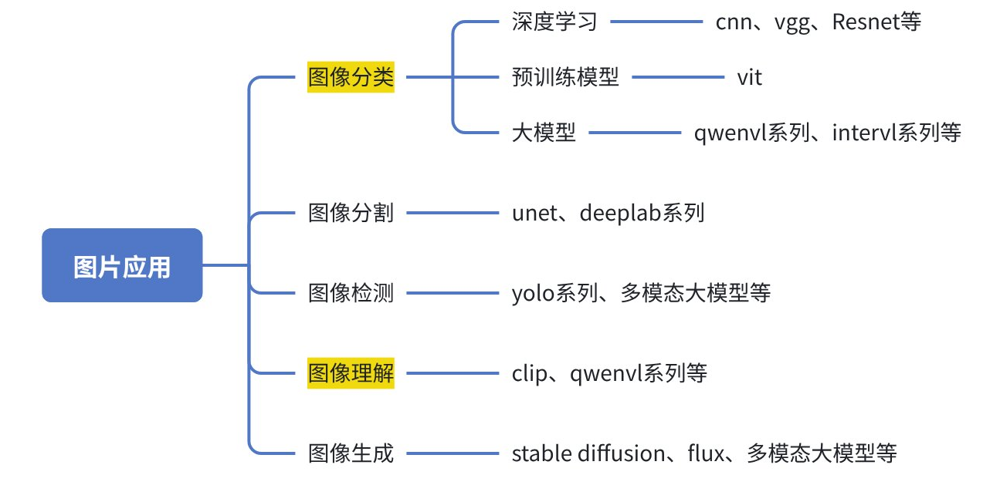</p>

## 6. 图片分类 - 深度学习

- 本次针对上节课中学习的 PyTorch 框架的使用介绍，以图片分类问题为例，来实现上节课讲的：DNN、CNN、VGG、ResNet 网络来进行图片的分类模型训练；
- 预训练模型：

### 6.1 数据介绍

- CIFAR-10 数据集包含 60000 张 32×32 像素的彩色图像，分为 10 个类别，每个类别有 6000 张图像。其中，有 5000 张训练图像和 10000 张测试图像。
- 该数据集被分为五个训练批次和一个测试批次，每个批次包含 10000 张图像。测试批次中恰好包含每个类别随机选取的 1000 张图像。训练批次包含剩余的图像，且这些图像以随机顺序排列，但某些训练批次可能包含来自某一类别的图像比其他类别更多。总体而言，训练批次中每个类别恰好包含 5000 张图像。
- 具体的图片例子

<p align="center">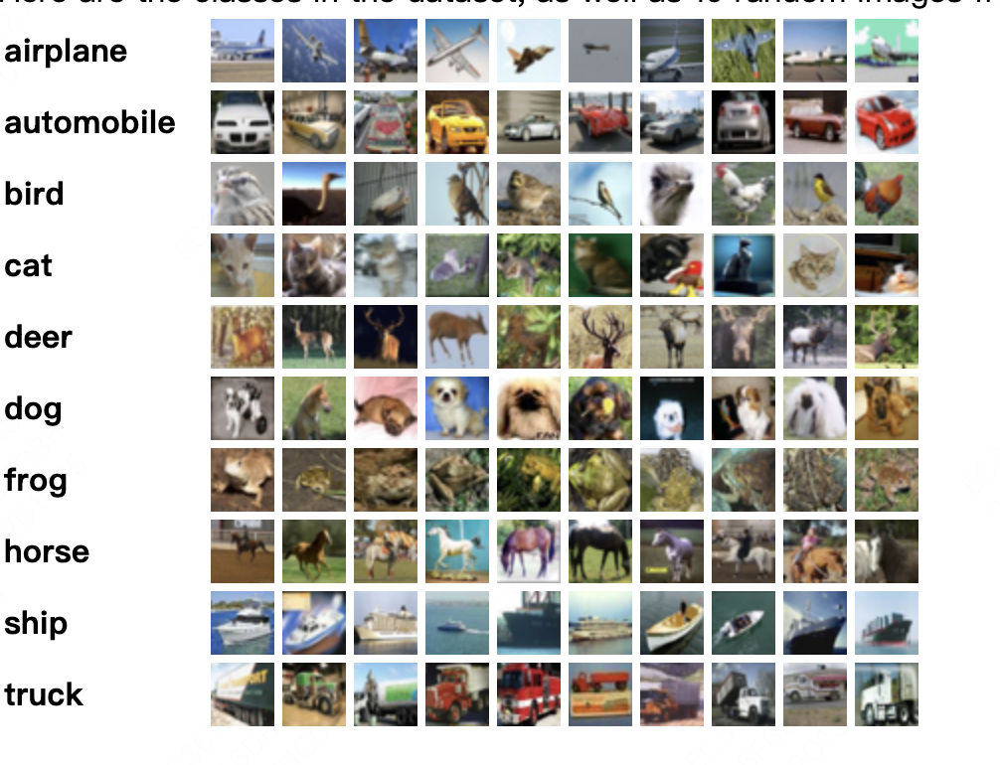</p>

### 6.2 代码

```python
import torch  # PyTorch深度学习框架
import torch.nn as nn  # 神经网络模块
import torch.optim as optim  # 优化器
import torchvision  # 计算机视觉工具包
import torchvision.transforms as transforms  # 图像预处理工具
from torch.utils.data import DataLoader, Dataset  # 数据加载器和数据集基类
from torchvision.models import vgg16, resnet18  # 预训练模型
import matplotlib.pyplot as plt  # 绘图工具
import numpy as np  # 数值计算库
import os  # 操作系统接口
import cv2  # OpenCV库
from PIL import Image  # PIL库用于图像处理
import pickle  # 用于加载CIFAR10的pickle文件

# 设置随机种子以确保可重复性
torch.manual_seed(42)
# 检查是否有GPU可用，如果有则使用GPU，否则使用CPU
device = torch.device('cuda' if torch.cuda.is_available() else 'cpu')

# 数据路径配置
DATA_ROOT = './data'  # 数据根目录
CIFAR10_PATH = os.path.join(DATA_ROOT, 'cifar10')  # CIFAR10数据具体存放路径

# 创建保存模型的目录
MODEL_SAVE_DIR = './saved_models'
os.makedirs(MODEL_SAVE_DIR, exist_ok=True)

# CIFAR10类别名称
CIFAR10_CLASSES = ['airplane', 'automobile', 'bird', 'cat', 'deer',
                   'dog', 'frog', 'horse', 'ship', 'truck']

# 自定义CIFAR10数据集类
class CustomCIFAR10(Dataset):
    """
    自定义CIFAR10数据集类，从本地文件加载数据
    """
    def __init__(self, root, train=True, transform=None):
        """
        参数:
            root: 数据根目录
            train: True表示训练集，False表示测试集
            transform: 数据预处理变换
        """
        self.root = root
        self.train = train
        self.transform = transform
        
        # 加载数据
        self.data = []
        self.labels = []
        
        if self.train:
            # 训练集有5个批次文件
            for i in range(1, 6):
                file_path = os.path.join(root, f'data_batch_{i}')
                with open(file_path, 'rb') as f:
                    batch = pickle.load(f, encoding='latin1')
                    self.data.append(batch['data'])
                    self.labels.extend(batch['labels'])
        else:
            # 测试集只有1个批次文件
            file_path = os.path.join(root, 'test_batch')
            with open(file_path, 'rb') as f:
                batch = pickle.load(f, encoding='latin1')
                self.data.append(batch['data'])
                self.labels.extend(batch['labels'])
        
        # 将数据合并为一个numpy数组
        self.data = np.vstack(self.data).astype(np.uint8)
        # 将数据重塑为 (N, 32, 32, 3) 的形状
        self.data = self.data.reshape(-1, 3, 32, 32)
        # 转换为 (N, 32, 32, 3) 以便PIL处理
        self.data = self.data.transpose((0, 2, 3, 1))
        
        self.labels = np.array(self.labels)
    
    def __len__(self):
        return len(self.labels)
    
    def __getitem__(self, idx):
        """
        获取单个数据样本
        """
        img = self.data[idx]
        label = self.labels[idx]
        
        # 转换为PIL图像
        img = Image.fromarray(img)
        
        # 应用变换
        if self.transform is not None:
            img = self.transform(img)
        
        return img, label

# 数据下载函数
def download_cifar10_data(root_dir):
    """
    下载CIFAR10数据集到本地
    参数:
        root_dir: 数据保存目录
    返回:
        data_dir: 实际数据文件所在目录
    """
    os.makedirs(root_dir, exist_ok=True)
    
    # 使用torchvision下载数据（只下载，不加载）
    print(f"正在下载CIFAR10数据集到 {root_dir}...")
    print("如果数据已存在，将跳过下载。")
    
    # 下载训练集
    trainset = torchvision.datasets.CIFAR10(
        root=root_dir, 
        train=True, 
        download=True, 
        transform=None
    )
    
    # 下载测试集
    testset = torchvision.datasets.CIFAR10(
        root=root_dir, 
        train=False, 
        download=True, 
        transform=None
    )
    
    # CIFAR10数据实际保存在 cifar-10-batches-py 目录下
    data_dir = os.path.join(root_dir, 'cifar-10-batches-py')
    
    print(f"数据下载完成，保存在: {data_dir}")
    return data_dir

# 数据预处理和加载函数
def load_data():
    """
    使用自定义数据集类加载CIFAR10数据
    """
    # # 确保数据目录存在
    # os.makedirs(CIFAR10_PATH, exist_ok=True)
    
    # # 先下载数据（如果还没有下载）
    # data_dir = download_cifar10_data(CIFAR10_PATH)
    data_dir = os.path.join(CIFAR10_PATH, 'cifar-10-batches-py')
    
    # 检查数据文件是否存在
    if not os.path.exists(data_dir):
        raise FileNotFoundError(f"数据目录不存在: {data_dir}")
    
    # 定义训练数据的预处理步骤
    transform_train = transforms.Compose([
        transforms.RandomCrop(32, padding=4),  # 随机裁剪，增加数据多样性
        transforms.RandomHorizontalFlip(),  # 随机水平翻转，增加数据多样性
        transforms.ToTensor(),  # 将图像转换为张量
        transforms.Normalize((0.4914, 0.4822, 0.4465), (0.2023, 0.1994, 0.2010)),  # 标准化，使用CIFAR10数据集的均值和标准差
    ])

    # 定义测试数据的预处理步骤（不需要数据增强）
    transform_test = transforms.Compose([
        transforms.ToTensor(),
        transforms.Normalize((0.4914, 0.4822, 0.4465), (0.2023, 0.1994, 0.2010)),
    ])

    print(f"使用自定义数据集类加载CIFAR10数据从 {data_dir}")
    
    # 使用自定义数据集类加载训练数据集
    trainset = CustomCIFAR10(
        root=data_dir, 
        train=True, 
        transform=transform_train
    )
    # 创建训练数据加载器，设置批量大小为128，打乱数据，使用2个工作进程
    trainloader = DataLoader(trainset, batch_size=128, shuffle=True, num_workers=2)

    # 使用自定义数据集类加载测试数据集
    testset = CustomCIFAR10(
        root=data_dir, 
        train=False, 
        transform=transform_test
    )
    # 创建测试数据加载器
    testloader = DataLoader(testset, batch_size=128, shuffle=False, num_workers=2)

    print(f"数据集加载成功。训练样本数: {len(trainset)}, 测试样本数: {len(testset)}")
    return trainloader, testloader

# 定义DNN（深度神经网络）模型
class DNN(nn.Module):
    def __init__(self):
        super(DNN, self).__init__()
        self.flatten = nn.Flatten()  # 将输入展平为一维向量
        self.fc1 = nn.Linear(32 * 32 * 3, 512)  # 第一个全连接层，输入维度为32*32*3（图像大小），输出维度为512
        self.fc2 = nn.Linear(512, 256)  # 第二个全连接层
        self.fc3 = nn.Linear(256, 10)  # 输出层，10个类别
        self.relu = nn.ReLU()  # ReLU激活函数
        self.dropout = nn.Dropout(0.5)  # Dropout层，防止过拟合

    def forward(self, x):
        x = self.flatten(x)  # 展平输入
        x = self.relu(self.fc1(x))  # 第一个全连接层+激活函数
        x = self.dropout(x)  # Dropout
        x = self.relu(self.fc2(x))  # 第二个全连接层+激活函数
        x = self.dropout(x)  # Dropout
        x = self.fc3(x)  # 输出层
        return x

# 定义CNN（卷积神经网络）模型
class CNN(nn.Module):
    def __init__(self):
        super(CNN, self).__init__()
        # 第一个卷积层：输入通道3（RGB），输出通道32，卷积核大小3x3，padding=1保持特征图大小
        self.conv1 = nn.Conv2d(3, 32, 3, padding=1)
        # 第二个卷积层：输入通道32，输出通道64
        self.conv2 = nn.Conv2d(32, 64, 3, padding=1)
        # 第三个卷积层：输入通道64，输出通道128
        self.conv3 = nn.Conv2d(64, 128, 3, padding=1)
        # 最大池化层：2x2窗口，步长2
        self.pool = nn.MaxPool2d(2, 2)
        # 全连接层：输入维度128*4*4（经过三次池化后的特征图大小），输出维度512
        self.fc1 = nn.Linear(128 * 4 * 4, 512)
        # 输出层：输入维度512，输出维度10（类别数）
        self.fc2 = nn.Linear(512, 10)
        self.relu = nn.ReLU()  # ReLU激活函数
        self.dropout = nn.Dropout(0.5)  # Dropout层

    def forward(self, x):
        x = self.pool(self.relu(self.conv1(x)))  # 第一个卷积块
        x = self.pool(self.relu(self.conv2(x)))  # 第二个卷积块
        x = self.pool(self.relu(self.conv3(x)))  # 第三个卷积块
        x = x.view(-1, 128 * 4 * 4)  # 展平特征图
        x = self.dropout(self.relu(self.fc1(x)))  # 全连接层+Dropout
        x = self.fc2(x)  # 输出层
        return x

# 模型训练函数
def train_model(model, trainloader, testloader, criterion, optimizer, num_epochs=10, model_name='model'):
    """
    训练模型并保存最佳模型
    参数:
        model: 要训练的模型
        trainloader: 训练数据加载器
        testloader: 测试数据加载器
        criterion: 损失函数
        optimizer: 优化器
        num_epochs: 训练轮数
        model_name: 模型名称，用于保存文件
    """
    train_losses = []  # 记录训练损失
    test_accuracies = []  # 记录测试准确率
    best_accuracy = 0.0  # 记录最佳准确率
    
    for epoch in range(num_epochs):
        model.train()  # 设置为训练模式
        running_loss = 0.0
        for i, data in enumerate(trainloader, 0):
            inputs, labels = data[0].to(device), data[1].to(device)  # 将数据移到指定设备
            
            optimizer.zero_grad()  # 清空梯度
            outputs = model(inputs)  # 前向传播
            loss = criterion(outputs, labels)  # 计算损失
            loss.backward()  # 反向传播
            optimizer.step()  # 更新参数
            
            running_loss += loss.item()
            
        epoch_loss = running_loss / len(trainloader)  # 计算平均损失
        train_losses.append(epoch_loss)
        
        # 在测试集上评估模型
        model.eval()  # 设置为评估模式
        correct = 0
        total = 0
        with torch.no_grad():  # 不计算梯度
            for data in testloader:
                images, labels = data[0].to(device), data[1].to(device)
                outputs = model(images)
                _, predicted = torch.max(outputs.data, 1)  # 获取预测结果
                total += labels.size(0)
                correct += (predicted == labels).sum().item()
        
        accuracy = 100 * correct / total  # 计算准确率
        test_accuracies.append(accuracy)
        print(f'Epoch {epoch+1}/{num_epochs}, Loss: {epoch_loss:.4f}, Accuracy: {accuracy:.2f}%')
        
        # 保存最佳模型
        if accuracy > best_accuracy:
            best_accuracy = accuracy
            # 保存模型状态字典
            model_save_path = os.path.join(MODEL_SAVE_DIR, f'{model_name}_best.pth')
            torch.save({
                'epoch': epoch,
                'model_state_dict': model.state_dict(),
                'optimizer_state_dict': optimizer.state_dict(),
                'accuracy': accuracy,
                'loss': epoch_loss,
            }, model_save_path)
            print(f'保存最佳模型，准确率: {accuracy:.2f}%')
    
    return train_losses, test_accuracies

def predict_image(model, image_path, model_name='model'):
    """
    使用保存的最佳模型对单张图片进行预测
    参数:
        model: 模型实例
        image_path: 图片路径
        model_name: 模型名称
    返回:
        predicted_class: 预测的类别
        confidence: 预测的置信度
    """
    # 加载最佳模型
    model_path = os.path.join(MODEL_SAVE_DIR, f'{model_name}_best.pth')
    if not os.path.exists(model_path):
        raise FileNotFoundError(f"找不到模型文件: {model_path}")
    
    checkpoint = torch.load(model_path)
    model.load_state_dict(checkpoint['model_state_dict'])
    model.eval()
    
    # 图像预处理
    transform = transforms.Compose([
        transforms.ToTensor(),
        transforms.Normalize((0.4914, 0.4822, 0.4465), (0.2023, 0.1994, 0.2010)),
    ])
    
    # 读取并预处理图像
    image = cv2.imread(image_path)
    if image is None:
        raise ValueError(f"无法读取图像: {image_path}")
    
    # 转换为RGB
    image = cv2.cvtColor(image, cv2.COLOR_BGR2RGB)
    
    # 转换为PIL图像
    image = Image.fromarray(image)
    
    # 应用预处理
    image = transform(image)
    image = image.unsqueeze(0)  # 添加batch维度
    image = image.to(device)
    
    # 进行预测
    with torch.no_grad():
        outputs = model(image)
        probabilities = torch.nn.functional.softmax(outputs, dim=1)
        confidence, predicted = torch.max(probabilities, 1)
        
    return CIFAR10_CLASSES[predicted.item()], confidence.item()

def predict_batch(model, image_paths, model_name='model'):
    """
    使用保存的最佳模型对多张图片进行批量预测
    参数:
        model: 模型实例
        image_paths: 图片路径列表
        model_name: 模型名称
    返回:
        predictions: 预测结果列表，每个元素为(预测类别, 置信度)的元组
    """
    # 加载最佳模型
    model_path = os.path.join(MODEL_SAVE_DIR, f'{model_name}_best.pth')
    if not os.path.exists(model_path):
        raise FileNotFoundError(f"找不到模型文件: {model_path}")
    
    checkpoint = torch.load(model_path)
    model.load_state_dict(checkpoint['model_state_dict'])
    model.eval()
    
    # 图像预处理
    transform = transforms.Compose([
        transforms.ToTensor(),
        transforms.Normalize((0.4914, 0.4822, 0.4465), (0.2023, 0.1994, 0.2010)),
    ])
    
    predictions = []
    for image_path in image_paths:
        try:
            # 读取并预处理图像
            image = cv2.imread(image_path)
            if image is None:
                print(f"警告: 无法读取图像 {image_path}")
                continue
                
            # 转换为RGB
            image = cv2.cvtColor(image, cv2.COLOR_BGR2RGB)
            
            # 转换为PIL图像
            image = Image.fromarray(image)
            
            # 应用预处理
            image = transform(image)
            image = image.unsqueeze(0)  # 添加batch维度
            image = image.to(device)
            
            # 进行预测
            with torch.no_grad():
                outputs = model(image)
                probabilities = torch.nn.functional.softmax(outputs, dim=1)
                confidence, predicted = torch.max(probabilities, 1)
                
            predictions.append((CIFAR10_CLASSES[predicted.item()], confidence.item()))
            
        except Exception as e:
            print(f"处理图像 {image_path} 时出错: {str(e)}")
            predictions.append(None)
    
    return predictions

def main():
    # 检查数据目录
    if not os.path.exists(CIFAR10_PATH):
        print(f"Data directory {CIFAR10_PATH} does not exist. It will be created when downloading the dataset.")
    
    trainloader, testloader = load_data()  # 加载数据
    criterion = nn.CrossEntropyLoss()  # 定义损失函数
    
    # 训练DNN模型
    print("Training DNN model...")
    dnn_model = DNN().to(device)
    dnn_optimizer = optim.Adam(dnn_model.parameters(), lr=0.001)  # 使用Adam优化器
    dnn_losses, dnn_accuracies = train_model(dnn_model, trainloader, testloader, criterion, dnn_optimizer, model_name='dnn')
    
    # 训练CNN模型
    print("\nTraining CNN model...")
    cnn_model = CNN().to(device)
    cnn_optimizer = optim.Adam(cnn_model.parameters(), lr=0.001)
    cnn_losses, cnn_accuracies = train_model(cnn_model, trainloader, testloader, criterion, cnn_optimizer, model_name='cnn')
    
    # 微调VGG16预训练模型
    print("\nFine-tuning VGG16 model...")
    vgg_model = vgg16(pretrained=True)  # 加载预训练的VGG16模型
    vgg_model.classifier[6] = nn.Linear(4096, 10)  # 修改最后一层以适应CIFAR10的10个类别
    vgg_model = vgg_model.to(device)
    vgg_optimizer = optim.Adam(vgg_model.parameters(), lr=0.0001)  # 使用较小的学习率进行微调
    vgg_losses, vgg_accuracies = train_model(vgg_model, trainloader, testloader, criterion, vgg_optimizer, model_name='vgg16')
    
    # 微调ResNet18预训练模型
    print("\nFine-tuning ResNet18 model...")
    resnet_model = resnet18(pretrained=True)  # 加载预训练的ResNet18模型
    resnet_model.fc = nn.Linear(512, 10)  # 修改最后一层以适应CIFAR10的10个类别
    resnet_model = resnet_model.to(device)
    resnet_optimizer = optim.Adam(resnet_model.parameters(), lr=0.0001)  # 使用较小的学习率进行微调
    resnet_losses, resnet_accuracies = train_model(resnet_model, trainloader, testloader, criterion, resnet_optimizer, model_name='ResNet18')
    
    # 绘制训练损失和测试准确率对比图
    plt.figure(figsize=(12, 5))
    
    # 绘制训练损失曲线
    plt.subplot(1, 2, 1)
    plt.plot(dnn_losses, label='DNN')
    plt.plot(cnn_losses, label='CNN')
    plt.plot(vgg_losses, label='VGG16')
    plt.plot(resnet_losses, label='ResNet18')
    plt.title('Training Loss')
    plt.xlabel('Epoch')
    plt.ylabel('Loss')
    plt.legend()
    
    # 绘制测试准确率曲线
    plt.subplot(1, 2, 2)
    plt.plot(dnn_accuracies, label='DNN')
    plt.plot(cnn_accuracies, label='CNN')
    plt.plot(vgg_accuracies, label='VGG16')
    plt.plot(resnet_accuracies, label='ResNet18')
    plt.title('Test Accuracy')
    plt.xlabel('Epoch')
    plt.ylabel('Accuracy (%)')
    plt.legend()
    
    plt.tight_layout()  # 自动调整子图布局
    plt.savefig('training_results.png')  # 保存图表
    plt.close()
    
    # 示例：使用训练好的模型进行预测
    print("\n使用训练好的模型进行预测示例：")
    test_image_path = 'test_image.jpg'  # 替换为你的测试图像路径
    
    try:
        # 使用VGG16模型进行预测
        predicted_class, confidence = predict_image(vgg_model, test_image_path, model_name='vgg16')
        print(f"VGG16预测结果: 类别={predicted_class}, 置信度={confidence:.2f}")
        
        # 使用ResNet18模型进行预测
        predicted_class, confidence = predict_image(resnet_model, test_image_path, model_name='ResNet18')
        print(f"ResNet18预测结果: 类别={predicted_class}, 置信度={confidence:.2f}")
        
        # 批量预测示例
        test_images = ['test_image1.jpg', 'test_image2.jpg']  # 替换为你的测试图像路径列表
        predictions = predict_batch(vgg_model, test_images, model_name='vgg16')
        print("\n批量预测结果:")
        for img_path, pred in zip(test_images, predictions):
            if pred is not None:
                print(f"图像 {img_path}: 类别={pred[0]}, 置信度={pred[1]:.2f}")
            else:
                print(f"图像 {img_path}: 预测失败")
                
    except Exception as e:
        print(f"预测过程中出错: {str(e)}")

if __name__ == '__main__':
    main()

```

## 7. 图像检测 -YOLO 系列

### 7.1 背景介绍

> [!NOTE] ✏️ 信息
> 论文：<https://arxiv.org/abs/1506.02640>
>
> **目标检测的背景**： 目标检测是计算机视觉中的一项关键任务，广泛应用于自动驾驶、安防监控、无人机导航和智能家居等领域。目标检测需要解决两个问题：
>
>   1. **物体分类**：确定图像中物体的类别。
>   2. **定位问题**：精确地找到每个物体的具体位置，通常用边界框表示。
> <https://developer.volcengine.com/articles/7416323031217225778#heading4>

### 7.2 简单回顾：早期目标检测算法

<table><colgroup><col/><col/><col/><col/></colgroup><tbody><tr><td><b>方法</b></td><td><b>描述</b></td><td><b>优点</b></td><td><b>缺点</b></td></tr><tr><td><b>DPM</b><br/><b>Deformable Parts Model</b></td><td>基于 HOG 特征和滑动窗口进行目标检测。</td><td>具有良好的形状建模能力。</td><td><ol><li>计算量大，速度慢。</li><li>不够鲁棒，对光照变化、背景干扰敏感。</li></ol></td></tr><tr><td><b>R-CNN (Regions with CNN Features)</b></td><td>通过选择性搜索生成候选框，用 CNN 对每个候选框进行分类。</td><td>检测精度高。</td><td><ol><li>候选框生成和特征提取过程独立，速度慢（&gt;40 秒/图像）。</li><li>训练流程复杂，依赖外部工具生成候选框。</li></ol></td></tr><tr><td><b>Fast R-CNN</b></td><td>将特征提取和分类整合到同一个网络中。</td><td><ol><li>提高了检测速度。</li><li>在多个数据集上保持较高精度。</li></ol></td><td>候选框生成仍依赖选择性搜索，速度瓶颈未能完全解决。</td></tr><tr><td><b>Faster</b><br/><b> R-CNN</b></td><td>引入区域建议网络（RPN），取代选择性搜索生成候选框。</td><td><ol><li>候选框生成速度显著提升。</li><li>在速度和精度之间实现了良好平衡。</li></ol></td><td>检测速度未能达到实时需求。</td></tr><tr><td><b>YOLOv1</b></td><td>YOLOv1 将目标检测转化为回归问题，通过一个统一的神经网络直接输出边界框和类别。</td><td><ol><li>实现了端到端训练和实时检测。</li><li>YOLOv1在检测精度方面相较于传统方法有所下降，特别是在小目标检测和密集目标场景中，可能会出现漏检和误检的情况。。</li></ol></td><td></td></tr><tr><td>MLLM</td><td></td><td></td><td></td></tr></tbody></table>

### 7.3 YOLO1 算法思想

### 7.4 思想

YOLOv1 将目标检测问题作为**回归问题**。会将输入图像分成 $S \times S$ 的网格，如果一个物体的中心点落入到一个 cell 中，那么该 cell 就要负责预测该物体，一个格子只能预测一个物体，会生成两个预测框。

**对于每个 grid cell：**

1. 预测 B 个边界框，每个框都有一个置信度分数（confidence score）这些框大小尺寸等等都随便，只有一个要求，就是**生成框的中心点必须在 grid cell 里**。
2. 每个边界框包含 5 个元素：**(x,y,w,h,c)**

<p align="center">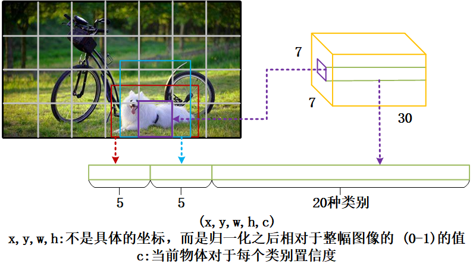</p>

<p align="center">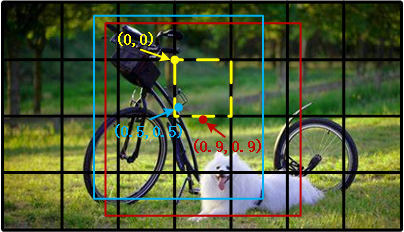</p>

<p align="center">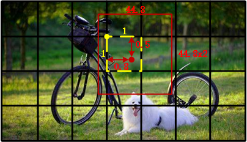</p>

- **x，y：** 是指 bounding box 的预测框的中心坐标相较于该 bounding box 归属的 grid cell 左上角的偏移量，在 0-1 之间。在下图中，**黄色虚线框**代表 grid cell，**黄点**表示该 grid cell 的左上角坐标，为（0，0）；**红色和蓝色框**代表该 grid cell 包含的两个 bounding box，**红点和蓝点**表示这两个 bounding box 的中心坐标。有一点很重要，bounding box 的中心坐标一定在该 grid cell 内部，因此，红点和蓝点的坐标可以归一化在 0-1 之间。在上图中，红点的坐标为（0.5，0.5），即 x=y=0.5，蓝点的坐标为（0.9，0.9），即 x=y=0.9。
- **w，h：** 是指该 bounding box 的宽和高，但也归一化到了 0-1 之间，表示相较于原始图像的宽和高（即 448 个像素）。比如该 bounding box 预测的框宽是 44.8 个像素，高也是 44.8 个像素，则 w=0.1，h=0.1。如下图所示：**红框**的 x=0.8，y=0.5，w=0.1，h=0.2。
3. 不管框 B 的数量是多少，**只负责预测一个目标**。
4. 预测 C 个条件概率类别（物体属于每一种类别的可能性）

<p align="center">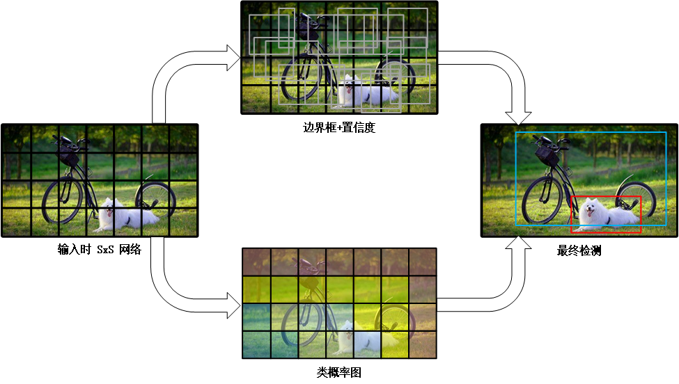</p>

**综上，S×S 个网格，每个网格要预测 B 个 bounding box （中间上图），还要预测 C 个类（中间下图）。**将两图合并，网络输出就是一个 S × S × (5×B+C)。（S x S 个网格，每个网格都有 B 个预测框，每个框又有 5 个参数，再加上每个网格都有 C 个预测类）

> Q1：为什么每个网格有固定的 B 个 bounding box？（即 B=2）
>
> 在训练的时候会在线地计算每个 predictor 预测的 bounding box 和 ground truth 的 IOU，计算出来的 IOU 大的那个 predictor，就会负责预测这个物体，另外一个则不预测。这么做有什么好处？我的理解是，这样做的话，实际上有两个 predictor 来一起进行预测，然后网络会在线选择预测得好的那个 predictor（也就是 IOU 大）来进行预测。
>
> Q2：每个网格预测的两个 bounding box 是怎么得到的？
>
> YOLOv1 中两个 bounding box 的边界框尺寸和形状是通过训练数据自动学习得到的 box，在训练开始时作为超参数输入 bounding box 的信息，随着训练次数增加，loss 降低，bounding box 越来越准确。Faster RCNN 也是人为选定的（9 个 不同长宽比和 scale），YOLOv2 中的 5 个 bounding box 是通过对训练集的 bounding box 进行 k-means 聚类分析得到的。。

### 7.5 预测特征组成

最终的预测特征由边框的位置、置信度得分以及类别概率组成，这三者的含义如下：

- **边框位置：** 对每一个边框需要预测其中心坐标及宽、高这 4 个量， 两个边框共计 8 个预测值边界框宽度 w 和高度 h 用图像宽度和高度归一化。因此 x,y,w,h 都在 0 和 1 之间。
- **置信度得分 (box confidence score) c ：** 框包含一个目标的可能性以及边界框的准确程度。类似于 Faster RCNN 中是前景还是背景。由于有两个边框，因此会存在两个置信度预测值。
- **类别概率：** 由于 PASCAL VOC 数据集一共有 20 个物体类别，因此这里预测的是边框属于哪一个类别。

**置信度的计算公式为：**

$$
\text{Confidence} = P(\text{Object}) \times \text{IoU}_{\text{pred}}^{\text{truth}}
$$

**置信度由两部分组成：**

1. 物体存在的概率（Pr(Object)）： 表示该边界框内存在物体的概率。
2. 预测框与真实框的交并比（IoU）： 衡量预测框与真实框重叠程度的指标。

**置信度的作用：**

有物体的网格单元： 如果网格单元包含物体，则置信度的目标值为预测框与真实框的 IoU。

无物体的网格单元： 如果网格单元不包含物体，则置信度的目标值为 0。

### 7.6 注意

- 一个 cell 预测的两个边界框共用一个类别预测， 在**训练**时会选取与标签 IoU 更大的一个边框负责回归该真实物体框，在**测试**时会选取置信度更高的一个边框，另一个会被舍弃，因此 7×7=49 个 grid cell 最多只能预测 49 个物体。
- 因为每一个 grid cell 只能有一个分类，也就是他只能预测一个物体，这也是导致 YOLO 对小目标物体性能比较差的原因。**如果所给图片极其密集，导致 grid cell 里可能有多个物体，但是 YOLOv1 模型只能预测出来一个，那这样就会忽略在本 grid cell 内的其他物体（缺点：对小目标检测性能较差）。**

### 7.7 网络结构

YOLOv1 的网络架构灵感来源于 GoogLeNet，输入图像的尺寸为 448×448，经过 24 个卷积层，2 个全连接的层（FC），最后在 reshape 操作，输出的特征图大小为 7×7×30。

> Q：7×7×30 怎么来的？
>
> 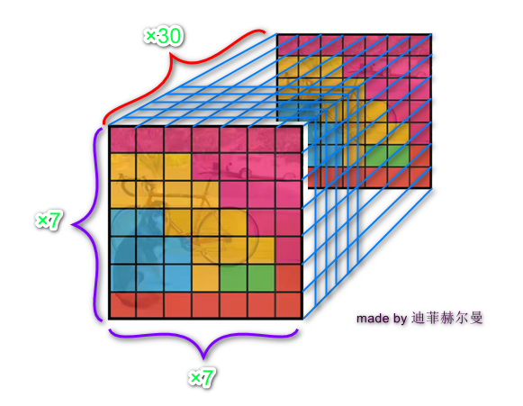
>
> 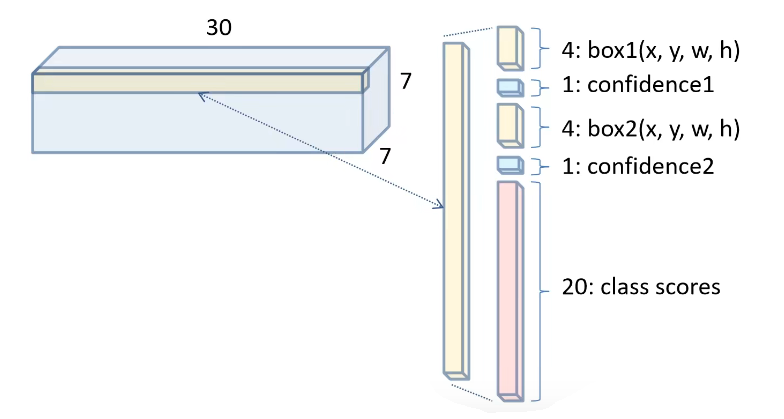
>
> 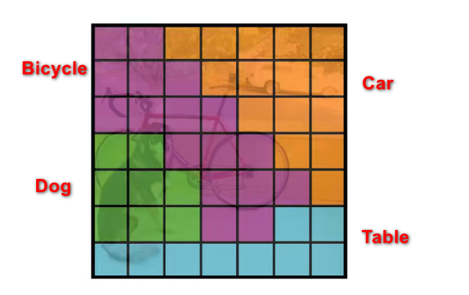
>
> （图片来源：[YOLO v1详细解读_yolov1详解_迪菲赫尔曼的博客-CSDN博客](https://yolov5.blog.csdn.net/article/details/123523225)）
>
> **7×7：** 一共划分成 7×7 的网格。
>
> **补充：** Q：为什么 backbone 输出空间尺寸为 7×7 的 featuremap 就对应在输入图上划分 7×7 个网格？A： 这是 backbone 中的不重叠 maxpooling 造成的，从而 Grid cell 的大小/分辨率就是总下采样率
>
> **30：** 30 包含了两个预测框的参数和 Pascal VOC 的类别参数：每个预测框有 5 个参数：x,y,w,h,confidence。另外，Pascal VOC 里面还有 20 个类别；所以最后的 30 实际上是由 5x2+20 组成的，也就是说这一个 30 维的向量就是一个 grid cell 的信息。
> **7×7×30：** 总共是 7 × 7 个 grid cell 一共就是 7 × 7 ×（2 × 5+ 20）= 7 × 7 × 30 tensor = 1470 outputs，正好对应论文。

### 7.8 网络详解

<p align="center">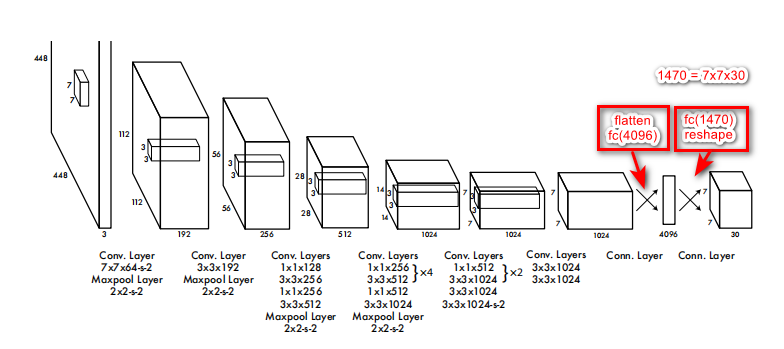</p>

1. YOLO 主要是建立一个 CNN 网络生成预测**7×7×1024** 的张量 。
2. 然后使用两个全连接层执行线性回归，以进行**7×7×2** 边界框（bounding box）预测。将具有高置信度得分（大于 0.25）的结果作为最终预测。
3. 在 3×3 的卷积后通常会接一个通道数更低**1×1**的卷积，这种方式既降低了计算量，同时也提升了模型的非线性能力。
4. 除了最后一层使用了线性激活函数外，其余层的激活函数为 **Leaky ReLU** 。
5. 在训练中使用了 **Dropout** 与数据增强的方法来防止过拟合。
6. 对于最后一个卷积层，它输出一个形状为 **(7, 7, 1024)** 的张量。 然后张量展开。使用 2 个全连接层作为一种线性回归的形式，它输出 1470 个参数，然后 reshape 为 **(7, 7, 30)** 。

### 7.9 NMS，非极大值抑制

NMS 算法主要解决的是一个目标被多次检测的问题，意义主要在于在一个区域里交叠的很多框选一个最优的。

<p align="center">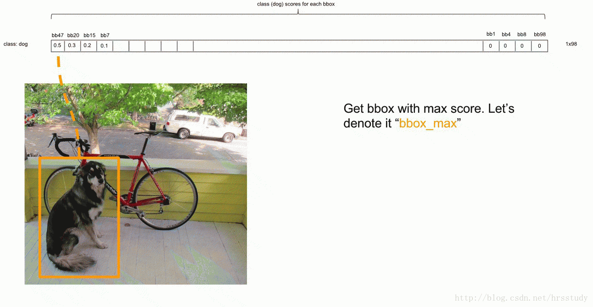</p>

1. 对于上述的 98 列数据，先看某一个类别，也就是只看 98 列的这一行所有数据，**先拿出最大值概率的那个框，剩下的每一个都与它做比较**，如果两者的 IoU 大于某个阈值，则认为这俩框重复识别了同一个物体，就将其中低概率的重置成 0。
2. 最大的那个框和其他的框比完之后，**再从剩下的框找最大的，继续和其他的比**，依次类推对所有类别进行操作。 注意，这里不能直接选择最大的，因为有可能图中有多个该类别的物体，所以 IoU 如果小于某个阈值，则会被保留。
3. 最后得到一个稀疏矩阵，因为里面有很多地方都被重置成 0，拿出来不是 0 的地方拿出来概率和类别，就得到最后的目标检测结果了。

> [!NOTE] ✏️ 信息
> **注意：** **NMS 只发生在预测阶段，训练阶段是不能用 NMS 的**，因为在训练阶段不管这个框是否用于预测物体的，他都和损失函数相关，不能随便重置成 0。

- 具体例子

> [!NOTE] ✏️ 信息
> 它的核心目的是：去重。
> 因为神经网络很“啰嗦”，对于同一个物体（比如图里的那只狗），它可能会预测出好几个框。我们需要把重复的框删掉，只保留最准的那个，同时还要小心不要误删掉另一只狗。
> 为了让你听懂，我们假设图里其实有 两只狗（虽然原图只有一只，但我们假设场景），算法一共预测出了 5 个框，它们的分数（概率）和位置如下：
> - Box A (0.9 分)： 框住了左边的狗（位置很准）。
> - Box B (0.6 分)： 也框住了左边的狗（位置偏了一点）。
> - Box C (0.5 分)： 也框住了左边的狗（位置偏了很多）。
> - Box D (0.8 分)： 框住了右边的狗（假设右边还有一只）。
> - Box E (0.4 分)： 也框住了右边的狗（位置偏了一点）。
> ### 具体操作流程（对应你图片里的第 2 点）：
> #### 第一轮：找“老大”
> 1. 挑出最大值： 在所有框里，分数最高的是 Box A (0.9)。我们把它定为当前的“老大”（`bbox_max`）。
> 2. 开始 PK（计算 IoU）： 让老大 A 跟剩下的所有人比重叠度（IoU）。
> 
>    - A vs B： 重叠度很高（因为它们都框左边的狗）。结论：B 是多余的，把 B 的概率置为 0（杀掉）。
>    - A vs C： 重叠度很高。结论：C 也是多余的，把 C 的概率置为 0（杀掉）。
>    - A vs D： 重叠度很低（A 框左边，D 框右边）。结论：D 是另一只狗，D 存活。
>    - A vs E： 重叠度很低。结论：E 可能是另一只狗，E 存活。
> 
> > 此时状态： A (0.9) 存活，B (0) 死，C (0) 死，D (0.8) 存活，E (0.4) 存活。
>
> #### 第二轮：找“剩下的老大”
> 原文说：“最大的那个框和别的框比完之后，再从剩下的框找最大的”。
> 1. 再挑最大值： 现在 A 已经比完了（它是第一轮的赢家）。我们在剩下还活着的框（D 和 E）里找分数最高的。
> 
>    - 剩下的最高分是 Box D (0.8)。
> 2. 继续 PK： 让新的老大 D 跟剩下的比。
> 
>    - D vs E： 重叠度很高（都框右边的狗）。结论：E 是多余的，把 E 的概率置为 0（杀掉）。
> 
> > 此时状态： A (0.9) 存活，D (0.8) 存活，其他全死。
>
> #### 第三轮：结束
> 剩下的框里没有比 D 分数更高的了，或者剩下的分数都太低被过滤掉了。流程结束。
> 最终结果： 我们得到了两个框 A 和 D，分别代表图中的两只狗。

### 7.10 损失函数

YOLOv1 的损失函数结合了边界框的定位、置信度预测和类别分类的多任务损失。

$$
Loss =\lambda_\mathrm{coord}\sum_{i=0}^{S^2}\sum_{j=0}^B\mathbf{1}_{ij}^\mathrm{obj}\left[\left(x_i-\hat{x}_i\right)^2+\left(y_i-\hat{y}_i\right)^2\right]\\+ \lambda_{\mathbf{coord}}\sum_{i=0}^{S^{2}}\sum_{j=0}^{B}\mathbf{1}_{ij}^{\mathrm{obj}}\left[\left(\sqrt{w_{i}}-\sqrt{\hat{w}_{i}}\right)^{2}+\left(\sqrt{h_{i}}-\sqrt{\hat{h}_{i}}\right)^{2}\right]\\+ \sum_{i=0}^{S^2}\sum_{j=0}^B\mathbf{1}_{ij}^{\mathrm{obj}}\left(C_i-\hat{C}_i\right)^2 +\lambda_{\mathrm{noobj}}\sum_{i=0}^{S^{2}}\sum_{j=0}^{B}\mathbf{1}_{ij}^{\mathrm{noobj}}\left(C_{i}-\hat{C}_{i}\right)^{2}\\+ \sum_{i=0}^{S^2}\mathbf{1}_i^\mathrm{obj}\sum_{c\in\mathrm{classes}}\left(p_i(c)-\hat{p}_i(c)\right)^2
$$

<p align="center">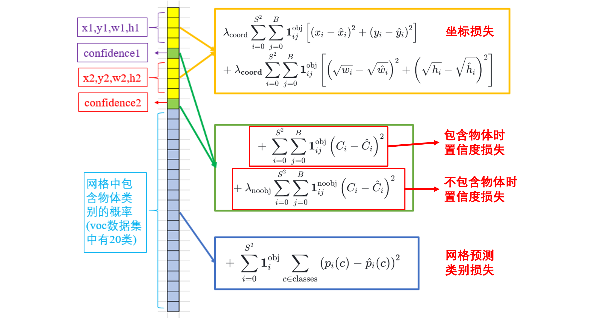</p>

1. **定位损失（Localization Loss）**：

   衡量预测边界框与真实框的偏差。

   $$
   LocalizationLoss = \lambda_\mathrm{coord}\sum_{i=0}^{S^2}\sum_{j=0}^B\mathbf{1}_{ij}^\mathrm{obj}\left[\left(x_i-\hat{x}_i\right)^2+\left(y_i-\hat{y}_i\right)^2\right]\\+ \lambda_{\mathbf{coord}}\sum_{i=0}^{S^{2}}\sum_{j=0}^{B}\mathbf{1}_{ij}^{\mathrm{obj}}\left[\left(\sqrt{w_{i}}-\sqrt{\hat{w}_{i}}\right)^{2}+\left(\sqrt{h_{i}}-\sqrt{\hat{h}_{i}}\right)^{2}\right]
   $$

   <p align="center">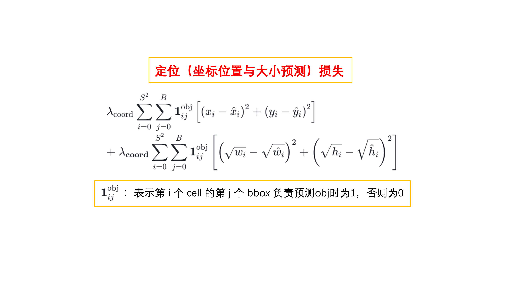</p>

   - 第一行：负责检测物体的框中心点（x, y）定位误差。
   - 第二行：负责检测物体的框的高宽（w,h) 定位误差，这个根号的作用就是为了修正对大小框一视同仁的缺点，削弱大框的误差。
   - $\lambda_\mathrm{coord}$ 的作用，就是让含有物体的格点，在损失函数中的权重更大，让模型更加“重视”含有物体的格点所造成的损失。在论文中，$\lambda_\mathrm{coord}$ 的取值为 5。

2. **置信度损失（Confidence Loss）**：

   衡量预测框是否包含物体的置信度与真实值的差异。

   $$
   ConfidenceLoss=\sum_{i=0}^{S^2}\sum_{j=0}^B\mathbf{1}_{ij}^{\mathrm{obj}}\left(C_i-\hat{C}_i\right)^2 \\+\lambda_{\mathrm{noobj}}\sum_{i=0}^{S^{2}}\sum_{j=0}^{B}\mathbf{1}_{ij}^{\mathrm{noobj}}\left(C_{i}-\hat{C}_{i}\right)^{2}
   $$

   <p align="center">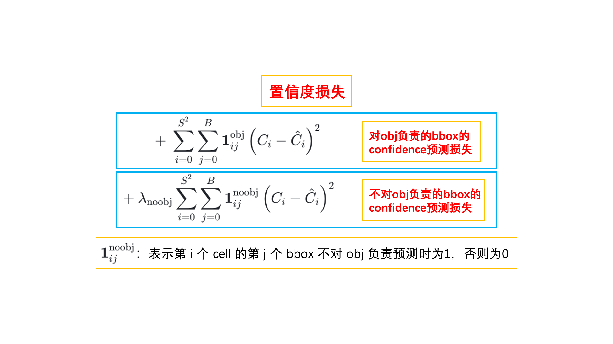</p>

   - 第一行：负责检测物体的那个框的置信度误差。
   - 第二行：不负责检测物体的那个框的置信度误差。
   - YOLOv1 的输出中有 49（7x7） 个格点，含有物体的格点往往只有 3、4 个，其余全是不含有物体的格点。此时如果不采取点措施，那么物体检测的 mAP 不会太高，因为模型更倾向于不含有物体的格点。$\lambda_{\mathrm{noobj}}$ 的作用，就是让不含有物体的格点，在损失函数中的权重更小，让模型更加“忽视“不含有物体的格点所造成的损失。在论文中，$\lambda_{\mathrm{noobj}}$ 的取值为 0.5。

3. **分类损失（Classification Loss）**：

   <p align="center">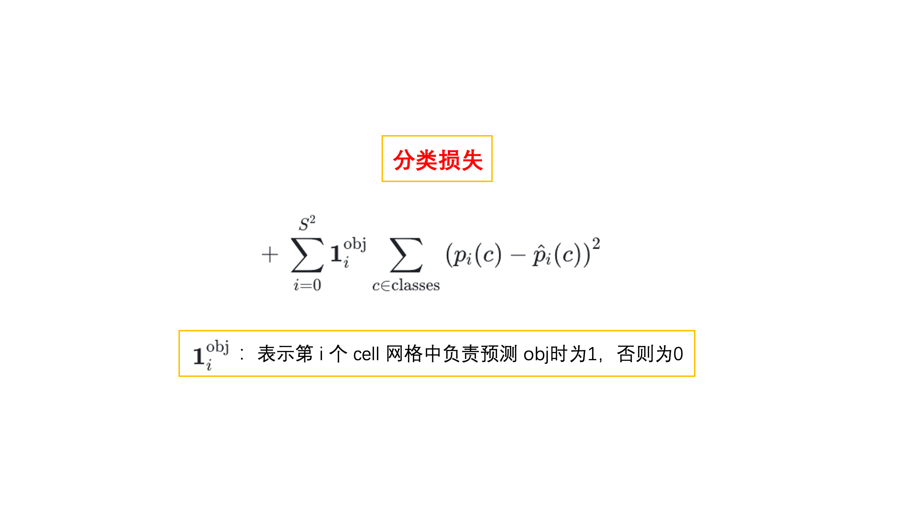</p>

   衡量预测的类别概率分布与真实类别的差异。

   $$
   ClassificationLoss=\sum_{i=0}^{S^2}\mathbf{1}_i^\mathrm{obj}\sum_{c\in\mathrm{classes}}\left(p_i(c)-\hat{p}_i(c)\right)^2
   $$

### 7.11 YOLOv1 的优缺点

| **优点** | **描述** |
|-|-|
| 速度快 | 基础版 YOLO 在 Titan X GPU 上达 45 FPS，快速版达 155 FPS。 |
| 全局上下文感知 | YOLO 在检测时考虑整幅图像的信息，减少了背景误检。 |
| 高泛化能力 | 在跨领域任务中（如艺术图像），表现优于其他方法。 |

| **缺点** | **描述** |
|-|-|
| 小目标检测性能较差 | 下采样导致小目标的特征丢失。 |
| 密集目标检测能力有限 | 每个网格单元只能检测一个物体。 |
| 边界框灵活性不足 | 对于不常见的目标长宽比，泛化能力较弱。 |

### 7.12 YOLOv2

<p align="center">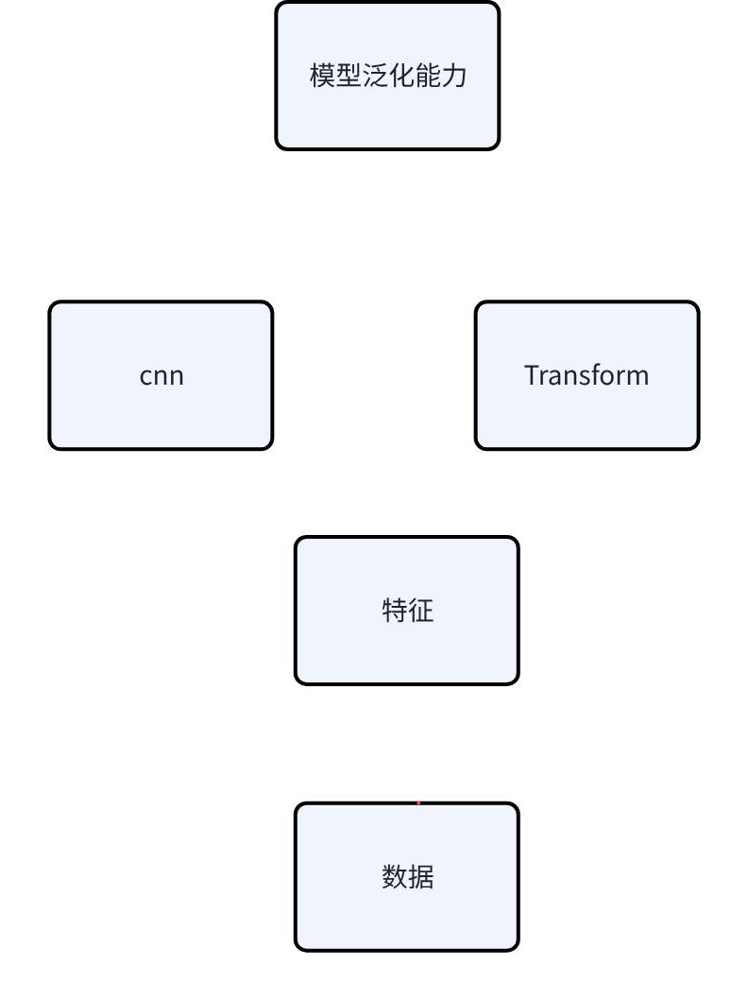</p>

- 迭轮子：Transform+
- 

<p align="center">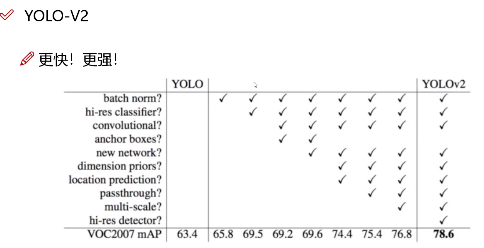</p>

<p align="center">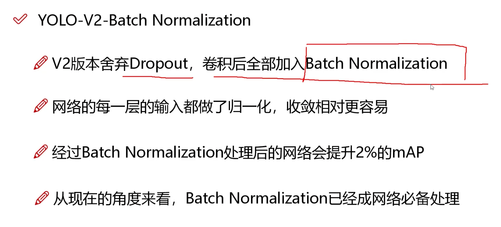</p>

<p align="center">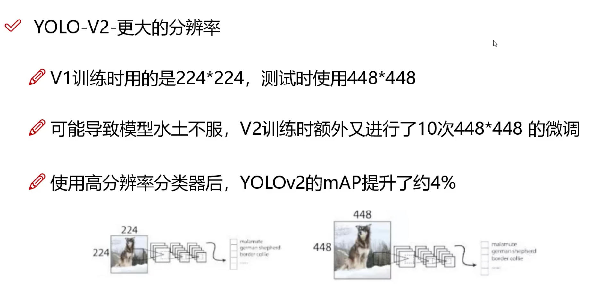</p>

<p align="center">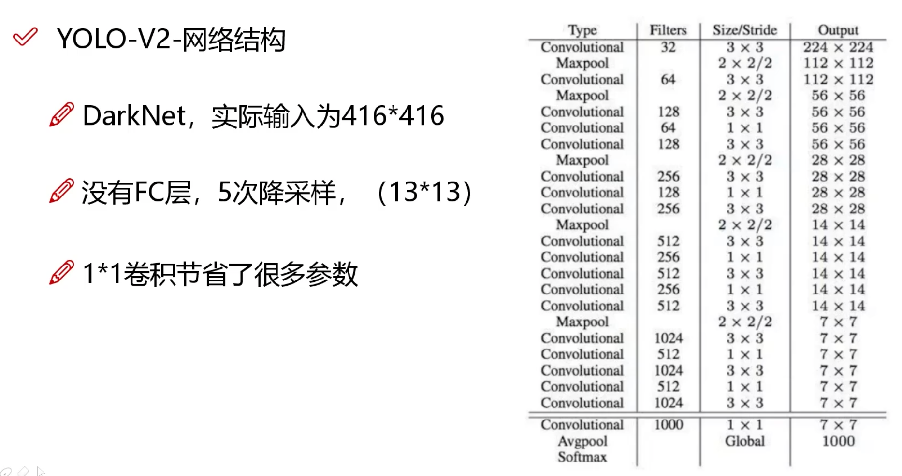</p>

<p align="center">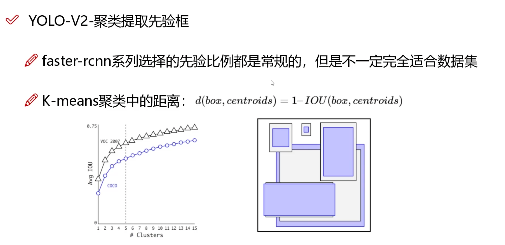</p>

> [!NOTE] ✏️ 信息
> 核心点：让数据自己说话。把训练集中所有真实标注框的宽高拿出来做聚类，直接提取出最符合该数据集分布的框型。

<p align="center">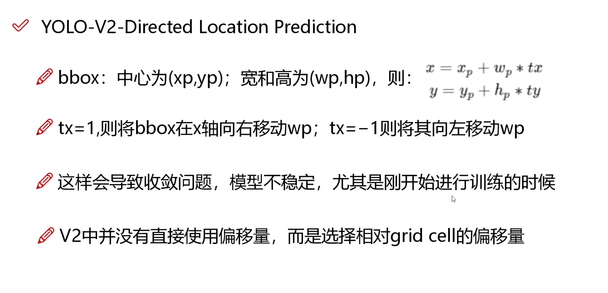</p>

> [!NOTE] ✏️ 信息
> ### 核心思想：不猜“绝对坐标”，只猜“相对偏移”
> 神经网络直接输出 `[x, y, w, h]`（比如 `[384, 256, 120, 80]`）非常难训练，因为坐标范围太大且容易跑偏。
> YOLOv2 的做法是：先给每个网格发一张“默认大小的透明贴纸”（Anchor 框），然后让网络只猜 4 个微调数字：往哪挪？拉长多少？

<p align="center">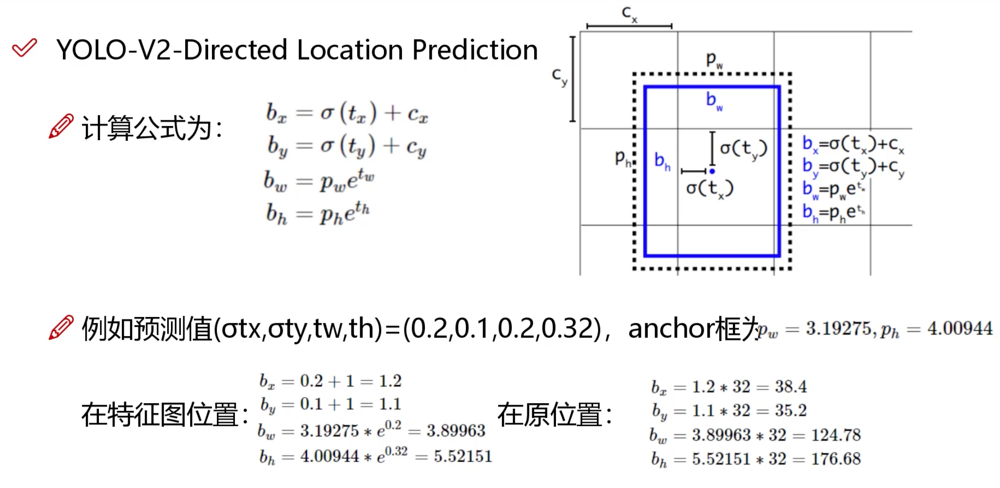</p>

> [!NOTE] ✏️ 信息
> 原位置计算方法：因为主干网络（Darknet-19）把原图缩小了 32 倍，所以要还原就乘以 32

<p align="center">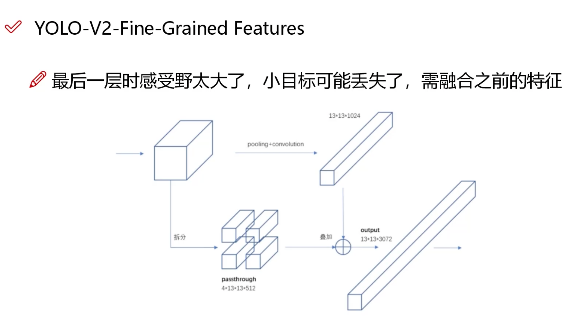</p>

<p align="center">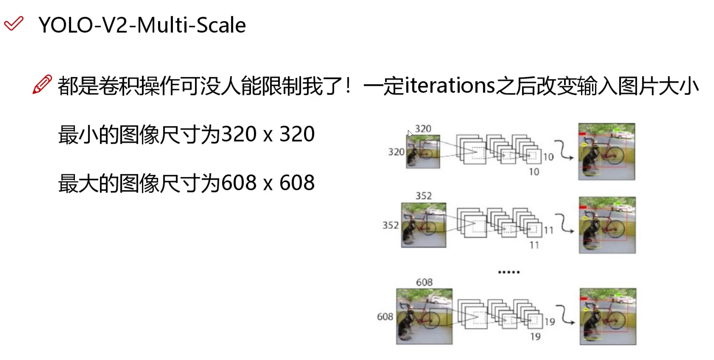</p>

<p align="center">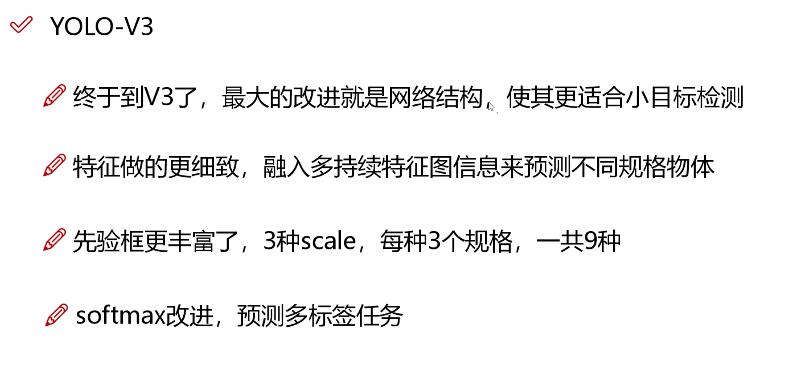</p>

<p align="center">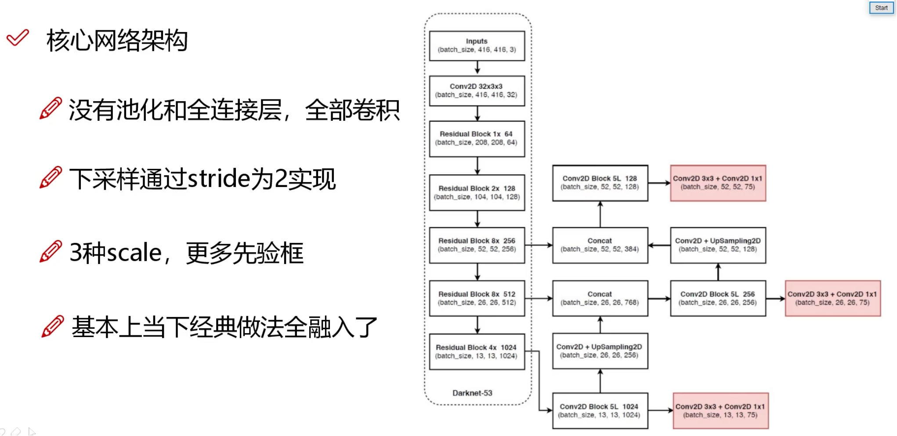</p>

<p align="center">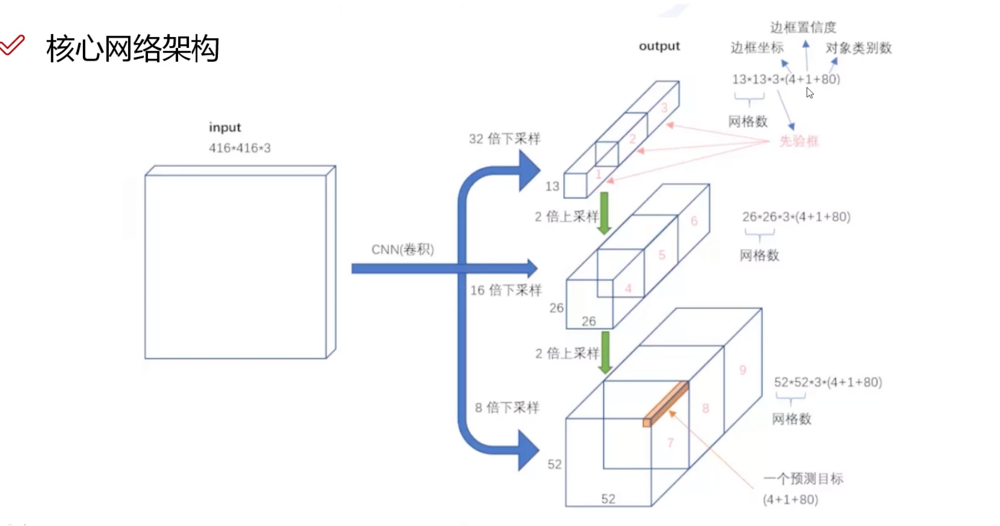</p>

<p align="center">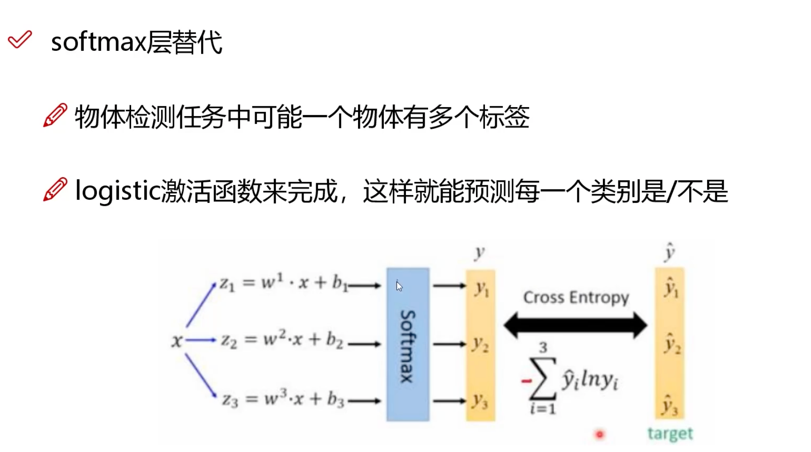</p>

- cv 相关数据集下载地址：<https://public.roboflow.com/object-detection/boggle-boards>
- 工程项目地址：<https://github.com/orgs/ultralytics/repositories?type=all>

<p align="center">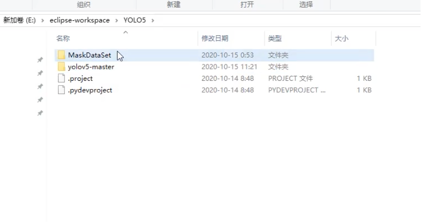</p>

### 7.13 YOLOv8 目标实战

<a href="./assets/2_attachment_03.zip" download="YOLOv8-watermark-brand-main.zip">YOLOv8-watermark-brand-main.zip</a>
