# 只学够用的Linux-零基础最小入门教程

随着人工智能技术向普通用户的普及，越来越多非计算机领域的普通用户开始接触 Linux 系统。但网络上的主流教程不是超长的教科书式教程，就是短到不足以带小白入门的残缺教程。针对这个问题，本篇教程的撰写理念就是最小但够用：只保留最核心的知识，同时确保零基础读者完成学习后，已经具备独立使用 Linux 并继续深入探索的能力。

- 只学够用的内容：只保留最核心的知识，同时确保学习后能独立使用 Linux
- 拒绝教条式讲解：拒绝“历史、分类和定义”这种教条形式的讲解
- 适合零基础用户：面向零基础或者知识散乱的初级用户，并非进阶用户

因此，该教程适合人群是零基础或者知识散乱的初级用户，并不面向想精进 Linux 技术的专业人士。接下来，本教程的大纲如下 **（点击左上角打开侧栏可以看到目录）** ：

- 1 核心基础：讲解最详细，并补充必要的背景知识
  - 1.1 内核和发行版
    - 1.2 Shell 和命令： `echo`, `sleep`
    - 1.3 目录、文件和路径： `cd`, `ls`, `pwd`, `cat`, `mkdir`, `touch`
    - 1.4 复制、移动和重命名： `cp`, `mv`
    - 1.5 删除对象： `rm`, `rmdir`
    - 1.6 查看和编辑： `more`, `less`, `head`, `tail`, `vim`, `nano`
    - 1.7 特殊符号：通配符、重定向、命令连接、变量、引号、转义
    - 1.8 用户和权限： `whoami`, `id`, `groups`, `passwd`, `su`, `sudo`, `chown`, `chmod`
    - 1.9 软件包管理： `apt`
    - 1.10 远程操作： `ssh`, `scp`
    - 1.11 目录结构
- 2 常用功能：已具备基础后，简要介绍常用指令和用法
  - 2.1 网络下载： `wget`, `curl`, `aria2c`
    - 2.2 打包和压缩： `tar`, `zip`, `unzip`, `7z`
    - 2.3 文档处理补充： `wc`, `grep`, `sed`
    - 2.4 符号链接和硬链接： `ln`
    - 2.5 后台任务和终端复用器： `bg`, `fg`, `jobs`, `nohup`, `screen`, `tmux`
    - 2.6 系统资源查询： `top`, `htop`, `kill`, `pkill`, `du`, `df`, `lsblk`, `iotop`, `ifconfig`, `iftop`, `nload`
    - 2.7 磁盘挂载： `mount`, `umount`
    - 2.8 环境变量： `export`, `env`, `PATH`, `LD_LIBRARY_PATH`
    - 2.9 Bash 配置文件：`.bashrc`, `source`
    - 2.10 拾遗补缺： `watch`, `tee`, `diff`, `uname` 以及常误触快捷键
- 3 常见需求与工具：仅说明常见需求对应的工具名称，方便后续自行查阅

在开始之前，有一个最重要的学习建议是—— **不用刻意背命令。** 经常使用的命令和参数自然会慢慢记住，重点是知道某个需求大概应该使用什么命令。

<iframe src="https://player.bilibili.com/player.html?isOutside=true&amp;aid=117208147630731&amp;bvid=BV13ctf6RECM&amp;cid=41558540969&amp;p=1" frameborder="no" framespacing="0" allowfullscreen="true"></iframe>

## 1. 核心基础

### 1.1 内核和发行版

#### 1.1.1 内核和发行版

对于初学者来说，我相信一定有一件事非常令人疑惑：为什么我们说用的是“Linux 系统”，但实际上用的却是 Ubuntu、CentOS、Arch Linux 这种五花八门的“系统”呢？

这就引出了第一个知识点，内核和发行版的关系：Linux 只是一个操作 **系统内核** ，要构建一个完整可用的操作系统，需要加入大量的用户空间软件，最终构建成五花八门的 **发行版** 。

这句话可能仍然有点难理解，我们用家喻户晓的 Android 系统来类比。Linux 内核可以类比为 Android 系统底层所使用的内核，而各种 Linux 发行版，则可以粗略类比为 HyperOS、OriginOS、ColorOS 等厂商定制系统。

#### 1.1.2 内核之间的区别

Linux 内核由 Linus Torvalds 发起，并由全球开发者共同维护。它会不断发布新的版本，同时形成主线版本、稳定版本和长期支持版本等不同分支。不同内核版本主要在硬件支持、驱动程序、性能调度、安全机制和文件系统功能等方面存在差异。

不过，对于初学者和普通用户来说，这些差异通常不会被直接感知。因此，一般只需要使用发行版默认提供的内核， **不必在入门阶段研究内核版本和分支** 。

#### 1.1.3 发行版之间的区别

不同 Linux 发行版就像不同厂商定制的 Android 系统：底层核心相近，但预装软件、管理工具、更新策略、默认配置和目标用途有所不同，如下表所示。

|                    | 各种 Linux 发行版的区别                                                                               | 各种 Android 定制系统的区别                                    |
| ------------------ | ----------------------------------------------------------------------------------------------------- | -------------------------------------------------------------- |
| 预装软件与默认服务 | 默认附带的工具和服务不同，例如 SSH、网络工具、编辑器、日志工具                                        | 默认安装的系统应用不同，例如浏览器、文件管理器、相册、手机管家 |
| 软件安装渠道       | 使用不同的软件仓库和包管理器，如 apt、dnf、pacman、opkg                                               | 使用不同的应用商店，如 Google Play、小米应用商店、华为应用市场 |
| 更新方式           | 有固定版本、长期支持、滚动更新等模式                                                                  | 不同厂商的更新频率、支持年限和推送方式不同                     |
| 目标用途           | Debian、Ubuntu Server 面向通用服务器；Alpine 面向容器；OpenWrt 面向路由器；Rocky Linux 面向企业服务器 | 有的强调原生体验，有的强调拍照、游戏、办公或设备互联           |

由于 Ubuntu 是目前最流行、知名度最高的 Linux 发行版，其沉淀的资料最多，便于新手学习与排错，因此本教程选择 **Ubuntu 24.04 LTS** 来作为演示发行版。不同发行版之间的基础知识和大多数常用软件相通，切换发行版的学习成本通常不高，因此后期可以根据自己的需求选择喜欢的发行版。

---

### 1.2 Shell 和命令

对于图形化操作系统例如 Windows 和 macOS，我们的大多数使用场景都是在图形操作界面（GUI）完成的，而对于 Linux 来说，它最原汁原味的使用方式是在命令行界面（CLI）完成的。在命令行界面中，我们不再通过鼠标单击按钮，而是输入命令来告诉计算机要做什么，计算机执行完后将结果返回用户。

#### 1.2.1 Shell 的基本交互

用户输入的命令由 Shell（命令解释器）负责解析，并由它直接执行或调用相应程序执行。Shell 是一个程序，在 Ubuntu 里它默认是 `bash` ，它是目前最常见的 Linux Shell 之一。

**（1）命令解释器的交互方式**

`bash` 在等待用户输入命令时，会显示出命令提示符（Command Prompt），Ubuntu 默认提示符的结构如下图，它会同时展现当前用户名、该计算机的名称、当前的工作目录。当出现命令提示符时，说明 Shell 已经准备好了接受用户命令，此时就可以用键盘在光标处键入命令了。输入完成后，按下回车键，Shell 就会开始执行这条命令。

<p align="center"></p>

命令提示符的格式和显示内容可以自定义，不同发行版可能有自己的设计，其核心作用是提示用户：Shell 已经准备好接受下一条命令。

现在，我们可以尝试在终端里键入 `echo` 命令来熟悉一下交互逻辑， `echo` 命令会将它后面的内容输出到终端，可以理解为“复读”。

<p align="center"></p>

命令解释器交互演示

**（2）执行耗时的命令**

有时，我们会执行一些非常耗时的命令，此时我们会发现命令提示符迟迟未出现。这是因为默认情况下 Shell 会等待当前在前台运行的命令结束，才会准备接受下一条命令的输入，没有出现命令提示符说明上一条命令还没有运行完。

现在，我们可以尝试在终端里键入 `sleep` 命令来验证一下， `sleep` 命令的作用是等待 x 秒，例如执行 `sleep 3` 后，该命令就会“干等”3 秒，什么都不会做。等待 3 秒后，新的命令提示符才会重新出现，等待新一轮的用户输入。

<p align="center"></p>

耗时命令演示

**（3）中断运行中的命令**

有时我们在运行耗时的命令途中，不想继续运行了，想要中断正在运行的命令。此时就可以按下 Ctrl + `C` 发送中断信号，程序一般会因此停止运行，新一轮的命令提示符也会随之弹出。另外，输入的 Ctrl + `C` 在终端中通常会显示 `^C` ，其中 `^` 表示 Ctrl 键。

现在，我们可以尝试在终端里键入 `sleep 60` 命令，这样 Shell 会等待一分钟，然后通过按 Ctrl + `C` 就可以提前打断它。

<p align="center"></p>

中断命令演示

#### 1.2.2 命令的基本结构

在熟悉了 Shell 的交互后，接下来的任务就是认识命令的结构了。一条最基本、最常见的 Linux 命令通常具有如下结构：

```text
命令名称 [命令参数]...
```

**命令名称** 指定你想要调用的命令，它是大小写敏感的，即 `ls` 和 `LS` 是不同的。 **命令参数** 则控制具体的调用行为以及提供数据，命令参数可以有多个。命令名称和每个命令参数之间通常要用 **空格隔开** ，空格的数量不限。

一条命令最复杂的是命令参数，不同的程序对命令参数的解析方式是不同的，原则上程序可以设计任意的命令参数语法。但是在 Linux 的多年发展中，已经形成了一套约定俗成的命令语法，接下来将会介绍典型命令的语法。

#### 1.2.3 典型的命令参数语法

典型的命令参数是大小写敏感的，语法大致可以分为以下几种类别，不同程序可能会用其中一种或几种：

| 类型           | 作用                   | 语法结构              | 示例          |
| -------------- | ---------------------- | --------------------- | ------------- |
| 不带值的短参数 | 一般作为开关使用       | `-[参数名]`           | `-a`          |
| 带值的短参数   | 用来传递具体的参数值   | `-[参数名] [参数值]`  | `-n 10`       |
| 不带值的长参数 | 一般作为开关使用       | `--[参数名]`          | `--all`       |
| 带值的长参数   | 用来传递具体的参数值   | `--[参数名]=[参数值]` | `--size=10MB` |
| 位置参数       | 用于传递具体的操作对象 | `[操作对象]` …        | `sample.txt`  |

我们用 `ls` 来举个例子： `ls -a -l --block-size=KB /home/chriskim`

<p align="center"></p>

典型命令参数语法演示

同时，命令参数的语法也有一些变体，不同程序可能兼容性不同，例如：

| 类型               | 特点                                 | 语法结构               | 示例          |
| ------------------ | ------------------------------------ | ---------------------- | ------------- |
| 合并的多个短参数   | 多个短参数合到一起写                 | `-[参数名][参数名]...` | `-alh`        |
| 不隔开的带值短参数 | 完全不隔开短参数和值                 | `-[参数名][参数值]`    | `-j16`        |
| 不用=的带值长参数  | 不用等号隔开参数和值，而是用空格隔开 | `--[参数名] [参数值]`  | `--size 10MB` |

继续用上面的那个例子，在这里它可以写成这样的等价形式： `ls -al --block-size KB /home/chriskim`

<p align="center"></p>

典型命令参数语法变体演示

在此我还要再次重复提醒一句， **原则上程序可以设计任意的命令参数语法** ，不同的程序必须具体情况具体分析，这一小节只是让大家对命令的样子有初步的印象。

#### 1.2.4 高效地键入命令

从我的观察来看，很多 Linux 初学用户并没有掌握命令的键入技巧，导致命令键入非常慢，下面介绍几个必备的键入技巧。

**（1）历史记录**

在终端键入的命令是有历史记录的，可以用 ↑ 和 ↓ 来导航历史命令，可以多次按 ↑ 键来找到更久远的命令。

**（2）TAB 键补全**

我们在键入命令时不需要每个字母都手工键入，通过 TAB 键即可进行自动补全（就像 IDE 里一样）。通常来说，TAB 可以补全命令名称和文件路径；如果系统为对应命令提供了专门的补全支持，还可以补全命令参数。

如果当前输入存在多个候选项，例如以 `/usr/l` 开头的路径有两个，可以连续按两次 TAB 键，终端就会列出所有候选项。继续输入几个字符，消除歧义后，再按 TAB 键即可完成补全。

<p align="center"></p>

TAB 键自动补全演示

**（3）光标导航**

有时候我们会要输入超长的命令，此时如果要修改命令，可不要按死左右方向键等光标慢慢移动了，这实在太慢了。光标是有快速导航的方式的：

- Home ：光标移动到命令头
- End ：光标移动到命令尾
- Ctrl + ← ：光标向左移动一个单词，是否可用取决于终端是否支持
- Ctrl + → ：光标向右移动一个单词，是否可用取决于终端是否支持

上面就是我日用的四个快捷键，其实除此之外还有挺多快捷键的，但是由于不是很好记，因此就不在这列出了。

**（4）复制粘贴**

需要注意，终端里的复制粘贴快捷键有所不同，不同终端会有差别，但是大多数都支持以下一组快捷键：

- Ctrl + Insert ：复制选中的文字
- Shift + Insert ：粘贴文字

**（5）清屏**

如果想要清屏终端，使用快捷键 Ctrl + L 或者命令 `clear`

#### 1.2.5 获取命令的文档

通常来说，Linux 命令约定俗成在 `--help` 下提供文档。假设你突然忘记了 `ls` 命令的用法，可以使用 `ls --help` 来获得它的文档。另外，很多命令还会提供详细手册（manual），使用 `man 命令名` 就可以查看。

**需要注意的是，必须是命令本身提供了相应的帮助文档或手册，才能够查询到。**

---

### 1.3 目录、文件和路径

#### 1.3.1 Linux 目录结构

相信阅读本教程的读者已经对 Windows 系统非常熟悉了，那么为了最快地学习，我们先可以只用理解 Linux 目录结构和 Windows 的不同点。总的来说，Linux 和 Windows 目录结构的重要区别有：

|            | Linux                                                | Windows                                     |
| ---------- | ---------------------------------------------------- | ------------------------------------------- |
| 目录分隔符 | 正斜杠 `/`                                           | 反斜杠 `\`                                  |
| 根目录     | 目录树仅有一个根节点 `/`                             | 每个盘符都有独立的根目录，如 `C:\` 、 `D:\` |
| 大小写敏感 | 通常区分大小写， `File.txt` 和 `file.txt` 是两个文件 | 默认不区分大小写，二者通常视为同一文件      |

用图来可视化的话如下图所示：（为了清晰，目录仅展开少许，并不代表实际目录只有图中所示）

<p align="center">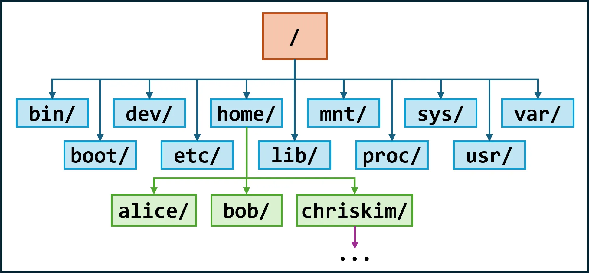</p>

Linux 的目录树示例

<p align="center">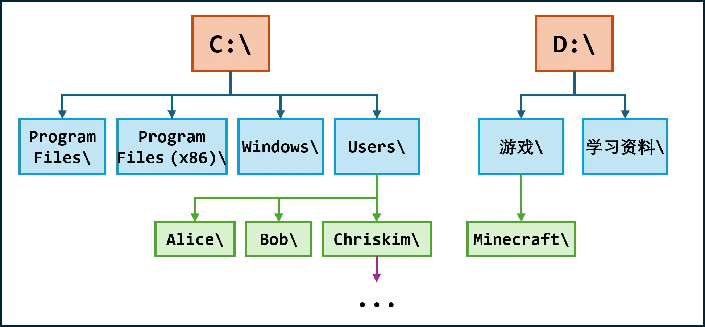</p>

Windows 的目录树示例

可能有些读者已经开始好奇了：Linux 根目录下的 `bin/`, `boot/`, `dev/`, … 都是些什么目录，装的都是什么东西。这个疑问还不必要在这里这么早地展开，但简单总结一下就是，Linux 有一套约定俗成的多层次目录结构，用于分类存放系统中的软件、库、配置文件等内容，具体内容将在 1.11 节展开。

在这里我们还不需要深究具体怎么存放，但可以先了解一点：用户的家目录在 `/home/用户名` 下，在家目录进行操作一般不会影响系统。

#### 1.3.2 路径的写法

Linux 路径的写法实际上和 Windows 基本一致，学习成本不高。

首先需要介绍的是绝对路径和相对路径的写法。绝对路径与当前工作目录无关，无论何时都指的是同一个东西；而相对路径与当前工作目录有关，给定的是指定目录与当前工作目录的相对位置关系。

如果是绝对路径，我们从根目录开始，一级一级写到目标目录，绝对路径必须以 `/` 开头。例如：

```text
/root/
/home/chriskim/hello.txt
/usr/local/etc/
/data/llm/weights/Qwen3.6-35B-A3B/config.json
```

如果是相对路径，我们用 `..` 代表当前工作目录的上一层，用 `.` 代表当前工作目录，通过这种方式来给定指定目录与当前工作目录的相对位置，相对路径不能以 `/` 开头。例如：

```text
# 如果当前工作目录为 /home/chriskim/，那么以下相对路径：
movies/
movies/interstellar.mp4
../
../../data/llm/weights/Qwen3.6-35B-A3B/config.json
././././././././././././././

# 他们分别代指的绝对路径是：
/home/chriskim/movies/
/home/chriskim/movies/interstellar.mp4
/home/
/data/llm/weights/Qwen3.6-35B-A3B/config.json
/home/chriskim/
```

另外，Linux 对用户家目录还有特殊记号 `~` ，我们可以用 `~` 来快捷方便地指定家目录：

```text
~          等价于 /home/chriskim
~/main.cpp 等价于 /home/chriskim/main.cpp
~/../      等价于 /home/
```

#### 1.3.3 切换与查看目录

要在 Linux 目录树中移动，核心的命令是 `cd` ，另外 `ls` 和 `pwd` 命令可以起辅助作用。

**（1） `cd` 命令：切换目录 change directory**

- **用途：** 切换当前的工作目录
- **核心参数：**
  - 位置参数：想切换的目标目录，若不传则切换到家目录

`cd` 命令是有许多参数的，但我们几乎只用得着一种用法，因此仅介绍这一种用法。示例如下，注意观察命令提示符的变化：

<p align="center"></p>

cd 命令演示

除此之外， `cd -` 是一个特殊的调用方式，通过传入减号 `-` 执行，可以回到上一次所在的目录，相当于 Windows 资源管理器的回退按钮。但是需要注意，这个历史记录只有一次，连续执行 `cd -` 会在当前目录和上一个目录之间来回切换，而不是逐级回退历史记录。

<p align="center"></p>

cd – 回退演示

**（2） `ls` 命令：打印目录 list**

- **用途：** 打印指定目录下的内容
- **核心参数：**
  - 位置参数：想打印的目标目录，不传则打印当前工作目录
    - `-a` ：打印隐藏内容（即 `.` 开头的对象）
    - `-l` ：以详细列表形式打印
    - `-F` ：在文件名后显示类别指示符
    - `-h` ：以更直观的方式显示文件大小

**补充知识：** Linux 中以 `.` 开头的文件或目录叫隐藏文件或目录，如 `.cache` 、`.config` 、`.gitignore` 等。

**示例一：** `ll` 别名 / `ls -alF` （最常用的用法）

在 Ubuntu 系统中，一般会帮用户默认配置 `ll` = `ls -alF` 的别名，即 Shell 检测到 `ll` 后会自动展开为 `ls -alF` ，其他发行版也有配置为 `ls -l` 别名的，后文也会介绍如何自己配置别名。由于 `ll` 非常方便键入，因此是最常用的用法。

在执行 `ll` 后，可以发现打印出了一个列表，示例如下：

<p align="center">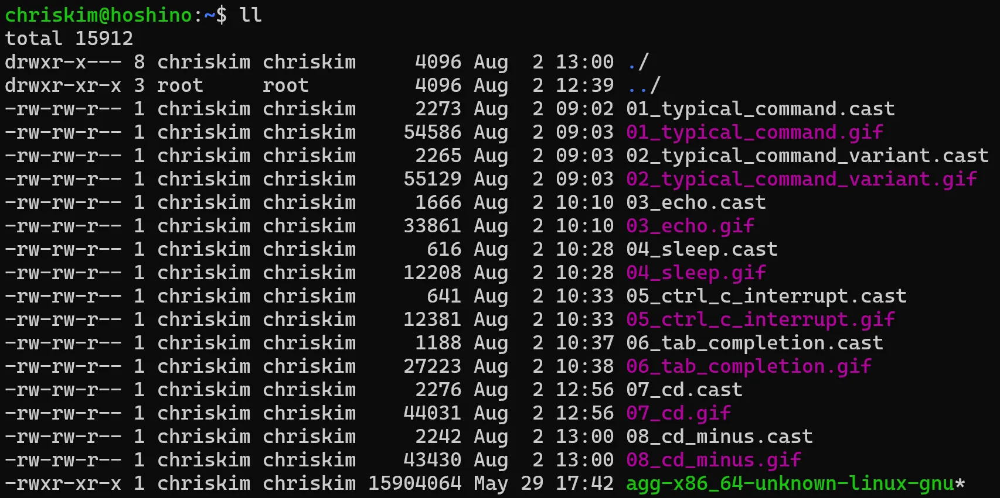</p>

ll 别名输出效果

接下来对该列表的含义做解释。首先是第一行 `total *` 代表的是当前列出的内容占用的磁盘块数量，通常 1 磁盘块代表 1 KiB，因此 `total 15912` 代表着列出的内容占用了 15912KiB 的磁盘，约 16MiB。接着便是下面的列表，每一行的含义如下：

```text
drwxr-xr-x  2 user user 4096 Aug  2 21:20 Documents/
│           │ │    │    │    │            └─ 文件名
│           │ │    │    │    └─ 最后修改时间
│           │ │    │    └─ 文件大小，单位通常是字节
│           │ │    └─ 所属组
│           │ └─ 所有者
│           └─ 硬链接数量
└─ 文件类型和权限
```

需要注意的是，由于我们给了 `-F` 参数，因此会在文件名后显示类别指示符，其中：

- 没有指示符：普通文件
- `*` ：可执行文件
- `/` ：目录
- `@` ：符号链接
- `|` ：命名管道
- `=` ：套接字

初学阶段最常见的是普通文件、可执行文件和目录，符号链接也可能经常出现；其他类型暂时不需要理解。另外，文件大小、最后修改时间、文件名都好理解，剩余的内容将会在后文逐渐展开。

**示例二：** `l` 别名 / `ls -CF` （也是常用的用法）

在 Ubuntu 系统中，一般会帮用户默认配置 `l` = `ls -CF` 的别名，由于 `l` 非常方便键入，因此也是常用的用法。

对于单命令终端交互加不加 `-C` 参数没有任何区别，因此读者可以暂时忽略，感兴趣可以自己搜索。因此该命令与示例一仅有 `-al` 的区别，即不会打印隐藏文件，也不会打印详细列表。

<p align="center">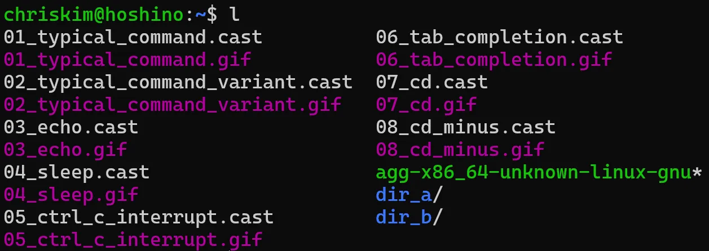</p>

l 别名输出效果

**示例三：** 使用 `-h` 参数

看到示例一 `ll` 的输出，我们会发现文件大小连换算单位都没有，实在是太难看了， `-h` 参数就能解决这个问题。我们执行 `ll -h` （等价于 `ls -alFh` ），就会发现列表的文件大小好看了不少，带上了 K/M 等单位。

<p align="center">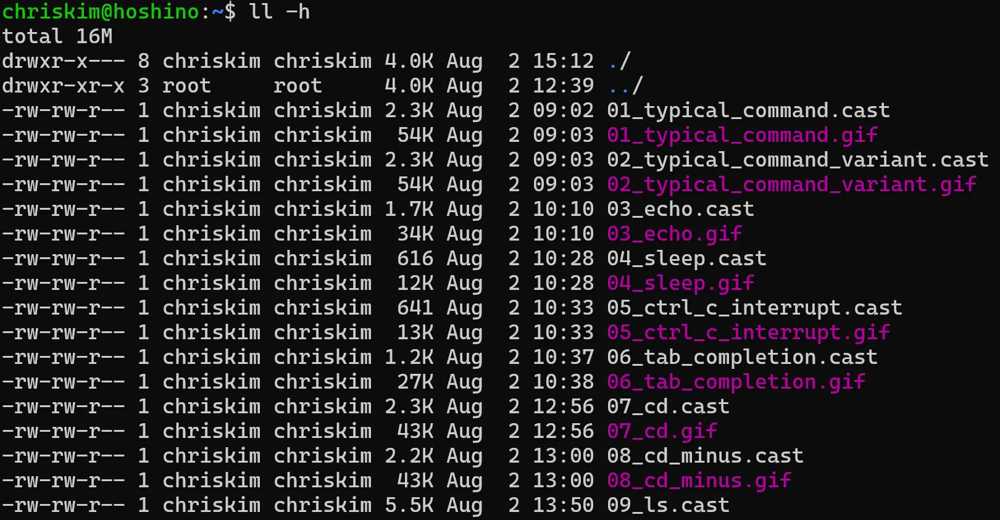</p>

ll -h 别名输出效果

**示例四：** 指定位置参数

在不指定位置参数时， `ls` 会打印当前路径下的内容，当指定后则会打印给定路径的内容。

<p align="center"></p>

ls 命令指定位置参数演示

**（3） `pwd` 命令：打印当前工作目录 print working directory**

`pwd` 命令很简单，无需任何参数执行后，它就会返回当前的工作目录（绝对路径）。

之前提到过，Ubuntu 的默认提示符会显示当前的工作目录，但是不同的发行版命令提示符格式可能不同。如果你用的发行版不会在提示符上显示当前工作目录，那这个命令就是必要的了

学习完这三个命令后，你就可以自由地“游走于目录树”了，想去到哪就去到。读者可以自行在 Linux 的目录结构中探索，理解目录树的结构。当然可能会碰到权限问题，不用担心，下文（1.8 节）会讲到这一点的。

#### 1.3.4 查看与运行文件

**（1）查看文件**

- **命令：** `cat` （意为 concatenate）
- **用途：** 查看文件、连接文件
- **核心参数：**
  - 位置参数：想要查看的文件的路径，传多个则把多个文件依次连接起来并输出

该命令很简单，直接举例说明，不再详细分析：若当前工作目录为 `/home/chriskim` ，a 文件内容为 `hello ` ，b 文件内容为 `world\n` ，c 文件内容为 `Nya~\n` ，则效果如下。

<p align="center"></p>

cat 命令演示

需要注意的是，不要使用 `cat` 打开超大的文件，由于它会把整个文件完整地输出在终端，如果文件太大可能会把终端卡住，如果真卡住了就按 Ctrl + C 中断。后文（1.6 节）会提到更高级的查看方式来解决这个问题。

另外，也不要用 `cat` 打开二进制、图片、压缩包等非纯文本，因为它不会识别文件格式，只是直接把其中的原始数据输出到终端，因此只会喷出一大堆乱码。

**（2）运行文件**

如果有些文件是二进制文件（可执行程序）或者脚本文件，并且有执行权限（在下文 1.8.4 节会介绍），那么它是可以通过 Shell 调用运行的。直接在 Shell 中指定它的路径就可以运行了，例如：

```bash
# 假设调用的文件都存在
./main
./run.sh
/data/my-program
/opt/my-script.sh

# 参数根据具体的程序传递即可
./my-app --host 0.0.0.0 --port 8000
/data/main --config /data/config.json
```

#### 1.3.5 新建目录和文件

前面几节讲述的都是查看，这一节将会介绍如何新建目录和文件，分别使用两个命令 `mkdir` 和 `touch` 。

**（1） `mkdir` 命令：新建目录 make directory**

- **用途：** 新建目录
- **核心参数：**
  - 位置参数：想要新建目录的路径，可以传多个，一次性新建多个目录
    - `-p` ：父目录不存在时一并创建，可用于一次性新建多级目录

该命令很简单，直接举例说明：

```bash
# 若当前工作目录为 /home/chriskim
mkdir test       # 新建 /home/chriskim/test/
mkdir /data/docs # 新建 /data/docs/
mkdir a b c      # 新建 /home/chriskim/a/, /home/chriskim/b/,   /home/chriskim/c/
mkdir x/y/z      # 报错 No such file or directory
mkdir -p x/y/z   # 新建 /home/chriskim/x/, /home/chriskim/x/y/, /home/chriskim/x/y/z/
```

**（2） `touch` 命令：新建文件**

- **常见用途：** 新建空文件
- **核心参数：**
  - 位置参数：想要新建文件的路径，可以传多个，一次性新建多个文件

该命令很简单，直接举例说明：

```bash
# 若当前工作目录为 /home/chriskim
touch test.txt   # 新建 /home/chriskim/test.txt
touch a b c      # 新建 /home/chriskim/a, /home/chriskim/b, /home/chriskim/c
```

#### 1.3.6 查找文件和目录

当我们知道文件大概在哪里，但不知道具体路径时，可以使用 `find` 命令进行查找。 `find` 会从指定的目录开始，递归检查其中的文件和子目录。

`find` 最常见的结构如下：

```text
find [起始目录] [查找条件]
```

最核心的查找条件有：

- `-name 名称` ：按照名称查找，区分大小写
- `-iname 名称` ：按照名称查找，不区分大小写
- `-type f` ：只查找普通文件
- `-type d` ：只查找目录
- `-maxdepth n` ：最多向下查找 n 层目录

直接通过几个例子理解：

```bash
# 在当前目录及其子目录中查找 config.json
find . -name "config.json"

# 在家目录及其子目录中查找所有 .txt 文件
find ~ -name "*.txt"

# 不区分大小写查找所有名称以 readme 开头的对象
find . -iname "readme*"

# 在 /data 中只查找名为 checkpoints 的目录
find /data -type d -name "checkpoints"

# 在 /data 中只查找 .pt 文件
find /data -type f -name "*.pt"

# 只查找当前目录及其下一层，不再继续深入
find . -maxdepth 1 -name "*.txt"
```

这里出现的 `*` 是通配符，可以简单理解为“任意一段字符”，例如 `"*.txt"` 可以匹配所有以 `.txt` 结尾的名称。通配符将在后文 1.7.1 节详细介绍。

需要注意，当 `-name` 或 `-iname` 中使用 `*` 等通配符时，建议像上面的例子一样用引号包起来，让通配符交给 `find` 处理，而不是提前被 Shell 展开。这个原理也会在 1.7.1 节详细介绍。

---

### 1.4 复制、移动和重命名

这一节非常简单，单纯就是对象（文件、目录…）的复制和移动。

#### 1.4.1 复制对象

- **命令：** `cp` （意味 copy）
- **用途：** 复制对象
- **核心参数：**
  - 位置参数 1：原对象路径
    - 位置参数 2：目标路径
    - `-r` ：是否递归复制（复制目录时使用）

`cp` 命令的行为与目标对象是否已经存在有关。若目标对象已经存在：

- 文件 → 已存在目录：把文件复制到目标目录 **里面**
- 目录 → 已存在目录：把目录复制到目标目录 **里面**
- 文件 → 已存在文件：用文件内容 **覆盖** 目标文件 **（不可恢复！！！）**
- 目录 → 已存在文件：报错，无效操作

```bash
# 如果目标对象路径存在（/data 目录和 exist.txt 都存在）
cp file.txt /data         # 将 file.txt 复制为 /data/file.txt
cp -r dir /data           # 将 dir/ 目录复制为 /data/dir/
cp file.txt exist.txt     # 用 file.txt 的内容覆盖 exist.txt
cp -r dir exist.txt       # 报错！无效操作
```

需要注意，如果目标目录中已经存在同名对象， `cp` 可能会覆盖或合并其中的内容：

```bash
cp file.txt /data         # 如果 /data/file.txt 已存在，则覆盖它
cp -r dir /data           # 如果 /data/dir 已存在，则将内容合并到其中
```

如果目标对象不存在，但目标对象的上一层目录存在， `cp` 会按照目标路径创建一个新的副本。但需要注意， `cp` 不会根据扩展名判断对象类型。目标名称没有扩展名，并不代表它一定是目录；目标名称带有 `.txt` ，也不代表它一定是文件。示例：

```bash
# 如果目标对象不存在（但上一层目录存在）
cp file.txt /data/new.txt      # 将 file.txt 复制为 /data/new.txt
cp file.txt /data/new_dir      # 将 file.txt 复制为名为 new_dir 的文件（cp 不会根据扩展名判断对象类型）
cp -r dir /data/new_dir        # 将 dir/ 复制为 /data/new_dir/ 目录
cp -r dir /data/new.txt        # 将 dir/ 复制为 /data/new.txt/ 目录（cp 不会根据扩展名判断对象类型）
```

如果目标对象的上一层目录不存在， `cp` 不会自动创建这些目录，而是直接报错：

```bash
cp file.txt /this/is/a/non/exist/directory/file.txt
```

#### 1.4.2 移动和重命名对象

- **命令：** `mv` （意味 move）
- **用途：** 移动对象
- **核心参数：**
  - 位置参数 1：源对象路径
    - 位置参数 2：目标路径

在 Linux 中，重命名也可以理解为一种移动：对象仍然位于原来的目录中，只是移动到了一个新的名称。

`mv` 命令的行为主要与目标对象是否已经存在有关。若目标对象已经存在：

- 文件 → 已存在目录：把文件放到目标目录里面
- 目录 → 已存在目录：把目录放到目标目录里面
- 文件 → 已存在文件：用文件覆盖目标文件 **（不可恢复！！！）**
- 目录 → 已存在文件：报错，无效操作

```bash
# 如果目标对象路径存在（/data 目录和 exist.txt 文件都存在）
mv file.txt /data         # 将 file.txt 移动为 /data/file.txt
mv dir /data              # 将 dir/ 目录移动为 /data/dir/
mv file.txt exist.txt     # 用 file.txt 覆盖 exist.txt
mv dir exist.txt          # 报错！不能用目录替换普通文件
```

需要注意，如果目标目录中已经存在同名对象， `mv` 的行为还会受到同名对象类型的影响：

```bash
mv file.txt /data         # 如果 /data/file.txt 已存在，则覆盖它
mv dir /data              # 如果 /data/dir 已存在并非空，则报错；如果它为空，则被源目录替换
```

如果目标对象不存在，但目标对象的上一层目录存在， `mv` 会让原对象变为指定的目标路径。但需要注意， `mv` 不会根据扩展名判断对象类型。目标名称没有扩展名，并不代表它一定是目录；目标名称带有 `.txt` ，也不代表它一定是文件。示例：

```bash
# 如果目标对象不存在（但上一层目录存在）
mv file.txt /data/new.txt    # 将 file.txt 移动并重命名为 /data/new.txt
mv file.txt /data/new_dir    # 将 file.txt 移动为名为 new_dir 的文件（mv 不会根据扩展名判断对象类型）
mv dir /data/new_dir         # 将 dir/ 移动并重命名为 /data/new_dir/
mv dir /data/new.txt         # 将 dir/ 移动为名为 new.txt 的目录（mv 不会根据扩展名判断对象类型）
```

如果目标对象的上一层目录不存在， `mv` 不会自动创建这些目录，而是直接报错：

```bash
mv file.txt /this/is/a/non/exist/directory/file.txt
```

---

### 1.5 删除对象

> _warning_ 警告  
> **rm 命令不存在“回收站”机制，将对象删除后，可以理解为对象就已经从磁盘中消失了。若没有配置其他的防护措施，几乎不存在方法能够挽救回来。由于初学者对命令还不够熟悉，很可能由于一个字符的错误导致毁灭性的结果。因此，为了文件的安全，本节内容一定要认真阅读，这也是为什么我将“删除对象”单列为一节。**

Linux 删除对象的命令是 `rm` ，请注意它删除的文件不会进入“回收站”，删除的对象不会进入桌面环境的“回收站”，因此删除对象时一定要小心谨慎。

- **命令：** `rm` （意为 remove）
- **用途：** 删除对象（文件或目录）
- **核心参数：**
  - 位置参数：想删除的文件或目录路径，传多个则同时删除
    - `-i` ：每次删除前询问用户
    - `-I` ：在较危险情况下询问用户（递归删除目录，或一次删除超过三个操作对象时，在执行前统一询问一次）
    - `-f` ：强制删除，不询问用户，操作对象不存在时不报错
    - `-d` ：删除空目录
    - `-r` ：递归删除目录
- **命令：** `rmdir` （意为 remove directory）
- **用途：** 删除空目录
- **核心参数：**
  - 位置参数：想删除的空目录，传多个则同时删除

#### 1.5.1 删除文件

使用 `rm` 命令直接传入文件路径即可，传入多个文件路径则同时删除。

```bash
rm test.txt
rm -i a.cpp b.cpp # 删除每个文件前，rm 都会再次询问用户
rm /data/model-00001-of-00002.safetensors /data/model-00002-of-00002.safetensors
```

#### 1.5.2 删除空目录

可以使用 `rmdir` 命令，也可以使用 `rm -d` 命令。直接传入空目录路径即可，传入多个空目录路径则同时删除。非空目录无法删除，会报错。

```bash
rmdir test_dir    # 删除空的 test_dir 目录
rmdir dir_a dir_b # 同时删除空的 dir_a 和 dir_b
rm test_dir       # 报错，不加参数只能删文件
rm -d test_dir    # 删除空的 test_dir 目录
rm -d dir_a dir_b # 同时删除空的 dir_a 和 dir_b
```

#### 1.5.3 删除有内容的目录

如果要删除里面有内容（文件或子目录）的目录，此时就得用 `rm` 的 `-r` 参数了，该参数指定 `rm` 递归进行删除，将目录以及目录里的所有内容删除。直接传入目录路径即可，传入多个目录路径则同时删除，传文件路径其实也会照常删除。

```bash
rm -r test_dir  # 将 test_dir 以及里面所有内容删除，不可恢复
rm -ri test_dir # 将 test_dir 以及里面所有内容删除，不可恢复，但在每次删除前 rm 都会再次询问用户
```

我强烈建议在使用 `rm -r` 删除目录时，若不是目录内文件非常多，就把 `-i` 带上，这样误删的几率会小很多，示例如下：

<p align="center"></p>

rm -ri 命令防误删演示

当然，如果你的目录内内容非常多，肯定是不可能全部人工批准删除的。因此可以尝试使用 `-I` 参数，这个参数只会在 `rm` 觉得比较危险的情况下才会发出提示（但不可能防住所有误删）： `rm -rI test_dir`

如果你真的确保无误后，使用 `-f` 参数可以不询问用户强制删除掉这个目录： `rm -rf test_dir`

#### 1.5.4 再提安全性

为了让 `rm` 命令的删除更安全，在这里强调一些容易出问题的点。

**（1）不要手滑打多路径空格**

- 假如你要执行的命令是： `rm -rf /home/chriskim/test_dir`
- 千万不要手滑打成了： `rm -rf /home/chriskim /test_dir`

如果变成这样，命令就变成了递归删除 `/home/chriskim` **和** `/test_dir` 。尽管第二个路径 `/test_dir` 不存在，但是第一个路径 `/home/chriskim` 是存在的， `rm` 命令会非常听你的话， **将整个家目录删除干净** ，什么都不会留下。

- 更不要手滑打成了： `rm -rf / home/chriskim/test_dir`

如果打成这样，从理论上来说， `rm -rf /` 会把整个系统里能删的东西 **全都删了** ！但是 `rm` 对根路径进行了特判，删除根路径时会报错“rm: it is dangerous to operate recursively on ‘/’”并停止。

**（2）千万不要打错绝对路径**

- 假如你要执行的命令是： `rm -rf data`
- 千万不要手滑打成了： `rm -rf /data`

第一个命令删除的是当前工作目录下的 `data` 目录，比如你的 AI 训练项目的数据集。而第二个命令删除的是系统根目录下的 `/data` 目录，删掉这个可能就把整个服务器存的所有数据集 **全部删除** 了！

**（3）与通配符、变量或脚本搭配**

虽说这些技巧还没有提到，但是这些使用方式都是很有风险的，在后续提到后也得再三注意！

---

### 1.6 查看和编辑

对初学者而言，使用命令行查看和编辑文件通常不如可视化编辑器直观。但是，当任务比较简单时，例如修改小型配置文件或批量替换几个单词，直接在终端中完成往往比启动 VS Code 更快捷。因此，学习在命令行中查看与编辑文件仍然是有价值的。

#### 1.6.1 分页查看文本

如果要分页查看文本，有两个命令可用： `more` 和 `less` 。其中 `more` 更老， `less` 更强，大多数情况下无脑选 `less` 就行，当环境里只有 `more` 时使用 `more` 也能实现类似功能。

**（1） `more` 命令**

- **用途：** 分页查看文件
- **核心参数：**
  - 位置参数：想看的文件的路径
    - `+行号` ：从指定行开始显示
    - `+/字符串` ：第一次匹配的位置开始显示
- **快捷键：**
  - Space ：下一屏
    - Enter ：下一行
    - `q` ：退出

```bash
more access.log         # 分页查看 access.log
more +100 access.log    # 从 100 行开始分页查看 access.log
more +/error access.log # 从第一次匹配 error 的位置开始显示
```

**（2） `less` 命令**

- **用途：** 更强的分页查看文件
- **核心参数：**
  - 位置参数：想看的文件的路径
    - `+行号` ：从指定行开始显示
    - `+/字符串` ：第一次匹配的位置开始显示
    - `-N` ：显示行号
    - `-S` ：长行不断行，可左右滚动
- **快捷键：**
  - Space ：下一屏
    - `↓` 或 Enter ：下一行
    - ↑ ：上一行
    - ← ：向左滚动长行，通常配合 `-S` 使用
    - → ：向右滚动长行，通常配合 `-S` 使用
    - `q` ：退出

`less` 命令除了能向上滚动之外，多了很多功能，是非常强大的工具，有非常多快捷键功能。为了教程的简洁性，这里只挑选了最实用的一些内容。如果懒得记，其实什么参数都不传，直接 `less` 打开也够用。

下面给出一个示例，命令为 `less -NS access.log` ：

<p align="center"></p>

less 命令演示

#### 1.6.2 查看文本头尾

如果要查看文本头尾，有两个命令分别可用： `head` 和 `tail`

**（1） `head` 命令**

- **用途：** 查看文件头部
- **核心参数：**
  - 位置参数：想看的文件的路径
    - `-n 行数` ：显示头部指定行数，默认 10 行

```bash
head access.log        # 打印出文件前 10 行
head -n 100 access.log # 打印出文件前 100 行
```

**（2） `tail` 命令**

- **用途：** 查看文件尾部
- **核心参数：**
  - 位置参数：想看的文件的路径
    - `-n 行数` ：显示尾部指定行数，默认 10 行
    - `-f` ：持续跟踪文件尾部，若有增多则打印（适合跟踪日志）

```bash
tail access.log        # 打印出文件尾 10 行
tail -n 100 access.log # 打印出文件尾 100 行
tail -f access.log     # 打印出文件尾 10 行，然后持续跟踪文件尾部，若有增多则打印
```

#### 1.6.3 文本编辑器

上面介绍的都是比较抽象的非交互式文本查看和编辑，实际上 Linux 上也有命令行形式的交互式编辑器，下面将会介绍两款编辑器叫做 `vim` 和 `nano` 。前者上手难度较高但最普遍，几乎所有 Linux 发行版都内置；后者上手难度较低，但可能不内置，要手动安装。

**（1） `vim` 编辑器**

`vim` 编辑器是 Linux 里出了名的上手难度极高的编辑器。如果不看文档的话，初学者甚至根本没法退出 `vim` 编辑器。

<p align="center">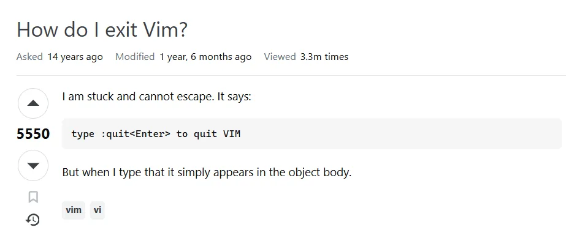</p>

Stack Overflow 上“如何退出 Vim”的帖子，14 年里被浏览了 330 万次，平均每天都有 600 人浏览

如果要讲解 `vim` 编辑器的完整用法，恐怕文章的长度会比本篇教程的全文还长很多，因此这里只会介绍最基础、最核心的用法。

**打开文件**

要使用 `vim` 编辑器，首先使用 `vim [待编辑文件路径]` 打开想要编辑的文件，例如 `vim test.txt` 。 `vim` 编辑器有 3 个主要模式，打开文件后默认进入的是普通模式：

| 模式                     | 主要用途                     | 进入方式                           |
| ------------------------ | ---------------------------- | ---------------------------------- |
| 普通模式（Normal）       | 移动光标、删除、复制、粘贴等 | 启动后默认进入；按 ESC 返回        |
| 插入模式（Insert）       | 输入和修改文本               | 普通模式下按 i                     |
| 命令模式（Command-line） | 保存、退出、查找、替换等     | 普通模式下输入 `:`（即 SHIFT + ;） |

**编辑文件**

在普通模式下，并不能输入和修改文本，需要先按 i 进入插入模式，此时左下角显示 `--INSERT--` 。进入插入模式后就是熟悉的编辑方式了，键盘输入文本，回车换行，方向键和 HOME END 移动光标位置。

**保存文件和退出**

当完成编辑后，按 ESC 键退出插入模式到普通模式，此时左下角 `--INSERT--` 消失。然后输入英文冒号 `:`（即 SHIFT + ;）进入命令模式，此时左下角出现冒号开头的命令键入框。与保存文件相关的命令如下：

- `:w` ：保存不退出
- `:wq` ：保存并退出 **（这个常用）**
- `:q` ：退出，文件有未保存修改时会拒绝
- `:q!`：强制退出，文件有未保存修改时丢弃

在冒号开头的命令键入框输入命令后，按回车键执行就可以了。至此，你已经学会了 `vim` 最基础的使用方式，现在至少不会退出不了编辑器了。下面是一个完整流程的演示：

<p align="center"></p>

vim 完整流程演示

**其他常用功能**

有一些功能很简单且实用，在这里一并介绍了。

在普通模式时（按 ESC 退出到普通模式），输入 `/` 来进行搜索，输入 `/字符串` 来搜索指定字符串。然后进入命令模式（在普通模式输入 `:`），可以使用以下命令开启和跳转行号：

- `:set number` ：开启行号显示
- `:行号` ：跳转到指定行号

<p align="center"></p>

vim 其他常用功能

**（2） `nano` 编辑器**

`nano` 编辑器虽然相对于 `vim` 只能算一个小弟，但是操作逻辑很直观，上手难度很低，同时完全足够满足基本编辑任务。我个人更喜欢 `nano` ，不到万不得已不会使用 `vim` 。

**打开文件**

一样的，要使用 `nano` 编辑器，首先使用 `nano [待编辑文件路径]` 打开想要编辑的文件，例如 `nano test.txt` ，另外可以使用 `-l` 参数开启行号，例如 `nano -l test.txt` 。

打开文件后 `nano` 编辑器会直接在底部显示常用功能的快捷键。

**编辑文件**

`nano` 编辑器的操作逻辑很直观，打开后直接就是编辑模式，键盘输入文本，回车换行，方向键和 HOME END PGUP PGDN 移动光标位置。

**保存文件和退出**

当完成编辑后，使用快捷键 Ctrl + S （老版本是 `Ctrl` + `O` ）保存文件，然后使用 Ctrl + X 退出编辑器。至此，你已经学会了 `nano` 最基础的使用方式，下面是一个完整流程的演示：

<p align="center"></p>

nano 完整流程演示

**其他常用功能**

打开文件后 `nano` 编辑器会直接在底部显示常用功能的快捷键，其中 `^` 符号代表着 CTRL 键，因此我也不需要再赘述了。

---

### 1.7 特殊符号

在 Linux 命令行中，有许多符号有特殊的功能，本节将会介绍最核心的几个功能：

- **通配符：** 用一个模式同时匹配多个符合条件的文件或目录。
- **重定向：** 改变命令输入或输出的来源和去向。
- **命令连接：** 把多个命令组合起来执行。
- **变量：** 声明变量来临时储存数据，便于数据复用。
- **引号：** 将一段内容作为整体，并控制其中某些特殊内容是否被解释。
- **转义：** 让原本具有特殊作用的字符变成普通字符。

#### 1.7.1 通配符

通配符用于按照一定的规律匹配文件或目录的名称。Shell 中最常用的通配符有：

- `*` ：匹配任意数量的任意字符，包括零个字符
- `?`：匹配任意一个字符
- `[...]` ：匹配方括号中指定的任意一个字符

通配符会被 Shell 展开为具体的内容，因此可以和命令一起合用。例如 `echo ./*.json` 可以打印出当前目录下的所有 JSON 文件名。

**（1）任意数量任意字符 `*`**

示例匹配：

- 可以被 `*.txt` 匹配的示例
  - `file.txt`
    - `123.txt`
- 可以被 `.*.txt` 匹配的示例
  - `.file.txt`
    - `.123.txt`
- 可以被 `checkpoint*.ckpt` 匹配的示例
  - `checkpoint01.ckpt`
    - `checkpoint_latest.ckpt`
- 可以被 `cache*` 匹配的示例
  - `cache.bin`
    - `cache-file.txt`

**需要注意，默认情况下如果文件名以 `.` 开头，匹配模式也需要显式写出开头的 `.`**

**（2）一个任意字符 `?`**

示例匹配：

- 可以被 `?.txt` 匹配的示例
  - `1.txt`
    - `a.txt`
- 可以被 `img_??.png` 匹配的示例
  - `img_00.png`
    - `img_aa.png`
- 可以被 `archive.tar.gz.part?` 匹配的示例
  - `archive.tar.gz.part1`
    - `archive.tar.gz.part9`

**（3）指定的字符 `[...]`**

示例匹配：

- 可以被 `[ab].json` 匹配的示例
  - `a.json`
    - `b.json`
- 可以被 `img_[0-9].png` 匹配的示例
  - `img_0.png`
    - `img_9.png`
- 可以被 `[0-9a-fA-F][0-9a-fA-F]` 匹配的示例
  - `60`
    - `1b`
    - `ef`

#### 1.7.2 重定向

重定向用于改变命令从哪里读取输入，以及把输出发送到哪里。Shell 中最常用的重定向符号有：

- 重定向输入：
  - `<` ：从文件中读取 **标准输入 (stdin)**
- 重定向输出：
  - `>` ：将 **标准输出 (stdout)** 写入文件，原有内容会被覆盖
    - `>>` ：将 **标准输出 (stdout)** 追加到文件末尾
    - `2>` ：将 **标准错误 (stderr)** 写入文件，原有内容会被覆盖
    - `2>>` ：将 **标准错误 (stderr)** 追加到文件末尾

**（1）重定向输入**

我们用以下 Python 程序 `mul.py` 举例，它从标准输入获得两个数字然后输出相乘结果，代码就三行：

```python
a = int(input())
b = int(input())
print(a * b)
```

我们正常使用 `python mul.py` 运行时，需要用键盘输入内容来发送给程序。而通过 `<` 符号，就可以直接从文件里读取数据作为标准输入发送给程序了。例如有一个文件 `input.txt` 内容如下：

```text
8
9
```

然后我们通过命令 `python3 mul.py < input.txt` 直接将文件内容发送给程序，此时程序就不会等待用户输入，而是直接输出结果：

```text
72
```

**（2）重定向输出**

我们用以下 Python 程序 `test.py` 举例，它首先正常输出消息到标准输出，然后会由于 `assert False` 崩溃：

```python
print("this is a message to stdout")
assert False, "this is a message to stderr"
```

Shell 中，标准输出和标准错误都会打印到终端上，所以我们用 `python3 test.py` 运行时，会看到以下输出，第一行是正常输出，后面全是报错：

```text
this is a message to stdout
Traceback (most recent call last):
  File "/home/chriskim/test.py", line 2, in <module>
    assert False, "this is a message to stderr"
           ^^^^^
AssertionError: this is a message to stderr
```

然后我们通过命令 `python3 test.py > output.txt 2> error.txt` 将输出内容导出到文件时，此时终端里就不会显示任何消息了，但是我们查看生成的 `output.txt` 和 `error.txt` 两个文件，可以发现它们的内容分别为：

```text
this is a message to stdout
```

```text
Traceback (most recent call last):
  File "/home/chriskim/test.py", line 2, in <module>
    assert False, "this is a message to stderr"
           ^^^^^
AssertionError: this is a message to stderr
```

#### 1.7.3 命令连接

命令连接用于将多个命令组合在一起执行。Shell 中最常用的命令连接符号有：

- 连续执行：
  - `;`：依次执行多个命令
    - `&&` ：前一个命令执行成功时，才执行后一个命令
    - `||` ：前一个命令执行失败时，才执行后一个命令
- 管道符号：
  - `|` ：将前一个命令的 **标准输出（stdout）连接到后一个命令的标准输入（stdin）**

**（1）连续执行**

三种连续执行符号都是从左到右执行命令，只不过通过成功和失败（返回码）来控制是否执行。直接举例说明：

```bash
# 从左到右依次执行，不管成功或者失败
mkdir test; cd test; touch hello.txt

# 从左到右依次执行，只有成功才继续，无论在哪失败执行链就会断开
mkdir test && cd test && touch hello.txt

# 前一个命令失败后才会执行后面的命令
cd non-exist-dir || echo "无法进入目录"
```

**（2）管道符号**

管道符号是一个非常实用的特殊符号，它把前面一个命令的 **输出** 连接到后面一个命令的 **输入** ，因此通过管道符号能完成更复杂的事情。例如我们可以将现在已经学过的命令组合一下：

- `ll | head -n 50` ：使用 `ll` 列出目录并只看前 50 行
- `cat access.log | head -n 50 | tail -n 25` ：查看 `access.log` 的第 26~50 行

需要注意的是，管道符号 **并不是** 前面一个命令全部处理完后下一个命令才开始处理。相反的，所有命令同时启动，只要上一个命令有了输出就会交给下一个命令， **像流水线一样** 。因此，管道符号若中间的命令报错退出，也不会停止后续的命令，只是后续命令再也收不到输入了。

**（3）优先级**

到这里，可能有些读者已经开始想 `a | b && c || d` 这种奇怪命令的执行优先级了，但是我认为搞这种难以阅读的离谱命令除了出考题外就没有价值，因此我不建议把各种连接符号混在一起用。如果确有复杂需求，写脚本比写一长串连在一起的命令要好。

不过为了完整性，我还是简单提一下优先级。连接符的优先级为 `|` > `&&` = `||` > `;`，唯一需要注意的就是 `&&` 和 `||` 是完全平级的，从左向右结合。

#### 1.7.4 变量

使用变量临时储存数据，便于数据复用。Shell 中与变量最常见的写法有：

- `=` ：为变量赋值
- `$变量名` 或 `${变量名}` ：读取变量的值

**（1）设置变量**

在 Bash 中，可以直接使用 `变量名=值` 创建变量，例如 `os=linux`

需要注意， `=` 两侧 **不能随意添加空格** ，如果写成 `os = linux` ，那么它就会被理解成执行名为 `os` 的命令，并将 `=` 和 `Linux` 作为参数，完全不是我们想要的行为。

变量名通常由 **字母、数字和下划线** 组成，但不能以数字开头：

- 正确：
  - `name=Linux`
    - `user_name=ChrisKim`
    - `version2=Ubuntu`
- 错误
  - `2version=Ubuntu`

**（2）读取变量**

在变量名前添加 ` 即可读取变量的值，例如使用 `echo $os` 就会打出我们刚才设定的值 `linux` 了。需要注意只有读取需要加 ` 符号，赋值（和后面的删除）都不需要。

有时候我们希望把变量和其他字符串连在一起，为了防止分不清界限，也可以用带括号的写法，如 `echo ${os}` ，它的效果和不带括号是一样的，只不过这样你就可以写 `echo ${os}system` 这样的命令，它会输出 `linuxsystem` 这样连起来的字符串。

**（3）删除变量**

使用 `unset` 可以删除变量，如 `unset os` 。

#### 1.7.5 引号

引号用于将一段内容作为一个整体，并控制 Shell 是否继续解释其中的特殊字符。Shell 中最常用的引号有：

- `'...'` ：单引号，其中的内容基本都按普通字符处理
- `"..."` ：双引号，其中的大部分内容按普通字符处理，但变量等仍然可以展开

例如如果有一个目录名称叫 `My File` ，它包含空格，直接打 `cd My File` 的话，目录名就被空格分开了导致无法正常进入，此时用引号扩起 `cd 'My File'` 就能正常进入了。

**（1）单引号**

单引号中的内容基本都按普通字符处理，无论变量还是特殊符号，写什么就是什么。例如以下命令中单引号中的特殊字符都会 **原样解释** ：

- `echo '*.txt'` ：直接输出字符串 `*.txt` 而不是匹配的内容
- `echo 'this is ${os} system'` ：直接输出字符串 `this is ${os} system` 而不是变量内容

**（2）双引号**

双引号中的内容大多都按普通字符处理，但是变量会被正常展开。例如以下命令中双引号中的特殊字符都会 **原样解释** ：

- `echo "*.txt"` ：直接输出字符串 `*.txt` 而不是匹配的内容
- `echo "<>|*?"` ：直接输出字符串 `<>|*?`

但是双引号中的变量会被 **正常展开** ：

- `echo "$os"` ：输出变量的值 `linux`
- `echo "this is ${os} system"` ：输出字符串 `this is linux system`

在 **变量** 的实际使用中，建议永远将其 **双引号扩起** ，否则可能出现 **很恐怖的操作失误** 。看到下面的例子：

path="/home/chriskim/project data/test project"

rm -rf $path

\# 执行上一行命令后，Shell 将会展开变量，变成

rm -rf /home/chriskim/project data/test project

\# 此时路径已经被空格裂开了，rm 会尝试删除掉 /home/chriskim/project 和./data/test 和./project，假如正好有这些文件，那就是非常恐怖的误删失误了

\# 如果将变量双引号扩起，就能避免该问题

rm -rf "$path"

\# 此时路径仍然作为一个整体来执行

rm -rf "/home/chriskim/project data/test project"

path="/home/chriskim/project data/test project" rm -rf $ path" # 此时路径仍然作为一个整体来执行 rm -rf "/home/chriskim/project data/test project"

```bash
path="/home/chriskim/project data/test project"
rm -rf $path

# 执行上一行命令后，Shell 将会展开变量，变成
rm -rf /home/chriskim/project data/test project
# 此时路径已经被空格裂开了，rm 会尝试删除掉 /home/chriskim/project 和 ./data/test 和 ./project，假如正好有这些文件，那就是非常恐怖的误删失误了

# 如果将变量双引号扩起，就能避免该问题
rm -rf "$path"
# 此时路径仍然作为一个整体来执行
rm -rf "/home/chriskim/project data/test project"
```

#### 1.7.6 转义

有时我们就是想在命令里用特殊符号的字面意思，就可以用反斜杠 `\` 转义。

例如我们想创建一个名为 `*.txt` 的文件，就可以使用 `touch \*.txt` ，要删除他使用 `rm \*.txt` （如果掉了转义符，那就会把目录下所有 `.txt` 文件删掉咯）。空格也是可以转义的，例如如果想创建一个带空格的目录，也可以这样写命令 `mkdir My\ File`

当然，引号也能起到转义的作用，怎么方便怎么用就行了。

---

### 1.8 用户和权限

#### 1.8.1 用户和用户组

Windows 系统虽说也是一个多用户系统，但是平时我们大多都是单用户使用的。在 Linux 中则不同了，即使用户只有一个人，我们也会常常接触它的用户相关操作。

在 Linux 中，每个用户都有自己的用户名，同时还会对应一个唯一的数字编号，称为 UID（User ID）。例如，普通用户可能叫 `chriskim` ，而 `root` 用户的 UID 固定为 `0` 。

除了用户之外，Linux 还有用户组（group）。用户组可以把多个用户归为一组，从而方便统一分配权限。每个用户默认属于同名用户组，也可以添加更多其他用户组。用户组同样有自己的数字编号，称为 GID（Group ID）。

相关的查询命令如下：

- `whoami` ：查询当前用户的用户名
- `id` ：查询当前用户的完整信息
- `groups` ：查询当前用户的所属组

<p align="center">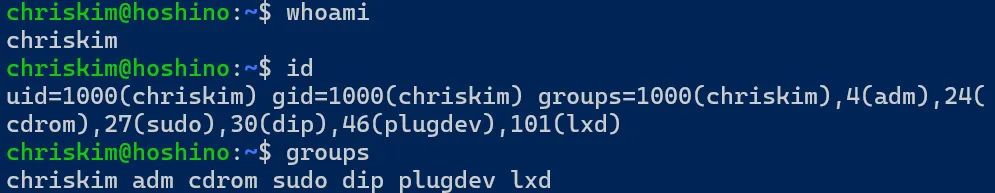</p>

whoami, id, groups 命令演示

另外还有一些用户相关的常用命令：

- **命令：** `passwd` （意为 password）
- **用途：** 修改用户密码
- **核心参数：**
  - 位置参数：留空则默认修改自己密码，给定用户名则修改其他用户的密码（改别人密码要权限）
- **命令：** `su` （意为 switch user）
- **用途：** 切换用户，需要目标用户的密码才能切换（超级用户可直接切换）
- **核心参数：**
  - 位置参数：想要切换的目标用户名
    - `-` 或 `-l` ：以登录 Shell 的方式切换

#### 1.8.2 root 和 sudo

Linux 中有一个特殊用户叫做 root，也称为超级用户（superuser）。root 拥有系统中的最高权限，几乎可以读取、修改和删除所有文件，也可以修改系统配置、安装软件以及管理其他用户。root 用户的 UID 固定为 `0` 。

由于 `root` 用户的权限实在是太高，在执行命令时如果出现操作失误，很可能破坏整个系统。为了安全，一般来说我们都使用普通用户来操作系统，仅在需要时才临时提权到 `root` ，此时就需要 `sudo` 命令。

另外， `sudo` 命令也不是所有用户都能使用的，而是通过配置文件赋予特定用户 `sudo` 权限才可使用，以此实现更精细的权限管理。使用 `sudo` 命令需要输入 **当前用户** 的密码。

- **命令：** `sudo` （意为 superuser do）
- **用途：** 提权到超级用户来执行，需要当前用户有 `sudo` 权限
- **核心参数：**
  - 位置参数：待执行的命令
    - `-i` ：直接进入 `root` 的 Shell

例如，如果我们要在 `/` 下创建新目录 `mkdir /test` ，这个操作是需要权限的，普通用户显示权限不足（Permission denied），那么就可以使用 `sudo mkdir /test` 来完成创建，该命令的含义是让 `root` 用户帮你执行 `mkdir /test` 命令。

如果要执行的操作比较复杂，可以用 `sudo -i` 直接切换到 `root` 的 Shell，这样就相当于成为了 `root` 用户。要返回普通用户，使用 `exit` 退出即可。

#### 1.8.3 对象的所有者和所属组

Linux 中，每个对象都有一个所有者（owner）和一个所属组（group）。系统会结合它们和文件的权限设置，判断不同用户能否读取、修改或执行这个文件。

**（1）查看对象的所有者和用户组**

使用已经学习过的 `ls -l` 命令（或 `ll` 别名）来查看对象的详细信息。如下图，第四列代表着文件的所有者（所属用户），第五列代表着文件的所属组：

<p align="center"></p>

对象的详细信息

**（2）修改对象的所有者和用户组**

- **命令：** `chown` （意为 change owner）
- **用途：** 修改对象的所有者和用户组
- **核心参数：**
  - 位置参数 1：目标值，格式为 `所有者:用户组` ，用户组可省略，省略时代表不修改
    - 位置参数 2：待修改的对象路径
    - `-R` ：递归修改目录内的对象

下面是使用示例：

```bash
chown alice test.txt     # 将 test.txt 的所有者改为 alice，所属组不改
chown alice:stu test.txt # 将 test.txt 的所有者改为 alice，所属组改为 stu 组
chown :stu test.txt      # 将 test.txt 的所有者不改，所属组改为 stu 组
chown alice dir/         # 将 dir/ 的所有者改为 alice，所属组不改
chown -R alice dir/      # 将 dir/ 以及里面的所有内容的所有者改为 alice，所属组不改
chown -R alice:stu dir/  # 将 dir/ 以及里面的所有内容的所有者改为 alice，所属组改为 stu 组
```

#### 1.8.4 对象的权限

**（1）查看对象的权限**

使用已经学习过的 `ls -l` 命令（或 `ll` 别名）来查看对象的详细信息。如下图，第一列代表着文件的权限：

<p align="center"></p>

对象的详细信息

第一列的权限的显示格式如下：

```text
-rwxrwxrwx
││  │  │
││  │  └─ 7~9位：其他用户（others）的权限
││  └──── 4~6位：所属组（group）的权限
│└─────── 1~3位：所有者（user）的权限
└──────── 第0位：文件类型，-为普通文件，d为目录
```

其中，代表权限的最小单位是形为 `rwx` 的三位字符串，含义如下：

- `r` ：读取（read）
- `w` ：写入（write）
- `x` ：执行（execute）
- `-` ：没有对应权限

接下来举几个例子：

- `rwxrwxrwx` ：所有者、所属组、其他用户都可读、可写、可执行
- `rwxr-xr-x` ：所有者可读、可写、可执行，所属组和其他用户可读、可执行
- `rw-r--r--` ：所有者可读、可写，所属组和其他用户可读
- `rw-------` ：所有者可读、可写，所属组和其他用户没有任何权限

**（2）对象权限的含义**

对于文件和目录，对象权限的含义是不同的。对于文件：

- `r` ：能否读取该文件内容
- `w` ：能否修改该文件内容
- `x` ：能否运行该文件

对于目录：

- `r` ：是否能列出该目录下的内容
- `w` ：是否能修改目录中的对象列表，例如创建、删除和重命名对象（和对象内容无关）
- `x` ：是否能进入该目录

这里最需要注意的是目录的权限，目录一定要有 `x` 权限才可以进入，多层目录只要其中有一层目录没有 `x` 就会导致进不去：例如 `/a/b/c` 如果 `b` 目录没有 `x` 权限，那么 `c` 目录都是进不去的。

**（3）修改对象的权限**

- **命令：** `chmod` （意为 change mode）
- **用途：** 修改对象的权限
- **核心参数：**
  - 位置参数 1：权限目标值，格式见下文
    - 位置参数 2：待修改的对象路径
    - `-R` ：递归修改目录内的对象

该命令的权限目标值格式有点复杂，主要分为两种：数字形式、字母形式。

**数字形式**

数字形式适合一次性指定完整的权限。

将每一个形为 `rwx` 的三位字符串看作一个二进制数字，有该权限则为 `1` ，没有对应权限则为 `0` ，那么每种权限组合都对应一个二进制数字，也对应一个十进制数字：

| 权限  | 二进制 | 八进制 |
| ----- | ------ | ------ |
| `---` | 000    | 0      |
| `--x` | 001    | 1      |
| `-w-` | 010    | 2      |
| `-wx` | 011    | 3      |
| `r--` | 100    | 4      |
| `r-x` | 101    | 5      |
| `rw-` | 110    | 6      |
| `rwx` | 111    | 7      |

那么形如 `rwxrwxrwx` 的权限格式就能用三个十进制数字来表示了，例如以下对应关系：

- `rwxrwxrwx` ：777
- `rwxr-xr-x` ：755
- `rw-r--r--` ：644
- `rw-------` ：600

通过该格式修改对象权限的示例如下：

```bash
chmod 777 dir/    # 将 dir/ 权限设为 rwxrwxrwx
chmod 755 -R dir/ # 将 dir/ 和里面所有内容的权限设为 rwxr-xr-x
chmod 644 a.md    # 将 a.md 权限设为 rw-r--r--
chmod 600 privkey # 将 privkey 权限设为 rw-------
```

**字母形式**

字母形式适合对权限进行增减

首先通过下面几个字母指定要修改哪一类用户的权限：

- `u` ：所有者
- `g` ：所属组
- `o` ：其他用户
- `a` ：所有用户

然后使用符号代表操作类型：

- `+` ：增加权限
- `-` ：移除权限
- `=` ：直接设置为指定权限

权限仍然使用：

- `r` ：读取
- `w` ：写入
- `x` ：执行

通过该格式修改对象权限的示例如下：

```bash
chmod u+x main             # 给 main 添加所有者的 x 权限
chmod a-x main             # 给 main 移除任何人的 x 权限
chmod u=rwx,g=rw,o=rw main # 给 main 设置为 rwxrw-rw- 权限
```

**（4）常用对象权限**

对于 8\*8\*8=512 中对象权限组合，常用的权限组合很少，下面介绍 5 种最常用的几种组合：

| 权限组合    | 八进制 | 常用场景                 |
| ----------- | ------ | ------------------------ |
| `rwxrwxrwx` | 777    | 大门敞开，非常危险但方便 |
| `rwxr-xr-x` | 755    | 普通目录或可执行文件     |
| `rwx------` | 700    | 私密目录                 |
| `rw-r--r--` | 644    | 普通文件                 |
| `rw-------` | 600    | 私密文件                 |

---

### 1.9 软件包管理

在 Windows 中，我们通常会前往软件官网下载安装程序，再手动完成安装和卸载。而在 Linux 中，更常见的方式是通过软件包管理器统一管理软件，当然也可以选择手动安装。

不同 Linux 发行版的软件包格式和软件包管理器是不同的，Ubuntu 使用的软件包格式主要为 `.deb` ，默认软件包管理命令是 `apt` 。通过 `apt` ，我们可以从软件包仓库中搜索、下载、安装、升级和卸载软件，同时自动处理软件之间的依赖关系。

#### 1.9.1 软件包仓库和配置镜像

Ubuntu 的软件存放在统一的软件包仓库中，而并非分散在各个软件开发者的网站上。当进行软件安装时， `apt` 将会从系统配置好的软件包仓库中查找并下载对应的软件包。

由于 Ubuntu 官方的软件包服务器可能距离我们较远，因此实际使用时经常会使用镜像（如果你有魔法那就无所谓了）。镜像服务器会同步官方软件包仓库中的内容，并部署在不同地区，从而提高软件下载速度。在中国大陆常用的镜像有：

- 清华大学镜像站： [https://mirrors.tuna.tsinghua.edu.cn/](https://mirrors.tuna.tsinghua.edu.cn/)
- 南京大学镜像站： [https://mirror.nju.edu.cn/](https://mirror.nju.edu.cn/)
- 校园网联合镜像站： [https://mirrors.cernet.edu.cn/](https://mirrors.cernet.edu.cn/)
- 阿里云镜像站： [https://developer.aliyun.com/mirror/](https://developer.aliyun.com/mirror/)

接下来将会介绍配置镜像站的方式，当前正处于 Ubuntu 镜像配置文件新老交替的时期，因此当前有两种配置文件的格式同时在使用。我们先介绍最新的配置格式（DEB822 格式），从 Ubuntu 24.04 LTS 开始将会使用这种配置格式。

**（1）新版配置格式** （DEB822 格式）

新版软件包仓库配置文件位置在： `/etc/apt/sources.list.d/ubuntu.sources`

使用自己习惯的文件编辑器（例如 `vim` 、 `nano` ）打开它，删除其中的内容后粘贴新配置即可。替换内容一般在各大镜像站的文档里会帮忙写好，例如下图的 TUNA 镜像站。选好对应的 Ubuntu 版本后，复制镜像站提供的配置文件即可。

<p align="center">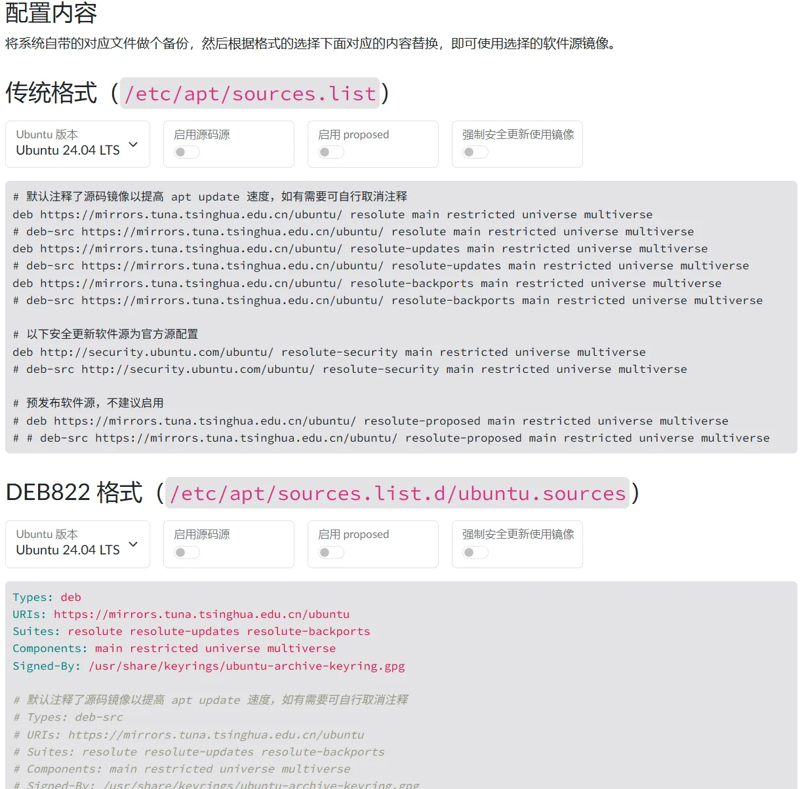</p>

清华 TUNA 镜像站的文档示例

当然，在修改软件源时，建议把原始软件源配置文件复制备份一份为 `ubuntu.sources.bak` ，以备不时之需。

**（2）传统格式**

传统格式软件包仓库配置文件位置在： `/etc/apt/sources.list`

使用自己习惯的文件编辑器（例如 `vim` 、 `nano` ）打开它，删除其中的内容后粘贴新配置即可。各大镜像站同样也会提供对应的配置文件。

#### 1.9.2 安装软件包

**（1）刷新软件包列表**

Ubuntu 会在本地保存一份软件包索引，其中记录了软件仓库中有哪些软件包、对应版本以及依赖关系等信息。因此为了每次能找到最新的软件包，在安装前首先要刷新一次软件包列表，使用以下命令：

```bash
sudo apt update
```

**（2）安装软件包**

接着就可以安装软件包了，下面是几个命令示例：

```bash
sudo apt install curl           # 安装 curl 软件包，需要手动确认
sudo apt install curl -y        # 安装 curl 软件包，无需确认
sudo apt install curl wget htop # 安装 curl wget htop 软件包，需要手动确认
```

例如我们以安装 `build-essential` 软件包为例，完整流程如下：

<p align="center"></p>

apt 安装演示

**（3）搜索软件包**

有时我们并不知道想要的软件包具体叫什么名字，就可以使用搜索功能通过关键词查询所有相关软件包。

例如我们想安装 `openjdk` ，但不知道具体有哪些版本，软件包叫什么，就可以执行 `apt search openjdk` 命令搜索所有相关软件包。

#### 1.9.3 升级软件包

软件包是会不断更新的，软件包管理器可以非常方便的进行更新，使用命令 `sudo apt upgrade` 来更新所有软件包。

#### 1.9.4 卸载和清理软件包

**（1）列出已安装的软件包**

如果要查询已经安装的软件包，使用 `apt list --installed` 命令。

**（2）卸载软件包**

如果要卸载已经安装的软件包，使用 `sudo apt remove 软件包名称` 命令，如果想卸载的同时清除配置，使用 `sudo apt purge 软件包名称` 命令。

**（3）清理无用依赖**

在我们安装软件包时， `apt` 会自动处理安装它的所有依赖，但是我们在卸载该软件包时，只有本体会被卸载，依赖不会卸载。如果要清理所有的无用依赖，可以使用命令： `sudo apt autoremove`

---

### 1.10 远程操作

对于 Windows 来说，最常使用方式是本地操作。而 Linux 系统常常工作在机房的服务器中，显然我们不可能搬个显示器在机房里操作，因此远程操作和本地操作对于 Linux 来说同样常用和重要。

Linux 中最常用的远程操作方式是 SSH（Secure Shell）。通过 SSH，我们可以在自己的电脑上连接到另一台 Linux 主机，在远程主机上执行命令，也可以在两台主机之间传输文件。

Windows 10/11、Linux 和 macOS 都已经可以直接使用 SSH 客户端，因此通常不需要额外安装软件。同时我也非常建议初学者首先从最原始的 SSH 命令开始使用 Linux，在熟悉 Linux 后再选择更加强大的图形化 SSH 客户端。

#### 1.10.1 远程连接

注意，这个命令是本地电脑命令行执行哦，是从本地远程到远程 Linux 计算机。

- **命令：** `ssh`
- **用途：** 通过 SSH 连接远程主机
- **核心参数：**
  - 位置参数：目标主机，格式为 `用户名@主机地址`
    - `-p` ：指定 SSH 端口，若为默认端口 `22` 时可省略

例如，如果我的用户名为 `chriskim` ，要连接地址为 `192.168.6.122` 的 Linux 计算机，端口默认，则使用以下命令：

```bash
ssh chriskim@192.168.6.122
```

SSH 第一次连接一台陌生的计算机时，会显示该主机的 SSH 密钥指纹，并询问是否信任这台主机。确认连接的地址无误后，输入 `yes` 并回车即可。随后输入远程用户的密码，就可以进入服务器。

<p align="center">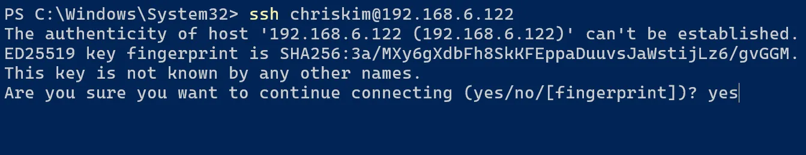</p>

ssh 第一次连接时的询问

远程操作完成后，使用 `exit` 即可退出远程 Shell，返回本地计算机。另外需要注意的是，只要 SSH 连接断开，在 Shell 里运行的普通任务 **都会被终止** ，下文 2.5 节会详细介绍这一点以及提供解决方案。

#### 1.10.2 文件传输

连接到远程服务器后，我们还经常需要在本地和远程主机之间传输文件。最简单的方式之一是使用 `scp` （secure copy），注意这个命令也是本地电脑命令行执行哦。

- **命令：** `scp` （意为 secure copy）
- **用途：** 通过 SSH 在本地计算机和远程主机之间传输文件
- **核心参数：**
  - 位置参数 1：原始对象路径
    - 位置参数 2：目标对象路径
    - `-r` ：递归传输目录
    - `-P` ：指定 SSH 端口，若为默认端口 `22` 时可省略

`scp` 的使用方式和之前学习过的 `cp` 很相似，区别在于， `scp` 可以通过以下格式来指定远端的路径 `用户名@主机地址:路径` ，下面是一些远程路径的示例：

```text
chriskim@192.168.6.122:/data/my-project
chriskim@192.168.6.122:~/test.txt
root@192.168.1.100:/data/archive.tar.gz
```

通过指定远端路径，就可以完成文件传输（上传和下载）了，用法几乎和 `cp` 一致，示例如下：

```bash
scp chriskim@192.168.6.122:~/test.txt .             # 把远程计算机的 test.txt 文件下载到本地
scp -r chriskim@192.168.6.122:/data/my-project D:\  # 把远程计算机的 /data/my-project 目录下载到本地 D 盘
scp D:\archive.zip root@192.168.1.100:/data         # 把本地 D 盘的 archive.zip 上传到远程计算机 /data 目录
scp -r D:\projects root@192.168.1.100:~             # 把本地 D 盘的 projects 目录上传到远程计算机用户家目录
```

### 1.11 目录结构

在 1.3 节，我们就了解了 Linux 有一套约定俗成的多层次目录结构，这一节我们将展开来介绍。熟悉 Linux 的目录结构后，在查找文件或者想要手动安装程序时，就会更加得心应手。

首先，需要注意的是 Linux 的目录结构并不是严格规定。也就是每个发行版的目录设计可能会有略微差异，但是总体来说是类似的。常见结构大致是：

```text
/
├── bin      常用命令
├── boot     启动相关文件
├── dev      设备文件
├── etc      系统配置
├── home     普通用户的家目录
├── lib      系统库文件
├── media    U盘、光盘等可移动设备挂载点
├── mnt      临时挂载目录
├── opt      第三方软件
├── proc     进程和内核信息
├── root     root 用户的家目录
├── run      系统运行时数据
├── sbin     系统管理命令
├── srv      服务提供的数据
├── sys      硬件和内核信息
├── tmp      临时文件
├── usr      大量程序、库和共享文件
└── var      日志、缓存等经常变化的数据
```

一下子记这么多还是有点晦涩，不如通过几个实际的场景来认识它们，初学者了解下面这些就够用了。

#### 1.11.1 挂载磁盘

Linux 中，硬盘、U 盘等设备通常可以在 `/dev` 下看到，例如：

```text
/dev/sda
/dev/nvme0n1
```

磁盘需要挂载到某个目录后才能访问（后文 2.7 节会介绍），常见的挂载位置有：

```text
/mnt
/media
```

其中 `/mnt` 常用于 **手动** 挂载， `/media` 常用于桌面系统 **自动** 挂载 U 盘、移动硬盘等设备。

#### 1.11.2 安装用户应用

普通用户自己的 **个人文件** 一般放在：

```text
/home/用户名
```

如果是手动安装的 **第三方软件** ，则经常会放在：

```text
/opt
/usr/local
```

其中 `/opt` 常用于存放相对独立的第三方软件， `/usr/local` 常用于用户或管理员自行安装的软件。

#### 1.11.3 系统安装的软件

通过系统包管理器安装的软件，大量文件会位于：

```text
/usr
```

其中比较常见的有：

```text
/usr/bin      可执行程序
/usr/lib      程序库
/usr/share    文档、图标等共享资源
```

此外还经常看到：

```text
/bin
/sbin
```

它们也主要用于存放系统命令。现代很多发行版中， `/bin` 和 `/sbin` 已经分别链接到 `/usr/bin` 和 `/usr/sbin` 。

#### 1.11.4 修改系统配置

Linux 中大量 **系统和软件配置文件** 都放在：

```text
/etc
```

例如：

```text
/etc/ssh
/etc/nginx
/etc/apt
```

以后看到 `/etc/...`，通常就可以判断这是某个系统或软件的配置。

#### 1.11.5 查看日志和程序数据

系统和软件运行过程中产生的数据经常放在：

```text
/var
```

其中最常见的是：

```text
/var/log      日志
/var/cache    缓存
/var/lib      程序数据
```

排查程序错误时，经常会接触到 `/var/log` 。

#### 1.11.6 临时存放文件

临时文件通常放在：

```text
/tmp
```

系统和程序也经常会在这里创建临时数据。

`/tmp` 中的内容可能会被系统自动清理，因此不适合长期保存重要文件。

#### 1.11.7 查看系统和硬件信息

还有几个比较特殊的目录：

```text
/proc    进程和内核运行信息
/sys     设备和内核相关信息
/dev     各种设备文件
```

这些目录中的很多内容并不是普通的硬盘文件，而是由系统动态提供的。

#### 1.11.8 系统启动文件

Linux 启动相关的文件一般位于：

```text
/boot
```

例如 Linux 内核、初始化文件和引导程序相关文件通常都在这里。

日常使用中一般不需要手动修改 `/boot` 中的内容，随意修改可能导致系统无法引导启动。

## 2. 常用功能

第 1 章介绍了使用 Linux 时必须了解的核心基础知识。这一章将继续介绍一些实际使用中非常常见的功能，不过它们是否需要学习因人而异。如果你认为完全用不到某个小节的内容，可以直接跳过。

另外，阅读第 1 章后读者应该已经对 Linux 初步熟悉了，因此从第 2 章开始，本教程的写作风格将会变得精简，倾向于直接用示例解释。

### 2.1 网络下载

本节将介绍三个工具 `wget` 、 `curl` 和 `aria2c` ， `wget` 最易用， `aria2c` 最强大，熟悉其中一种其实就够了。

#### 2.1.1 wget 下载

`wget` 设计出来偏向于下载文件这个需求，因此参数比较简单：

```bash
# 如果没有安装，请执行
sudo apt install wget -y
# 基本用法：下载到当前目录，并使用原文件名保存
wget https://example.com/file.zip
# -O：指定保存文件名
wget -O myfile.zip https://example.com/file.zip
# -P：下载到指定目录
wget -P /data/downloads https://example.com/file.zip
# -c：断点续传
wget -c https://example.com/file.zip
```

#### 2.1.2 curl 下载

`curl` 是一个通用的 HTTP 请求客户端，它有极多功能，当然也可以用来下载文件：

```bash
# 如果没有安装，请执行
sudo apt install curl -y
# 下载文件的基本用法：使用服务器上的原文件名保存
curl -O https://example.com/file.zip
# -o：自己指定文件名
curl -o myfile.zip https://example.com/file.zip
# -L：跟随重定向，很多下载链接都需要加
curl -L -O https://example.com/file.zip
# -C：断点续传
curl -L -C - -O https://example.com/file.zip
```

#### 2.1.3 aria2c 下载器

`aria2c` 是一个专业的下载工具，好比 Windows 上的 IDM 下载器，因此它有非常多下载相关的强化功能，尤其是最常用的并行下载。因此，如果要下载大文件建议使用它。

```bash
# 安装
sudo apt install aria2 -y
# 基本用法：下载到当前目录，并使用原文件名保存，另外默认开启断点续传
aria2c https://example.com/file.zip
# -x, -s：并行下载，x 参数代表单服务器最大连接数，s 参数代表把文件切成几段并行下载
aria2c -x 16 -s 16 https://example.com/file.zip
# -o：指定文件名
aria2c -o myfile.zip https://example.com/file.zip
# -d：指定保存目录
aria2c -d /data/downloads https://example.com/file.zip
```

---

### 2.2 打包和压缩

本节将介绍以下工具： `tar`, `zip`, `unzip`, `7z` 。

#### 2.2.1 tar 打包和压缩

`tar` 是一个打包工具，但它可以帮忙调用 `gzip`, `zstd` 等压缩工具实现打包+压缩。同时 `tar` 可以将 Linux 文件系统里的对象元数据储存（例如所有者、所属用户组、对象权限等），因此在 Linux 里 `tar` 是最地道的打包方式。

```bash
# 仅打包
tar -cvf archive.tar dir/
# 解包
tar -xvf archive.tar
# 打包+gzip压缩
tar -cvzf archive.tar.gz dir/
# 解包+gzip解压
tar -xvzf archive.tar.gz
```

这几个参数几乎永远都一起使用，因此可以直接背下来，它们的含义分别是：

- `c` ：创建归档
- `x` ：解包归档
- `v` ：显示正在处理的文件
- `z` ：使用 gzip 压缩/解压
- `f` ：后面紧跟归档文件名

另外，还有一些实用的高级用法可以了解：

```bash
# 1. 多线程 gzip 压缩
# tar 默认调用的 gz 压缩器仅支持单线程压缩，pigz 压缩器支持多线程，速度更快
# 首先确保安装了 pigz 这个软件包
sudo apt install pigz -y
# 然后压缩/解压时去除 -z 参数，使用 -I 指定压缩器为 pigz
tar -I pigz -cvf archive.tar.gz dir/
tar -I pigz -xvf archive.tar.gz

# 2. zstd 压缩
# zstd 是相比 gzip 更好的压缩算法，它更快，而且通常压缩率更高
# 首先确保安装了 zstd 这个软件包
sudo apt install zstd -y
# 然后压缩/解压时去除 -z 参数，使用 --zstd 指定使用 zstd 算法
tar --zstd -cvf archive.tar.zst dir/
tar --zstd -xvf archive.tar.zst
```

#### 2.2.2 zip 压缩

zip 可能是当前最流行的压缩格式了，因此也有必要了解怎么使用。

```bash
# 如果没有安装，请执行
sudo apt install zip unzip -y
# 压缩目录
zip -r archive.zip dir/
# 解压
unzip archive.zip
```

#### 2.2.3 7z 压缩

7z 是一个极为优秀的压缩格式，可以获得非常高的压缩率，不过它的缺点是压缩速度很慢。

```bash
# 如果没有安装，请执行
sudo apt install p7zip-full -y
# 压缩目录
7z a archive.7z dir/
# 解压
7z x archive.7z
```

---

### 2.3 文本处理补充

#### 2.3.1 文本统计

如果你有一个纯文本，需要统计它的长度和行数信息，可以使用 `wc` 命令。

- **命令：** `wc` （意为 word count）
- **用途：** 统计文本信息
- **核心参数：**
  - 位置参数：想统计文件的路径
    - `-l` ：只统计行数
    - `-w` ：只统计单词数
    - `-c` ：只统计字节数
    - `-m` ：只统计字符数

不加任何参数时， `wc` 默认统计行数、单词数、字节数，输出格式如下：

```text
[行数] [单词数] [字节数] [文件名]
```

#### 2.3.2 文本搜索

如果你希望在文本中搜索某个模式（pattern）， `grep` 是一个非常强大的工具。

- **命令：** grep（意为 global regular expression print）
- **用途：** 文本搜索
- **核心参数：**
  - 位置参数 1：搜索内容的正则表达式
    - 位置参数 2：想搜索文件的路径
    - `-i` ：忽略大小写
    - `-n` ：显示行号
    - `-r` ：递归搜索目录
    - `-v` ：显示不匹配的行
    - `-w` ：只匹配完整单词
    - `-F` ：按普通字符串匹配，不解析正则表达式
    - `-C 行数` ：显示匹配行前后各 n 行

`grep` 是一个强大的工具，因此参数非常多，上面我只挑选了最核心的参数，下面是一些示例。

```bash
grep "error" access.log             # 打印匹配（包含error）的行
grep -n "error" access.log          # 打印匹配（包含error）的行和行号
grep -r "error" logs/               # 递归搜索目录中的文件，打印匹配（包含error）的行
grep -v "debug" access.log          # 过滤匹配（包含debug）的行，打印剩下的行
grep -w "err" access.log            # 打印包含单词err的行，不会匹配error中的err
grep -F "192.168.1.100" access.log  # 将搜索内容视为普通文本而不是正则表达式（例如这里的.就不是正则表达式的语法了）
grep -C 2 "error" access.log        # 打印匹配（包含error）的行，并打印它的前2行和后2行
```

#### 2.3.3 文本替换

如果你希望在文本中替换某个字符串，可以使用 `sed` 命令，其查找部分默认按照正则表达式解释。

- **命令：** `sed` （意为 stream editor）
- **用途：** 文本编辑（常用于字符串替换）
- **核心参数：**
  - 位置参数 1：替换方式
    - 位置参数 2：想修改文件的路径
    - `-i` ：直接修改源文件，保存后不可恢复！

指定替换方式的位置参数 1 的最常用的用法如下：

```text
s/替换前字符串/替换后字符串/    # 将每一行中的第一个“替换前字符串”替换为“替换后字符串”
s/替换前字符串/替换后字符串/g   # 将每一行中的所有“替换前字符串”替换为“替换后字符串”
s!替换前字符串!替换后字符串!g   # 分隔符可以使用其他符号（如!#|@:），来防止与替换字符串冲突
```

默认情况下， `sed` 不编辑原文件而是将修改后的结果打印出来，如果需要直接落实修改则需要 `-i` 参数：

```bash
sed 's/Before/After/g' test.txt    # 将 test.txt 每一行的所有 Before 替换为 After，输出结果到终端
sed -i 's/Before/After/g' test.txt # 将 test.txt 每一行的所有 Before 替换为 After，直接修改原文件
```

---

### 2.4 符号链接和硬链接

#### 2.4.1 符号链接（又称软链接）

考虑以下场景：编写的代码中大量使用了绝对路径例如 `/mnt/disk_a/project_data` ，由于 `disk_a` 已满 `project_data` 目录必须移动到 `/mnt/disk_b/project_data` ，但是代码维护困难，不允许修改代码。该场景是不是看起来无解？了解完符号链接后这个问题就能轻松解决了。

符号链接相当于一个快捷方式，如果原始文件/目录是 a，那么创建一个符号链接 b 指向 a 后，通过 b 就可以直接访问到 a，如图所示：

<p align="center">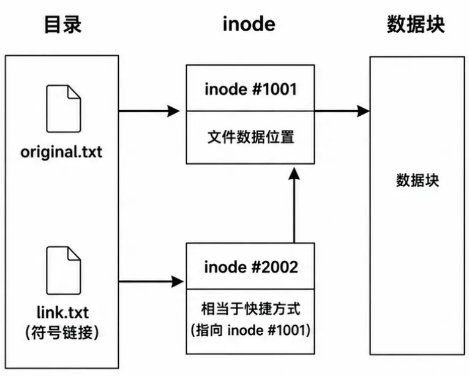</p>

符号链接示意图

通过 `ln` 命令就能创建符号链接，目录和文件均可： `ln -s 原对象 链接名`

```bash
# 创建符号链接 link.txt 指向 original.txt
ln -s original.txt link.txt
# 创建符号链接 ~/project 指向 /data/project
ln -s /data/project ~/project
```

需要注意的是，符号链接只相当于一个快捷方式，删除快捷方式当然不会影响原始文件，但是反过来删除（或移动）原始文件后，符号链接就会失效。

回到开头的场景，我们就可以放心地把数据先移走 `mv /mnt/disk_a/project_data /mnt/disk_b` ，然后创建符号链接即可解决 `ln -s /mnt/disk_b/project_data /mnt/disk_a/project_data` 。因为符号链接几乎不占储存空间，同时从程序眼里文件就仿佛真实地存在那里。

#### 2.4.2 硬链接

考虑以下场景：我希望两个“文件” `/data/a.txt` 和 `/data/b.txt` 的内容完全相同，并且无论编辑谁，都会同时作用于另一个文件，并且删除二者任意一个也不会影响另一个文件。假如没有最后一个删除限制，拿上面的符号链接就可以解决，但是如果要实现删除二者任意一个也不会影响另一个文件，得用到硬链接了。

硬链接和符号链接不同，它并不是一个“快捷方式”。创建硬链接后，两个文件名的地位完全相同，它们共同指向同一个 inode（文件数据节点），就仿佛两个 C 语言指针指向同一个对象。如图所示：

<p align="center">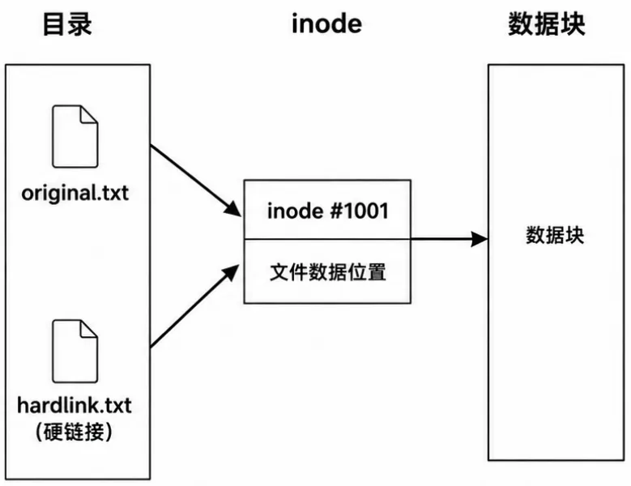</p>

硬链接示意图

Linux 会记录一个 inode 被多少个文件名引用，这个数量称为链接数。创建上述硬链接后，链接数为 2；删除 `original.txt` 或 `hardlink.txt` 中任意一个后，链接数变成 1，文件数据仍然存在。只有两个文件名都被删除后，链接数才会归零，文件数据才会被删除。

通过 `ln` 命令也能创建硬链接，只有 **同文件系统** 的 **文件** 可以创建硬链接： `ln 原对象 链接名`

```bash
# 创建硬链接 link.txt 指向 original.txt
ln original.txt link.txt
```

回到开头的场景，我们创建硬链接即可解决： `ln /data/a.txt /data/b.txt` 。另外，硬链接是不会消耗多倍存储空间的，文件只会被储存一遍。

---

### 2.5 后台任务和终端复用器

在一个 Shell 中，运行一个命令后它就独占了整个 Shell，如果这个命令很耗时，那此时就无法再运行第二个命令了。此时，我们有多种解决方案，分别是 Linux 传统的前后台任务机制以及更为强大易用的终端复用器。此外，本节还会提供“SSH 断开后运行的任务被终止”的解决方案。

#### 2.5.1 传统后台任务管理

需要承认的是，现在大家用的更多的还是终端复用器这种强大的工具，而不是传统的后台任务管理。但是为了教程完整性，我还是在这里简单分享一下。

**（1）将前台任务挂到后台**

假如运行了一个极为耗时的命令：

```bash
sleep 3600
```

此时希望将其切到后台，让开 Shell，那么可以按键盘快捷键 Ctrl + Z 。此时 Shell 会弹出提醒，代表着命令已经被挂到后台，同时 **已经被暂停了** ：

```text
[1]+  Stopped                 sleep 3600
```

如果我们希望在后台它继续运行，需要使用命令：

```bash
bg
```

此时 Shell 会弹出提醒，代表挂到后台的任务重新开始在 **后台运行** 了：

```text
[1]+ sleep 3600 &
```

**（2）直接新建后台任务**

如果你已经知道一个命令很耗时，打算直接把它挂到后台，那么可以在命令的末尾添加 `&` 符号，代表直接新建后台任务：

```bash
sleep 1800 &
```

此时，执行完命令后它就直接进入后台并继续运行了，不会占用 Shell，同时会弹出提醒：

```text
[2] 21638
```

**（3）将后台任务取回前台**

若要将后台任务取回前台，可以使用命令：

```bash
fg
```

如果此时有多个后台任务，默认取回最近一个。也可以通过序号来指定，首先用命令列出所有后台任务：

```bash
jobs
```

会以列表打印出所有后台任务和任务的状态：

```text
[1]   Running                 sleep 3600 &
[2]-  Running                 sleep 1800 &
[3]+  Stopped                 sleep 2400
```

然后使用 `%序号` 来指定要取回前台的后台任务：

```bash
fg %1 # 取回任务1
fg %2 # 取回任务2
fg %3 # 取回任务3
```

#### 2.5.2 不被挂断的任务

对于普通任务，当 SSH 或者 Shell 关闭时，任务都会收到来自 Shell 的 `SIGHUP` 信号而被终止。如果希望任务在 SSH 或者 Shell 关闭时继续正常运行，就需要 `nohup` 命令了。

在命令前添加 `nohup` 即可创建不被挂断的任务：

```bash
nohup python train.py
```

如果希望直接创建不被挂断的后台任务，可以使用：

```bash
nohup python train.py &
```

如果希望把任务的输出导出保存为文件，可以使用下面的写法（最常见的组合）：

```text
nohup python train.py >train.log 2>&1 &
                      │          │    └─ 挂到后台
                      │          └────── 将 stderr 写入 stdout（即 train.log）
                      └───────────────── 将 stdout 写入 train.log
```

#### 2.5.3 终端复用器

终端复用器融合了上面两节的功能，同时更加强大和易用。它不仅能实现多任务便捷地切换，还默认是不被挂断的。本节将介绍两个终端复用器工具分别是 `screen` 和 `tmux` ，前者是经典老牌工具，后者是现代的更加强大的替代品， **推荐直接学习 `tmux`** ，本文为了完整性也会介绍 `screen` 。

**（1） `screen` 工具**

- 安装： `sudo apt install screen`
- 首先创建一个会话： `screen` （可以起一个名字 `screen -S train` ）
- 创建会话后默认就会进入该会话：
  - 在会话中会有一个和普通 Shell 完全一样的终端，可以任意运行命令： `python train.py`
    - 然后离开当前会话，相当于最小化，程序依然会运行：按快捷键 Ctrl + A ，松开后再按 D
- 此时会回到原来的 Shell， `screen` 中的程序仍然继续运行
- 如果想重新进入会话，首先查看已有会话： `screen -ls`
- 然后指定会话名重新进入： `screen -r train`

**（2） `tmux` 工具**

tmux 工具非常强大，是推荐使用的终端复用器。它有多层级的设计，能像浏览器一样，轻松实现切换标签、分屏等高级操作。不过为了教程精简，下面只分享最基础的功能，更多内容可以查看文章：

[Linux tmux 基础使用教程 -](https://www.zouht.com/3846.html)  
如果你有断开 ssh 仍保持程序运行的需求，大概率听说过 screen 这个命令。但作为一个 37 岁的老程序，它确实有点老了，本篇文章的内容便是它的现代替代 —— tmux 的基础使用教程。 当然…

[__](https://www.zouht.com/3846.html)

- 安装： `sudo apt install tmux`
- 首先创建一个会话： `tmux` （可以起一个名字 `tmux new -s train` ）
- 创建会话后默认就会进入该会话：
  - 在会话中会有一个和普通 Shell 完全一样的终端，可以任意运行命令： `python train.py`
    - 然后离开当前会话，相当于最小化，程序依然会运行：按快捷键 Ctrl + B ，松开后再按 D
- 此时会回到原来的 Shell， `tmux` 中的程序仍然继续运行
- 如果想重新进入会话，首先查看已有会话： `tmux ls`
- 然后指定会话名重新进入： `tmux attach -t train` （如果不指定会话名，默认进入上次使用的）

下面是一个 tmux 的使用示例：（该示例包含本文没有提到的功能，可以在上面的链接文章中了解）

<p align="center"></p>

tmux 使用示例

---

### 2.6 系统资源查询

Windows 有任务管理器来查看系统资源的使用情况，相同的，Linux 也有丰富的工具来查询和管理系统资源，本节将会介绍以下工具：

- 任务管理器（CPU、内存和进程）： `top`, `htop`
- 进程中止： `kill`, `pkill`
- 磁盘状态查看： `du`, `df`, `lsblk`, `iotop`
- 网络状态查看： `ifconfig`, `iftop`, `nload`

#### 2.6.1 任务管理器

本节将会介绍查看管理 CPU、内存和进程的任务管理器 `top` 和 `htop` ，前者是绝大多数 Linux 发行版都会自带的系统组件，后者需要手动安装，但是更为强大和好用。

**（1） `top` 工具（table of processes）**

使用 `top` 命令即可打开任务管理器，打开后用 q 或 Ctrl + C 退出。 `top` 会占满终端并自动刷新，界面如下：

<p align="center">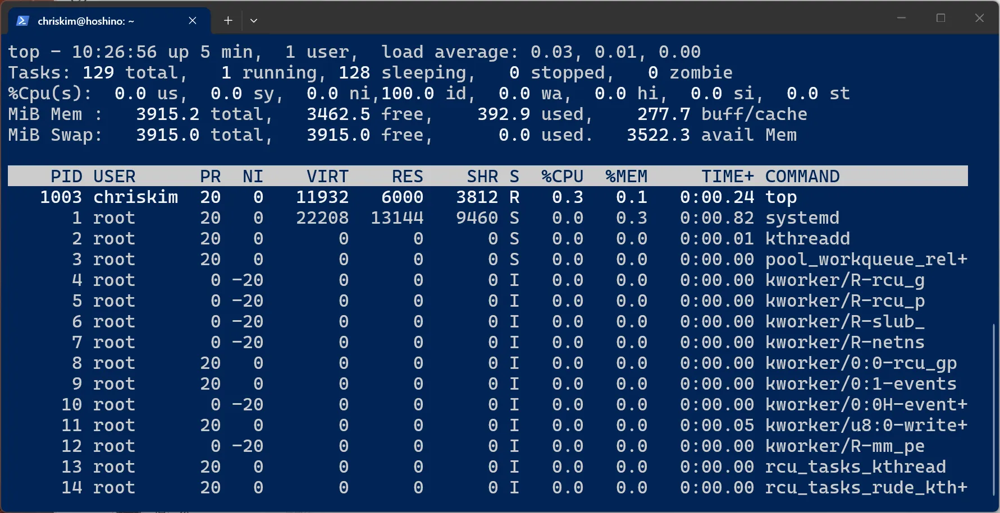</p>

top 界面

首先看到顶部的五行信息，格式如下：

```text
top - 10:26:56 up 5 min,  1 user,  load average: 0.03, 0.01, 0.00
当前时间；系统已运行时间；当前登录用户数；过去 1、5、15 分钟的平均负载

Tasks: 129 total,  1 running,  128 sleeping,  0 stopped,  0 zombie
进程总数；正在运行的进程数；休眠进程数；已停止进程数；僵尸进程数

%Cpu(s): 0.0 us,  0.0 sy,  0.0 ni, 100.0 id,  0.0 wa,  0.0 hi,  0.0 si,  0.0 st
用户进程占用；内核占用；调整过 nice 的进程占用；CPU 空闲；等待 I/O；硬件中断；软件中断；被虚拟机宿主机占用

MiB Mem : 3915.2 total,  3462.5 free,  392.9 used,  277.7 buff/cache
物理内存总量；空闲内存；已使用内存；缓冲区和缓存

MiB Swap: 3915.0 total,  3915.0 free,  0.0 used,  3522.3 avail Mem
Swap 总量；Swap 空闲；Swap 已使用；预计可用物理内存
```

除了显示当前系统的状态外， `top` 还能显示和管理进程，这就是下面的表格显示的内容。首先看到表头，每一列的含义是：

- PID – 进程编号
- USER – 启动该进程的用户
- PR – 进程调度优先级，数值越小优先级越高
- NI – 进程 nice 值，数值越小优先级越高
- VIRT – 虚拟内存总量
- RES – 实际驻留在物理内存中的大小
- SHR – 共享内存大小
- S – 进程状态：R 运行，S 可中断睡眠，D 不可中断睡眠，T 已暂停，Z 僵尸进程，I 空闲内核线程
- %CPU – CPU 使用率
- %MEM – 物理内存使用率
- TIME+ – 进程累计占用 CPU 的时间
- COMMAND – 进程对应的命令或程序名

然后我们就可以用 ↑ ↓ 和 PGUP PGDN ，来滚动和翻页整个表格了，除此之外，还可以输出大写 P 以 CPU 占用排序，输入大写 M 以内存占用排序。

**（2） `htop` 工具**

`htop` 相当于加强版的 `top` ，它的界面更美观易用，同时功能也更强大，一般来说我更喜欢用 `htop` 。首先安装它： `sudo apt install htop -y`

使用 `htop` 命令即可打开任务管理器，打开后用 q 或 Ctrl + C 退出。 `htop` 会占满终端并自动刷新，界面如下：

<p align="center">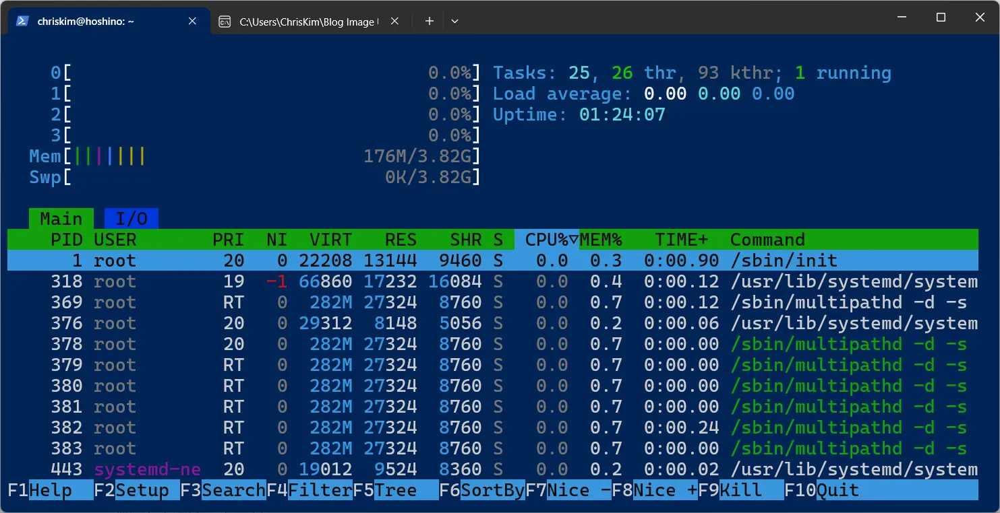</p>

htop 界面

可以发现， `htop` 最明显的区别就是界面更美观了，还有一个区别就是 `htop` 不仅可以纯键盘操作，还可以用鼠标操作。例如可以用滚轮来滚动进程列表，点击表头可以切换排序列以及排序方向，点击下方的按钮可以选择功能。

因此 `htop` 的使用难度就很低了，这里简单介绍一下两个我常用的功能：

- 搜索：按 F3 或者鼠标点击 Search 按钮，接着就可以用关键字搜索进程了。
- 中止：高亮选中一行进程后按 F9 或者鼠标点击 Kill 按钮，会进入信号发送界面，选择 15 SIGTERM 发送来请求中止进程，或者发送 9 SIGKILL 来强制中止进程。

#### 2.6.2 进程中止

上一节介绍的 `htop` 已经有中止进程的功能了，不过 Linux 自身也有专门的命令。

**（1） `kill` 命令：杀死指定 ID 进程**

使用 `kill 进程ID` 来杀死进程，进程 ID 可以通过 `top` 或者 `htop` 查到。

`kill` 默认发送 SIGTERM 即请求中止进程，如果进程已经完全卡死不响应，可以发送 SIGKILL 来强制中止进程，使用 `kill -9 进程ID`

**（2） `pkill` 命令：杀死指定正则表达式的进程**

使用 `pkill 正则表达式` 来杀死进程，所有进程名匹配上正则表达式的进程都会被一起杀死，因此可能一次杀多个。

`pkill` 默认匹配进程名，如果想匹配完整的启动命令，可以使用 `-f` 参数，例如： `pkill -f "python.*train.py"`

同样， `pkill` 默认发送 SIGTERM 即请求中止进程，如果进程已经完全卡死不响应，可以发送 SIGKILL 来强制中止进程，使用 `pkill -9 正则表达式`

#### 2.6.3 磁盘状态查看

**（1） `du` 命令：查询对象磁盘占用**

`du` （disk usage）用于查看文件或目录实际占用了多少磁盘空间。

`-s` 参数表示只显示汇总结果，不每行列出所有对象的大小， `-h` 参数让容量自动使用 KB、MB、GB 等易读单位。 `du -sh` 的调用方式基本上是最常用的固定搭配：

```bash
du -sh /var/log   # 查看一个目录的总大小
du -sh /var/log/* # 查看一个目录下所有对象的大小
```

**（2）`df` 命令：查询文件系统空间**

`df` （disk free）用于查看已经挂载的文件系统还有多少可用空间。因此，一块尚未挂载的磁盘或分区不会出现在 `df` 中。

`-h` 参数让容量自动使用 KB、MB、GB 等易读单位，因此最常使用的是：

```bash
df -h
```

输出类似：

```text
Filesystem      Size  Used Avail Use% Mounted on
/dev/sda2       100G   42G   53G  45% /
/dev/sdb1       1.8T  1.2T  550G  69% /data
```

每一列分别是：

- Filesystem – 文件系统位置
- Size – 总容量
- Used – 已使用空间
- Avail – 可用空间
- Use% – 使用率
- Mounted on – 挂载位置

**（3）`lsblk` 命令：查询磁盘和分区**

`lsblk` （list block devices）用于查看计算机中的磁盘、分区以及它们的挂载关系。因此，即使是空盘，它也会出现在 `lsblk` 里。使用：

```bash
lsblk
```

输出类似：

```text
NAME   MAJ:MIN RM   SIZE RO TYPE MOUNTPOINTS
sda      8:0    0   500G  0 disk
├─sda1   8:1    0     1G  0 part /boot
└─sda2   8:2    0   499G  0 part /
sdb      8:16   0     2T  0 disk
└─sdb1   8:17   0     2T  0 part /data
```

其中重要的列有：

- `NAME` – 设备名称
- `SIZE` – 容量
- `TYPE` – 类型，例如 `disk` 为整块磁盘， `part` 为分区
- `MOUNTPOINTS` – 挂载位置

例如上面的 `/dev/sda` 是一块 500 GB 磁盘，其中包含 `sda1` 和 `sda2` 两个分区。

**（4）`iotop` 工具：查询磁盘 I/O**

有时候磁盘空间并没有满，但系统仍然非常卡，这可能是某个程序正在大量读写磁盘。此时可以使用 `iotop` 查看各进程的磁盘读写情况。

首先安装：

```bash
sudo apt install iotop -y
```

然后运行：

```bash
sudo iotop
```

它的使用方式和 `top` 类似，会实时显示各进程的磁盘读写速度。其中主要关注：

- `DISK READ` – 磁盘读取速度
- `DISK WRITE` – 磁盘写入速度
- `COMMAND` – 对应的程序

按方向键可以导航，按 q 可以退出。

#### 2.6.4 网络状态查看

**（1）`ifconfig` 命令：查询网络接口**

`ifconfig` 可以查看计算机的网络接口、IP 地址以及网络流量等信息。

首先安装：

```bash
sudo apt install net-tools
```

然后运行：

```bash
ifconfig
```

可能会看到：

```text
eth0: flags=4163<UP,BROADCAST,RUNNING,MULTICAST>  mtu 1500
        inet 192.168.1.100  netmask 255.255.255.0
        inet6 fe80::1234:5678:abcd:ef01  prefixlen 64
        RX packets 123456  bytes 987654321
        TX packets 65432   bytes 123456789
```

这里最常关注的是：

- `eth0` – 网络接口名称（一般物理网口以 `eth`, `ens`, `eno`, `enp` 开头）
- `inet` – IPv4 地址和子网掩码
- `inet6` – IPv6 地址和前缀长度
- `RX` – 接收的数据包累计数量和累计大小
- `TX` – 发送的数据包累计数量和累计大小

另外， `ifconfig` 是比较经典的工具，现在较新的 Linux 系统主要使用 `ip` 命令代替它，使用 `ip addr` 命令的效果和 `ifconfig` 类似。

**（2）`iftop` 工具：查询网络连接流量**

如果想知道“到底是哪个远程地址正在占用网络”，可以使用 `iftop` 。

首先安装：

```bash
sudo apt install iftop -y
```

然后运行：

```bash
sudo iftop
```

`iftop` 会实时显示本机与其他地址之间的网络连接以及对应流量，因此比较适合排查：

- 哪个服务器正在大量传输数据
- 当前主要连接到了哪些地址
- 哪条网络连接占用了最多带宽

如果计算机有多个网卡，可以指定网络接口：

```bash
sudo iftop -i eth0
```

按 q 退出。

**（3）`nload` 工具：查询网卡总流量**

如果并不关心具体是哪个连接，只想看看当前总下载和上传速度，那么 `nload` 会更加直观。

首先安装：

```bash
sudo apt install nload -y
```

然后运行：

```bash
nload
```

界面中会分别显示：

```text
Incoming
当前下载速度

Outgoing
当前上传速度
```

如果计算机存在多个网络接口，可以使用 ← 和 → 切换。按 q 退出。

---

### 2.7 磁盘挂载

#### 2.7.1 挂载的含义

对于 Windows 用户来说，挂载是很陌生的概念。因为 Windows 如果接入了新磁盘，格式化后就直接显示为新盘符了（例如 E:\\ 盘）。

但对于 Linux，没有盘符这个概念，整个系统只有唯一的一棵树，每个磁盘相当于挂在整个树的某个节点下，这就是为什么我们需要挂载磁盘。

看到下图示例，假如一台计算机有两块磁盘分别为 A 和 B，我们可以让 A 磁盘储存根目录，称为系统盘，可以让 B 磁盘仅储存用户的用户文件，成为用户盘。那么，就可以将 B 磁盘的文件系统挂载到 `/home` 目录下，这样，所有储存在 `/home` 目录里面的内容，实际写入的磁盘是 B，而其他的目录均写入磁盘 A。

<p align="center">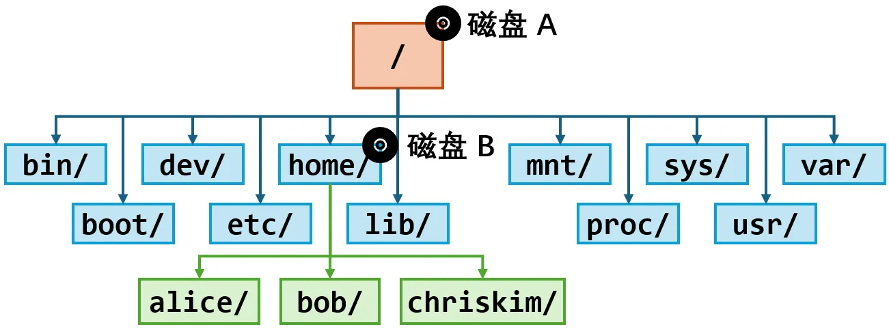</p>

Linux 磁盘挂载示例

本节主要介绍的是可移动设备（例如 U 盘、移动硬盘）的挂载和卸载，对于系统安装了新磁盘，要进行分区、格式化并配置自动挂载，我认为已经较为深入，不适合在本章介绍。

#### 2.7.2 挂载磁盘

对于带桌面环境的 Linux，例如 Ubuntu Desktop，插入 U 盘或移动硬盘后通常会自动挂载，因此一般不需要手动操作。但在服务器 Linux 中，系统通常只会识别设备，而不会自动挂载。

插入设备后，可以先使用前面介绍过的 `lsblk` 查看，例如：

```text
NAME   SIZE TYPE MOUNTPOINTS
sda    500G disk
└─sda1 500G part /
sdb     64G disk
└─sdb1  64G part
```

这里 `/dev/sda1` 已经挂载到根目录 `/` ，而新插入的 `/dev/sdb1` 的 `MOUNTPOINTS` 为空，说明它还没有挂载。

注意，通常需要挂载的是 **磁盘中的分区** ，例如 `/dev/sdb1` ，而不是整块磁盘 `/dev/sdb` 。

首先创建一个目录作为挂载位置：

```bash
sudo mkdir -p /mnt/usb
```

然后使用 `mount` ：

```bash
sudo mount /dev/sdb1 /mnt/usb
```

此时正常来说就完成了挂载， `ls /mnt/usb` 看到的就是 `/dev/sdb1` 文件系统里面的内容，向 `/mnt/usb` 写入文件也会实际写入这块磁盘。

可以再次使用 `lsblk` 确认挂载结果：

```text
NAME   SIZE TYPE MOUNTPOINTS
sda    500G disk
└─sda1 500G part /
sdb     64G disk
└─sdb1  64G part /mnt/usb
```

除了 `/mnt/usb` 外，挂载位置本身没有特殊要求，只要是一个存在的目录即可。例如：

```bash
sudo mkdir -p /data/backup
sudo mount /dev/sdb1 /data/backup
```

需要注意，如果把文件系统挂载到一个 **原本已经存在文件的目录** 上，那么这个目录原来的文件并不会被删除，但在挂载期间会暂时看不到。因此一般建议使用专门创建的空目录作为挂载点。

#### 2.7.3 卸载磁盘

移动设备在拔出之前，最好先进行卸载，否则还有尚未真正写入磁盘的数据时，直接拔出可能导致数据丢失或文件系统损坏。

使用 `umount` 命令卸载（注意命令叫做 `umount` ，而不是 `unmount` ）：

```bash
sudo umount /mnt/usb  # 可以指定挂载点
sudo umount /dev/sdb1 # 也可以指定设备
```

卸载完成后再次运行：

```bash
lsblk
```

可以看到 `/dev/sdb1` 仍然存在，但是 `MOUNTPOINTS` 已经为空：

```text
NAME   SIZE TYPE MOUNTPOINTS
sdb     64G disk
└─sdb1  64G part
```

这时就可以安全拔出设备了。

如果卸载时提示 `target is busy` ，说明还有程序正在使用这个挂载目录。例如当前 Shell 正好位于 `/mnt/usb` 中，也会导致无法卸载。

---

### 2.8 环境变量

在 Linux 的安装教程、软件配置和开发环境中，经常可以看到下面这样的命令：

export PATH="/opt/myapp/bin:$PATH"

export LD_LIBRARY_PATH="/opt/myapp/lib:$LD_LIBRARY_PATH"

export CUDA_VISIBLE_DEVICES=0,1,2,3

export PATH="/opt/myapp/bin: $ LD_LIBRARY_PATH" export CUDA_VISIBLE_DEVICES=0,1,2,3

```bash
export PATH="/opt/myapp/bin:$PATH"
export LD_LIBRARY_PATH="/opt/myapp/lib:$LD_LIBRARY_PATH"
export CUDA_VISIBLE_DEVICES=0,1,2,3
```

这些命令都与 **环境变量** 有关。本节将简单介绍环境变量是什么，并重点介绍两个非常常见的特殊环境变量： `PATH` 和 `LD_LIBRARY_PATH` 。

#### 2.8.1 变量和环境变量

我们在前文已经接触过 Shell 变量，例如： `name="Chris"`

变量可以临时保存一段数据，使用 `$变量名` 可以读取变量的值： `echo $name`

但普通 Shell 变量默认只属于当前 Shell。从当前 Shell 启动其他程序时，这些程序并不会自动获得普通变量。

如果希望变量能够传递给当前 Shell 启动的程序，可以使用 `export` 将其导出为 **环境变量** ：

```bash
name="Chris"
export name
```

也可以在声明时直接导出：

```bash
export name="Chris"
```

简单理解：

- **普通变量：** 主要供当前 Shell 自己使用。
- **环境变量：** 除了当前 Shell 可以使用，还会传递给它启动的子进程。

可以使用 `env` 查看当前环境中的所有环境变量：

```bash
env
```

环境变量的用法和普通 Shell 变量类似，1.7.4 已经讲过。不过有一个用法需要注意，环境变量既可以设置到当前 Shell 的环境中（重启 Shell 后失效），并传递给之后启动的子进程，也可以临时仅给某个命令使用。临时使用的语法为：

```bash
MY_ENV=my-env-value 要运行的命令
```

例如在 Python 人工智能训练中极为常见的指定计算卡的用法，就是临时设定的环境变量：

```bash
CUDA_VISIBLE_DEVICES=0 python train.py
```

#### 2.8.2 特殊环境变量——PATH

`PATH` 是 Linux 中最重要的环境变量之一，它决定了 Shell **去哪些目录寻找命令** 。

使用 `echo $PATH` 查看当前的 `PATH` ，将会显示一个使用 `:` 分隔的目录列表，例如：

```text
/usr/local/sbin:/usr/local/bin:/usr/sbin:/usr/bin:/sbin:/bin:/usr/games:/usr/local/games:/snap/bin
```

下面介绍 `PATH` 变量到底有什么用。假如执行命令 `ls` ，我们并没有告诉 Shell `ls` 程序具体位于哪里。此时 Shell 就会按照 `PATH` 中的顺序，到这些目录中寻找名为 `ls` 的可执行程序。

可以使用 `which` 查看某个命令实际对应的位置： `which ls` 。一般来说会输出： `/usr/bin/ls` 。即 Shell 通过遍历 PATH 后，在 `/usr/bin/ls` 找到了 `ls` 命令。

如果要新增一个 PATH 目录，可以用下面的命令。请注意一定不要覆盖 `PATH` ，而是用冒号拼接，因为如果直接覆盖 `PATH` 会导致其他大多数命令 Shell 全部都找不到了。

```bash
export PATH="/opt/myapp/bin:$PATH"
```

另外， `PATH` 中越靠前的目录优先级越高。如果不同目录中存在同名命令，Shell 通常会优先找到排在前面的那个。

#### 2.8.3 特殊环境变量——LD_LIBRARY_PATH

很多 Linux 程序并不是把所有功能都包含在自己的可执行文件中，而是运行时还需要加载一些 **动态链接库** 。当程序运行时，Linux 的动态链接器需要找到这些库文件，否则就会因为缺失库而运行失败。这类动态链接库文件通常以 `.so` 结尾，例如：

```text
libexample.so
libexample.so.1
```

如果说上一节的 `PATH` 是告诉 Shell 到哪些目录寻找可执行程序，那么 `LD_LIBRARY_PATH` 就是告诉动态链接器到哪些额外目录寻找动态链接库。

可以查看当前设置： `echo $LD_LIBRARY_PATH`

假如某个程序需要的动态链接库位于： `/opt/myapp/lib`

可以执行下面的命令，另外也注意一定不要直接覆盖原环境变量了。

```bash
export LD_LIBRARY_PATH="/opt/myapp/lib:$LD_LIBRARY_PATH"
```

正确设置 `LD_LIBRARY_PATH` 后，程序就可能正常找到对应的库。

如果你好奇一个程序依赖哪些动态链接库，以及这些库最终从哪里加载，可以使用 `ldd` 查看：

```bash
ldd /usr/bin/ls
```

例如会看到类似：

```text
linux-vdso.so.1 (0x00007ffc0fdc4000)
        libselinux.so.1 => /lib/x86_64-linux-gnu/libselinux.so.1 (0x0000773b85560000)
        libc.so.6 => /lib/x86_64-linux-gnu/libc.so.6 (0x0000773b85200000)
        libpcre2-8.so.0 => /lib/x86_64-linux-gnu/libpcre2-8.so.0 (0x0000773b854c6000)
        /lib64/ld-linux-x86-64.so.2 (0x0000773b855ba000)
```

与 `PATH` 类似， `LD_LIBRARY_PATH` 中也可以包含多个目录，使用 `:` 分隔，并且靠前的目录具有更高的查找优先级：

```bash
export LD_LIBRARY_PATH="/path/a:/path/b:$LD_LIBRARY_PATH"
```

---

### 2.9 Bash 配置文件.bashrc

在前面的内容中，我们已经接触过环境变量、命令别名等配置。不过如果只是在终端中直接执行 `export PATH="/opt/myapp/bin:$PATH"` ，那么这些修改通常只对当前 Shell 生效，关闭终端后就会消失。

如果希望某些配置每次打开 Bash 时都自动生效，就可以把它们写进 Bash 的配置文件 `.bashrc` 。

#### 2.9.1 .bashrc 是什么

`.bashrc` 是 Bash 常用的用户级配置文件，一般位于当前用户的家目录 `~/.bashrc` ，它的文件名以 `.` 开头，因此它属于隐藏文件，可以使用 `ll` 别名或者 `ls -al` 查看它。

`.bashrc` 本质上就是一份 Shell 脚本。每次启动交互式 Bash 时，Bash 通常会读取并执行其中的内容。因此，平时可以直接在 Bash 中执行的很多配置命令，也可以写进 `.bashrc` ，让它们以后自动执行。

可以使用文本编辑器打开来修改： `nano ~/.bashrc`

#### 2.9.2 .bashrc 常用来干什么

**（1）长期保存环境变量**

例如前文介绍过，如果希望将 `/opt/myapp/bin` 加入 `PATH` ，直接在终端中执行时，只对当前 Shell 生效。如果把这一行加入 `~/.bashrc` （位置一般不重要，加到末尾即可）：

```bash
export PATH="/opt/myapp/bin:$PATH"
```

那么之后每次打开 Bash 时都会自动执行这条命令。

类似地，也可以设置其他环境变量，例如自己装过 CUDA 的读者肯定有印象：

```bash
export PATH=$PATH:/usr/local/cuda/bin
export LD_LIBRARY_PATH=$LD_LIBRARY_PATH:/usr/local/cuda/lib64
```

**（2）设置命令别名**

本文非常前面就已经提到了别名，现在终于可以学习自己设定了。别名可以给一个较长的命令取一个更短的名字，例如：

```bash
alias ll='ls -alF'
```

之后执行 `ll` 就相当于执行 `ls -alF`

也可以按照自己的使用习惯添加别名，例如我自己的个人习惯是把 `conda` 几个命令设定别名：

```bash
alias cac="conda activate"
alias cda="conda deactivate"
```

直接在 Shell 中执行 `alias` 同样只是临时生效，写入 `.bashrc` 后，每次打开 Bash 都会自动创建这些别名。

**（3）基于脚本语法的功能**

实际上，因为 `.bashrc` 本质上就是 Shell 脚本，所以也可以在里面执行普通命令。例如：

```bash
echo "Welcome back!"
```

那么以后每次打开对应的 Bash 时，都可能看到这段文字。

因此，你完全通过 Shell 脚本的语法，实现一些很酷的事情。例如我就在 `.bashrc` 里注册了一个用来切换 CUDA 版本的函数，每次调用这个函数它就会帮我切换想要的 CUDA 版本，这个玩法之前我已经写过文章了，感兴趣可以查看： [https://www.zouht.com/3754.html](https://www.zouht.com/3754.html)

不过一般建议 `.bashrc` 主要用于 Shell 配置，不要在里面加入耗时很长、需要用户输入或者会产生大量输出的命令，否则每次打开 Shell 都会受到影响。

#### 2.9.3 重新加载.bashrc

修改 `.bashrc` 后，新打开的 Bash 通常会读取新的配置，因此最简单的方法是关闭并重新打开终端。如果不想重新打开终端，也可以让当前 Bash 立即重新执行 `.bashrc` ：

```bash
source ~/.bashrc   # 完整形式
. ~/.bashrc        # 简写形式
```

了解到这里，如果用过 Python 的虚拟环境 `venv` ，应该就能理解 `source xxx/bin/activate` 在做什么了：它让当前 Bash 执行虚拟环境的激活脚本，从而修改 `PATH` 等环境变量，让 `python` 等命令指向虚拟环境中的版本。

---

### 2.10 拾遗补缺

本节补充几个非常实用、但内容比较少，不值得单独开一节介绍的命令。

#### 2.10.1 watch：重复执行命令

`watch` 可以每隔一段时间（默认 2 秒）重复执行某个命令，并不断刷新终端中的显示结果，需要退出时按 Ctrl + C 。示例如下：

```bash
watch nvidia-smi           # 每隔 2 秒查看一次 GPU 状态
watch -n 1 nvidia-smi      # 每隔 1 秒查看一次 GPU 状态
watch -n 1 du -sh ./output # 每隔 1 秒查看一次 output 目录多大
```

#### 2.10.2 tee：同时输出到终端和文件

前文介绍过使用 `>` 将命令输出重定向到文件：

```bash
ls > files.txt
```

这样输出会直接进入文件，不再显示在终端中。

如果希望 **一边在终端中看到输出，一边把相同内容保存到文件** ，可以使用 `tee` ：

```bash
ls | tee files.txt
```

此时 `ls` 的输出既会显示在终端，也会写入 `files.txt` 。如果要追加，可以给 `tee` 加上 `-a` 参数。

#### 2.10.3 diff：比较文件差异

`diff` 可以比较两个文件的内容差异：

```bash
diff old.txt new.txt
```

如果两个文件完全相同，通常不会输出任何内容；如果存在差异，则会显示发生变化的位置和内容。

更常见、也更容易阅读的是统一格式：

```bash
diff -u old.txt new.txt
```

输出中：

- 以 `-` 开头的内容表示旧文件中的内容
- 以 `+` 开头的内容表示新文件中的内容

例如：

```text
-Hello
+Hello World
```

表示原来的 `Hello` 被修改成了 `Hello World` 。

#### 2.10.4 uname：查看系统和内核信息

`uname` 用于查看当前系统的一些基本信息。

直接执行 `uname` 一般会输出 `Linux` ，即内核名称。通常我们使用 `-a` 参数打印出完整信息，这样更实用，执行 `uname -a` 后，我手上的 Ubuntu 24.04 LTS 输出以下内容：

```text
Linux hoshino 6.8.0-137-generic #137-Ubuntu SMP PREEMPT_DYNAMIC Fri Jul 17 20:28:23 UTC 2026 x86_64 x86_64 x86_64 GNU/Linux
```

一次性输出了内核名称、计算机名、内核版本、内核编译信息、硬件架构等信息。

需要注意， `uname` 主要显示的是内核和硬件架构相关信息，并不能直接告诉你当前使用的是 Ubuntu、Debian 还是其他 Linux 发行版。如果想查看当前 Linux 发行版的信息，可以查看 `/etc/os-release` 文件：

```bash
cat /etc/os-release
```

例如我手上的 Ubuntu 内容如下：

```text
PRETTY_NAME="Ubuntu 24.04.3 LTS"
NAME="Ubuntu"
VERSION_ID="24.04"
VERSION="24.04.3 LTS (Noble Numbat)"
VERSION_CODENAME=noble
ID=ubuntu
ID_LIKE=debian
HOME_URL="https://www.ubuntu.com/"
SUPPORT_URL="https://help.ubuntu.com/"
BUG_REPORT_URL="https://bugs.launchpad.net/ubuntu/"
PRIVACY_POLICY_URL="https://www.ubuntu.com/legal/terms-and-policies/privacy-policy"
UBUNTU_CODENAME=noble
LOGO=ubuntu-logo
```

#### 2.10.5 常见误触快捷键和恢复方式

在终端中，一些快捷键可能因为误触导致看起来“卡住”或任务突然暂停：

- `Ctrl + S` ：触发终端 **软件流控制** ，暂停终端输出。按 `Ctrl + Q` 恢复。
- `Ctrl + Z` ：暂停当前前台任务。执行 `fg` 可以恢复到前台继续运行。
- `Ctrl + C` ：中断当前前台任务。通常无法恢复，只能重新运行命令。
- `Ctrl + D` ：发送输入结束（EOF）。在空命令行中可能导致 Shell 退出，重新打开终端或重新连接 SSH 即可。

## 3. 常见需求与工具

前两章已经介绍了日常使用 Linux 所需的大部分基础知识。不过 Linux 能做的事情远不止这些，并且有些功能极为强大和复杂，可能单独写都能超过本篇的长度。

因此，本章不再详细教学，而是介绍一些常见的进阶需求，以及解决这些需求时通常需要使用的工具或系统功能。以后真正遇到相关需求时，可以根据本章提供的关键词自行搜索和学习。

### 3.1 系统服务管理

如果希望一个程序长期在后台运行、开机自动启动，或者程序崩溃后自动重新启动，通常需要将它配置成一个 **系统服务** 。

现代 Ubuntu 等 Linux 发行版主要使用 `systemd` 管理系统服务，最常用的工具是：

- `systemctl` ：启动、停止、重启和查看服务
- `systemd service` ：定义一个系统服务
- `systemctl enable` ：设置开机自动启动

需要注意，很多旧教程会使用 `service` 、 `init.d` 等方式管理服务，现在仍可能看到，但现代 Linux 通常以 `systemd` 为主。

### 3.2 系统日志和故障排查

如果某个服务启动失败、系统突然重启、硬件出现异常，第一件事通常应该是 **查看日志** 。

常见工具和位置包括：

- `journalctl` ：查看 systemd 收集的系统和服务日志
- `dmesg` ：查看 Linux 内核产生的信息，硬件和驱动故障排查中非常常用
- `/var/log` ：传统日志文件所在目录

### 3.3 定时和自动执行任务

如果希望 Linux 在指定时间自动执行某个命令，例如：

- 每天凌晨自动备份
- 每小时执行一次脚本
- 每周自动清理文件

可以了解：

- `cron` / `crontab` ：经典的 Linux 定时任务工具
- `systemd timer` ：systemd 提供的定时任务机制
- `at` ：在未来某个时间只执行一次任务

简单的周期任务使用 `cron` 非常常见，而已经使用 systemd 管理的服务通常也可以搭配 `systemd timer` 。

### 3.4 Shell 脚本和自动化

如果发现自己经常需要连续执行相同的一组 Linux 命令，就可以考虑把这些命令写成 **Shell 脚本** 。

Shell 脚本可以进一步实现：

- 顺序执行多个命令
- 条件判断
- 循环
- 函数
- 接收命令行参数
- 根据上一条命令是否成功决定下一步操作

Shell 脚本非常适合简单的系统管理和自动化任务，但如果逻辑逐渐变得复杂，使用 Python 等更加完整的编程语言通常会更容易维护。

### 3.5 网络配置和排障

网络问题种类很多，不同问题通常需要不同工具：

- `ifconfig` / `ip addr` ：查看网络接口和 IP 地址
- `ip route` ：查看和管理路由
- `ping` ：测试目标是否能够连通
- `ss` ：查看网络连接和监听端口
- `dig` / `nslookup` ：查询 DNS
- `traceroute` / `tracepath` ：查看数据包经过的网络路径
- `tcpdump` ：抓取和分析网络数据包
- `nmap` ：探测网络中的主机和开放端口

### 3.6 防火墙

如果希望限制哪些网络连接能够进入或离开 Linux 系统，就需要配置 **防火墙** 。

常见工具包括：

- `ufw` ：Ubuntu 中非常易用的防火墙管理工具
- `nftables` ：现代 Linux 内核主要使用的底层防火墙框架
- `iptables` ：旧教程中非常常见的防火墙工具

对于普通 Ubuntu 服务器，通常可以先学习 `ufw` ；需要复杂规则、路由器或高级网络配置时，再了解 `nftables` 。

配置远程服务器防火墙时需要特别小心。例如通过 SSH 连接服务器时，如果错误地禁止了 SSH 使用的端口，就可能把自己挡在服务器外面。

### 3.7 SSH 安全性

前文已经介绍了使用用户名和密码通过 SSH 登录服务器。实际长期使用服务器时，更推荐进一步了解 **SSH 密钥认证** 。

相关工具和配置包括：

- `ssh-keygen` ：生成 SSH 密钥
- `~/.ssh/authorized_keys` ：服务器允许登录的公钥
- `~/.ssh/config` ：客户端 SSH 配置
- `/etc/ssh/sshd_config` ：SSH 服务端配置
- `PasswordAuthentication` ：控制密码认证
- `PermitRootLogin` ：控制 root 远程登录

使用 SSH 密钥后，不仅可以避免反复输入密码，在正确配置的情况下安全性也通常更高。

修改 SSH 服务端配置时，需要确保新的登录方式已经测试成功，再关闭原有登录方式，否则可能导致自己无法再次连接服务器。

### 3.8 高级文件同步

前文介绍的 `scp` 很适合简单地复制文件，但如果需要经常同步大型目录、备份数据或只传输发生变化的文件，可以进一步学习 `rsync` 。

`rsync` 可以进行本地同步，也可以通过 SSH 在不同计算机之间同步文件，并且可以只传输发生变化的数据。

常见需求包括：

- 服务器之间同步数据
- 增量备份目录
- 上传大型数据集
- 保持两个目录内容一致

### 3.9 磁盘、分区和文件系统

前文只介绍了磁盘的查看和临时挂载。如果需要安装新硬盘、重新分区或者配置长期挂载，还需要了解更多磁盘管理工具：

- `lsblk` ：查看磁盘和分区
- `blkid` ：查看文件系统类型、UUID 等信息
- `fdisk` / `parted` ：管理磁盘分区
- `mkfs` ：创建文件系统，也就是常说的“格式化”
- `/etc/fstab` ：配置开机自动挂载
- `smartctl` ：读取硬盘 SMART 健康信息

常见文件系统有 `ext4` 、 `XFS` 、 `Btrfs` ，进一步还可以了解 `LVM` 和 `ZFS` 。

这一部分尤其需要谨慎。 **分区、格式化和文件系统操作可能直接导致数据丢失** ，执行命令前一定要确认操作对象对应的是哪块磁盘。

### 3.10 用户和权限的高级功能

前文介绍的所有者、用户组和 `rwx` 权限已经足够应对大部分普通场景。如果需要更精细的权限控制，还可以了解：

- `umask` ：控制新建文件和目录的默认权限
- ACL：为特定用户或组单独设置权限
- `getfacl` / `setfacl` ：查看和修改 ACL
- `/etc/sudoers` / `visudo` ：精细控制用户可以通过 sudo 执行哪些操作
- `setuid` / `setgid` / sticky bit：特殊权限位
- Linux capabilities：只授予程序一部分原本属于 root 的能力

### 3.11 硬件和驱动

如果需要查看 Linux 识别到了哪些硬件，或者排查设备和驱动问题，可以了解：

- `lspci` ：查看 PCI / PCIe 设备
- `lsusb` ：查看 USB 设备
- `lscpu` ：查看 CPU 信息
- `dmidecode` ：查看 BIOS、内存、主板等 DMI 信息
- `lsmod` ：查看当前已经加载的内核模块
- `modprobe` ：加载或卸载内核模块
- `dmesg` ：查看内核和驱动产生的信息
