# 数据结构

## 参考

https://algorithms-data-structures-python.readthedocs.io/en/latest/index.html

<a id="index"></a>

## 1. GETTING STARTED

<a id="1-introduction-1-data_structure"></a>

### 1.1 Data Structure

#### 1.1.1 Abstract Data Type（抽象数据类型 ADT）

抽象数据类型 = 数据类型 + 操作， 是抽象的，是一种逻辑上的概念，不是具体的实现。

以下内容来自维基百科 [https://en.wikipedia.org/wiki/Abstract_data_type](https://en.wikipedia.org/wiki/Abstract_data_type)

在计算机科学中，抽象数据类型（ADT）是一种数据类型的数学模型。从用户的角度来看，抽象数据类型是通过其行为（语义）来定义的，具体而言，是关于可能的值、该类型数据的可能操作以及这些操作的行为。这种数学模型与数据结构相对应，数据结构是数据的具体表示，是实现者而非用户的观点。

正式地，ADT 可以被定义为“一类对象，其逻辑行为由一组值和一组操作定义”；这类似于数学中的代数结构。不同作者对于“行为”的含义有所不同，正式行为规范的两种主要类型是公理（代数）规范和抽象模型；它们分别对应于抽象机器的公理语义和操作语义。有些作者还包括计算复杂度（“成本”），包括时间（计算操作）和空间（表示值）方面的成本。实际上，许多常见的数据类型不是 ADT，因为抽象不是完美的，用户必须注意诸如算术溢出之类的问题，这是由于表示方式引起的。例如，整数通常作为固定宽度的值（32 位或 64 位二进制数）存储，因此如果超过最大值，则会出现整数溢出。

ADT 是计算机科学中的理论概念，用于算法、数据结构和软件系统的设计和分析，并不对应于计算机语言的特定功能。然而，各种语言功能与 ADT 的某些方面相对应，很容易与 ADT 混淆；这些包括抽象类型、不透明数据类型、协议和按合同设计。ADT 最初由 Barbara Liskov 和 Stephen N. Zilles 在 1974 年提出，作为 CLU 语言开发的一部分

#### 1.1.2 Data Structure （数据结构）

数据结构 = 数据类型 + 数据类型的存储方式， 是具体的，可以被计算机实现的和使用的。

[https://en.wikipedia.org/wiki/Data_structure](https://en.wikipedia.org/wiki/Data_structure)

#### 1.1.3 常用的数据结构

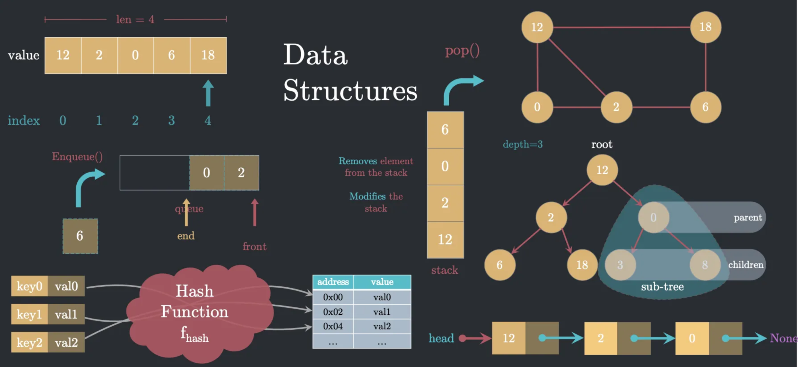

- Array/List
- Linked List
- Hash Table
- Queue
- Stack
- Tree
- Graph

<a id="1-introduction-2-algorithms"></a>

### 1.2 Algorithms and Complexities

#### 1.2.1 Algorithm

An algorithm is a finite set of instructions, those if followed, accomplishes a particular task. It is not language specific, we can use any language and symbols to represent instructions.

一个算法是一组有限的指令，如果按照它们所规定的顺序执行，可以完成特定的任务。它不受语言限制，我们可以使用任何语言和符号来表示指令

#### 1.2.2 The criteria of an algorithm

算法是解决问题或实现特定任务的逐步过程。为了被认为是算法，该过程必须满足以下几个标准：

- 清晰明确：算法的每一步必须清晰明确，没有解释或混淆的余地。
- 有限性：算法必须在有限步骤后终止，这意味着它不能无限运行或无限循环。
- 输入：算法必须有一个或多个输入，这些是算法在执行任务时使用的初始数据或信息。
- 输出：算法必须有一个或多个输出，这些是算法在完成任务后产生的结果或解决方案。
- 有效性：算法必须是有效的，这意味着它应该能够在合理的时间内为任何有效输入产生正确的输出。
- 一般性：算法应该足够通用，以适用于广泛的相似问题，而不是针对单个问题或情况而设计。

这些标准有助于确保算法定义良好、可靠，并对解决特定问题或任务有用。

#### 1.2.3 Analysis of algorithms

Algorithm analysis is an important part of computational complexities. The complexity theory provides the theoretical estimates for the resources needed by an algorithm to solve any computational task. Analysis of the algorithm is the process of analyzing the problem-solving capability of the algorithm in terms of the time and size required (the size of memory for storage while implementation). However, the main concern of the analysis of the algorithm is the required time or performance.

算法分析是计算复杂性的重要组成部分.
复杂性理论为算法解决任何计算任务所需的资源提供了理论估计。
算法分析是指通过时间和空间的需求（实现时所需的存储空间）来分析算法的问题解决能力的过程。然而，算法分析的主要关注点是所需的时间或性能

#### 1.2.4 Complexities of an Algorithm

The complexity of an algorithm computes the amount of time and spaces required by an algorithm for an input of size (n). The complexity of an algorithm can be divided into two types. The time complexity and the space complexity.

算法的复杂度计算的是算法在输入规模为 n 时所需的时间和空间。算法的复杂度可以分为两种类型：时间复杂度和空间复杂度。

（1）Time Complexity of an Algorithm

The time complexity is defined as the process of determining a formula for total time required towards the execution of that algorithm. This calculation is totally independent of implementation and programming language.

时间复杂度是指确定执行该算法所需总时间的过程。这个计算完全独立于具体的实现和编程语言。

（2）Space Complexity of an Algorithm

Space complexity is defining as the process of defining a formula for prediction of how much memory space is required for the successful execution of the algorithm. The memory space is generally considered as the primary memory.

空间复杂度是指定义一种公式来预测算法在成功执行时需要多少内存空间的过程。通常，内存空间是指主存储器。

> [!WARNING] ⚠️ 警告
> 无法准确地测量算法的运行时间，因为算法所需的时间取决于它执行的硬件和软件环境。
>
> 我们应该测量算法执行的操作次数。操作次数是算法所需时间的良好近似值

[https://en.wikipedia.org/wiki/Algorithm](https://en.wikipedia.org/wiki/Algorithm)

#### 1.2.5 常用算法

（1）Search 搜索

例如 Binary search （二分查找）

著名的 BFS（广度优先） DFS（深度优先）

（2）Sorting 排序

例如 Bubble sort （冒泡排序）

<a id="1-introduction-3-bigo"></a>

### 1.3 Big O notation

BIG O 表示算法的时间复杂度，用来描述算法在 `最坏情况下` 的运行时间的增长率。简单来说，它是一种度量算法效率的方式，表示算法的运行时间与输入规模的增长率之间的关系。

#### 1.3.1 Types of Big O Notations

There are seven common types of big O notations. These include: (orderd from best to worst)

- O(1): Constant complexity.
- O(logn): Logarithmic complexity.
- O(n): Linear complexity.
- O(nlogn): Loglinear complexity.
- O(n^x): Polynomial complexity.
- O(X^n): Exponential time.
- O(n!): Factorial complexity.

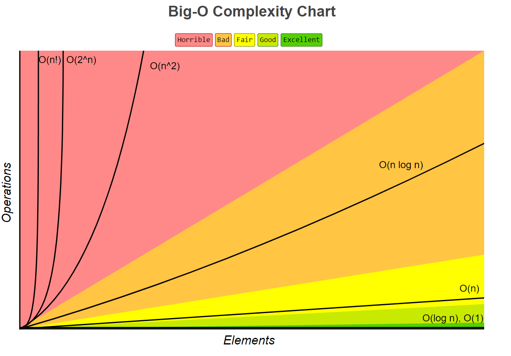
参考 [https://www.bigocheatsheet.com/](https://www.bigocheatsheet.com/)

#### 1.3.2 常用算法的 Big O

请参考 [https://www.bigocheatsheet.com/](https://www.bigocheatsheet.com/)

<a id="1-introduction-4-bigo-py"></a>

### 1.4 BIG O and Python

```python
# O(n)
def bigo(n):
   for i in range(n):
       print(i)
       for j in range(n):
           print(j)

bigo(10)

# O(n^2)

# O(1)

a = [1, 2, 3]

a[0]

```

## 2. DATA STRUCTURES - ARRAY

<a id="2-arrays-1-arrays"></a>

### 2.1 What is Array

#### 2.1.1 Array(数组)

[https://en.wikipedia.org/wiki/Array_(data_structure](https://en.wikipedia.org/wiki/Array_(data_structure))

An array is a collection of items of same data type stored at contiguous memory locations.
数组就是把一组相同类型的数据存储在连续的内存空间中。

The idea is to store multiple items of the same type together.
This makes it easier to calculate the position of each element by simply adding an offset to a base value,
i.e., the memory location of the first element of the array (generally denoted by the name of the array).

在 C 语言中，数组的大小是固定的。一旦声明了数组的大小，就不能再改变了。原因很简单，假如要扩展数组的大小，就需要在当前数组所在内存后面的连续内存空间增加一块内存，
然而很难保证当前数组所在内存后面的内存空间是空闲的。

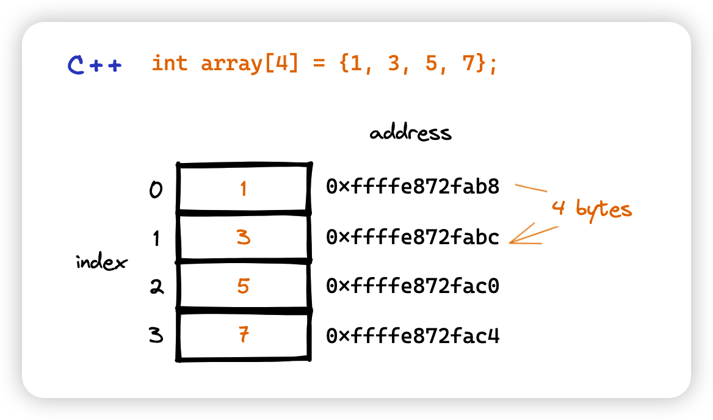

#### 2.1.2 一维和多维数组

一维数组就是数组中的每个元素都是一个单独的变量，多维数组就是数组中的每个元素还是一个数组。

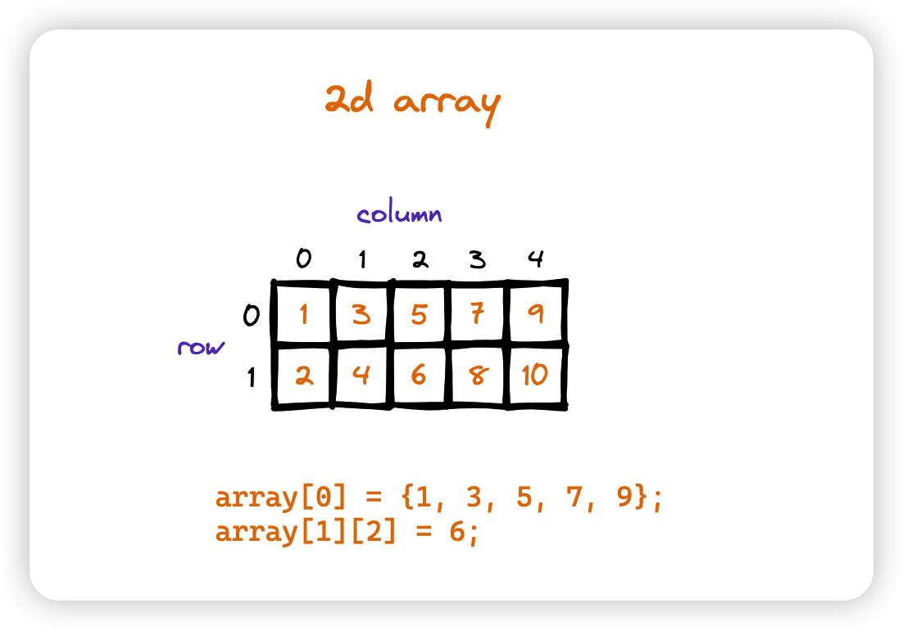

#### 2.1.3 数组优势

- 基于 index 的快速访问(地址连续，偏移量相同)
- 易实现

#### 2.1.4 数组的缺点

- 无法动态扩展
- resize 的代价高 O(n)
- 通常只能存储同一类型的数据 （Python 是例外之一）

<a id="2-arrays-2-operations"></a>

### 2.2 Operations

#### 2.2.1 Adding item (添加元素)

（1）末尾添加

往 Array 的末尾添加元素的时间复杂度是 `O(1)`

Array 预先分配的内存空间满了怎么办？

如果预先分配的内存空间满了，那么 Array 会自动扩容，扩容的时间复杂度是 `O(n)` 具体操作是：

- 申请一个新的内存空间，大小是原来的 2 倍(这个倍数可以自己设置)
- 把原来 Array 中的所有元素依次复制到新的内存空间
- 释放原来 Array 占用的内存空间

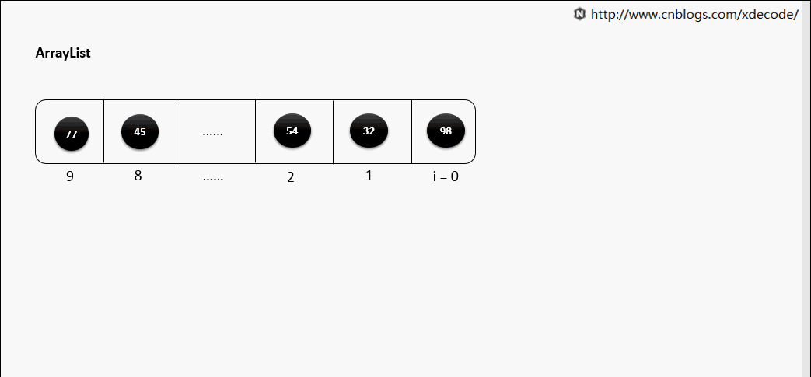
所以，如果你事先知道 Array 中元素的个数，那么最好在初始化的时候就指定 Array 的容量，避免不必要的扩容操作。
但如果你不知道 Array 中元素的个数，初始化 size 的大小是一个 `trade-off` ：

- 如果初始 size 太小，那么扩容操作会频繁发生，
- 如果 size 太大，那么会浪费很多内存空间。

（2）随机位置添加

如果要在 Array 中间添加元素，那么需要把 index 后面的所有元素依次向后移动一位，时间复杂度是 `O(n)`

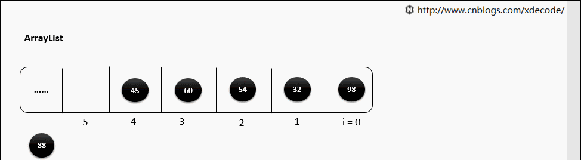

#### 2.2.2 Deleting Item（删除元素）

（1）末尾删除

删除 Array 末尾的元素，时间复杂度是 `O(1)`

（2）随机位置删除

如果要删除 Array 中间的元素，那么需要把 index 后面的所有元素依次向前移动一位，时间复杂度是 `O(n)`

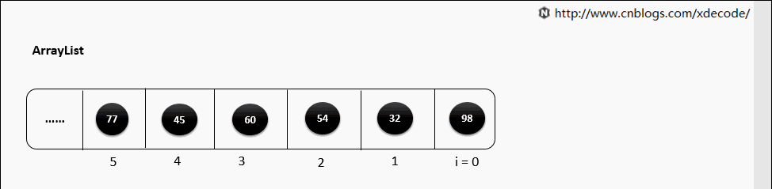

<a id="2-arrays-3-python-26c-2B-2B"></a>

### 2.3 Arrays in Python & C++

In Python, arrays are called `lists`. Lists are a very powerful data structure that can be used to store a wide variety of data.
Lists can be used to store numbers, strings, other lists, and even functions. Lists are also very flexible, as they can be resized and their contents can be changed.
Lists are also very easy to use, as they have a wide variety of built-in methods that can be used to manipulate them.

#### 2.3.1 Creating a list

To create a list, you simply need to put a comma-separated list of values in square brackets. For example:

```pycon
>>> my_list = [1, 2, 3, 4, 5]
>>> my_list
[1, 2, 3, 4, 5]

```

#### 2.3.2 C++ 例子

```cpp
#include <iostream> // header file for taking input and producing output
using namespace std;

int main()
{
	int array[4] = {1, 3, 5, 7}; // initializing an array of size 4
	int *ptr;										 // declaring a pointer

	cout << array[3] << "\n"; // gives the element at index 3
	cout << array[2] << "\n"; // gives the element at index 2

	cout << "==================================================\n";
	cout << "Displaying the Address of The Pointer of an Array";
	cout << "\n=================================================\n\n";

	int i;
	for (i = 0; i < 4; i++)
	{
		cout << "Address Of " << array[i] << " Using Array is ===> " << &array[i] << endl;
	}

	cout << "\n========================================\n";
	return 0;
}
```

运行

```bash
g++ array.cpp
./a.out

```

---

<a id="2-arrays-4-reverse_array"></a>

### 2.4 Reversing an Array

Solution Steps

- Place the two pointers (let start and end) at the start and end of the array.
- Swap arr[start] and arr[end]
- Increment start and decrement end with 1
- If start reached to the value length/2 or start ≥ end, then terminate otherwise repeat from step 2.

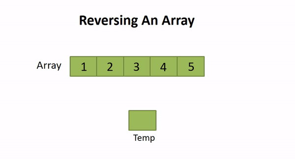

```python
from typing import List


def reverse_array(arr: List) -> List:
    start = 0
    end = len(arr) - 1

    while start < end:
        arr[start], arr[end] = arr[end], arr[start]
        start += 1
        end -= 1

    return arr


def reverse_array_pythonic(arr: List) -> List:

    return arr[::-1]


if __name__ == "__main__":
    arr = [1, 2, 3, 4, 5, 6]
    print(reverse_array(arr))
    print(arr)

    print(reverse_array_pythonic(arr))
```

#### 2.4.1 相关练习

（1）Integer reversion

[https://leetcode.com/problems/reverse-integer/](https://leetcode.com/problems/reverse-integer/)

```python
def reverse_integer1(x: int) -> int:
    if x < -(2**31) or x > 2**31 - 1:
        # if x is out of range,
        return 0
    if x < 0:  # for negative numbers, -100
        x = -x  # 100
        x = int(str(x)[::-1])  # '001' -> 1
        x = -x  # -1
    else:  # for positive numbers, 100
        x = int(str(x)[::-1])
    return x


def reverse_integer2(x: int) -> int:

    if x < -(2**31) or x > 2**31 - 1:
        # if x is out of range,
        return 0
    if x < 0:
        return -reverse_integer2(-x)
    else:
        result = 0
        while x > 0:
            result = result * 10 + x % 10
            x //= 10
        return result


if __name__ == "__main__":
    print(reverse_integer1(1230))
    print(reverse_integer1(-1230))
    print(reverse_integer2(1230))
    print(reverse_integer2(-1230))
```

（2）Palindrome Problem

[https://en.wikipedia.org/wiki/Palindrome](https://en.wikipedia.org/wiki/Palindrome)

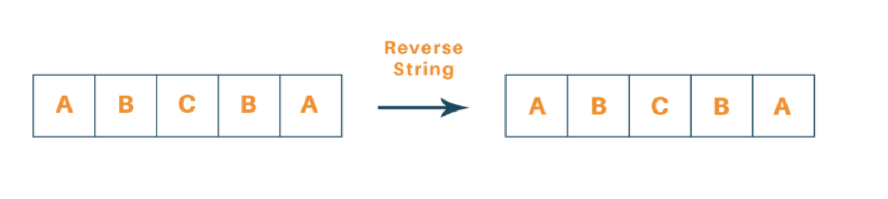

```python
def is_palindrome_pythonic(s):
    """Return True if the given string is a palindrome."""
    return s == s[::-1]


def is_palindrome(s):
    """Return True if the given string is a palindrome."""
    start_index = 0
    end_index = len(s) - 1
    while start_index < end_index:
        if s[start_index] != s[end_index]:
            return False
        start_index += 1
        end_index -= 1
    return True


def leetcode_valid_palindrome(s: str) -> bool:

    # https://leetcode.com/problems/valid-palindrome/

    if len(s) == 0:
        return True
    start = 0
    end = len(s) - 1

    while start < end:
        while start < end and not s[start].isalnum():
            start += 1
        while start < end and not s[end].isalnum():
            end -= 1

        if s[start].lower() != s[end].lower():
            return False

        start += 1
        end -= 1

    return True


if __name__ == "__main__":
    s = "abba"
    print(is_palindrome(s))
    s = "1A man, a plan, a canal: Panama1"
    print(leetcode_valid_palindrome(s))
```

LeetCode

[https://leetcode.com/problems/valid-palindrome/](https://leetcode.com/problems/valid-palindrome/)

[https://leetcode.com/problems/valid-palindrome-ii/](https://leetcode.com/problems/valid-palindrome-ii/)

[https://leetcode.com/problems/longest-palindromic-substring/](https://leetcode.com/problems/longest-palindromic-substring/)

[https://leetcode.com/problems/longest-palindromic-subsequence/](https://leetcode.com/problems/longest-palindromic-subsequence/)

[https://leetcode.com/problems/palindromic-substrings/](https://leetcode.com/problems/palindromic-substrings/)

#### 2.4.2 Dutch National Flag Problem

一个只有 0，1，2 三种元素的数组，要求把 0 放在前面，1 放在中间，2 放在后面。

解题思路总结成一句话就是，把 2 往后放，把 0 往前放。

具体思路如下，假如输入的是  `[2, 1, 0, 0, 1, 2]`

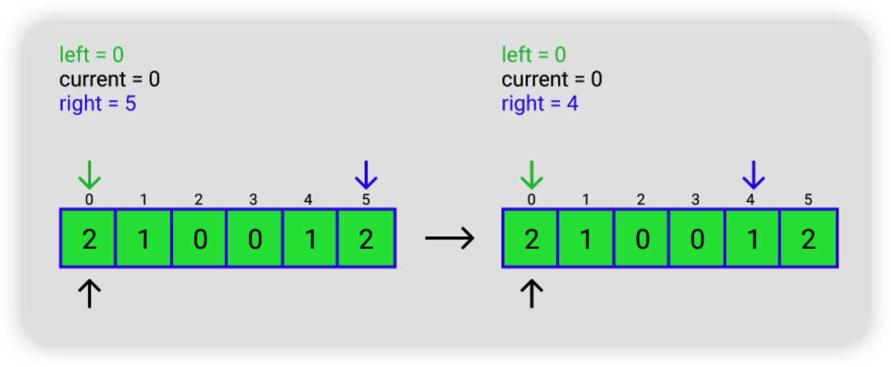
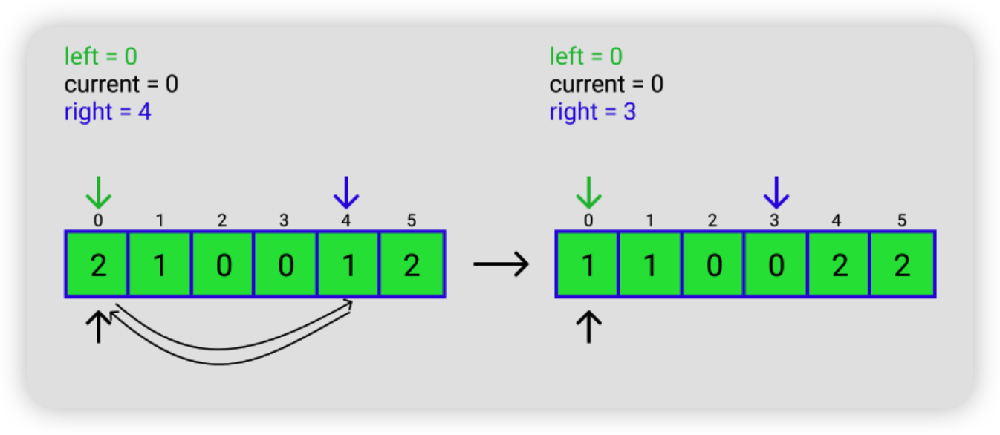
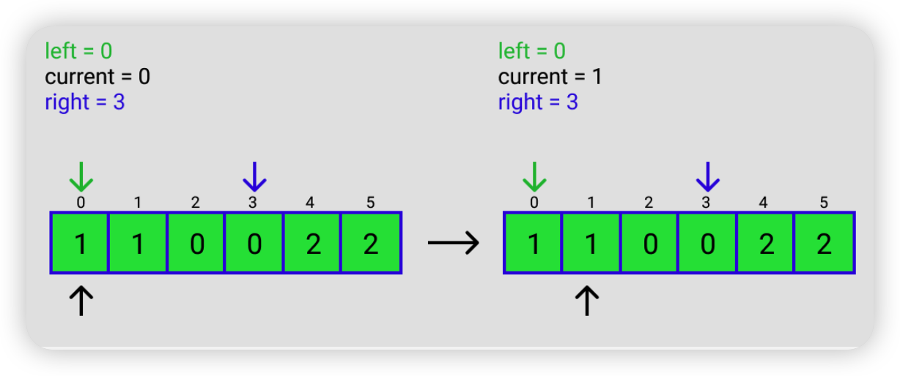
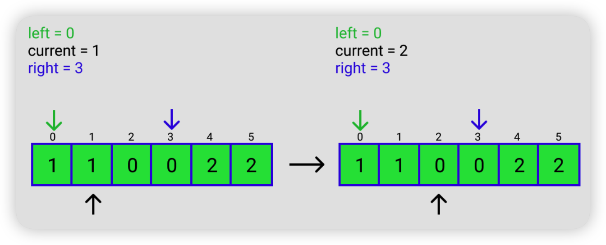
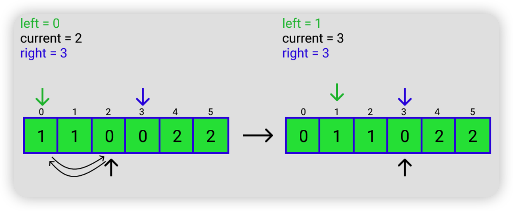
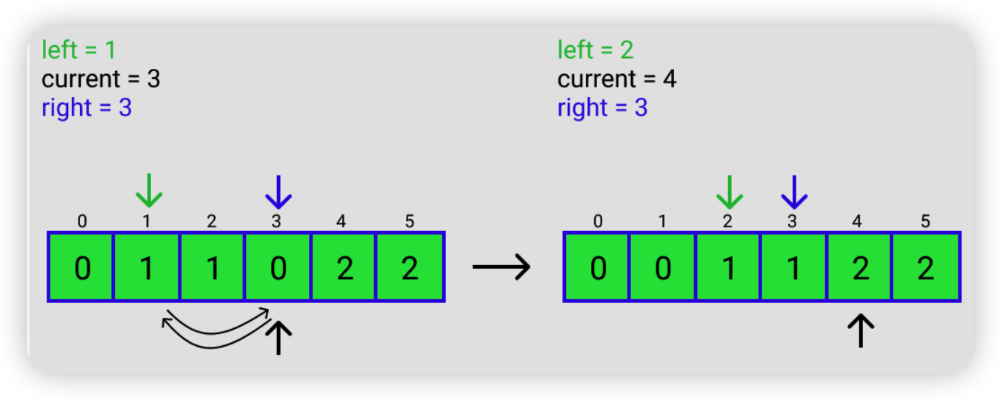

LeetCode

[https://leetcode.com/problems/sort-colors/](https://leetcode.com/problems/sort-colors/)

```python
def dutch_flag_problem(nums, pivot=1):
    i = 0
    j = 0
    k = len(nums) - 1

    while j <= k:

        if nums[j] < pivot:
            nums[i], nums[j] = nums[j], nums[i]
            i += 1
            j += 1
        elif nums[j] > pivot:
            nums[j], nums[k] = nums[k], nums[j]
            k = k - 1

        else:
            j += 1
    return nums


if __name__ == "__main__":

    nums = [1, 0, 2, 2, 1, 0, 0, 2, 1]
    print(dutch_flag_problem(nums, 1))
```

#### 2.4.3 Trapping Rain Water Problem

LeetCode

[https://leetcode.com/problems/trapping-rain-water/](https://leetcode.com/problems/trapping-rain-water/)

```python
# https://leetcode.com/problems/trapping-rain-water/


def trap(height):
    # fill in
    pass


# Trapping Rain Water within given set of bars
if __name__ == "__main__":
    heights = [5, 1, 2, 4, 4, 4, 3, 1, 0, 0, 0]
    print("Maximum amount of water that can be trapped is", trap(heights))


import unittest


class Test(unittest.TestCase):
    def test_1(self):
        assert trap([0, 0, 1, 0, 2, 1, 0, 1, 3, 2, 1, 2, 1, 0, 0]) == 6
        print("PASSED: `trap([0,0,1,0,2,1,0,1,3,2,1,2,1,0,0])` should return `6`")

    def test_2(self):
        assert trap([0, 0, 1, 0, 2, 4, 4, 4, 2, 3, 1, 0, 2, 4, 3, 1, 0, 1]) == 14
        print(
            "PASSED: `trap([0,0,1,0,2,4,4,4,2,3,1,0,2,4,3,1,0,1])` should return `14`"
        )

    def test_3(self):
        assert trap([0, 0, 1, 2, 4, 4, 4, 3, 1, 0, 0, 0]) == 0
        print("PASSED: `trap([0,0,1,2,4,4,4,3,1,0,0,0])` should return `0`")


if __name__ == "__main__":
    unittest.main(verbosity=2)
    print("Nice job, 3/3 tests passed!")
```

#### 2.4.4 Anagram Problem

Anagram 问题指的是判断两个字符串中的字符是否完全相同，只是顺序不同。例如，“listen”和“silent”就是一对 anagram

[https://leetcode.com/problems/valid-anagram/](https://leetcode.com/problems/valid-anagram/)

[https://leetcode.com/problems/find-all-anagrams-in-a-string/](https://leetcode.com/problems/find-all-anagrams-in-a-string/)

[https://leetcode.com/problems/group-anagrams/](https://leetcode.com/problems/group-anagrams/)

```python
"""
方法1：排序法

首先对两个字符串分别进行排序，如果它们排序后相等，那么这两个字符串就是anagram。
"""


def is_anagram(s1, s2):

    if len(s1) != len(s2):
        return False
    s1 = s1.lower()
    s2 = s2.lower()
    s1 = sorted(s1)
    s2 = sorted(s2)
    return s1 == s2


"""
方法2：哈希表法

可以使用哈希表来记录每个字符在字符串中出现的次数，如果两个字符串中每个字符出现的次数都相同，那么这两个字符串就是anagram。
"""

from collections import Counter


def is_anagram1(s1, s2):
    return Counter(s1) == Counter(s2)
```

## 3. DATA STRUCTURES - LINKED LIST

<a id="3-linked_list-1-linked_list"></a>

### 3.1 Linked Lists

链表（Linked List）是一种常见的数据结构，用于存储一系列元素，每个元素由一个值和一个指向下一个元素的指针组成。

[https://en.wikipedia.org/wiki/Linked_list](https://en.wikipedia.org/wiki/Linked_list)

链表可以分为单向链表和双向链表。

#### 3.1.1 单向链表

在单向链表中，每个节点都只有一个指针，指向下一个节点。

[https://en.wikipedia.org/wiki/Linked_list](https://en.wikipedia.org/wiki/Linked_list)

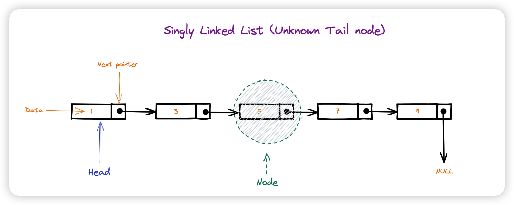
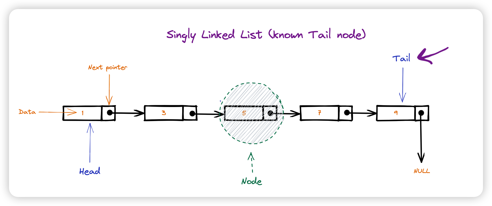

#### 3.1.2 双向链表

在双向链表中，每个节点都有两个指针，一个指向前一个节点，一个指向后一个节点。

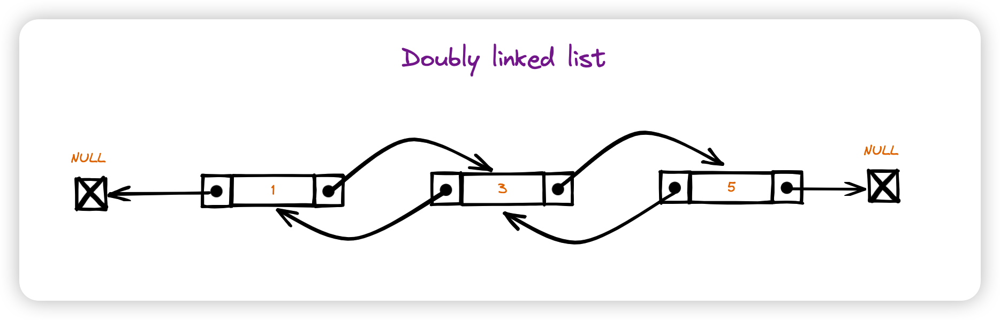

<a id="3-linked_list-2-operations"></a>

### 3.2 Operations

和 Array 对比一下

| Operations | Big-O (Array) | Big-O (singly linked list) | Big-O (doubly linked list) |
| --- | --- | --- | --- |
| 任意位置元素访问 | O(1) | O(n) | O(n) |
| 头部插入/删除 | O(n) | O(1) | O(1) |
| 尾部插入/删除 | O(1) | O(1)，或者 O(n)（取决于是否知道尾部） | O(1) |
| 任意位置插入删除 | O(n) | O(n) | O(n) |

#### 3.2.1 Linked Lists Advantages

linked list is dynamic data structure, it can grow and shrink in size during runtime. 操作第一个元素的速度非常快。

#### 3.2.2 Linked Lists Disadvantages

- need more memory to store the pointer to the next node
- need to traverse the list to find the last node， so the time complexity is O(n)
- can not go backwards, so it is not possible to find the previous node

#### 3.2.3 Linked List vs Array

（1）动态和静态

Linked list is dynamic, array is static.

（2）Random Access

Array 的元素是紧挨着的，所以可以通过 index 快速来访问，而 linked list 的元素是分散的，所以需要遍历整个 list 来访问。

（3）插入第一个元素

Array 需要移动所有的元素，所以时间复杂度是 O(n)，而 linked list 只需要改变 head 的指针，所以时间复杂度是 O(1)。

（4）插入最后一个元素

Array 只需要改变 tail 的指针，所以时间复杂度是 O(1)，而 linked list 需要遍历整个 list，所以时间复杂度是 O(n)。

（5）内存

Array 不需要额外的内存，Linked list 需要额外的内存来存储指向下一个元素的指针。

<a id="3-linked_list-3-linked_list_py"></a>

### 3.3 Linked List in Python

#### 3.3.1 Singly Linked List

```python
class Node:
    def __init__(self, data):
        self.data = data
        self.next = None


class LinkedList:
    def __init__(self) -> None:
        self.head = None
        self.tail = None

    def print_list(self):
        tmp = self.head
        while tmp:
            print(tmp.data, end=" ")
            tmp = tmp.next
            if tmp:
                print("-> ", end=" ")
        print()

    def append(self, value):
        # O(1) if know the tail
        new_node = Node(value)
        if self.head == None:
            self.head = new_node
            self.tail = new_node
        else:
            self.tail.next = new_node
            self.tail = new_node

    def prepend(self, value):
        # O(1)
        new_node = Node(value)
        if self.head == None:
            self.head = new_node
            self.tail = new_node
        else:
            new_node.next = self.head
            self.head = new_node

    def pop_first(self):
        # O(1)
        if self.head == None:
            return
        if self.head.next == None:
            self.head = None
            self.tail = None
            return

        tmp = self.head
        self.head = self.head.next
        tmp.next = None
        return tmp

    def pop(self):
        # O(N)
        if self.head == None:
            return
        if self.head.next == None:
            self.head = None
            self.tail = None
            return

        temp = self.head
        while temp.next.next:
            temp = temp.next

        temp.next = None
        self.tail = temp
        return temp

    def reverse(self, head):
        # # O(N)
        # if self.head == None:
        #     return
        # if self.head.next == None:
        #     return

        # prev = None
        # curr = self.head
        # after = curr.next

        # while after:
        #     curr.next = prev
        #     prev = curr
        #     curr = after
        #     after = after.next

        # curr.next = prev
        # self.head, self.tail = self.tail, self.head
        if not self.head:
            return None

        new_head = self.head
        if self.head.next:
            new_head = self.reverse(head=self.head.next)
            self.head.next.next = self.head

        self.head.next = None
        return new_head


if __name__ == "__main__":

    linkedlist = LinkedList()
    linkedlist.append(1)
    linkedlist.append(2)
    linkedlist.append(3)

    linkedlist.print_list()
    linkedlist.prepend(0)
    linkedlist.print_list()

    linkedlist.reverse(linkedlist.head)

    linkedlist.print_list()
```

#### 3.3.2 Doubly Linked List

```python
class Node:
    def __init__(self, data) -> None:
        self.data = data
        self.next = None
        self.prev = None


class DoublyLinkedList:
    def __init__(self) -> None:
        self.head = None
        self.tail = None

    def print_list(self):
        tmp = self.head
        while tmp:
            print(tmp.data, end=" ")
            tmp = tmp.next
            if tmp:
                print(" <-> ", end=" ")
        print()

    def append(self, value):
        # O(1) if know tail
        new_node = Node(value)
        if self.head == None:
            self.head = new_node
            self.tail = new_node
        else:
            self.tail.next = new_node
            new_node.prev = self.tail
            self.tail = new_node

    def prepend(self, value):
        # O(1)
        new_node = Node(value)
        if self.head == None:
            self.head = new_node
            self.tail = new_node
        else:
            new_node.next = self.head
            self.head.prev = new_node
            self.head = new_node

    def pop_first(self):
        # O(1)
        if self.head == None:
            return
        if self.head.next == None:
            self.head = None
            self.tail = None
            return

        temp = self.head
        self.head = self.head.next
        self.head.prev = None
        temp.next = None
        return temp

    def pop(self):
        # O(1)
        if self.head == None:
            return
        if self.head.next == None:
            self.head = None
            self.tail = None

        temp = self.tail
        self.tail = self.tail.prev
        self.tail.next = None
        temp.prev = None
        return temp


if __name__ == "__main__":

    dl = DoublyLinkedList()
    dl.append(1)
    dl.append(2)
    dl.append(3)
    dl.prepend(0)
    dl.prepend(-1)
    dl.print_list()

    dl.pop()
    dl.print_list()

    dl.pop_first()
    dl.print_list()
```

<a id="3-linked_list-4-leetcode-practise"></a>

### 3.4 Leetcode Practise

#### 3.4.1 Reverse Linked List

[https://leetcode.com/problems/reverse-linked-list/](https://leetcode.com/problems/reverse-linked-list/)

Solution

```python
# Definition for singly-linked list.
# class ListNode:
#     def __init__(self, val=0, next=None):
#         self.val = val
#         self.next = next
class Solution:
    def reverseList(self, head: Optional[ListNode]) -> Optional[ListNode]:
        if not head:
            return
        if head.next == None:
            return head

        prev = None
        curr = head
        after = curr.next

        while after:
            curr.next = prev
            prev = curr
            curr = after
            after = after.next

        curr.next = prev
        return curr

```

#### 3.4.2 Middle of the Linked List

[https://leetcode.com/problems/middle-of-the-linked-list/](https://leetcode.com/problems/middle-of-the-linked-list/)

#### 3.4.3 Palindrome Linked List

[https://leetcode.com/problems/palindrome-linked-list/](https://leetcode.com/problems/palindrome-linked-list/)

#### 3.4.4 Reverse Linked List II

[https://leetcode.com/problems/reverse-linked-list-ii/](https://leetcode.com/problems/reverse-linked-list-ii/)

## 4. DATA STRUCTURES - STACKS & QUEUES

<a id="4-stacks_queues-1-stacks"></a>

### 4.1 Stacks

Stack（堆栈）是一种线性数据结构，其操作遵循先进后出（LIFO），后进先出（FILO）的原则。

Stack is a linear data structure that follows a particular order in which the operations are performed.
The order may be `LIFO` (Last In First Out) or `FILO` (First In Last Out).
LIFO implies that the element that is inserted last, comes out first and FILO implies that the element that is inserted first, comes out last.

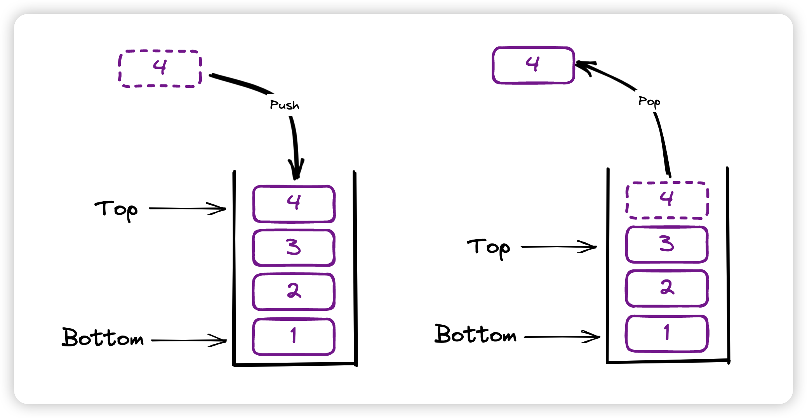

#### 4.1.1 operations

下面是每个操作的基本描述和时间复杂度分析：

- 入栈（push）操作：将元素压入栈顶。时间复杂度：O(1)
- 出栈（pop）操作：从栈顶弹出元素。时间复杂度：O(1)
- 查看栈顶元素（peek）操作：返回栈顶元素，但不弹出。时间复杂度：O(1)
- 判断栈是否为空（isEmpty）操作：判断栈是否为空。时间复杂度：O(1)

```python
class Stack:
    def __init__(self):
        self.items = []

    def push(self, item):
        self.items.append(item)

    def pop(self):
        if not self.is_empty():
            return self.items.pop()

    def peek(self):
        if not self.is_empty():
            return self.items[-1]

    def is_empty(self):
        return len(self.items) == 0

    def size(self):
        return len(self.items)
```

<a id="4-stacks_queues-2-queues"></a>

### 4.2 Queues

A Queue is defined as a linear data structure that is open at both ends and the operations are performed in First In First Out (`FIFO`) order.

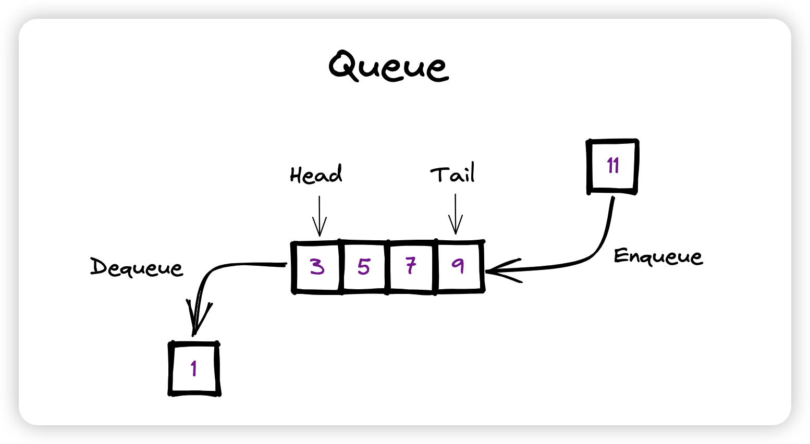

#### 4.2.1 Queue 的操作

- 入队（enqueue）操作：将元素加入队尾。时间复杂度：O(1)
- 出队（dequeue）操作：从队头弹出元素。时间复杂度：O(1)
- 查看队头元素（peek）操作：返回队头元素，但不弹出。时间复杂度：O(1)
- 判断队列是否为空（isEmpty）操作：判断队列是否为空。时间复杂度：O(1)

```python
class Queue:
    def __init__(self):
        self.items = []

    def enqueue(self, item):
        self.items.append(item)

    def dequeue(self):
        if not self.is_empty():
            return self.items.pop(0)

    def peek(self):
        if not self.is_empty():
            return self.items[0]

    def is_empty(self):
        return len(self.items) == 0

    def size(self):
        return len(self.items)
```

<a id="4-stacks_queues-3-practise"></a>

### 4.3 Practise

#### 4.3.1 Implement Stack using Queues

[https://leetcode.com/problems/implement-stack-using-queues/](https://leetcode.com/problems/implement-stack-using-queues/)

#### 4.3.2 Implement Queue using Stacks

[https://leetcode.com/problems/implement-queue-using-stacks/](https://leetcode.com/problems/implement-queue-using-stacks/)

#### 4.3.3 Min Stack

[https://leetcode.com/problems/min-stack/](https://leetcode.com/problems/min-stack/)

## 5. RECURSION

<a id="5-recursion-1-intro"></a>

### 5.1 Introduction

递归（recursion）是一种计算机科学中常用的技术，它是指在函数定义中使用函数自身的方法。简单来说，递归是一种自我调用的算法。

下面是一个使用递归计算阶乘的示例：

```python
def factorial(n):
    if n == 0:
        return 1
    else:
        return n * factorial(n - 1)


r = factorial(4)

print(r)
```

#### 5.1.1 LeetCode 练习

[https://leetcode.com/problems/reverse-linked-list/](https://leetcode.com/problems/reverse-linked-list/) 递归法解决反转链表

```python
# Definition for singly-linked list.
# class ListNode:
#     def __init__(self, val=0, next=None):
#         self.val = val
#         self.next = next
from typing import Optional


class ListNode:
    def __init__(self, val=0, next=None):
        self.val = val
        self.next = next


class Solution:
    def reverseList(self, head: Optional[ListNode]) -> Optional[ListNode]:

        if not head:
            return None

        new_head = head
        if head.next:
            new_head = self.reverseList(head=head.next)
            head.next.next = head

        head.next = None
        return new_head


s = Solution()
head = ListNode(
    val=1,
    next=ListNode(
        val=2, next=ListNode(val=3, next=ListNode(val=4, next=ListNode(val=5)))
    ),
)
s.reverseList(head=head)
```

## 6. DATA STRUCTURES - TREE

<a id="6-tree-1-intro"></a>

### 6.1 Introduction

树形数据结构是一种用于表示和组织数据的层次结构，以便于导航和搜索。
它是由节点和边连接而成的集合，并且节点之间具有层次关系。树的顶层节点称为根节点，其下方的节点称为子节点。每个节点可以有多个子节点，而这些子节点也可以有它们自己的子节点，形成一个递归结构。

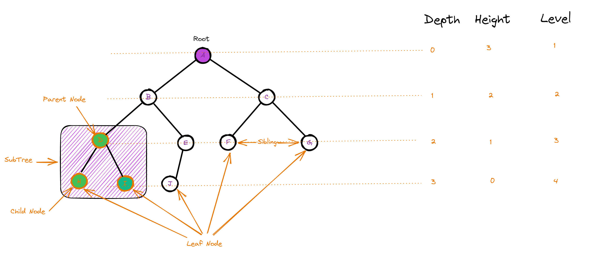

#### 6.1.1 高度深度和层

树的高度（Height）指的是从根节点到最远叶子节点的边数，也可以理解为树的深度（Depth）。

树的深度（Depth）指的是从根节点到当前节点的边数，也可以理解为节点的层数（Level）。

节点的层数（Level）是指从根节点开始，到该节点所经过的边数（不包括该节点所在的边），根节点的层数为 1

<a id="6-tree-2-bst"></a>

### 6.2 Binary Search Tree

#### 6.2.1 Binary Tree (二叉树)

二叉树是一种特殊的树形结构，它的每个节点最多只能有两个子节点。二叉树的子节点分为左子节点和右子节点.

#### 6.2.2 Binary Search Tree (二叉搜索树)

二叉搜索树是一种特殊的二叉树，它的每个节点都满足以下条件：

- 左子节点的值小于父节点的值
- 右子节点的值大于父节点的值

满二叉树（Full Binary Tree），也称为真二叉树或者严格二叉树，是一种特殊的二叉树，其中每个非叶子节点都恰好有两个子节点，并且所有叶子节点都在相同的深度上。

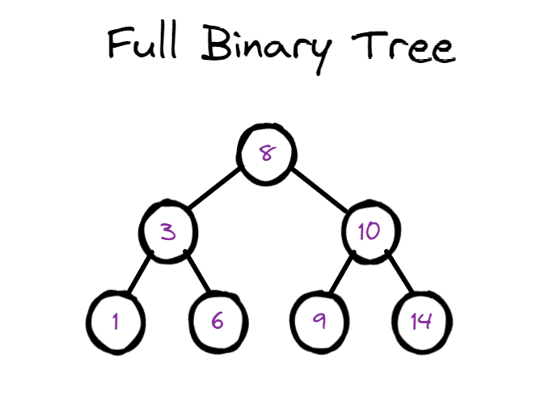
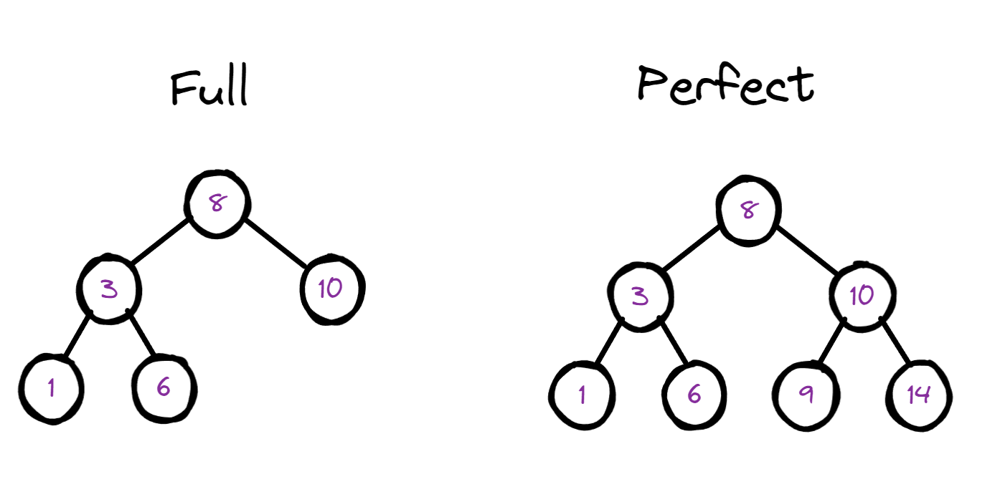
[https://en.wikipedia.org/wiki/Binary_search_tree](https://en.wikipedia.org/wiki/Binary_search_tree)

二叉搜索树（Binary Search Tree）是一种二叉树，其中每个节点最多有两个子节点。
对于任何一个节点，其左子树中的节点的值都小于该节点的值，右子树中的节点的值都大于该节点的值。
通过这种结构，可以快速地进行搜索、插入和删除等操作。

#### 6.2.3 Binary Search Tree Python 实现

```python
class Node:
    def __init__(self, value) -> None:
        self.value = value
        self.left = None
        self.right = None

    def __str__(self):
        return str(self.value)


class BinarySearchTree:
    def __init__(self) -> None:
        self.root = None

    def insert(self, value):

        new_node = Node(value)
        if self.root is None:
            self.root = new_node
            return True

        tmp_root = self.root

        while True:

            if new_node.value == tmp_root.value:
                return False

            elif new_node.value < tmp_root.value:

                if tmp_root.left is None:
                    tmp_root.left = new_node
                    return True
                tmp_root = tmp_root.left
            else:
                if tmp_root.right is None:
                    tmp_root.right = new_node
                    return True
                else:
                    tmp_root = tmp_root.right

    def search(self, value):

        tmp = self.root

        while tmp is not None:

            if value < tmp.value:
                tmp = tmp.left
            elif value > tmp.value:
                tmp = tmp.right

            else:
                return True
        return False

    def _r_search(self, current_root, value):

        if current_root == None:
            return False
        if value == current_root.value:
            return True

        if value < current_root.value:
            return self._r_search(current_root=current_root.left, value=value)
        if value > current_root.value:
            return self._r_search(current_root=current_root.right, value=value)

    def r_search(self, value):

        return self._r_search(self.root, value)

    def _r_insert(self, current_root, value):
        if current_root == None:
            return Node(value)

        if value < current_root.value:
            current_root.left = self._r_insert(
                current_root=current_root.left, value=value
            )
        if value > current_root.value:
            current_root.right = self._r_insert(
                current_root=current_root.right, value=value
            )
        if value == current_root.value:
            return current_root

    def r_insert(self, value):

        if self.root is None:
            self.root = Node(value)

        self._r_insert(self.root, value)


if __name__ == "__main__":

    bst = BinarySearchTree()

    for i in [8, 3, 10, 1]:
        bst.r_insert(i)

    print(bst.root)
    print(bst.root.left)
    print(bst.root.right)
```

<a id="6-tree-3-leetcode"></a>

### 6.3 LeetCode 练习

#### 6.3.1 Search in a Binary Search Tree

[https://leetcode.com/problems/search-in-a-binary-search-tree/description/](https://leetcode.com/problems/search-in-a-binary-search-tree/description/)

Solution

```python
# Definition for a binary tree node.
# class TreeNode:
#     def __init__(self, val=0, left=None, right=None):
#         self.val = val
#         self.left = left
#         self.right = right
class Solution:
    def searchBST(self, root: Optional[TreeNode], val: int) -> Optional[TreeNode]:
        if root is None:
            return None
        if val  root.val:
            return self.searchBST(root.right, val)
        else:
            return root

```

## 7. DATA STRUCTURES - GRAPHS

<a id="7-graphs-1-intro"></a>

### 7.1 Introduction

图（Graph）是一种常见的数据结构，用于表示节点之间的关系。
它由节点（Vertex 或 Node）和边（Edge）组成，其中节点表示图中的实体，而边表示这些实体之间的关系。
图可以用于表示许多实际应用场景，例如社交网络、道路网络、电路网络等等。

#### 7.1.1 相关术语

- Vertex： 节点
- Edge：连接节点的线
- Unweighted Graph: 非权重图
- Weighted Graph：权重图
- Undirected Graph：无向图
- Directed Graph：有向图
- Cyclic Graph：循环图
- Acyclic Graph：无环图
- Tree：有向无环图 （所有的树都是有向无环图，但并不是所有有向无环图是树

<a id="7-graphs-2-represent"></a>

### 7.2 图的表示

#### 7.2.1 Adjacency Matrix

邻接矩阵

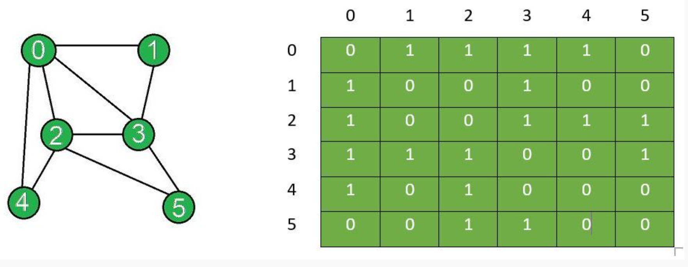

#### 7.2.2 Adjacency List

邻接列表

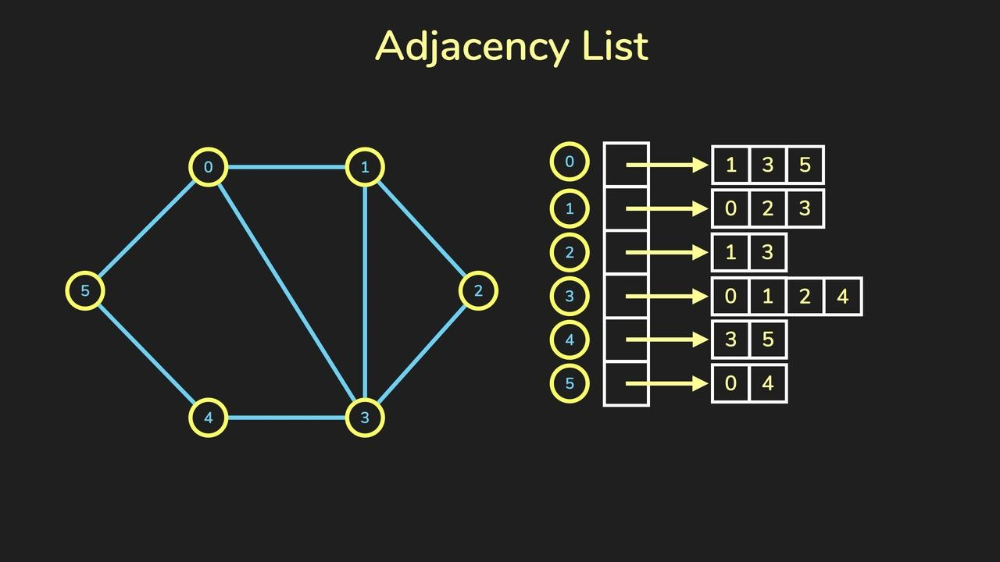
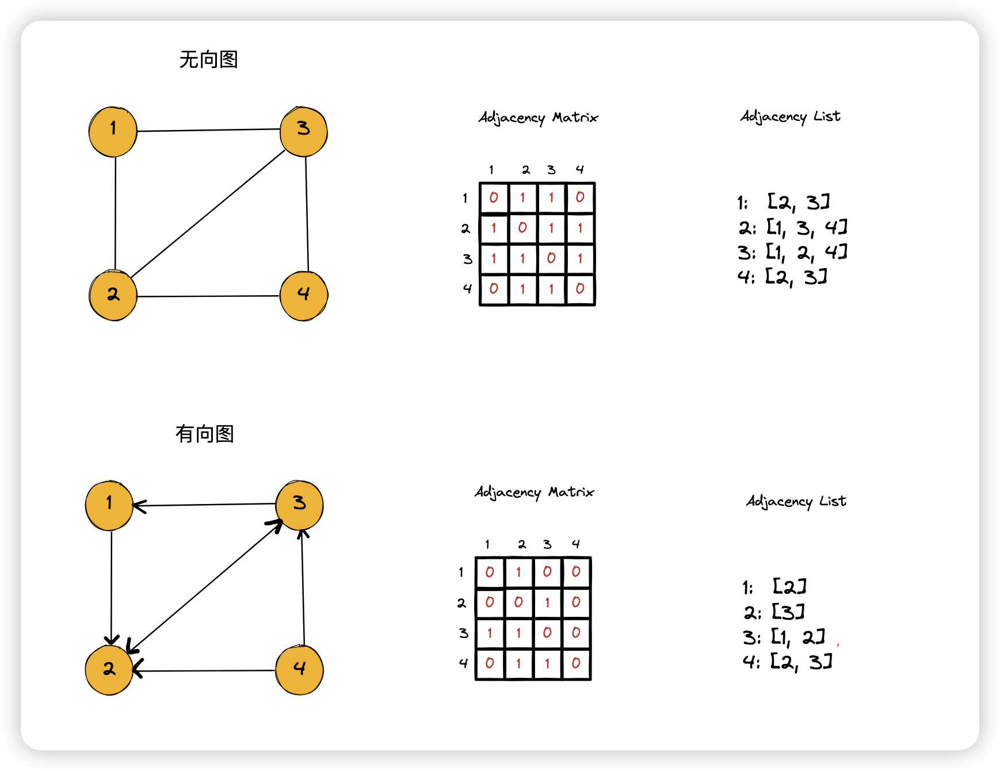
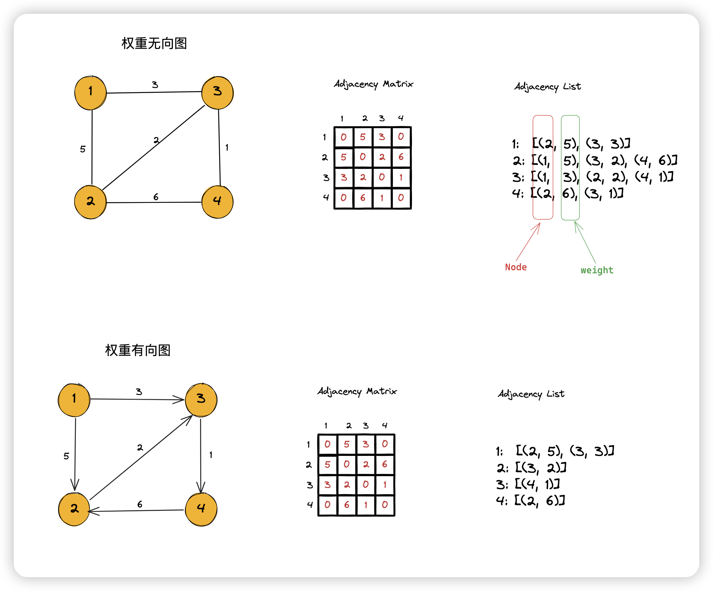

<a id="7-graphs-3-bigo"></a>

### 7.3 BIG O 分析

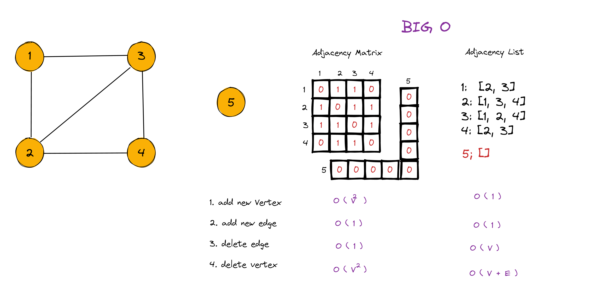

<a id="7-graphs-4-implement"></a>

### 7.4 用 Python 实现一个 Graph

基于邻接列表的存储方式，用 Python 实现一个 Graph，要求实现初始化，添加删除节点和边。

```python
class Graph:
    def __init__(self):

        self.adj_list = {}

    def print_graph(self):
        for vertex in self.adj_list:
            print(vertex, ":", self.adj_list[vertex])

    def add_vertex(self, vertex):

        if vertex not in self.adj_list:
            self.adj_list[vertex] = []
            return True
        return False

    def add_edge(self, v1, v2):

        if v1 in self.adj_list and v2 in self.adj_list:
            self.adj_list[v1].append(v2)
            self.adj_list[v2].append(v1)
            return True
        return False

    def delete_edge(self, v1, v2):
        if v1 in self.adj_list and v2 in self.adj_list:
            try:
                self.adj_list[v1].remove(v2)
                self.adj_list[v2].remove(v1)
            except ValueError:
                pass
            return True
        return False

    def delete_vertex(self, vertex):
        if vertex not in self.adj_list:
            return False
        for other_vertex in self.adj_list[vertex]:
            self.adj_list[other_vertex].remove(vertex)
        del self.adj_list[vertex]
        return True


graph = Graph()
graph.add_vertex("A")
graph.add_vertex("B")
graph.add_vertex("C")
graph.add_vertex("D")
graph.add_edge("A", "B")
graph.add_edge("A", "C")
graph.add_edge("B", "C")
print("before delete vertex: ")
graph.print_graph()
graph.delete_vertex("D")
graph.delete_vertex("C")
print("after delete vertex: ")
graph.print_graph()
```

## 8. TREE TRAVERSAL - 树的遍历

<a id="8-tree-traversal-1-intro"></a>

### 8.1 Tree Traversal 树的遍历

[https://en.wikipedia.org/wiki/Tree_traversal](https://en.wikipedia.org/wiki/Tree_traversal)

#### 8.1.1 深度优先搜索 Depth-first search

[https://en.wikipedia.org/wiki/Depth-first_search](https://en.wikipedia.org/wiki/Depth-first_search)

是一种用于遍历或搜索树或图的算法。这个算法会尽可能深地搜索树的分支。
当节点 v 的所在边都己被探寻过，搜索将回溯到发现节点 v 的那条边的起始节点。
这一过程一直进行到已发现从源节点可达的所有节点为止。
如果还存在未被发现的节点，则选择其中一个作为源节点并重复以上过程，整个进程反复进行直到所有节点都被访问为止.

分作前序遍历、中序遍历、后序遍历，前、中、后代表根节点在遍历时的位置。

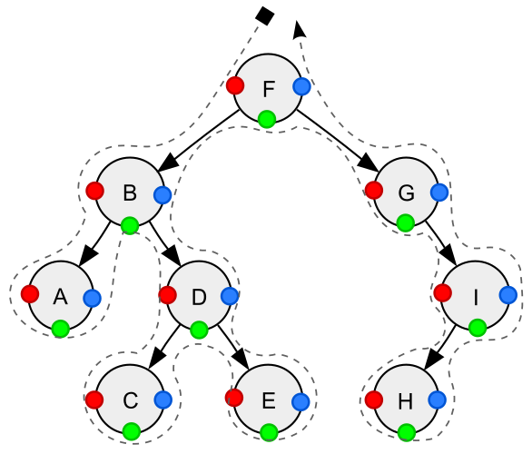
Depth-first traversal (dotted path) of a binary tree:

- Pre-order (node visited at position red)：F, B, A, D, C, E, G, I, H
- In-order (node visited at position green)：A, B, C, D, E, F, G, H, I
- Post-order (node visited at position blue)：A, C, E, D, B, H, I, G, F

Pre-order 的动画演示：

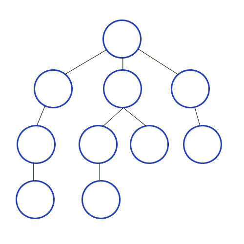

#### 8.1.2 广度优先搜索 Breadth-first search

[https://en.wikipedia.org/wiki/Breadth-first_search](https://en.wikipedia.org/wiki/Breadth-first_search)

又译作宽度优先搜索，或横向优先搜索，是一种图形搜索算法。简单的说，BFS 是从根节点开始，沿着树的宽度遍历树的节点。如果所有节点均被访问，则算法中止。

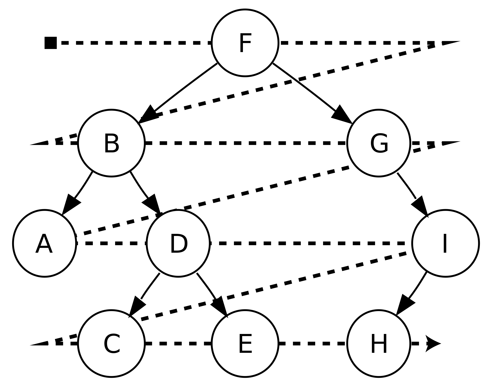
动画演示


<a id="8-tree-traversal-2-BFS"></a>

### 8.2 Breadth First Search 的实现

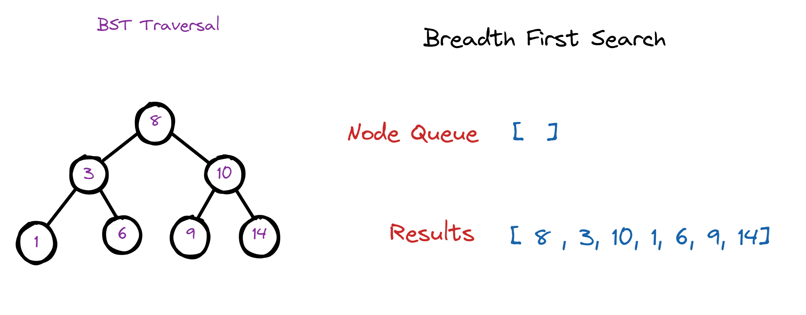

```python
class Node:
    def __init__(self, value) -> None:
        self.value = value
        self.left = None
        self.right = None

    def __str__(self):
        return str(self.value)


class BinarySearchTree:
    def __init__(self) -> None:
        self.root = None

    def insert(self, value):

        new_node = Node(value)
        if self.root is None:
            self.root = new_node
            return True

        tmp_root = self.root

        while True:

            if new_node.value == tmp_root.value:
                return False

            elif new_node.value < tmp_root.value:

                if tmp_root.left is None:
                    tmp_root.left = new_node
                    return True
                tmp_root = tmp_root.left
            else:
                if tmp_root.right is None:
                    tmp_root.right = new_node
                    return True
                else:
                    tmp_root = tmp_root.right

    def bfs(self):
        node_queue = []
        results = []
        current_node = self.root
        node_queue.append(current_node)

        while len(node_queue) > 0:
            current_node = node_queue.pop(0)
            results.append(current_node.value)
            if current_node.left is not None:
                node_queue.append(current_node.left)
            if current_node.right is not None:
                node_queue.append(current_node.right)
        return results


if __name__ == "__main__":

    bst = BinarySearchTree()

    for i in [8, 3, 10, 1, 6, 9, 14]:
        bst.insert(i)

    print(bst.bfs())
```

<a id="8-tree-traversal-3-DFS"></a>

### 8.3 Depth First Search 的实现

```python
class Node:
    def __init__(self, value) -> None:
        self.value = value
        self.left = None
        self.right = None

    def __str__(self):
        return str(self.value)


class BinarySearchTree:
    def __init__(self) -> None:
        self.root = None

    def insert(self, value):

        new_node = Node(value)
        if self.root is None:
            self.root = new_node
            return True

        tmp_root = self.root

        while True:

            if new_node.value == tmp_root.value:
                return False

            elif new_node.value < tmp_root.value:

                if tmp_root.left is None:
                    tmp_root.left = new_node
                    return True
                tmp_root = tmp_root.left
            else:
                if tmp_root.right is None:
                    tmp_root.right = new_node
                    return True
                else:
                    tmp_root = tmp_root.right

    def dfs_pre_order(self):
        results = []

        def traversal(current_node):
            results.append(current_node.value)
            if current_node.left is not None:
                traversal(current_node=current_node.left)
            if current_node.right is not None:
                traversal(current_node=current_node.right)

        traversal(self.root)

        return results

    def dfs_in_order(self):
        results = []

        def traversal(current_node):
            if current_node.left is not None:
                traversal(current_node=current_node.left)
            results.append(current_node.value)
            if current_node.right is not None:
                traversal(current_node=current_node.right)

        traversal(self.root)

        return results

    def dfs_post_order(self):
        results = []

        def traversal(current_node):
            if current_node.left is not None:
                traversal(current_node=current_node.left)
            if current_node.right is not None:
                traversal(current_node=current_node.right)
            results.append(current_node.value)

        traversal(self.root)

        return results


if __name__ == "__main__":

    bst = BinarySearchTree()

    for i in [8, 3, 10, 1, 6, 9, 14]:
        bst.insert(i)

    print(bst.dfs_post_order())
```

<a id="8-tree-traversal-4-leetcode"></a>

### 8.4 LeetCode 练习

#### 8.4.1 Validate Binary Search Tree

各大公司热门面试题

[https://leetcode.com/problems/validate-binary-search-tree/](https://leetcode.com/problems/validate-binary-search-tree/)

如何才算一个二叉搜索树？

- 当前节点的值大于其所有的左子树节点的值
- 当前节点的值小于其所有的右子树节点的值
- 当前节点的左子树和右子树也是二叉搜索树

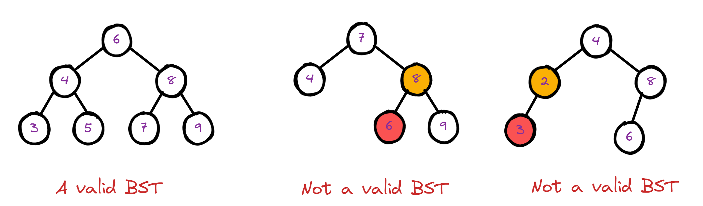
常用的解题方法

- 按二叉搜索树的定义，暴力比较
- 按 In order 遍历这个树，然后对遍历结果进行检查，看是否是顺序排列

（1）暴力解法

基本的逻辑：

- 如果 root 是 None，则返回 True
- 否则就已当前节点为 root 根节点，找到左子树的最大值，右子树的最小值
- 如果左子树的最大值比当前节点的值大，或者右子树的最小值比当前节点值小，返回 False
- 否则就继续查找，以当前节点的左右节点分别为根节点，进行递归检查

参考代码

```python
# Definition for a binary tree node.
# class TreeNode:
#     def __init__(self, val=0, left=None, right=None):
#         self.val = val
#         self.left = left
#         self.right = right
class Solution:
    def isValidBST(self, root: Optional[TreeNode]) -> bool:

        if root is None:
            return True
        if root.left:
            if root.val <= self.find_max(root.left):
                return False
        if root.right:
            if root.val >= self.find_min(root.right):
                return False

        if self.isValidBST(root.left) and self.isValidBST(root.right):
            return True
        return False

    def find_max(self, root):

        # 最大值在右子树的最右一个节点
        while root.right:
            root = root.right
        return root.val

    def find_min(self, root):
        while root.left:
            root = root.left

        return root.val
```

暴力解法的优化

```python
# Definition for a binary tree node.
# class TreeNode(object):
#     def __init__(self, x):
#         self.val = x
#         self.left = None
#         self.right = None


class Solution(object):
    def isValidBST(self, root):
        return self.isValidBSTRecu(root, float("-inf"), float("inf"))

    def isValidBSTRecu(self, root, low, high):
        if root is None:
            return True

        return (
            low < root.val
            and root.val < high
            and self.isValidBSTRecu(root.left, low, root.val)
            and self.isValidBSTRecu(root.right, root.val, high)
        )
```

（2）DFS In Order 遍历

参考代码

```python
# Definition for a binary tree node.
# class TreeNode:
#     def __init__(self, val=0, left=None, right=None):
#         self.val = val
#         self.left = left
#         self.right = right
class Solution:
    def dfs(self, root):
        # in order DFS
        results = []

        def traversal(current_node):
            if current_node.left is not None:
                traversal(current_node.left)
            results.append(current_node.val)
            if current_node.right is not None:
                traversal(current_node.right)

        traversal(root)
        return results

    def isValidBST(self, root: Optional[TreeNode]) -> bool:

        results = self.dfs(root)

        i = 1
        flag = 1
        while i < len(results):
            if results[i] <= results[i - 1]:
                flag = 0
                break
            i += 1
        return True if flag == 1 else False
```

代码优化

```python
# Definition for a binary tree node.
# class TreeNode:
#     def __init__(self, val=0, left=None, right=None):
#         self.val = val
#         self.left = left
#         self.right = right
class Solution:
   def dfs(self, root):
       # in order DFS
       self.flag = 1
       self.pre_node = None

       def traversal(current_node):
           if self.flag != 1:
               return
           if current_node.left is not None:
               traversal(current_node.left)
           # results.append(current_node.val)
           if self.pre_node:
               if self.pre_node.val >= current_node.val:
                   self.flag = 0
           self.pre_node = current_node

           if current_node.right is not None:
               traversal(current_node.right)

       traversal(root)
       return True if self.flag == 1 else False

   def isValidBST(self, root: Optional[TreeNode]) -> bool:

       return self.dfs(root)

```

## 9. GRAPH TRAVERSAL - 图的遍历

<a id="9-graph-traversal-1-intro"></a>

### 9.1 图的遍历

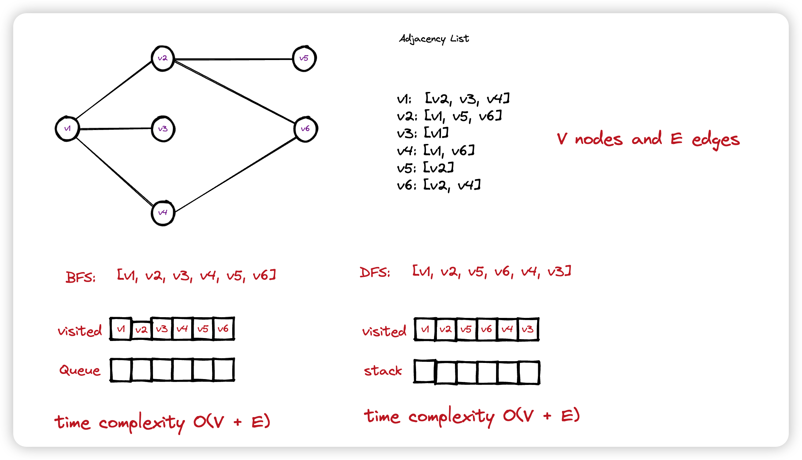

<a id="9-graph-traversal-2-bfs"></a>

### 9.2 BFS Python

```python
graph = {
   "v1": ["v2", "v3", "v4"],
   "v2": ["v1", "v5", "v6"],
   "v3": ["v1"],
   "v4": ["v1", "v6"],
   "v5": ["v2"],
   "v6": ["v2", "v4"],
}
visited = []  # List for visited nodes.
queue = []  # Initialize a queue

def bfs(graph, node):  # function for BFS

   visited.append(node)
   queue.append(node)

   while queue:
       m = queue.pop(0)
       for neighbor in graph[m]:
           if neighbor not in visited:
               visited.append(neighbor)
               queue.append(neighbor)

bfs(graph=graph, node="v1")

print(visited)

```

<a id="9-graph-traversal-3-dfs"></a>

### 9.3 DFS Python

非递归

```python
from collections import deque
graph = {
   "v1": ["v2", "v3", "v4"],
   "v2": ["v1", "v5", "v6"],
   "v3": ["v1"],
   "v4": ["v1", "v6"],
   "v5": ["v2"],
   "v6": ["v2", "v4"],
}

visited = []
stack = deque()

def dfs(graph, node):

   stack.append(node)
   while len(stack) > 0:

       node = stack.pop()
       if node not in visited:
           visited.append(node)
       for neighbor in graph[node]:
           if neighbor not in visited:
               stack.append(neighbor)

dfs(graph=graph, node="v1")
print(visited)

```

递归

```python
graph = {
   "v1": ["v2", "v3", "v4"],
   "v2": ["v1", "v5", "v6"],
   "v3": ["v1"],
   "v4": ["v1", "v6"],
   "v5": ["v2"],
   "v6": ["v2", "v4"],
}
visited = []

def dfs(visited, graph, node):  # function for dfs
   if node not in visited:
       visited.append(node)
       for neighbour in graph[node]:
           dfs(visited, graph, neighbour)

# Driver Code
print("Following is the Depth-First Search")
dfs(visited, graph, "v1")
print(visited)

```

## 10. BASIC SORT - 基本排序

<a id="10-basic-sort-1-bubble-sort"></a>

### 10.1 Bubble Sort 冒泡排序

[https://en.wikipedia.org/wiki/Bubble_sort](https://en.wikipedia.org/wiki/Bubble_sort)

冒泡排序的Python实现

```python
def bubble_sort(array):
   n = len(array)
   for i in range(n):
       for j in range(0, n - i - 1):
           if array[j] > array[j + 1]:
               array[j], array[j + 1] = array[j + 1], array[j]

array = [5, 1, 4, 2, 8]
bubble_sort(array=array)

print(array)

```

<a id="10-basic-sort-2-select-sort"></a>

### 10.2 Select Sort

选择排序的Python实现

```python
def selection_sort(arr):
   n = len(arr)
   for i in range(n):
       min_index = i
       for j in range(i + 1, n):
           if arr[j] < arr[min_index]:
               min_index = j

       if min_index != i:

           arr[i], arr[min_index] = arr[min_index], arr[i]

arr = [5, 1, 4, 2, 8]
selection_sort(arr)

print(arr)

```

<a id="10-basic-sort-3-insert-sort"></a>

### 10.3 Insert Sort

插入排序的Python实现

```python
def insertion_sort(arr):
   for i in range(1, len(arr)):
       current_value = arr[i]
       position = i
       while position > 0 and current_value < arr[position - 1]:
           arr[position] = arr[position - 1]
           position -= 1

       arr[position] = current_value

   return arr

arr = [5, 1, 4, 2, 8]
insertion_sort(arr=arr)
print(arr)

```

## 11. MERGE SORT - 归并排序

<a id="11-merge-sort-1-merge-sort"></a>

### 11.1 Merge Sort

Merge Sort的Python实现

```python
def merge(l1, l2):
   result = []
   i = j = 0
   while i  l2[j]:
           result.append(l2[j])
           j += 1

       elif l1[i] < l2[j]:
           result.append(l1[i])
           i += 1
       else:
           result.append(l1[i])
           result.append(l2[j])
           i += 1
           j += 1

   while i < len(l1):
       result.append(l1[i])
       i += 1

   while j < len(l2):
       result.append(l2[j])
       j += 1

   return result

def merge_sort(my_list):

   if len(my_list) == 1:
       return my_list

   mid_index = int(len(my_list) / 2)

   left = merge_sort(my_list[:mid_index])
   right = merge_sort(my_list[mid_index:])

   return merge(left, right)

result = merge_sort([6, 6, 3, 1, 8, 7, 2, 6])
print(result)

```

## 12. QUICK SORT - 快排

<a id="12-quick-sort-1-quick-sort"></a>

### 12.1 Quick Sort 快排

Quick Sort的Python实现

```python
def pivot(my_list, start_index, end_index):
   pivot_index = start_index
   swap_index = pivot_index
   swap = False
   for i in range(pivot_index + 1, end_index + 1):
       if my_list[i]  my_list[pivot_index]:
           i += 1
           swap = True

   my_list[pivot_index], my_list[swap_index] = (
       my_list[swap_index],
       my_list[pivot_index],
   )

   return swap_index

my_list = [6, 5, 3, 1, 8, 7, 2, 4]

def quick_sort(my_list, start_index, end_index):

   if start_index < end_index:

       pivot_index = pivot(my_list, start_index, end_index)

       quick_sort(my_list, start_index, pivot_index)
       quick_sort(my_list, pivot_index + 1, end_index)

quick_sort(my_list, 0, len(my_list) - 1)

print(my_list)

```
