# 7节课搞定毕业答辩PPT

> 本文根据课程视频语音转写整理。字幕由 `faster-whisper` 生成，内容经过结构化归纳和明显识别错误校正，不是官方逐字稿。

## 1. 文案梳理和逻辑结构组织

本节课解决的问题：在打开 PowerPoint 之前，先把论文内容整理成适合答辩演讲的结构。毕业答辩 PPT 不是把论文内容机械搬进幻灯片，而是把论文内容重新梳理、提炼、组织，再翻译成视觉化表达。

### 1.1 先梳理文案，再进入设计

论文通常是完整的 Word 文档，而答辩 PPT 是服务于现场讲解的演示文稿。两者的表达方式不同，所以从论文到 PPT 的第一步不是排版和美化，而是文案梳理。

做 PPT 的表达目标可以概括为：

- 想清楚：知道要讲什么
- 说明白：知道按什么顺序讲
- 呈现出来：知道用什么形式把内容放到页面上

也就是说，PPT 制作包含两个先后关系很明确的阶段：

```text
先有文案逻辑 -> 再做视觉设计
```

#### 1.1.1 常见的内容逻辑问题

答辩 PPT 常见的问题主要有两类：

- 整个文档条理不清晰，没有明确的逻辑架构。
- 单页内容难以理解，页面内部缺少层次。

这类问题不能只靠换模板、改字体、调配色解决。页面不好看有时只是表象，根本原因可能是内容没有经过充分梳理。

#### 1.1.2 答辩 PPT 的核心任务

答辩 PPT 的核心任务不是展示论文全文，而是帮助听众快速理解：

- 研究背景
- 问题和目标
- 使用的方法
- 得到的结果
- 结论和价值

因此，制作前要先把论文内容压缩成清晰的表达结构。

### 1.2 用金字塔原理梳理论文内容

金字塔原理是一种用于思考、表达和解决问题的逻辑方法。应用到 PPT 制作中，它可以帮助我们把论文内容整理成重点突出、逻辑清晰、主次分明的结构。

简单来说，金字塔原理要求：

```text
先表明中心结论 -> 再展开分论点 -> 再用子论点和材料支撑
```

这正好对应答辩 PPT 的表达方式：先让观众知道你要说明什么，再逐层解释为什么。

#### 1.2.1 结论先行

结论先行，就是先把中心观点直接抛出来，再阐述支撑这个结论的内容。

如果不提前给出核心结论，观众会一边看 PPT 一边自己猜测你的意图。不同观众可能形成不同理解，既增加理解负担，也容易造成信息偏差。

答辩 PPT 中建议优先做到：

- 每个章节先给出核心结论或主要观点。
- 每一页尽量有明确的页面主旨。
- 页面中的材料要服务于主旨，而不是堆满所有细节。

#### 1.2.2 以上统下

以上统下强调表达时要自上而下：

- 先重要，后次要
- 先全局，后具体
- 先结论，后论述
- 先论点，后论据
- 先结果，后原因

不过，在整理内容、形成结论的过程中，思考路径可以是自下而上的。

如果主题清晰、结论明确，可以直接自上而下列出关键论点，再梳理它们之间的关系。

如果主题模糊、结论不明确，则需要从底层材料开始，自下而上概括关键要点，最后提炼出中心结论。

#### 1.2.3 归类分组

归类分组要求同一组内容属于同一范畴。对应到 PPT 中，就是把具有共同属性的信息组织到一起，减少观众需要同时处理的信息点。

如果信息没有经过归纳和分组，观众接收时容易混乱。合理分组能让内容变得更容易理解，也能帮助后续页面设计。

金字塔结构中的内容关系可以从两个方向看：

- 纵向：下一级内容支撑上一级内容，上一级内容概括下一级内容。
- 横向：同一组内容应属于同一逻辑范畴。

#### 1.2.4 逻辑递进

逻辑递进要求同一组内容按照清楚的顺序展开。常见顺序包括：

- 时间顺序：按事情发生或研究推进的先后组织。
- 流程顺序：按操作步骤或方法流程组织。
- 程度顺序：按重要性、影响程度或层级关系组织。
- 因果顺序：按原因、过程、结果组织。

答辩 PPT 中，每组信息都要能回答“为什么按这个顺序讲”。

### 1.3 构建答辩 PPT 的思维导图

把论文内容整理成金字塔结构后，可以用思维导图把结构可视化。思维导图相当于 PPT 制作前的提纲，它帮助我们从整体上规划内容。

常用工具包括：

- 幕布
- XMind
- 百度脑图
- 纸笔手写

工具本身没有绝对优劣，关键是能帮助自己完成思考和梳理。手写适合快速构思，软件适合后续整理、沟通和复用。

#### 1.3.1 幕布的基本操作

使用幕布整理内容时，可以先用大纲方式输入，再切换成思维导图。

常用操作：

- `Tab`：下沉到下一层级
- `Shift + Tab`：提升到上一层级
- 点击思维导图按钮：把大纲切换成脑图形式
- 根据需要调整导图布局和颜色

这种方式适合先把课程、论文或答辩内容按层级列出来，再检查结构是否清楚。

#### 1.3.2 思维导图要细化到页面层级

答辩 PPT 的思维导图不能只停留在章节标题层面，还要继续细分到每一页幻灯片。

整理时要注意：

- 每个分支如果还能继续展开，就继续细分。
- 最终每个关键节点最好能对应一页 PPT。
- 各部分内容要尽量做到相互独立、完全穷尽。

这里的“相互独立、完全穷尽”可以理解为：

- 不重复：同一内容不要在多个章节里反复出现。
- 不遗漏：关键论点和必要支撑材料不要缺失。

### 1.4 根据思维导图规划 PPT 结构

小时候写作文前会先写提纲，PPT 设计也是同样的逻辑。没有整体框架，制作过程中就容易迷失方向，最后变成一页一页孤立的海报。

答辩 PPT 是线性浏览工具，观众会按页面顺序理解内容。一个文档可能包含二十页甚至更多页面，这些页面需要连贯起来，才能形成完整表达。

从这个角度看，PPT 更像一个网站：

- 每个章节像一个频道。
- 每个页面像一个栏目页。
- 所有页面共同服务于整体信息传递。

因此，PPT 中每一页都应该有存在的理由，也应该能解释它与前后页面的结构关系。

#### 1.4.1 PPT 是把文案翻译成视觉语言

当思维导图整理完成后，PPT 的整体框架其实已经形成了。后续制作过程，就是把文字结构转化成视觉表达。

可以这样理解：

```text
论文内容 -> 金字塔结构 -> 思维导图 -> PPT 页面结构 -> 视觉化表达
```

每个分论点对应相应论据，每一页展开后也应该有自己的小型金字塔结构。

#### 1.4.2 使用 PowerPoint 的“节”管理结构

Office 2013 及以上版本中，PowerPoint 提供了“节”的功能，可以用来管理复杂文档结构。

基本操作：

- 在左侧缩略图区域右键
- 选择“新增节”
- 给节命名，例如“背景介绍”“研究思路与方法”等
- 把对应页面归入该节
- 根据需要折叠、展开、移动、删除或重命名节

使用“节”的好处：

- 可以从全局查看 PPT 的结构。
- 可以快速判断每个部分包含多少页。
- 方便在幻灯片浏览视图中检查整体逻辑。
- 便于后续调整章节顺序和页面归属。

### 1.5 本节总结

第一节课的核心是：答辩 PPT 制作前，要先完成文案梳理和结构规划。

关键流程：

```text
整理论文内容
-> 用金字塔原理提炼逻辑
-> 用思维导图规划结构
-> 细化到每一页 PPT
-> 用 PowerPoint 的“节”管理页面
```

需要记住的重点：

- PPT 不是论文搬运，而是面向答辩场景的重新表达。
- 先解决“讲什么、怎么讲”，再解决“怎么设计”。
- 金字塔原理能帮助内容结论先行、层次清楚。
- 思维导图是 PPT 制作前的结构草稿。
- PowerPoint 的“节”可以帮助管理长文档结构。

## 2. 毕业答辩 PPT 主题框架的设计

本节课开始进入 PowerPoint 软件层面的设计。核心目标不是从零手动画出所有页面，而是先建立一套统一的主题框架，再借助全局化设置和 `iSlide` 插件提高制作效率。

### 2.1 全局化设计思维

毕业答辩 PPT 通常页数较多，而且修改次数也多。如果每一页都单独改字体、颜色、行间距和版式，后期会非常低效。

全局化设计思维的核心是：

```text
先建立统一规则 -> 再填充页面内容 -> 后期修改时全局联动
```

这样可以避免把时间浪费在重复修改上。

#### 2.1.1 文本规范

PPT 中最多的内容通常是文字，后期修改最多的也往往是文字。建立统一的字体规则，可以减少大量重复操作。

**主题字体**

PowerPoint 默认字体通常不是最终想要的效果。与其每插入一个文本框都重新设置字体，不如直接修改当前文档的主题字体。

操作路径：

```text
设计 -> 字体 -> 自定义字体
```

<p align="center">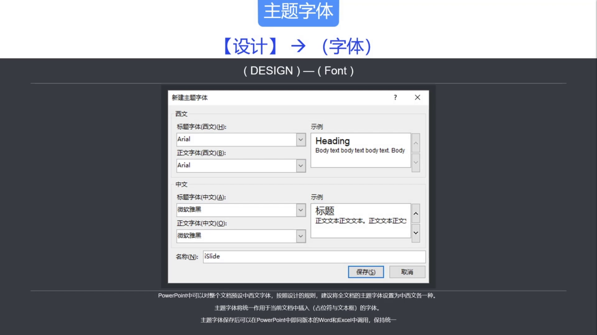</p>

设置主题字体时，一般不需要过度区分标题和正文。中西文各使用一种稳定字体即可。保存后，后续新输入的文字会自动适配当前主题字体。

**粘贴时保留纯文本**

从外部复制文字到 PPT 时，很容易把原来的字体、字号、颜色一起带入，导致文档字体越来越混乱。

建议粘贴时选择：

```text
右键 -> 粘贴选项 -> 只保留文本
```

这样粘贴进来的文字会适配当前 PPT 的主题字体。

**替换字体**

如果文档已经出现多种字体，可以使用 PowerPoint 自带的“替换字体”功能统一。

操作路径：

```text
开始 -> 替换 -> 替换字体
```

<p align="center">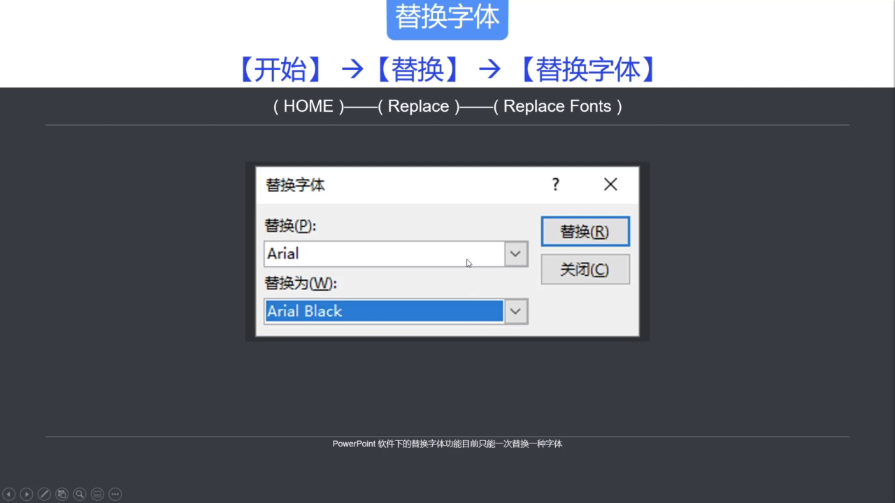</p>

它的限制是一次只能替换一种字体。如果文档中字体种类很多，需要逐个替换。

更高效的方式是使用 `iSlide` 的“一键优化”功能：

```text
iSlide -> 一键优化 -> 统一字体
```

如果原文档没有按主题字体制作，可以使用强制模式做一次统一。

**行间距**

中文 PPT 中，默认 `1.0` 倍行间距容易显得文字密集。文字较多时，建议设置为：

```text
1.2 - 1.5 倍行间距
```

<p align="center">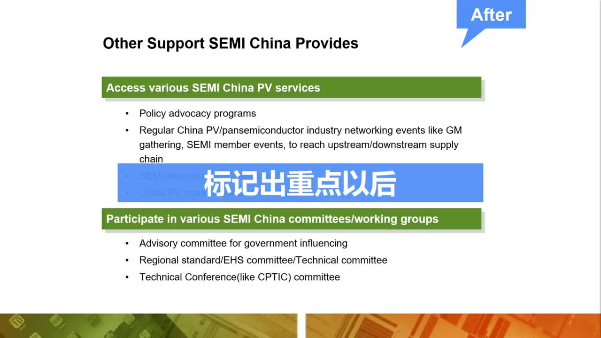</p>

PowerPoint 自带行间距设置需要逐个文本框修改。若需要全文档统一，可以使用：

```text
iSlide -> 一键优化 -> 统一段落
```

设置好行间距后，选择所有幻灯片并应用。

**默认文本框**

设置好一个文本框的完整格式后，可以把它设为默认文本框。

操作方式：

```text
选中文本框 -> 右键 -> 设置为默认文本框
```

后续新插入的文本框会继承它的格式，包括字体、颜色、段落和行间距。

PPT 中可以设置默认样式的对象主要有三类：

- 文本框
- 图形
- 线条

<p align="center">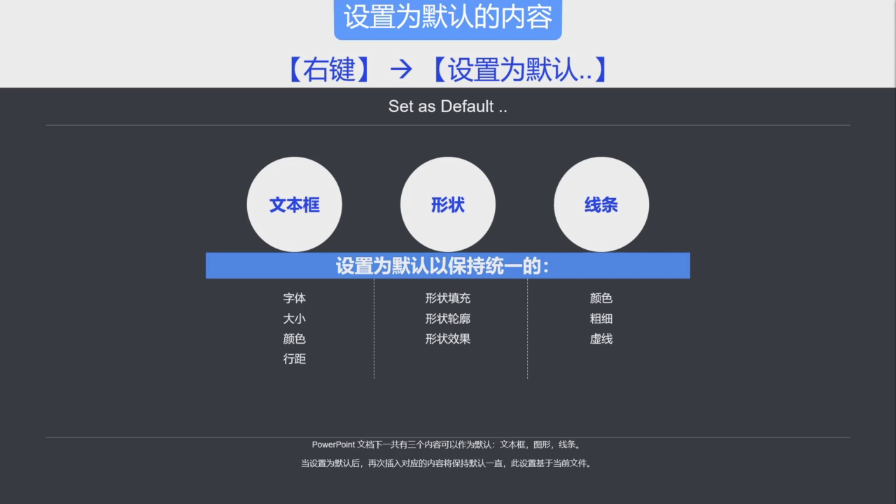</p>

这些默认设置保存在当前文档中。文档复制到其他电脑后，默认样式仍然存在。

#### 2.1.2 色彩规范

色彩用于建立识别、区分层级和突出重点。毕业答辩 PPT 不需要复杂配色，但需要避免颜色杂乱。

**主题颜色**

PowerPoint 中有“主题颜色”的概念。图表、表格、SmartArt 等对象会根据当前文档的主题颜色自动适配。

每个 PPT 文档可以预置一套主题颜色。不同文档之间复制粘贴内容时，颜色可能发生变化，原因通常就是两个文档的主题颜色不同。

例如，从 Excel 复制图表到 PPT 后，图表颜色可能被自动替换为当前 PPT 的主题色。

**主题色与图表颜色**

PPT 图表中的默认柱状图颜色，通常会按主题颜色中的“着色 1”到“着色 6”依次使用。

<p align="center">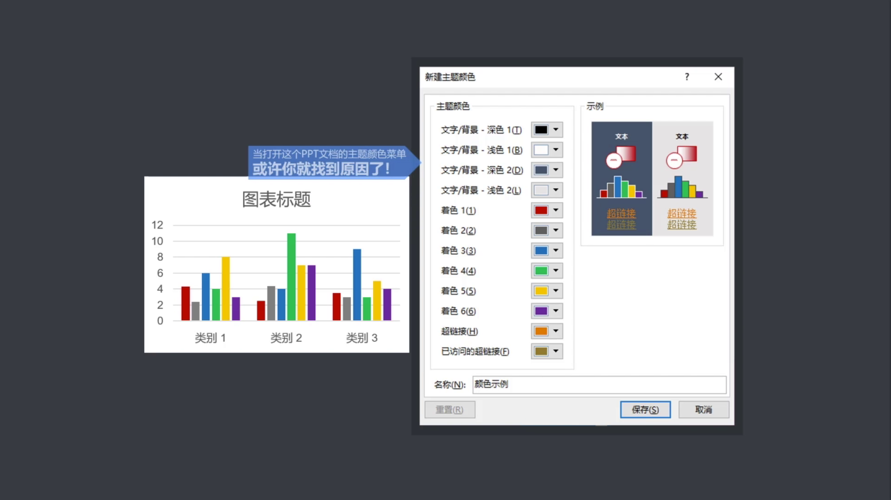</p>

因此，想让图表、表格和图示颜色统一，关键不是逐个对象改颜色，而是先设置好主题颜色。

**使用 iSlide 色彩库**

如果没有配色经验，可以直接使用 `iSlide` 色彩库。它提供了设计师搭配好的配色方案，可以一键应用到当前文档。

基本流程：

```text
iSlide -> 色彩库 -> 选择配色 -> 应用到全部页面
```

<p align="center">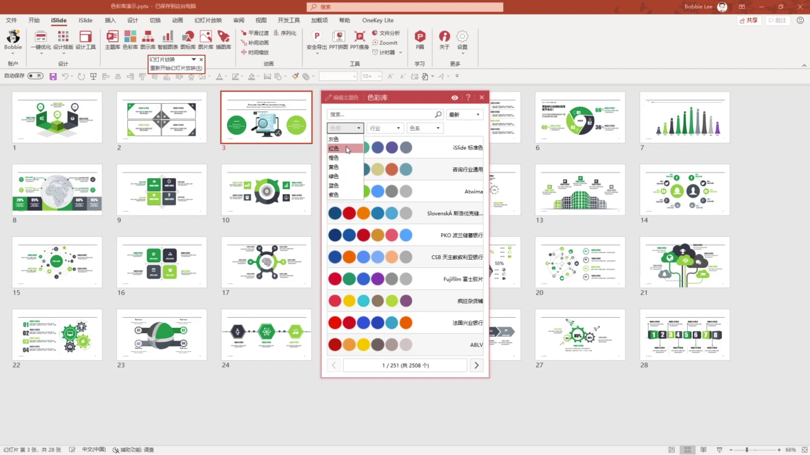</p>

应用后，当前文档的主题颜色会发生变化。后续使用颜色时，优先使用主题颜色中的色彩，这样才能保持整体统一，并支持后续一键换色。

#### 2.1.3 版式和参考线

专业的 PPT 页面通常不是凭感觉摆放元素，而是由看不见的参考线约束版面。

参考线可以帮助页面形成稳定结构，常见区域包括：

- 标题区
- 内容区
- 页脚区

这些区域相当于页面设计的规则，能让后续排版更整齐。

**PowerPoint 参考线**

开启参考线的方式：

```text
视图 -> 参考线
```

快捷键：

```text
Alt + F9
```

开启后，页面中会出现一条水平参考线和一条垂直参考线。按住 `Ctrl` 拖动参考线，可以复制出新的参考线。

手动设置参考线的问题是：如果需要多条参考线，逐条拖动很麻烦，而且位置数值不容易控制。

**iSlide 智能参考线**

更高效的方式是使用 `iSlide` 的智能参考线功能。

操作路径：

```text
iSlide -> 一键优化 -> 智能参考线
```

可以直接选择预设参考线方案，例如正常、适中、宽等。也可以调整标题区、页脚区和左右边距，让参考线一次性建立好。

<p align="center">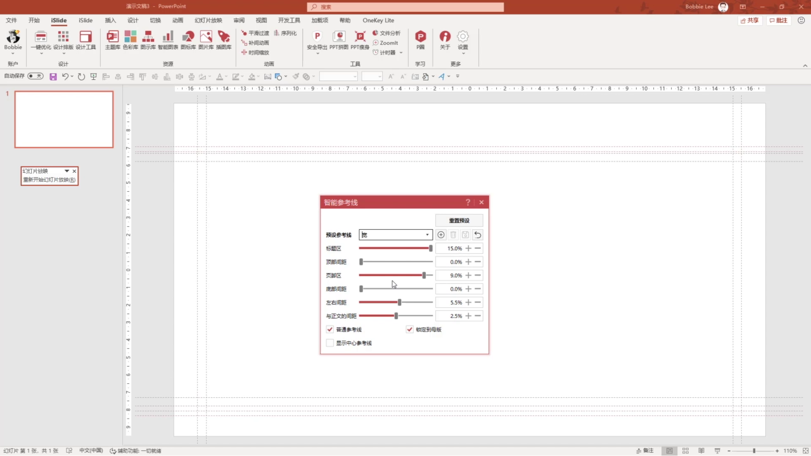</p>

**对齐工具**

对齐工具是 PPT 中非常高频的基础功能，用于让页面元素快速建立秩序。

常见操作包括：

- 左对齐
- 右对齐
- 顶端对齐
- 底端对齐
- 水平居中
- 垂直居中
- 横向分布
- 纵向分布

<p align="center">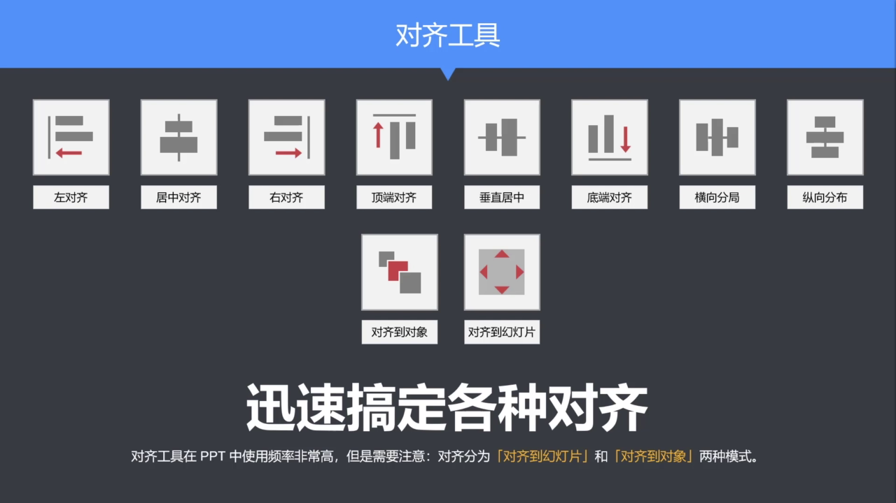</p>

如果想让页面显得专业，对齐工具必须熟练使用。

### 2.2 毕业答辩 PPT 的主题框架

一份完整的毕业答辩 PPT 通常由几个固定部分组成：

- 封面页
- 目录页
- 章节过渡页
- 内容页
- 结束页

这个结构本质上仍然对应第一节讲到的金字塔结构。封面和目录给出整体框架，章节页划分层级，内容页展开论点，结束页完成收束。

#### 2.2.1 主题框架的作用

如果把 PPT 内容看成肌肉和血液，那么主题框架就是支撑内容的骨架。

主题框架需要统一这些页面：

- 封面版式
- 目录版式
- 章节版式
- 内容版式
- 尾页版式

它们要形成同一套视觉外观，而不是每一页各自为政。

#### 2.2.2 直接使用现成主题

毕业答辩准备时间通常很紧，不建议从零设计所有主题页面。更实际的方式是使用现成模板，再重点处理内容页。

可用来源主要有两个：

- `iSlide` 主题库
- OfficePlus 模板网站

`iSlide` 主题库可以直接筛选“毕业答辩”分类，下载完整主题。下载时要根据实际展示设备选择比例，例如 `16:9`。

<p align="center">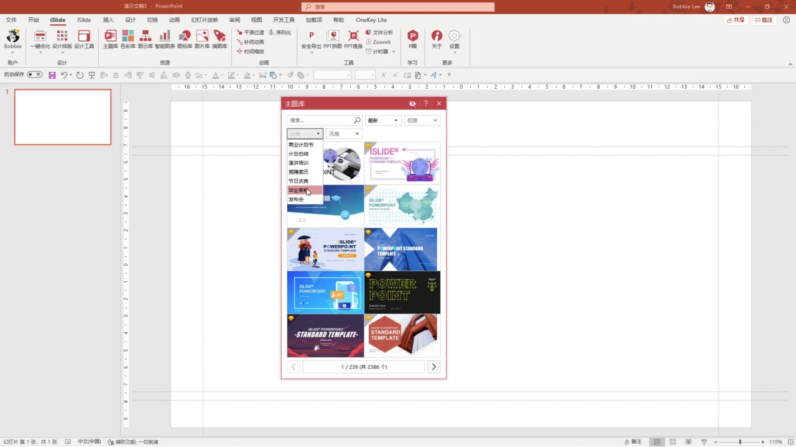</p>

OfficePlus 是微软官方模板网站，也提供毕业答辩相关模板。可以下载后再根据自己的论文内容修改。

使用模板时，重点不是照搬，而是：

- 保留统一的主题框架
- 替换封面和目录文字
- 按自己的论文结构调整章节
- 重点重做内容页表达

### 2.3 用 iSlide 快速完成内容页

主题框架解决的是整体外观，内容页还需要把论文内容转化为视觉表达。`iSlide` 可以用资源库提高内容页制作效率。

#### 2.3.1 图示库

`iSlide` 图示库提供了大量现成图示，按照逻辑关系分类，例如：

- 列表
- 流程
- 循环
- 层级
- 结构

也可以按观点数量筛选。例如一页需要呈现 3 个观点，就筛选 3 项图示。

下载图示后，它会自动适配当前主题色。使用时主要做两件事：

- 替换文字
- 替换图标

<p align="center">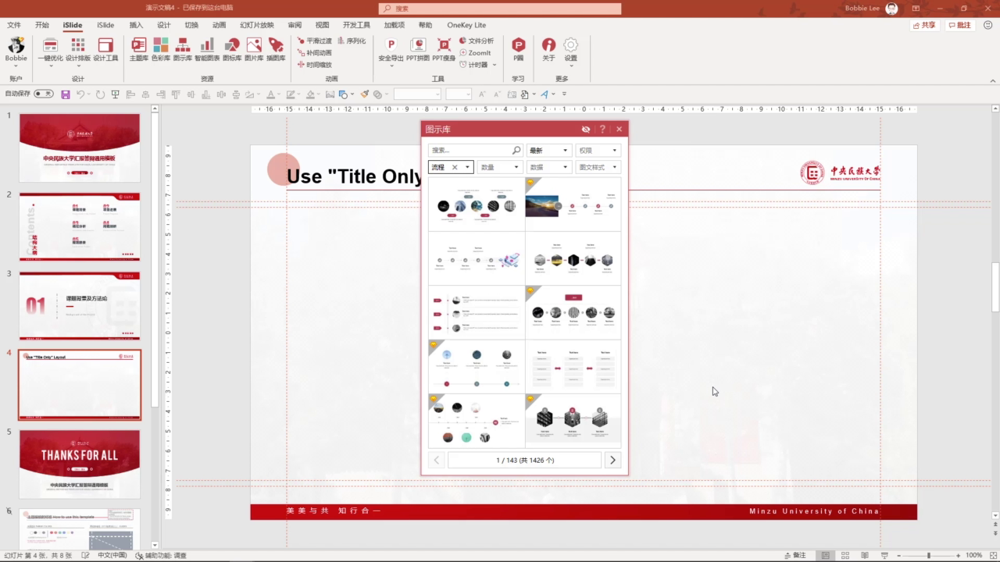</p>

#### 2.3.2 图标库

图标库用于快速替换图示中的小图标。

基本操作：

```text
选中原图标 -> 在图标库中选择新图标 -> 点击替换
```

需要什么图标就搜索对应关键词，再替换到页面中。

#### 2.3.3 图片库

部分图示会带有图片占位符。使用图片库时，可以先选中占位符，再点击图片素材，图片会自动填入对应区域。

<p align="center">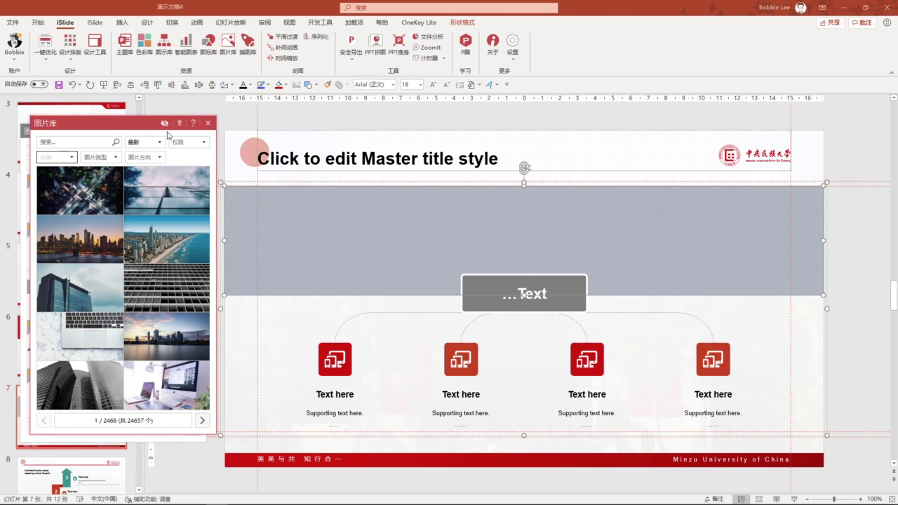</p>

这种方式可以避免图片压缩变形，也能快速替换图片。

#### 2.3.4 插图库

插图库提供矢量素材。下载后通常是由多个形状组合而成的对象。

如果需要局部修改，可以：

```text
右键 -> 取消组合
```

取消组合后，可以单独调整颜色、大小和位置。

#### 2.3.5 智能图表

智能图表适合处理数据图表。下载后，图表左上角会有编辑器，可以直接修改数值。

它的特点是：

- 数值和形状联动
- 所见即所得
- 颜色可以快速统一修改

<p align="center">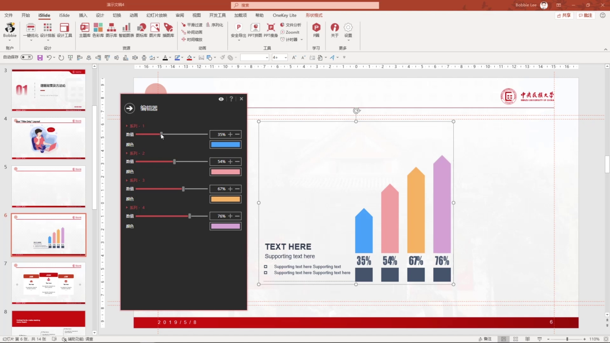</p>

数据图表的详细设计会在后续课程继续展开。

### 2.4 本节总结

第二节课的核心是：先建立全局规则和主题框架，再制作具体页面。

关键流程：

```text
统一字体和文本样式
-> 设置主题颜色
-> 建立参考线和版式规则
-> 选择合适的主题框架
-> 用 iSlide 资源库快速搭建内容页
```

需要记住的重点：

- 不要逐页手动修改字体、颜色和行间距。
- 主题字体、主题颜色、默认文本框是提高效率的基础。
- 参考线和对齐工具能让页面更规整。
- 毕业答辩 PPT 应包含封面、目录、章节页、内容页和结束页。
- 模板可以解决主题框架，但内容页仍然需要根据论文逻辑重新设计。
- `iSlide` 的主题库、图示库、图标库、图片库、插图库和智能图表可以显著提高制作效率。

## 3. 文字内容图示化设计三步法

本节课解决的问题是：如何把抽象、密集的文字内容转化为更适合 PPT 展示的图示语言。文字图示化不是简单美化，而是先理解内容逻辑，再用版式、图形和视觉素材降低观众的理解成本。

### 3.1 为什么要做文字图示化

很多 PPT 的问题不是“不够好看”，而是把大段文字直接粘贴到页面里。观众需要自己阅读、提炼、判断主次，理解成本很高。

文字图示化的目标是：

- 把抽象文字拆成清晰的信息点
- 把主次关系和逻辑关系显性化
- 用图形、图标、图片和版式辅助理解
- 避免把 PPT 做成 Word 文档搬运

换句话说，PPT 页面应该帮助观众更快看懂内容，而不是让观众自己在页面里找重点。

### 3.2 文案转图示的基本案例

课程用一段介绍 `iSlide` 的文字作为案例。原始内容是一整段介绍文字，直接放到页面上会显得密集，也不利于观众快速理解。

处理时先做两件事：

- 提取页面的核心结论
- 拆出支撑结论的多个观点

<p align="center"></p>

这一步本质上是在做信息整理，而不是马上做美化。只有先知道页面要表达几个信息点，后面才知道该选择什么图示结构。

#### 3.2.1 确定信息数量级

第一步是判断这段内容里到底有几个独立观点。比如案例中可以拆成：

- 一个核心标题
- 三个并列观点
- 一句总结或补充说明

数量级决定页面上需要多少个信息容器。三条并列观点，就应该优先考虑三栏、三点、三段式或其他三项结构。

#### 3.2.2 梳理主次信息

拆出数量后，还要判断哪些内容是主要信息，哪些内容是解释信息。

对应到金字塔原理中，可以理解为：

- 论点：页面最想表达的中心结论
- 论据：支撑中心结论的事实、功能、数据或理由
- 总结：对整页内容的收束

如果第一节课的思维导图已经整理得比较完整，这一步会容易很多，因为论点和论据在文案阶段已经基本明确。

#### 3.2.3 判断逻辑关系

确定主次之后，要进一步判断内容之间是什么逻辑关系。案例中的三个支撑观点彼此平等，没有明显先后顺序，也没有谁比谁更重要，所以它们适合用并列关系呈现。

判断逻辑关系之后，就可以开始搭建页面版式：

- 上方放核心结论或标题
- 中间放并列的支撑观点
- 底部放总结或补充说明

### 3.3 文字图示化的三步法

课程把文字图示化总结为三个步骤：

- 确定数量级：梳理内容有几个信息点，明确主次信息
- 判断逻辑关系：根据内容关系选择合适的图示结构和版式
- 优化美观度：增加图标、图片、色彩和留白，让页面更清晰

<p align="center"></p>

这三个步骤里，数量级和逻辑关系属于内容理解，通常比单纯排版更重要。只有内容结构判断正确，后面的图形化表达才不会偏离原意。

### 3.4 常见图示逻辑关系

PPT 中的图示不是随便选的。图示结构应该服务于内容逻辑。常见的逻辑关系包括：

- 列表
- 流程
- 循环
- 层次结构
- 矩阵
- 棱锥

<p align="center"></p>

设计页面时，先判断内容属于哪种逻辑，再选择相应图示。逻辑关系越清楚，观众理解越容易。

#### 3.4.1 并列关系

并列关系是最常见的图示关系。只要几条信息处于同一层级，没有明显先后、主次或因果关系，就可以使用并列结构。

并列关系常见做法包括：

- 横向排列多个信息点
- 纵向排列多个信息点
- 给每个信息点搭配图标
- 给每个信息点搭配图片

<p align="center"></p>

并列关系的重点是整齐、清楚、方便阅读，不需要过度装饰。

#### 3.4.2 强调关系

强调关系本质上仍然属于并列关系，只是其中某一项需要被突出展示。

常见强调方式有两种：

- 用大小突出重点项
- 用颜色突出重点项

<p align="center"></p>

如果页面中所有元素都很突出，就等于没有重点。强调只能服务于真正需要凸显的信息。

#### 3.4.3 对比关系

当两个信息点之间存在比较、冲突、对抗或差异时，可以使用对比关系。

对比关系常见表现方式包括：

- 左右对照
- 箭头连接
- 颜色区分
- 两组内容并列比较

<p align="center"></p>

对比关系也可以看作一种特殊的并列关系，只是它强调两者之间的差异。

#### 3.4.4 总分关系

总分关系通常包含两个层级：

- 第一层是一个总观点或中心概念
- 第二层是多个并列的分支观点

<p align="center"></p>

这种结构适合说明一个主题由哪些部分组成，也适合把一个中心观点展开成多个支撑点。

#### 3.4.5 其他常见关系

除了前面几类，PPT 中还经常遇到：

- 组织架构关系：适合表达层级、部门、系统功能结构
- 流程关系：适合表达时间轴、操作步骤、项目推进顺序
- 循环关系：适合表达首尾相接、循环往复的过程
- 等级关系：适合表达高低层级、重要性差异或金字塔结构

其中流程关系强调先后顺序，循环关系强调回到起点，等级关系强调高低差异。选择图示时不要只看样式好不好看，而要看它是否匹配内容逻辑。

### 3.5 用 iSlide 图示库寻找结构

如果一时想不到合适的图示结构，可以使用 `iSlide` 的图示库查找现成方案。

使用时可以按这些条件筛选：

- 逻辑关系
- 数量级
- 图示类型
- 页面风格

<p align="center"></p>

图示库的作用不是让页面直接套模板，而是提供结构参考。下载后仍然需要根据自己的论文内容替换文字、调整图标和统一视觉风格。

### 3.6 本节总结

本节课的核心是：先理解内容，再选择图示。

关键流程：

```text
拆出信息点
-> 判断主次关系
-> 判断逻辑关系
-> 选择图示结构
-> 增加视觉素材并统一美观度
```

需要记住的重点：

- 文字图示化不是装饰，而是把内容逻辑视觉化。
- 页面设计前要先确定信息数量级。
- 图示结构必须匹配内容逻辑关系。
- 并列、强调、对比、总分、流程、循环和等级关系是 PPT 中常见的图示基础。
- `iSlide` 图示库可以作为结构参考，但不能代替内容判断。

## 4. 图文排版设计技巧

本节课解决的是 PPT 中图片如何使用、如何排版的问题。图片不只是“装饰素材”，它在页面中可能承担内容表达，也可能承担视觉辅助。不同用途对应不同的排版处理方法。

### 4.1 先判断图片的作用

PPT 中的图片大致可以分为两类：

- 内容型图片
- 修饰型图片

判断图片属于哪一类，是后续排版设计的前提。

#### 4.1.1 内容型图片

内容型图片本身就是需要被阅读和识别的信息，例如：

- 产品图片
- 人物介绍图片
- 软件截图
- 实验或案例图片

<p align="center"></p>

这类图片和文字一样，是页面内容的一部分，不能随便用无关图片替换。处理这类图片时，应重点保证清晰、统一和有序。

内容型图片的排版原则：

- 保持图片简洁，避免复杂效果。
- 保持规格统一，减少页面杂乱感。
- 保持排列整齐，让观众容易比较和识别。

#### 4.1.2 修饰型图片

修饰型图片不直接承载核心信息，主要用于配合页面氛围、填补空白、增强画面层次。

<p align="center"></p>

这类图片要注意不要喧宾夺主。它应该服务于文字和内容，而不是抢走页面焦点。

修饰型图片的处理原则：

- 选择简单、干净、和主题相关的图片。
- 样式保持低调，减少复杂效果。
- 通过裁剪选择合适画面范围。
- 必要时降低亮度、降低饱和度或虚化背景。

### 4.2 多图排版要规整

多张图片如果来自不同渠道，常常会出现尺寸不一、比例不同、位置随意的问题。逐张手动调整不仅低效，也容易造成图片变形。

多图排版的核心目标是：

- 规格统一
- 比例正常
- 排列整齐
- 画面有秩序

<p align="center"></p>

设计时需要特别注意：图片不能因为拉伸或压缩而变形。多图页面只要规格统一、对齐明确，整体观感就会专业很多。

多图排版常用功能包括：

- 对齐对象
- 统一大小
- 图片裁剪
- 填充调整

<p align="center"></p>

其中“填充调整”尤其重要，它可以帮助恢复被压缩变形的图片，让图片以正常比例填入指定区域。

### 4.3 用形状占位做图片排版

做多图页面时，不一定要先插入图片再逐张调整。更高效的方法是先用形状占位，再把图片填充进去。

基本思路是：

```text
先画标准形状 -> 排好版式 -> 再把图片填充进形状
```

<p align="center"></p>

这种方法的好处是：页面结构先固定下来，图片只需要进入对应容器，不会破坏整体版式。

#### 4.3.1 基本操作流程

可以按下面流程操作：

```text
插入形状
-> 设置形状大小和位置
-> 去掉轮廓
-> 复制并排列多个形状
-> 组合形成版式
-> 用图片填充形状
```

如果要复制多个相同模块，可以使用：

```text
Ctrl + Shift 拖动复制 -> F4 重复上一步
```

这样可以快速得到等距、同规格的多个图片容器。

#### 4.3.2 图片填充和裁剪

将图片填入形状时，可以使用：

```text
设置形状格式 -> 填充 -> 图片或纹理填充
```

如果图片被压缩变形，可以使用：

```text
图片格式 -> 裁剪 -> 填充
```

<p align="center"></p>

“裁剪 -> 填充”会让图片恢复原始比例，同时用看不见的裁剪框隐藏多余部分。图片本身没有真正被删除，后续还可以重新移动和调整显示区域。

#### 4.3.3 用 iSlide 图片库填充

如果安装了 `iSlide`，图片填充可以更快：

```text
选中形状 -> 打开图片库 -> 点击图片
```

<p align="center"></p>

这种方式会把图片自动填入选中的形状，并尽量保持合适比例。也可以把本地图片上传到私有图片库，方便后续复用。

### 4.4 背景图片要低调处理

当图片作为背景或修饰元素使用时，它不应该比正文更抢眼。背景图的任务是增强氛围和层次，而不是成为页面主体。

网页中常见的大图背景、半透明色块、图标组合，也可以迁移到 PPT 中使用。

<p align="center"></p>

处理背景图片时，可以使用三类方法：

- 叠加半透明遮罩
- 调整图片颜色和亮度
- 裁剪图片范围

#### 4.4.1 叠加半透明遮罩

如果背景图太亮，文字会不清楚。可以在图片上方叠加一个半透明矩形，把图片压暗。

操作思路：

```text
插入矩形
-> 设置为和图片等大
-> 填充黑色或主题色
-> 去掉轮廓
-> 调整透明度
```

<p align="center"></p>

这样既保留图片氛围，又能保证文字可读性。

#### 4.4.2 调整颜色、亮度和虚化

除了叠加遮罩，也可以直接调整图片本身：

- 降低亮度
- 降低饱和度
- 去色
- 添加虚化效果

<p align="center"></p>

虚化适合把图片变成背景层，弱化细节，让文字信息更突出。如果默认虚化程度不合适，可以在艺术效果选项里调整虚化半径。

#### 4.4.3 裁剪掉多余细节

背景图片并不需要完整展示全部内容。可以通过裁剪只保留最适合作为背景的区域。

裁剪的作用包括：

- 去掉干扰信息
- 让主体落在合适位置
- 保留足够留白放文字
- 保持画面比例正常

只要图片发生挤压变形，就可以回到：

```text
图片格式 -> 裁剪 -> 填充
```

让图片恢复原比例，再调整显示区域。

### 4.5 本节总结

本节课的核心是：图片排版先看用途，再选方法。

关键判断：

- 图片作为内容时，要清晰、统一、规整。
- 图片作为修饰时，要低调、干净、服务文字。
- 多图排版要统一规格，避免变形。
- 形状占位可以提高多图排版效率。
- 背景图通常需要遮罩、调色、虚化或裁剪处理。

关键流程：

```text
判断图片用途
-> 统一图片规格
-> 用形状占位控制版式
-> 用裁剪填充恢复比例
-> 对背景图做低调化处理
```

## 5. 数据图表的个性化呈现

数据图表在答辩 PPT 中主要承担“增强说服力”的作用。它不是为了展示所有数据细节，而是帮助观众快速看懂数据变化、关键差异和结论。

### 5.1 图表首先要清晰传达信息

毕业答辩里的图表不需要达到专业数据可视化设计师的复杂程度。更重要的是让观众在投影屏幕上快速理解：

- 数据在表达什么
- 哪个结果最重要
- 不同类别之间有什么差异
- 这组数据支持什么观点

PPT 图表不同于论文、报告或打印稿。观众通常不会在现场仔细研究坐标轴、图例和每一个数值，所以图表要尽量简洁、明确、易读。

不同版本的 Office 默认图表样式差异很大。课程建议尽量使用较新的 Office 版本，例如 Office 2019、Office 365，至少使用 Office 2016 以上版本。

<p align="center"></p>

理想的图表不是元素越多越好，而是能用最少的视觉负担传达数据变化。

### 5.2 用主题色统一图表风格

从 Excel 复制到 PPT 的图表，常见问题是样式不统一：颜色杂、字体乱、图表效果和页面主题不匹配。

统一图表风格时，可以先从颜色入手。PPT 默认图表会按照主题色中的着色 1 到着色 6 依次配色，也可以改成同一主题色的不同明度。

常见配色方法包括：

- 多色系列：适合区分类别
- 同色系明度变化：适合保持页面统一
- 灰色弱化非重点数据
- 对比色突出关键数据

<p align="center"></p>

如果外部图表复制到 PPT 后样式混乱，可以选中图表，在图表设计菜单里选择默认图表样式，让图表先恢复到统一、干净的基础状态。

操作路径：

```text
选中图表
-> 图表设计
-> 图表样式
-> 选择第一个默认样式
```

<p align="center"></p>

所有外部图表复制进来后，都可以先做这一步。这样后续再调整颜色、字体和布局，会更容易保持一致。

### 5.3 去掉无用装饰

数据本身已经有理解成本，图表设计不要再增加额外干扰。课程中特别强调，图表要避免“画蛇添足”。

一个好的答辩图表通常具备这些特点：

- 简单直接
- 观点明确
- 数据重点突出
- 装饰元素少
- 视觉风格和页面一致

<p align="center"></p>

很多时候，简洁的常规图表比复杂的装饰图表更适合答辩场景。即使是专业公司的路演 PPT，也常常使用最基础的柱状图、折线图和饼图。

选中图表后，右上角会出现三个按钮：

- 图表元素
- 图表样式
- 图表筛选器

其中“图表元素”最常用，可以控制标题、坐标轴、网格线、图例、数据标签等内容是否显示。

<p align="center"></p>

可以根据需要隐藏或调整：

- 图表标题
- 横坐标轴
- 纵坐标轴
- 网格线
- 图例
- 数据标签
- 趋势线

如果坐标轴或网格线不帮助理解，就可以删掉；如果关键数值需要被看见，就可以添加数据标签，并调整标签位置。

### 5.4 谨慎使用个性化图表

个性化图表可以让页面更有设计感，但不适合大量使用。答辩 PPT 的重点是内容和数据结论，不是炫技。

如果过度追求图表形式，可能会出现两个问题：

- 设计形式抢走数据的重点
- 制作耗时过长，影响整体效率

因此，个性化图表适合少量、克制地使用。它应该服务于数据理解，而不是替代数据表达。

`iSlide` 的智能图表可以作为辅助工具。智能图表通常由 PPT 基础形状组成，适合快速制作比例关系、层级关系和组合图表。

常见类型包括：

- 柱形图
- 条形图
- 渐变图
- 环形图
- 饼图
- 复合图表

<p align="center"></p>

使用时可以在分类中选择合适类型，下载到 PPT 后再调整数据和颜色。智能图表窗格左上角通常会提供编辑器，可以直接修改数值和色彩。

<p align="center"></p>

需要注意：智能图表不要取消组合。取消组合后，即使再次组合，插件也可能无法识别它原本的智能图表结构。

### 5.5 用动画降低理解成本

当图表数据较多时，可以用简单动画帮助观众逐步理解。动画的目的不是装饰，而是控制信息出现的顺序。

适合图表的动画原则：

- 动画要简单
- 顺序要配合讲解
- 不要让图表一次性全部出现
- 按系列或类别逐步展示

课程推荐使用“擦除”动画。比如柱状图可以设置为自下而上擦除，让动画方向和数据柱增长方向一致。

操作路径：

```text
选中图表
-> 动画
-> 擦除
-> 效果选项
-> 选择方向
-> 按系列或按类别出现
```

<p align="center"></p>

如果图表作为一个对象整体出现，观众还是需要一次性理解全部信息。把序列选项改成“按系列”或“按类别”，可以让图表逐步出现，更方便配合现场讲解。

动画窗格也可以展开图表动画组，进一步设置每一项动画是“单击开始”还是“从上一项开始”。

### 5.6 本节总结

本节课的核心是：数据图表要先保证清晰，再考虑美观和个性化。

处理图表时可以按这个顺序：

```text
统一图表样式
-> 使用主题色控制配色
-> 删除无用装饰
-> 突出关键数据
-> 少量使用个性化图表
-> 用简单动画辅助讲解
```

关键原则：

- 图表不是数据堆砌，而是观点表达。
- PPT 图表要让观众快速看懂，不要要求观众现场研究。
- 颜色要服务重点，灰色可以弱化，强调色可以突出。
- 装饰元素能删就删，保留真正帮助理解的内容。
- 智能图表可以提高效率，但不要让形式抢过数据。
- 图表动画要克制，只用来控制信息出现节奏。

## 6. Before & After 案例解析

这一节通过一个毕业答辩 PPT 案例，观察从原始稿到优化稿的修改思路。重点不是逐页模仿，而是理解每一类问题应该怎样判断、怎样改。

案例中的部分文字被替换成了占位内容，所以分析时只关注版式、逻辑、视觉呈现和设计方法。

### 6.1 修改前先做整体诊断

做案例优化时，不要一上来就改颜色、换模板或调细节。第一步应该先判断整份 PPT 的主要问题。

原始稿的问题可以概括为三类：

- 逻辑不够清楚
- 设计呈现不够专业
- 制作效率偏低

<p align="center"></p>

#### 6.1.1 逻辑不够清楚

整份文档结构比较混乱，页面之间的层级关系不明确。单页内容也容易出现重点不突出、信息堆在一起的问题。

典型表现包括：

- 页面标题和内容关系不清楚
- 大段文字直接复制到 PPT
- 页面上没有明确的主次
- 多个观点之间的关系没有被视觉化

#### 6.1.2 设计呈现不够专业

原稿中存在大量过时素材和过度修饰，颜色也比较凌乱。部分页面文字过密，投影到现场后会更难阅读。

常见问题包括：

- 素材风格过时
- 色彩缺少统一规则
- 字体使用不统一
- 页面文字密度过高
- 修饰元素多于有效信息

#### 6.1.3 制作效率偏低

课程里还展示了一个很实际的判断方法：查看 PPT 文件属性里的统计信息。原稿总编辑时间超过 3000 分钟，同时使用了多种字体。

<p align="center"></p>

这说明问题不只是“页面不好看”，还包括制作流程低效、主题样式没有统一、重复劳动过多。

### 6.2 优化要先做全局统一

优化后的版本并不是单独改某一页，而是先建立全局规则，再逐页调整。

全局统一主要包括：

- 统一主题配色
- 统一字体和字号层级
- 统一参考线和版心
- 统一页面风格
- 删除冗余版式

<p align="center"></p>

优化后的版本仍然可以继续完善，但相比原稿已经更规整、统一、简洁。这个变化说明：PPT 优化不是简单套模板，而是先建立一致的视觉系统。

### 6.3 案例一：选题背景页

原始页面的问题是把论文中的大段文字直接复制到 PPT 中，再配一张修饰性图片。这样的页面更像 Word 文档，不像演示辅助画面。

原稿问题：

- 文字过密
- 视觉重点不清楚
- 图片只是装饰，没有服务内容
- 页面阅读压力大

<p align="center"></p>

优化思路是先删减文字，只保留关键信息，再借助形状、图标和背景图进行视觉化表达。

优化后的做法：

- 提炼关键观点
- 用图标辅助理解
- 用半透明色块压暗背景图
- 保留下方留白
- 让画面形成更轻松的视觉节奏

<p align="center"></p>

这一页的关键不是“用了什么高级效果”，而是把密集文字转译成更容易被观众接受的图形化语言。

### 6.4 案例二：研究过程页

研究过程本质上是流程关系，但原稿把四个观点做成了并列排布。再加上暗色背景和半透明色块，现场投影时可能不清晰。

原稿问题：

- 流程关系没有表达出来
- 暗色背景影响投影可读性
- 前景文字与背景干扰较多
- 信息关系和视觉关系不一致

<p align="center"></p>

优化时要先判断内容关系：如果是研究过程，就应该用线条、箭头或形状表现流程。

优化后的做法：

- 使用白色背景提高稳定性
- 用线条串联四个关键步骤
- 通过编号和节点表达流程顺序
- 添加低调背景装饰，避免页面过空

<p align="center"></p>

课程中特别提醒：毕业答辩现场的投影设备不一定理想，所以深色复杂背景要谨慎使用。白色或浅色背景通常更稳妥。

### 6.5 案例三：并列信息页

这页内容是四个并列关系的信息点。原稿把四个内容纵向堆叠，虽然能看懂，但页面吸引力较弱，整体性也不足。

原稿问题：

- 信息点之间联系弱
- 页面视觉重心偏散
- 内容排列比较机械
- 缺少能把页面串起来的视觉元素

<p align="center"></p>

优化后的页面把四个信息点改成横向排列，并用上方图片区域把页面连接成整体。

优化后的做法：

- 纵向排列改为横向排列
- 上方三分之一区域使用图片
- 图片作为连接四个信息点的视觉桥梁
- 重点文字加粗，形成层次
- 用小图标增强视觉化表达

<p align="center"></p>

小图标不一定解决所有问题，但在并列信息页里，它常常能帮助信息变得更轻、更清楚。

### 6.6 案例四：成绩与不足页

这页内容是“成绩”和“不足”的对比。原稿直接把两段文字放进页面，用标签说明含义，但文字仍然偏大段。

原稿问题：

- 两段文字缺少进一步提炼
- 成绩与不足的关系表达不够明确
- 页面视觉结构比较松散
- 观众需要自己读文字理解重点

<p align="center"></p>

优化时可以先用金字塔原理继续拆解文字，把成段内容提炼成更明确的小观点。然后让“成绩”和“不足”分列左右两侧。

优化后的做法：

- 左右两侧分别呈现成绩与不足
- 两侧内部用纵向列表表达并列关系
- 中间用形状和图标建立视觉焦点
- 成绩用下沉感表达低调
- 不足用上升感表达改进空间
- 注意对齐，让页面更规整

<p align="center"></p>

这一页的重点是：对比关系不能只靠文字说明，还要让页面结构本身表达“左右对比”。

### 6.7 本节总结

案例优化的核心不是替换模板，而是把内容关系重新表达清楚。

整体流程可以概括为：

```text
先诊断问题
-> 建立全局统一规则
-> 判断每页内容关系
-> 删减和提炼文字
-> 用图形化语言重组页面
-> 检查对齐、配色、字体和留白
```

关键原则：

- 先有内容，再考虑设计。
- 不要把论文原文直接搬到 PPT。
- 页面设计要服务观点表达。
- 不同内容关系要用不同视觉结构表达。
- 答辩现场要优先考虑清晰度和可读性。
- 优化一份 PPT，要先看整体系统，再改单页细节。

## 7. 答辩PPT演示注意事项

答辩时，PPT 只是辅助工具。评委真正关注的是论文质量、讲解逻辑和现场表达，但 PPT 不能拖后腿。最后一课重点讲演示前的准备、演示者视图、动画节奏和辅助工具。

### 7.1 答辩前先排除技术风险

答辩现场最怕临时出现软硬件问题。很多事故不是不能解决，而是没有提前检查。

到答辩教室后，要尽早确认：

- 现场电脑是否正常
- `Office` 版本是否过旧
- PPT 放映是否正常
- 投影仪或大屏是否可用
- 麦克风是否需要调试
- 网络是否可用
- 字体是否会丢失

<p align="center"></p>

不要等到答辩前 10 分钟才到现场。提前到教室可以熟悉环境，也能缓解紧张情绪。

#### 7.1.1 准备自己的电脑和连接线

现场电脑可能系统老、`Office` 版本旧，甚至无法正常播放你的 PPT。比较稳妥的做法是带上自己的电脑作为备用。

如果使用自己的电脑，还要提前准备连接设备：

- `HDMI` 线
- `VGA` 转接头
- `Type-C` 转接头
- `USB` 扩展或转换器
- 激光翻页笔

新的笔记本电脑可能没有 `VGA` 接口，答辩教室的投影设备又可能比较旧，所以转接线要提前准备。

#### 7.1.2 处理字体丢失问题

如果 PPT 使用了特殊字体，要考虑现场电脑没有安装这些字体的情况。字体丢失后，页面排版可能会发生明显变化。

`iSlide` 提供了字体导出功能，可以把当前文档中使用的字体从系统中导出，再安装到放映电脑上。

操作路径：

```text
iSlide
-> 安全导出
-> 导出字体
```

<p align="center"></p>

### 7.2 使用演示者视图辅助讲解

演示者视图可以让观众看到正常放映画面，而演讲者在自己的电脑上看到备注、下一页预览和当前页。

它适合用来放：

- 讲解关键词
- 下一步提示
- 时间提醒
- 容易忘记的结构点

<p align="center"></p>

但不要把完整讲稿逐字写在备注里，然后盯着屏幕念。备注最好只放关键词，让自己知道下一步该讲什么。

开启演示者视图的基本步骤：

```text
连接投影
-> 按 Windows + P
-> 选择扩展模式
-> 幻灯片放映
-> 勾选使用演示者视图
-> 开始放映
```

<p align="center"></p>

投影屏幕上只会显示观众看到的页面，演讲者电脑上会显示备注区和下一页预览。

### 7.3 动画要为演讲服务

毕业答辩 PPT 不建议使用过多动画。如果不熟悉动画，可以不用；如果熟悉，也不要在答辩现场炫技。

动画最重要的作用是：让正在讲的内容和屏幕上正在出现的内容保持同步。

#### 7.3.1 不要一次性暴露所有信息

当一页 PPT 同时出现多个信息点时，观众会本能地先扫完整页内容。这样会出现一个问题：你还在讲第二点，观众可能已经把后面的内容都看完了。

<p align="center"></p>

这种情况下，观众会分心，也会提前知道你接下来要讲什么，现场讲解就容易变得无聊。

#### 7.3.2 突出当前正在讲的内容

更好的做法是把当前正在讲的信息突出显示，把无关信息暂时隐藏或弱化。

<p align="center"></p>

可以用这些方式控制注意力：

- 当前信息使用强调色
- 其他信息使用灰色弱化
- 信息点按顺序逐步出现
- 用色块或线条标出当前重点

<p align="center"></p>

这样观众的视线会跟着你的讲解节奏移动，而不是自己提前阅读完整页内容。

#### 7.3.3 用页面复制配合切换动画

有些逐步强调效果不一定要复杂动画。可以把同一页复制多份，每一页突出一个信息点，再通过切换效果实现连续变化。

常用做法：

```text
复制同一页
-> 每页突出一个不同信息点
-> 设置平滑切换或弹出切换
-> 放映时逐页推进
```

<p align="center"></p>

`平滑切换` 主要在较新版本的 `Office` 中可用。如果版本较旧，也可以改用 `弹出` 等普通切换效果。

### 7.4 用 ZoomIt 做演示辅助

`ZoomIt` 是一个屏幕放大辅助工具，适合在演示时临时放大画面细节。课程中提到，`iSlide` 工具组里也提供了 `ZoomIt` 入口。

第一次使用时，可以按提示下载并加载工具。加载完成后，再次打开就能使用屏幕放大功能。

<p align="center"></p>

它适合用于：

- 放大页面细节
- 临时强调某个区域
- 演示复杂界面或操作步骤
- 避免观众看不清小字

### 7.5 本节总结

答辩演示的核心不是让 PPT 抢镜，而是让 PPT 稳定、清晰地配合你的讲解。

答辩前要重点检查：

```text
现场设备
-> Office 版本
-> 投影连接
-> 字体文件
-> 麦克风和网络
-> 备用电脑和转接线
```

现场演示要注意：

- 提前到场，避免临时排查问题。
- PPT 是辅助工具，讲解才是主角。
- 演示者视图只放关键词，不要放完整逐字稿。
- 动画要低调，重点是配合讲解节奏。
- 不要一次展示过多内容，要控制观众注意力。
- 必要时使用 `ZoomIt` 等工具放大细节。


