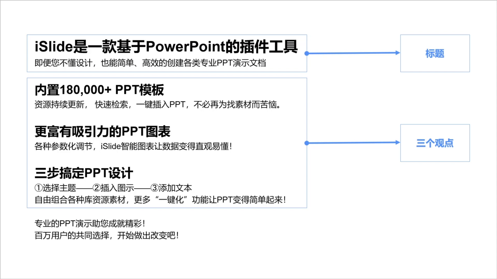
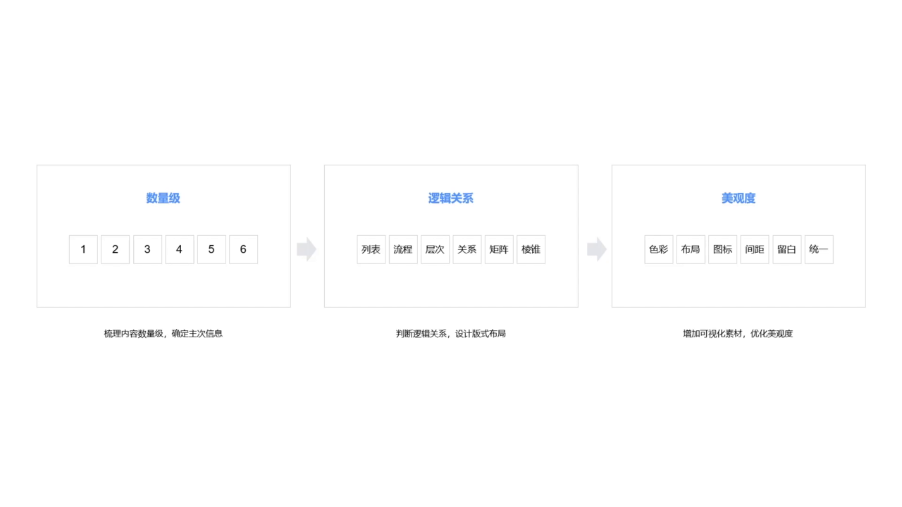
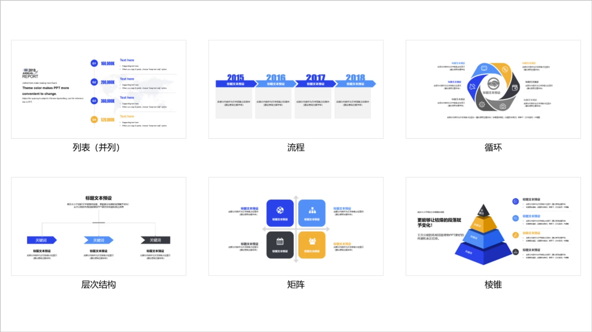
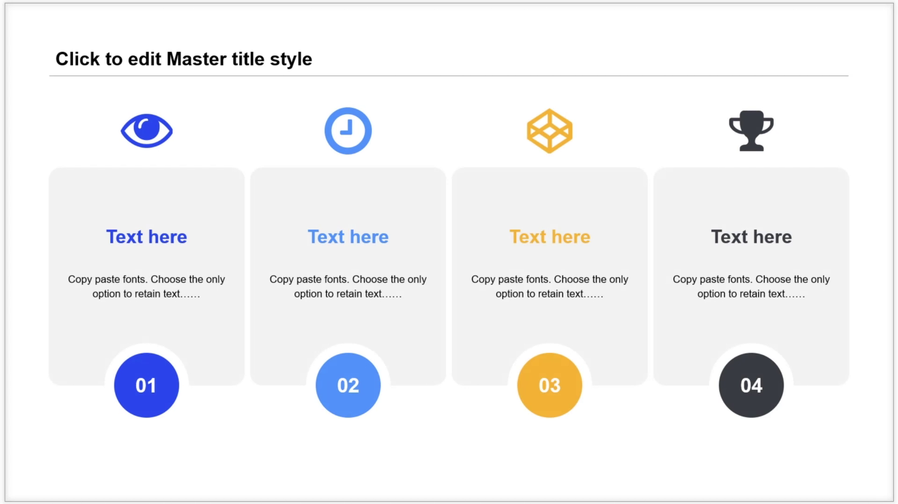
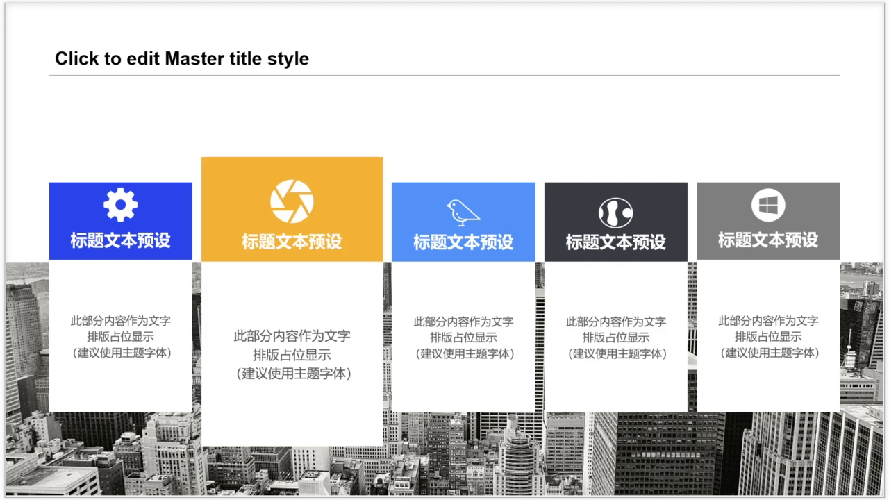
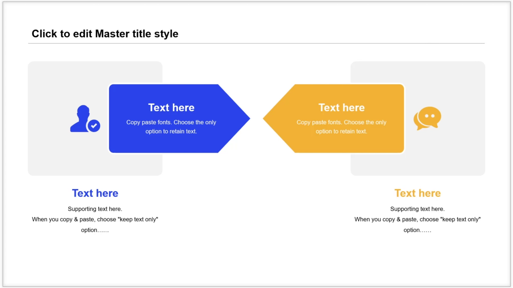
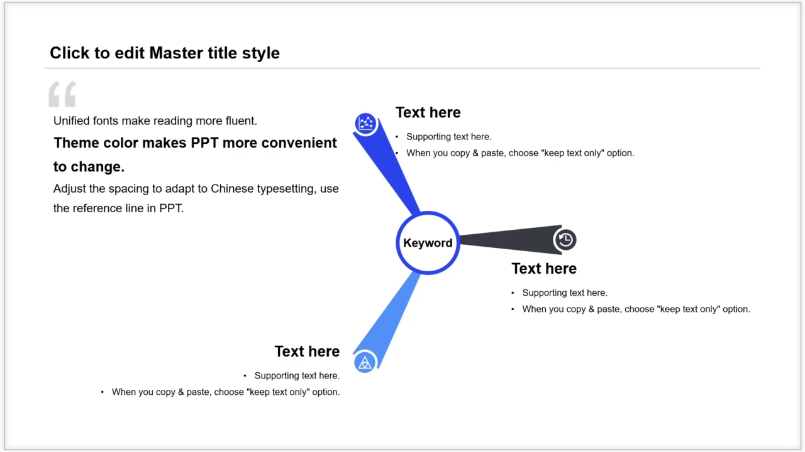
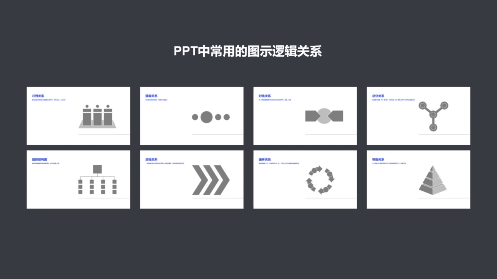

# 3. 文字内容图示化设计三步法

本节课解决的问题是：如何把抽象、密集的文字内容转化为更适合 PPT 展示的图示语言。文字图示化不是简单美化，而是先理解内容逻辑，再用版式、图形和视觉素材降低观众的理解成本。

## 3.1 为什么要做文字图示化

很多 PPT 的问题不是“不够好看”，而是把大段文字直接粘贴到页面里。观众需要自己阅读、提炼、判断主次，理解成本很高。

文字图示化的目标是：

- 把抽象文字拆成清晰的信息点
- 把主次关系和逻辑关系显性化
- 用图形、图标、图片和版式辅助理解
- 避免把 PPT 做成 Word 文档搬运

换句话说，PPT 页面应该帮助观众更快看懂内容，而不是让观众自己在页面里找重点。

## 3.2 文案转图示的基本案例

课程用一段介绍 `iSlide` 的文字作为案例。原始内容是一整段介绍文字，直接放到页面上会显得密集，也不利于观众快速理解。

处理时先做两件事：

- 提取页面的核心结论
- 拆出支撑结论的多个观点

<p align="center"></p>

这一步本质上是在做信息整理，而不是马上做美化。只有先知道页面要表达几个信息点，后面才知道该选择什么图示结构。

### 3.2.1 确定信息数量级

第一步是判断这段内容里到底有几个独立观点。比如案例中可以拆成：

- 一个核心标题
- 三个并列观点
- 一句总结或补充说明

数量级决定页面上需要多少个信息容器。三条并列观点，就应该优先考虑三栏、三点、三段式或其他三项结构。

### 3.2.2 梳理主次信息

拆出数量后，还要判断哪些内容是主要信息，哪些内容是解释信息。

对应到金字塔原理中，可以理解为：

- 论点：页面最想表达的中心结论
- 论据：支撑中心结论的事实、功能、数据或理由
- 总结：对整页内容的收束

如果第一节课的思维导图已经整理得比较完整，这一步会容易很多，因为论点和论据在文案阶段已经基本明确。

### 3.2.3 判断逻辑关系

确定主次之后，要进一步判断内容之间是什么逻辑关系。案例中的三个支撑观点彼此平等，没有明显先后顺序，也没有谁比谁更重要，所以它们适合用并列关系呈现。

判断逻辑关系之后，就可以开始搭建页面版式：

- 上方放核心结论或标题
- 中间放并列的支撑观点
- 底部放总结或补充说明

## 3.3 文字图示化的三步法

课程把文字图示化总结为三个步骤：

- 确定数量级：梳理内容有几个信息点，明确主次信息
- 判断逻辑关系：根据内容关系选择合适的图示结构和版式
- 优化美观度：增加图标、图片、色彩和留白，让页面更清晰

<p align="center"></p>

这三个步骤里，数量级和逻辑关系属于内容理解，通常比单纯排版更重要。只有内容结构判断正确，后面的图形化表达才不会偏离原意。

## 3.4 常见图示逻辑关系

PPT 中的图示不是随便选的。图示结构应该服务于内容逻辑。常见的逻辑关系包括：

- 列表
- 流程
- 循环
- 层次结构
- 矩阵
- 棱锥

<p align="center"></p>

设计页面时，先判断内容属于哪种逻辑，再选择相应图示。逻辑关系越清楚，观众理解越容易。

### 3.4.1 并列关系

并列关系是最常见的图示关系。只要几条信息处于同一层级，没有明显先后、主次或因果关系，就可以使用并列结构。

并列关系常见做法包括：

- 横向排列多个信息点
- 纵向排列多个信息点
- 给每个信息点搭配图标
- 给每个信息点搭配图片

<p align="center"></p>

并列关系的重点是整齐、清楚、方便阅读，不需要过度装饰。

### 3.4.2 强调关系

强调关系本质上仍然属于并列关系，只是其中某一项需要被突出展示。

常见强调方式有两种：

- 用大小突出重点项
- 用颜色突出重点项

<p align="center"></p>

如果页面中所有元素都很突出，就等于没有重点。强调只能服务于真正需要凸显的信息。

### 3.4.3 对比关系

当两个信息点之间存在比较、冲突、对抗或差异时，可以使用对比关系。

对比关系常见表现方式包括：

- 左右对照
- 箭头连接
- 颜色区分
- 两组内容并列比较

<p align="center"></p>

对比关系也可以看作一种特殊的并列关系，只是它强调两者之间的差异。

### 3.4.4 总分关系

总分关系通常包含两个层级：

- 第一层是一个总观点或中心概念
- 第二层是多个并列的分支观点

<p align="center"></p>

这种结构适合说明一个主题由哪些部分组成，也适合把一个中心观点展开成多个支撑点。

### 3.4.5 其他常见关系

除了前面几类，PPT 中还经常遇到：

- 组织架构关系：适合表达层级、部门、系统功能结构
- 流程关系：适合表达时间轴、操作步骤、项目推进顺序
- 循环关系：适合表达首尾相接、循环往复的过程
- 等级关系：适合表达高低层级、重要性差异或金字塔结构

其中流程关系强调先后顺序，循环关系强调回到起点，等级关系强调高低差异。选择图示时不要只看样式好不好看，而要看它是否匹配内容逻辑。

## 3.5 用 iSlide 图示库寻找结构

如果一时想不到合适的图示结构，可以使用 `iSlide` 的图示库查找现成方案。

使用时可以按这些条件筛选：

- 逻辑关系
- 数量级
- 图示类型
- 页面风格

<p align="center"></p>

图示库的作用不是让页面直接套模板，而是提供结构参考。下载后仍然需要根据自己的论文内容替换文字、调整图标和统一视觉风格。

## 3.6 本节总结

本节课的核心是：先理解内容，再选择图示。

关键流程：

```text
拆出信息点
-> 判断主次关系
-> 判断逻辑关系
-> 选择图示结构
-> 增加视觉素材并统一美观度
```

需要记住的重点：

- 文字图示化不是装饰，而是把内容逻辑视觉化。
- 页面设计前要先确定信息数量级。
- 图示结构必须匹配内容逻辑关系。
- 并列、强调、对比、总分、流程、循环和等级关系是 PPT 中常见的图示基础。
- `iSlide` 图示库可以作为结构参考，但不能代替内容判断。


