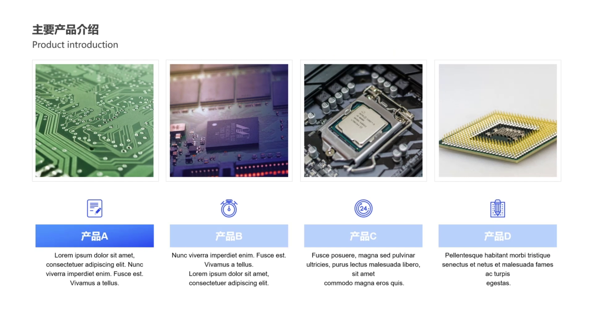
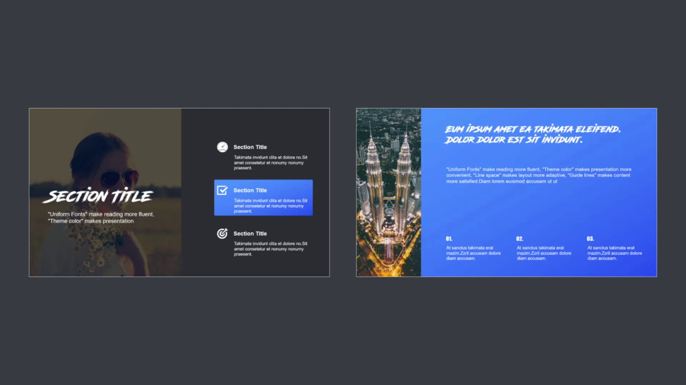
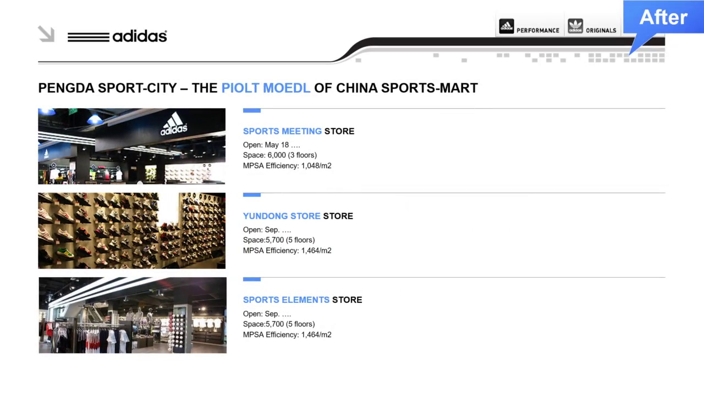
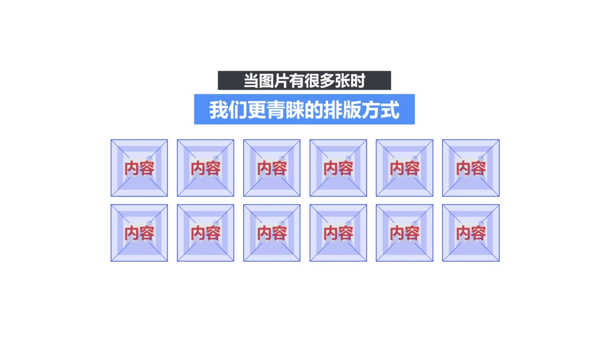
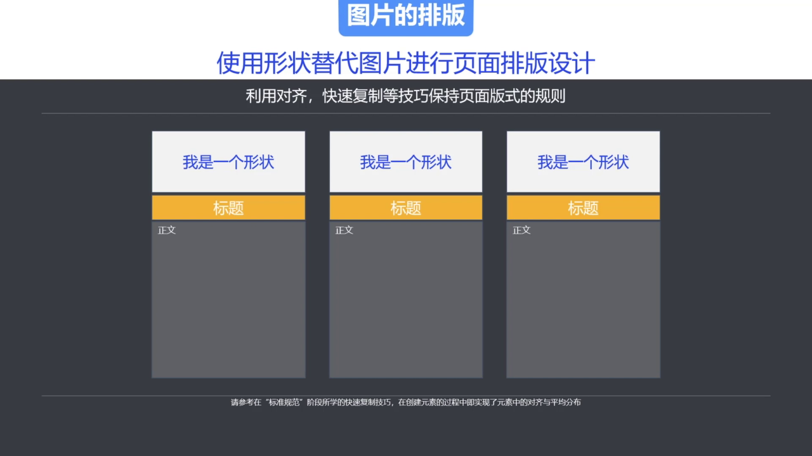
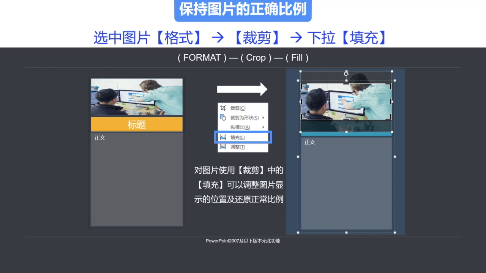
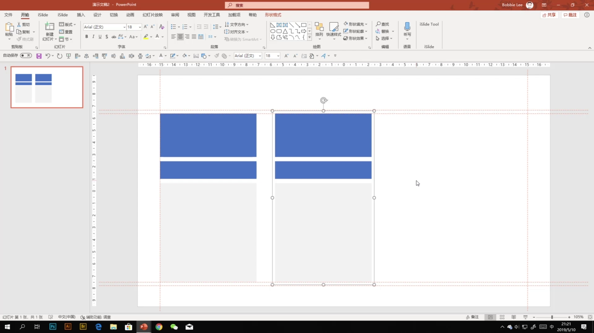
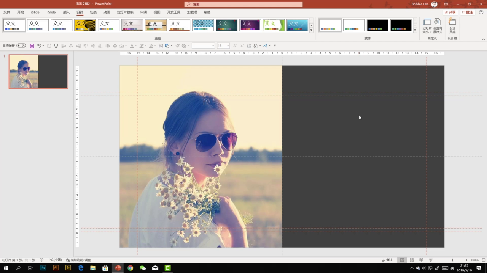
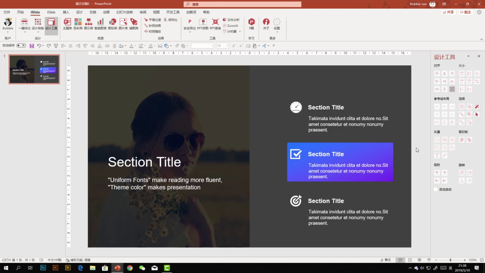

# 4. 图文排版设计技巧

本节课解决的是 PPT 中图片如何使用、如何排版的问题。图片不只是“装饰素材”，它在页面中可能承担内容表达，也可能承担视觉辅助。不同用途对应不同的排版处理方法。

## 4.1 先判断图片的作用

PPT 中的图片大致可以分为两类：

- 内容型图片
- 修饰型图片

判断图片属于哪一类，是后续排版设计的前提。

### 4.1.1 内容型图片

内容型图片本身就是需要被阅读和识别的信息，例如：

- 产品图片
- 人物介绍图片
- 软件截图
- 实验或案例图片

<p align="center"></p>

这类图片和文字一样，是页面内容的一部分，不能随便用无关图片替换。处理这类图片时，应重点保证清晰、统一和有序。

内容型图片的排版原则：

- 保持图片简洁，避免复杂效果。
- 保持规格统一，减少页面杂乱感。
- 保持排列整齐，让观众容易比较和识别。

### 4.1.2 修饰型图片

修饰型图片不直接承载核心信息，主要用于配合页面氛围、填补空白、增强画面层次。

<p align="center"></p>

这类图片要注意不要喧宾夺主。它应该服务于文字和内容，而不是抢走页面焦点。

修饰型图片的处理原则：

- 选择简单、干净、和主题相关的图片。
- 样式保持低调，减少复杂效果。
- 通过裁剪选择合适画面范围。
- 必要时降低亮度、降低饱和度或虚化背景。

## 4.2 多图排版要规整

多张图片如果来自不同渠道，常常会出现尺寸不一、比例不同、位置随意的问题。逐张手动调整不仅低效，也容易造成图片变形。

多图排版的核心目标是：

- 规格统一
- 比例正常
- 排列整齐
- 画面有秩序

<p align="center"></p>

设计时需要特别注意：图片不能因为拉伸或压缩而变形。多图页面只要规格统一、对齐明确，整体观感就会专业很多。

多图排版常用功能包括：

- 对齐对象
- 统一大小
- 图片裁剪
- 填充调整

<p align="center"></p>

其中“填充调整”尤其重要，它可以帮助恢复被压缩变形的图片，让图片以正常比例填入指定区域。

## 4.3 用形状占位做图片排版

做多图页面时，不一定要先插入图片再逐张调整。更高效的方法是先用形状占位，再把图片填充进去。

基本思路是：

```text
先画标准形状 -> 排好版式 -> 再把图片填充进形状
```

<p align="center"></p>

这种方法的好处是：页面结构先固定下来，图片只需要进入对应容器，不会破坏整体版式。

### 4.3.1 基本操作流程

可以按下面流程操作：

```text
插入形状
-> 设置形状大小和位置
-> 去掉轮廓
-> 复制并排列多个形状
-> 组合形成版式
-> 用图片填充形状
```

如果要复制多个相同模块，可以使用：

```text
Ctrl + Shift 拖动复制 -> F4 重复上一步
```

这样可以快速得到等距、同规格的多个图片容器。

### 4.3.2 图片填充和裁剪

将图片填入形状时，可以使用：

```text
设置形状格式 -> 填充 -> 图片或纹理填充
```

如果图片被压缩变形，可以使用：

```text
图片格式 -> 裁剪 -> 填充
```

<p align="center"></p>

“裁剪 -> 填充”会让图片恢复原始比例，同时用看不见的裁剪框隐藏多余部分。图片本身没有真正被删除，后续还可以重新移动和调整显示区域。

### 4.3.3 用 iSlide 图片库填充

如果安装了 `iSlide`，图片填充可以更快：

```text
选中形状 -> 打开图片库 -> 点击图片
```

<p align="center"></p>

这种方式会把图片自动填入选中的形状，并尽量保持合适比例。也可以把本地图片上传到私有图片库，方便后续复用。

## 4.4 背景图片要低调处理

当图片作为背景或修饰元素使用时，它不应该比正文更抢眼。背景图的任务是增强氛围和层次，而不是成为页面主体。

网页中常见的大图背景、半透明色块、图标组合，也可以迁移到 PPT 中使用。

<p align="center"></p>

处理背景图片时，可以使用三类方法：

- 叠加半透明遮罩
- 调整图片颜色和亮度
- 裁剪图片范围

### 4.4.1 叠加半透明遮罩

如果背景图太亮，文字会不清楚。可以在图片上方叠加一个半透明矩形，把图片压暗。

操作思路：

```text
插入矩形
-> 设置为和图片等大
-> 填充黑色或主题色
-> 去掉轮廓
-> 调整透明度
```

<p align="center"></p>

这样既保留图片氛围，又能保证文字可读性。

### 4.4.2 调整颜色、亮度和虚化

除了叠加遮罩，也可以直接调整图片本身：

- 降低亮度
- 降低饱和度
- 去色
- 添加虚化效果

<p align="center"></p>

虚化适合把图片变成背景层，弱化细节，让文字信息更突出。如果默认虚化程度不合适，可以在艺术效果选项里调整虚化半径。

### 4.4.3 裁剪掉多余细节

背景图片并不需要完整展示全部内容。可以通过裁剪只保留最适合作为背景的区域。

裁剪的作用包括：

- 去掉干扰信息
- 让主体落在合适位置
- 保留足够留白放文字
- 保持画面比例正常

只要图片发生挤压变形，就可以回到：

```text
图片格式 -> 裁剪 -> 填充
```

让图片恢复原比例，再调整显示区域。

## 4.5 本节总结

本节课的核心是：图片排版先看用途，再选方法。

关键判断：

- 图片作为内容时，要清晰、统一、规整。
- 图片作为修饰时，要低调、干净、服务文字。
- 多图排版要统一规格，避免变形。
- 形状占位可以提高多图排版效率。
- 背景图通常需要遮罩、调色、虚化或裁剪处理。

关键流程：

```text
判断图片用途
-> 统一图片规格
-> 用形状占位控制版式
-> 用裁剪填充恢复比例
-> 对背景图做低调化处理
```

