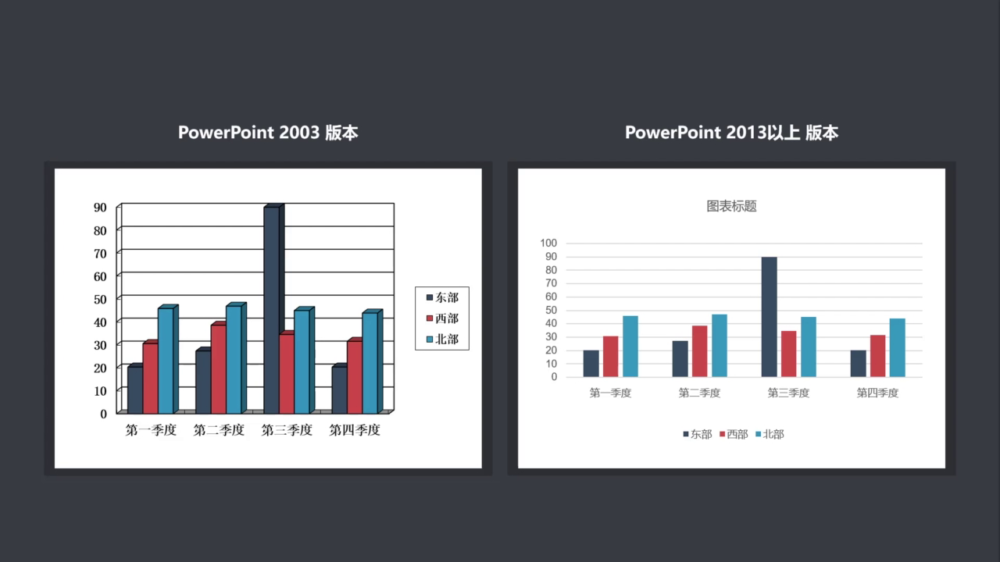
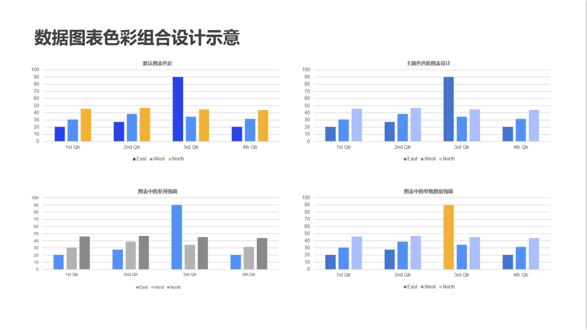
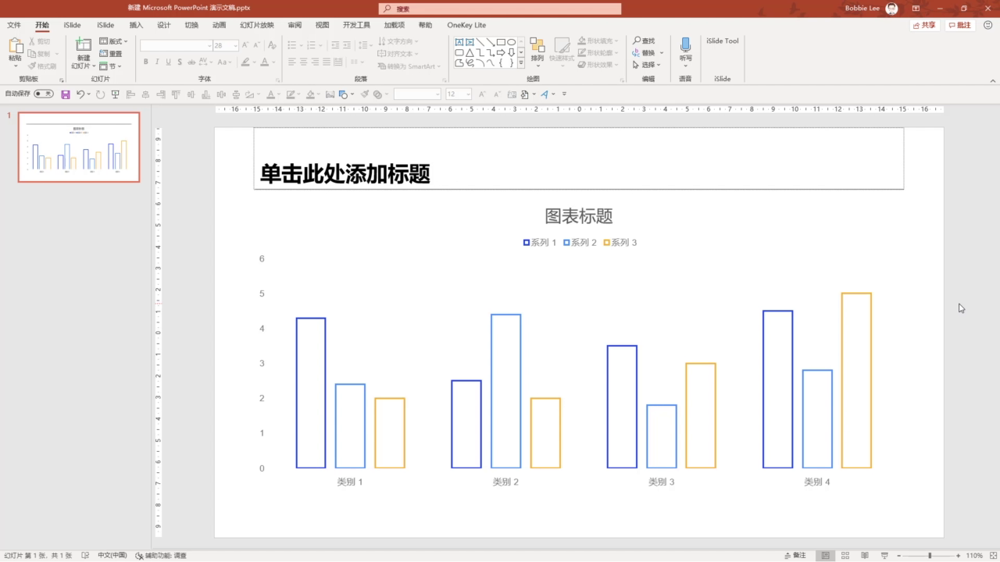
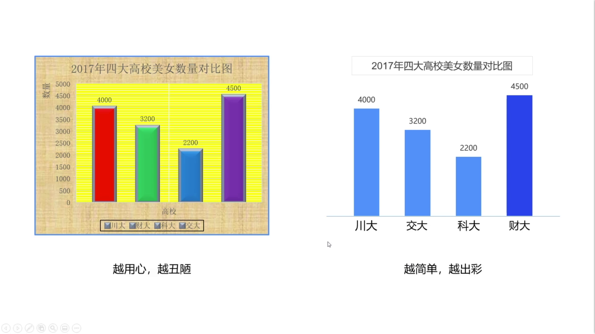
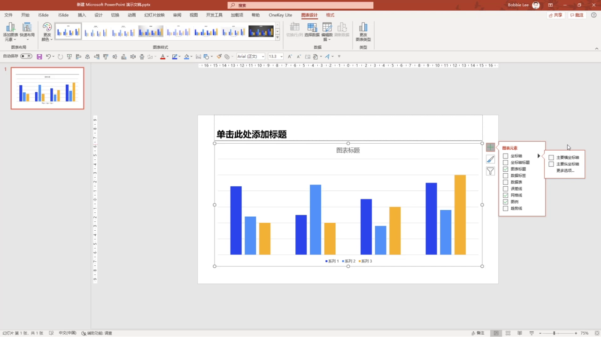
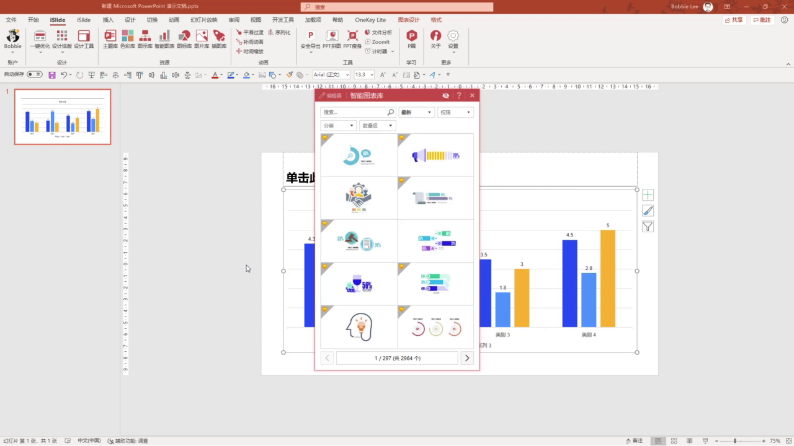
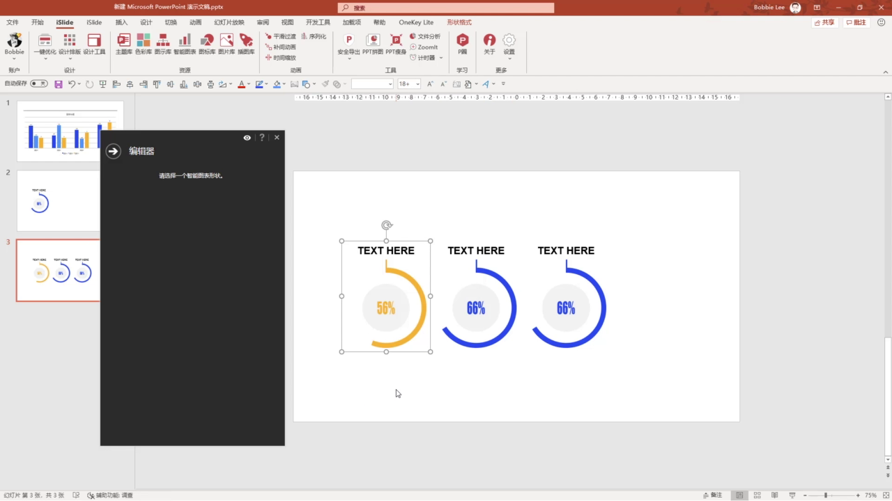
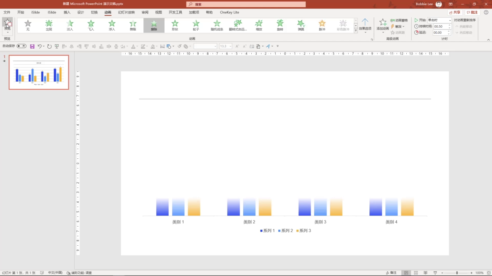

# 第 5 课：数据图表的个性化呈现

数据图表在答辩 PPT 中主要承担“增强说服力”的作用。它不是为了展示所有数据细节，而是帮助观众快速看懂数据变化、关键差异和结论。

## 5.1 图表首先要清晰传达信息

毕业答辩里的图表不需要达到专业数据可视化设计师的复杂程度。更重要的是让观众在投影屏幕上快速理解：

- 数据在表达什么
- 哪个结果最重要
- 不同类别之间有什么差异
- 这组数据支持什么观点

PPT 图表不同于论文、报告或打印稿。观众通常不会在现场仔细研究坐标轴、图例和每一个数值，所以图表要尽量简洁、明确、易读。

<p align="center"></p>

## 5.2 用主题色统一图表风格

从 Excel 复制到 PPT 的图表，常见问题是样式不统一：颜色杂、字体乱、图表效果和页面主题不匹配。

常见配色方法包括：

- 多色系列：适合区分类别
- 同色系明度变化：适合保持页面统一
- 灰色弱化非重点数据
- 对比色突出关键数据

<p align="center"></p>

如果外部图表复制到 PPT 后样式混乱，可以选中图表，在图表设计菜单里选择默认图表样式，让图表先恢复到统一、干净的基础状态。

<p align="center"></p>

## 5.3 去掉无用装饰

数据本身已经有理解成本，图表设计不要再增加额外干扰。课程中特别强调，图表要避免“画蛇添足”。

一个好的答辩图表通常具备这些特点：

- 简单直接
- 观点明确
- 数据重点突出
- 装饰元素少
- 视觉风格和页面一致

<p align="center"></p>

选中图表后，右上角会出现“图表元素”“图表样式”“图表筛选器”三个按钮。其中“图表元素”最常用，可以控制标题、坐标轴、网格线、图例、数据标签等内容是否显示。

<p align="center"></p>

## 5.4 谨慎使用个性化图表

个性化图表可以让页面更有设计感，但不适合大量使用。答辩 PPT 的重点是内容和数据结论，不是炫技。

`iSlide` 的智能图表可以作为辅助工具。智能图表通常由 PPT 基础形状组成，适合快速制作比例关系、层级关系和组合图表。

<p align="center"></p>

使用时可以在分类中选择合适类型，下载到 PPT 后再调整数据和颜色。智能图表窗格左上角通常会提供编辑器，可以直接修改数值和色彩。

<p align="center"></p>

需要注意：智能图表不要取消组合。取消组合后，即使再次组合，插件也可能无法识别它原本的智能图表结构。

## 5.5 用动画降低理解成本

当图表数据较多时，可以用简单动画帮助观众逐步理解。动画的目的不是装饰，而是控制信息出现的顺序。

课程推荐使用“擦除”动画。比如柱状图可以设置为自下而上擦除，让动画方向和数据柱增长方向一致。

<p align="center"></p>

## 5.6 本节总结

本节课的核心是：数据图表要先保证清晰，再考虑美观和个性化。

处理图表时可以按这个顺序：

```text
统一图表样式
-> 使用主题色控制配色
-> 删除无用装饰
-> 突出关键数据
-> 少量使用个性化图表
-> 用简单动画辅助讲解
```
