# 第 6 课：Before & After 案例解析

这一节通过一个毕业答辩 PPT 案例，观察从原始稿到优化稿的修改思路。重点不是逐页模仿，而是理解每一类问题应该怎样判断、怎样改。

## 6.1 修改前先做整体诊断

原始稿的问题可以概括为三类：

- 逻辑不够清楚
- 设计呈现不够专业
- 制作效率偏低

<p align="center">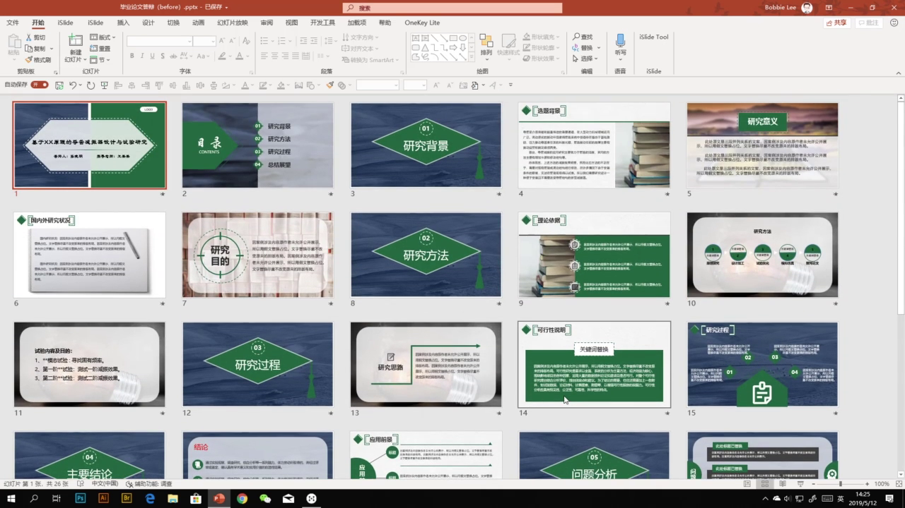</p>

课程里还展示了一个很实际的判断方法：查看 PPT 文件属性里的统计信息。原稿总编辑时间超过 3000 分钟，同时使用了多种字体。

<p align="center">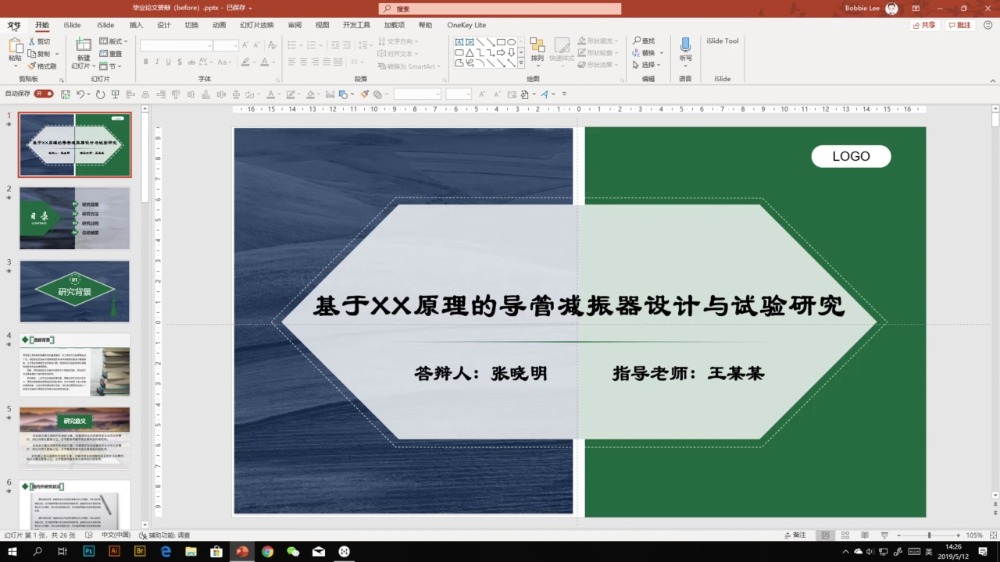</p>

## 6.2 优化要先做全局统一

优化后的版本并不是单独改某一页，而是先建立全局规则，再逐页调整。

全局统一主要包括：

- 统一主题配色
- 统一字体和字号层级
- 统一参考线和版心
- 统一页面风格
- 删除冗余版式

<p align="center">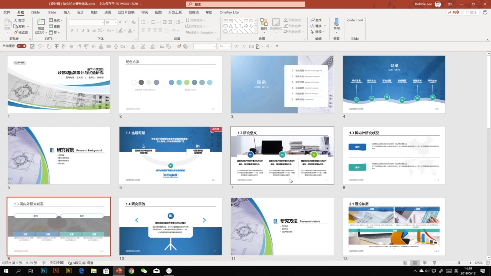</p>

## 6.3 案例一：选题背景页

原始页面的问题是把论文中的大段文字直接复制到 PPT 中，再配一张修饰性图片。这样的页面更像 Word 文档，不像演示辅助画面。

<p align="center">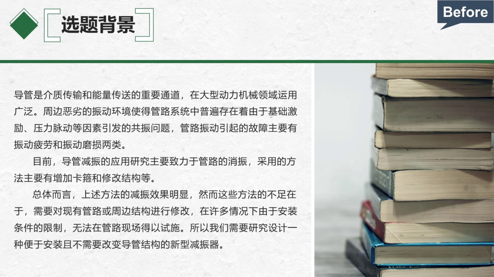</p>

优化思路是先删减文字，只保留关键信息，再借助形状、图标和背景图进行视觉化表达。

<p align="center">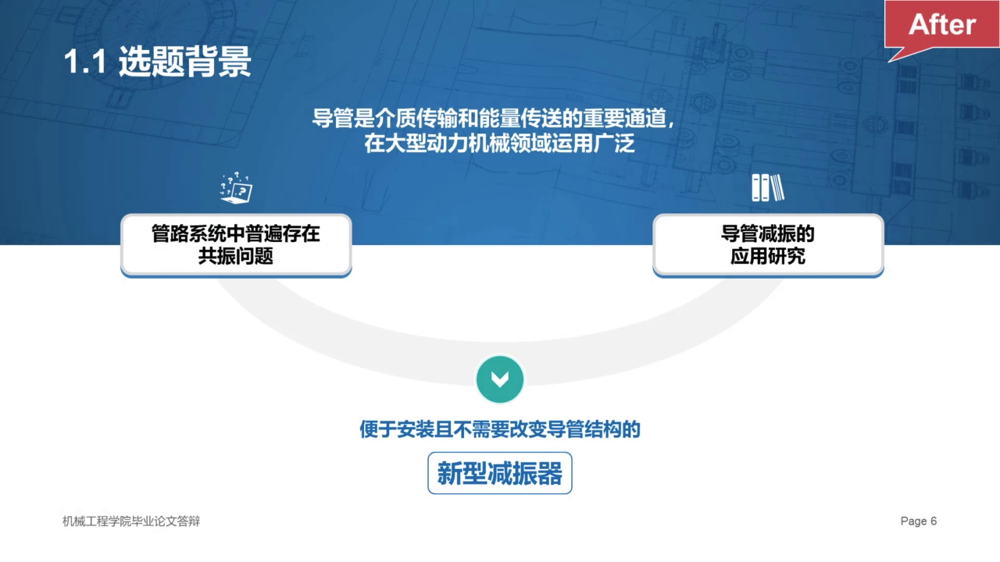</p>

## 6.4 案例二：研究过程页

研究过程本质上是流程关系，但原稿把四个观点做成了并列排布。再加上暗色背景和半透明色块，现场投影时可能不清晰。

<p align="center">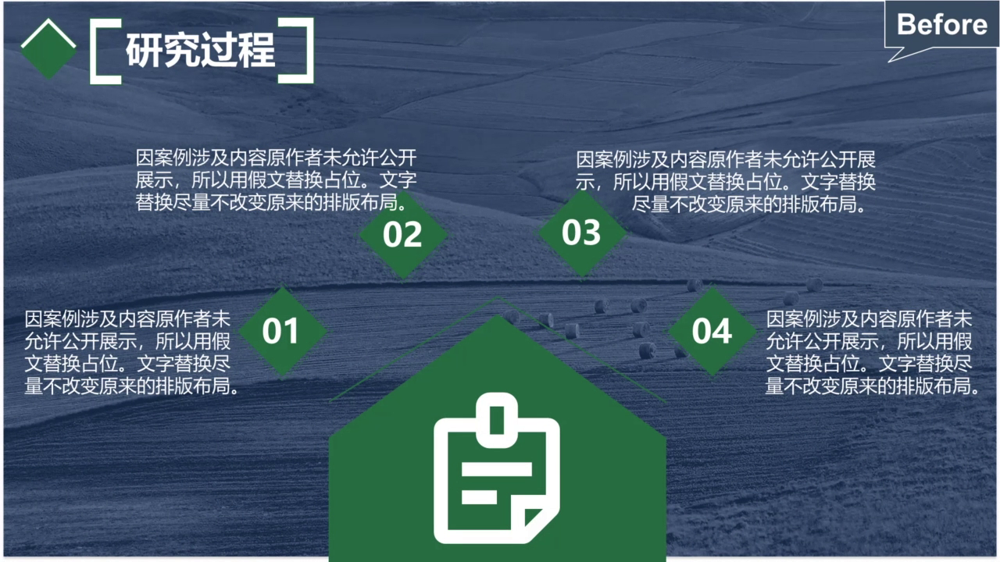</p>

优化时要先判断内容关系：如果是研究过程，就应该用线条、箭头或形状表现流程。

<p align="center">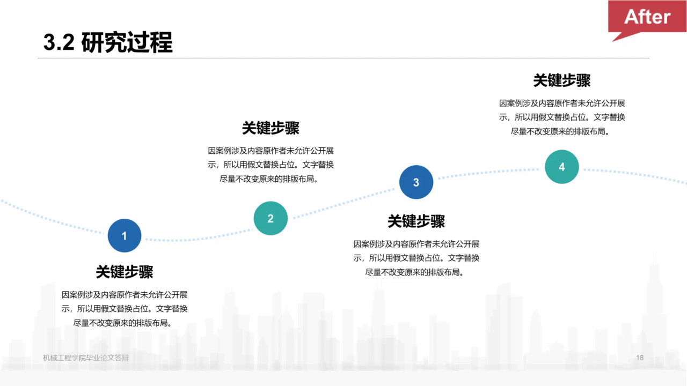</p>

## 6.5 案例三：并列信息页

这页内容是四个并列关系的信息点。原稿把四个内容纵向堆叠，虽然能看懂，但页面吸引力较弱，整体性也不足。

<p align="center">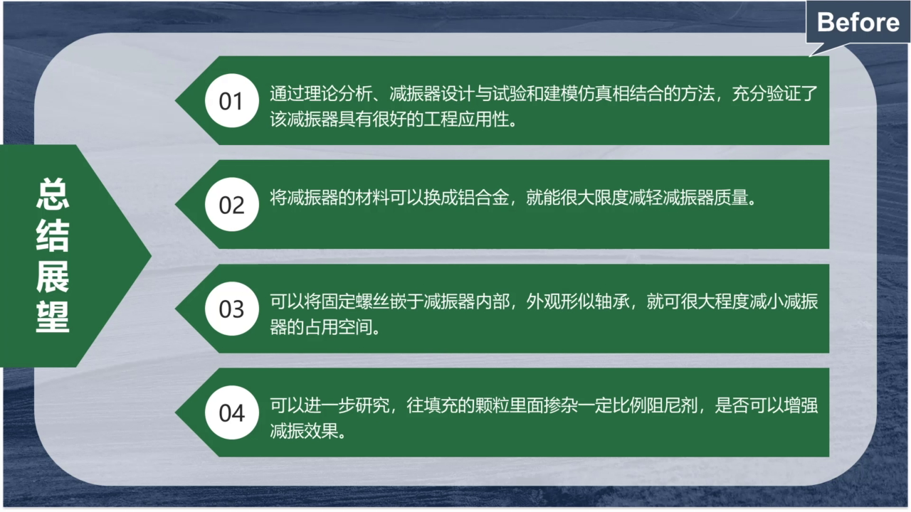</p>

优化后的页面把四个信息点改成横向排列，并用上方图片区域把页面连接成整体。

<p align="center">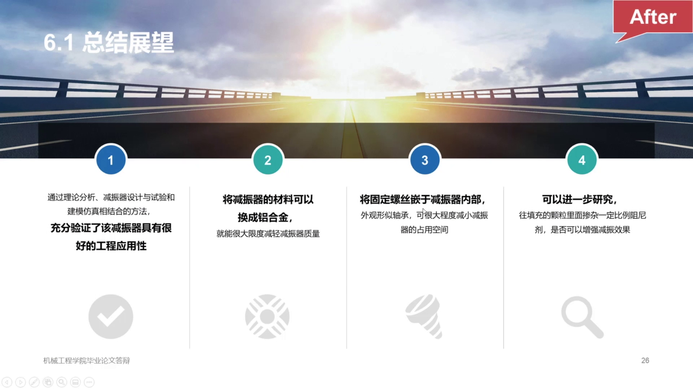</p>

## 6.6 案例四：成绩与不足页

这页内容是“成绩”和“不足”的对比。原稿直接把两段文字放进页面，用标签说明含义，但文字仍然偏大段。

<p align="center">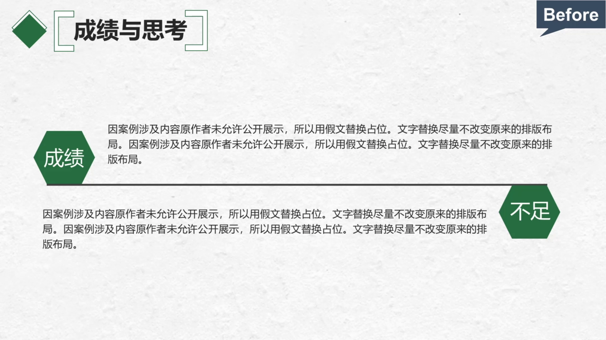</p>

优化时可以先用金字塔原理继续拆解文字，把成段内容提炼成更明确的小观点。然后让“成绩”和“不足”分列左右两侧。

<p align="center">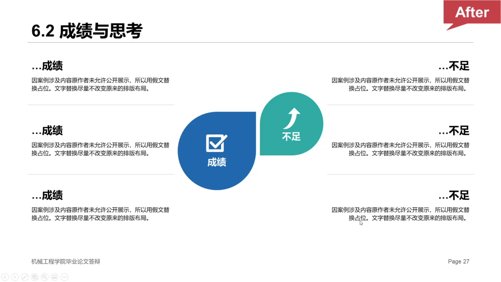</p>

## 6.7 本节总结

案例优化的核心不是替换模板，而是把内容关系重新表达清楚。

```text
先诊断问题
-> 建立全局统一规则
-> 判断每页内容关系
-> 删减和提炼文字
-> 用图形化语言重组页面
-> 检查对齐、配色、字体和留白
```
