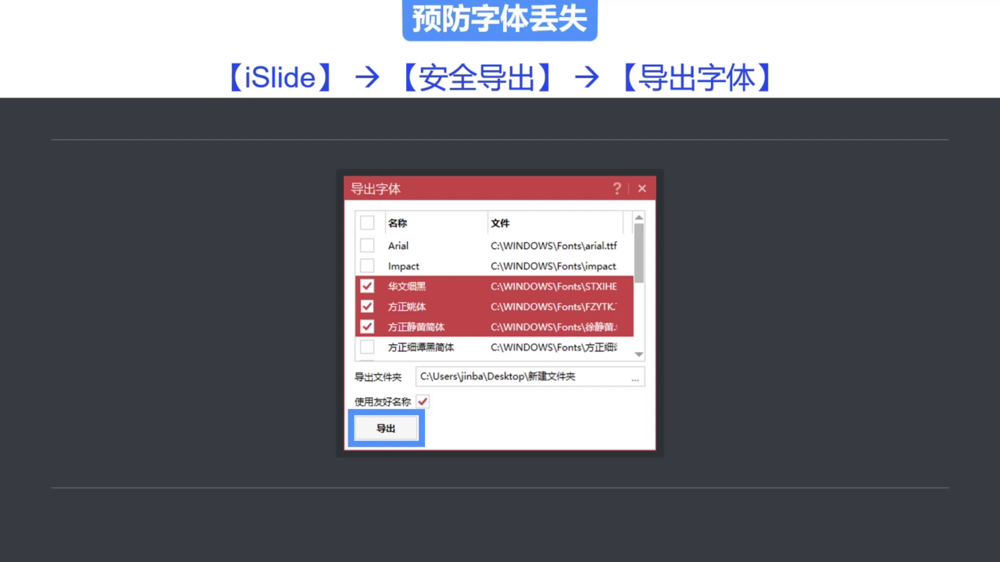
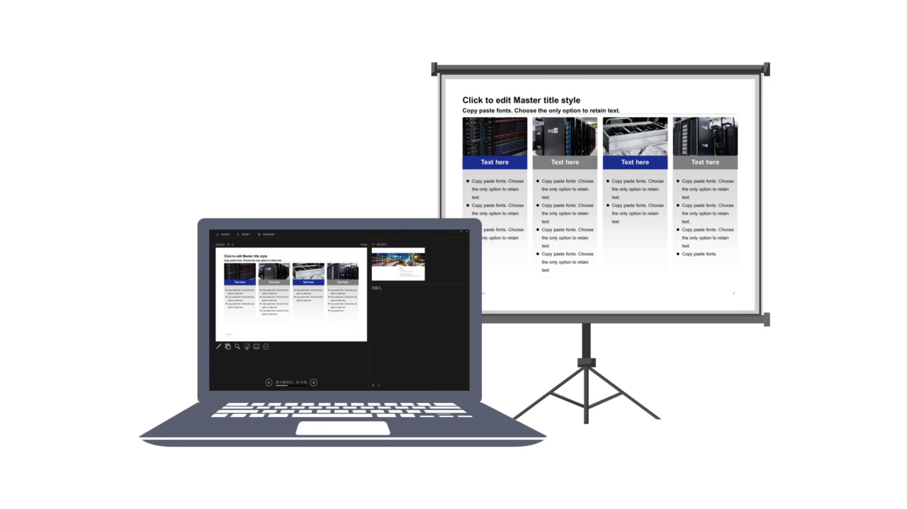
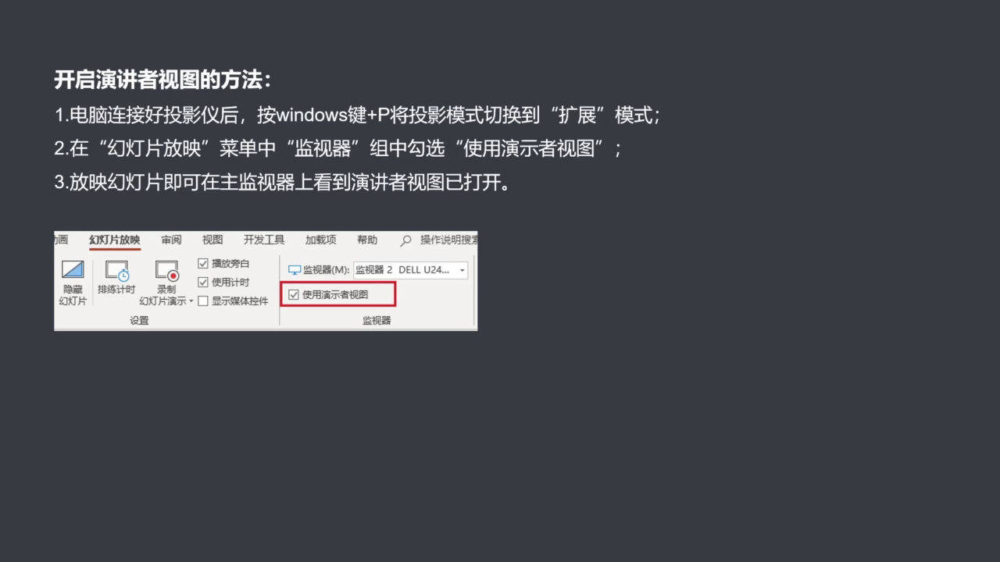
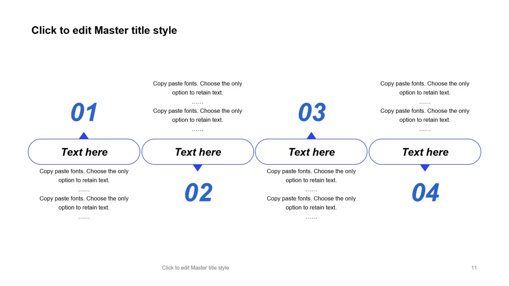
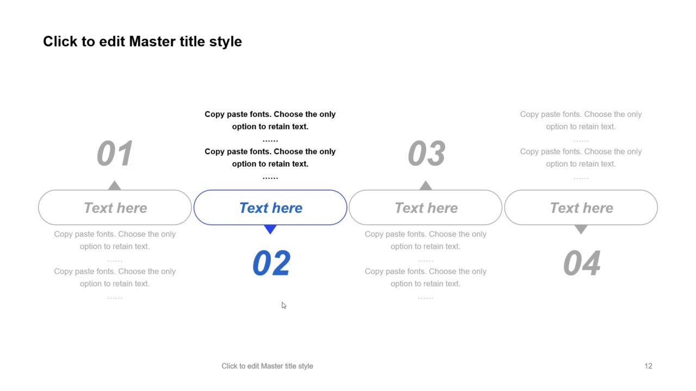
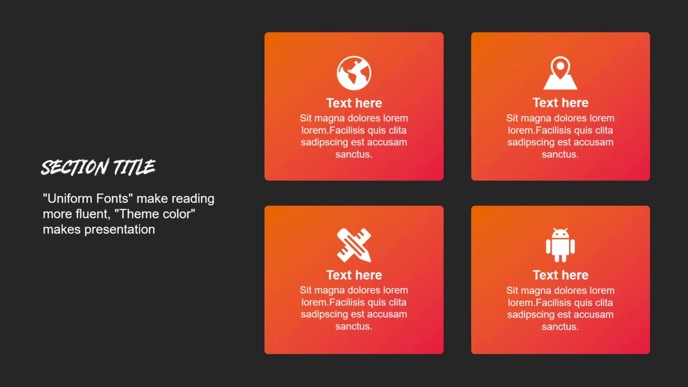
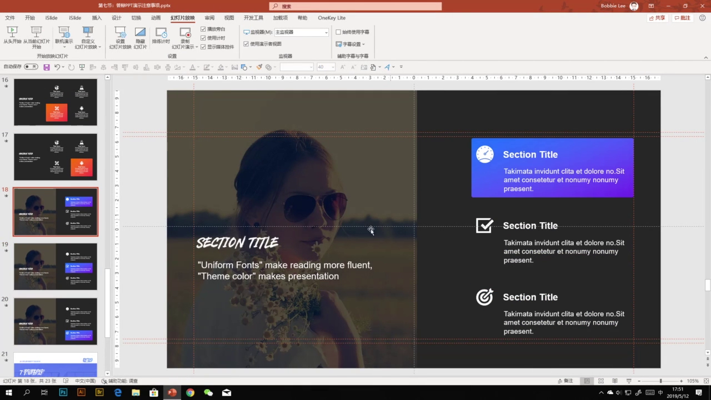
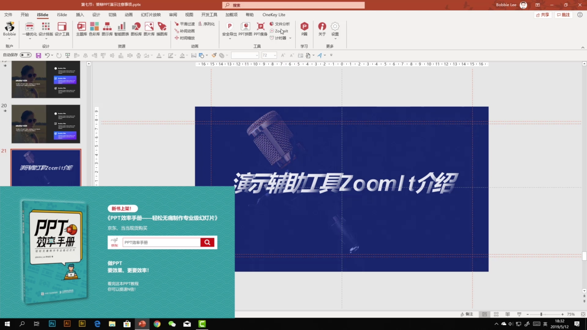

# 第 7 课：答辩 PPT 演示注意事项

答辩时，PPT 只是辅助工具。评委真正关注的是论文质量、讲解逻辑和现场表达，但 PPT 不能拖后腿。

## 7.1 答辩前先排除技术风险

到答辩教室后，要尽早确认：

- 现场电脑是否正常
- `Office` 版本是否过旧
- PPT 放映是否正常
- 投影仪或大屏是否可用
- 麦克风是否需要调试
- 网络是否可用
- 字体是否会丢失

<p align="center"></p>

如果 PPT 使用了特殊字体，要考虑现场电脑没有安装这些字体的情况。`iSlide` 提供了字体导出功能，可以把当前文档中使用的字体导出，再安装到放映电脑上。

<p align="center"></p>

## 7.2 使用演示者视图辅助讲解

演示者视图可以让观众看到正常放映画面，而演讲者在自己的电脑上看到备注、下一页预览和当前页。

<p align="center"></p>

开启演示者视图的基本步骤：

```text
连接投影
-> 按 Windows + P
-> 选择扩展模式
-> 幻灯片放映
-> 勾选使用演示者视图
-> 开始放映
```

<p align="center"></p>

## 7.3 动画要为演讲服务

毕业答辩 PPT 不建议使用过多动画。动画最重要的作用是：让正在讲的内容和屏幕上正在出现的内容保持同步。

当一页 PPT 同时出现多个信息点时，观众会本能地先扫完整页内容。

<p align="center"></p>

更好的做法是把当前正在讲的信息突出显示，把无关信息暂时隐藏或弱化。

<p align="center"></p>

也可以用色块控制观众视线，让观众跟着讲解节奏移动。

<p align="center"></p>

有些逐步强调效果不一定要复杂动画。可以把同一页复制多份，每一页突出一个信息点，再通过切换效果实现连续变化。

<p align="center"></p>

## 7.4 用 ZoomIt 做演示辅助

`ZoomIt` 是一个屏幕放大辅助工具，适合在演示时临时放大画面细节。课程中提到，`iSlide` 工具组里也提供了 `ZoomIt` 入口。

<p align="center"></p>

## 7.5 本节总结

答辩演示的核心不是让 PPT 抢镜，而是让 PPT 稳定、清晰地配合你的讲解。

```text
现场设备
-> Office 版本
-> 投影连接
-> 字体文件
-> 麦克风和网络
-> 备用电脑和转接线
```
