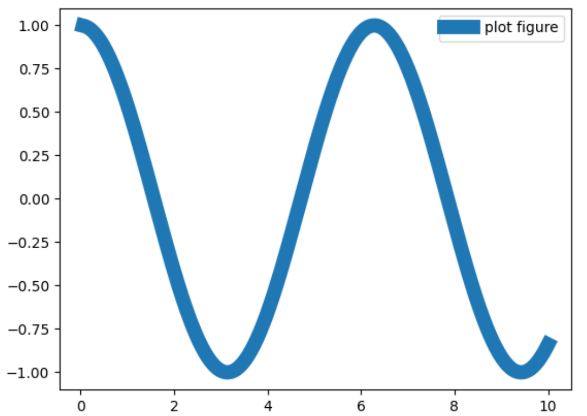
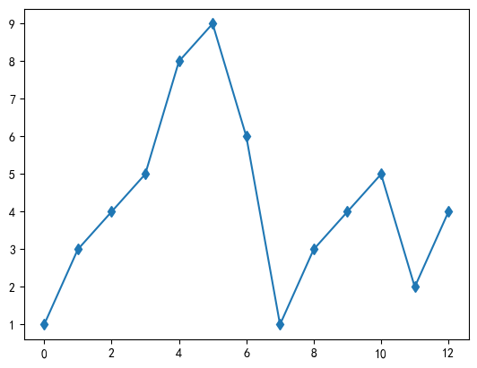
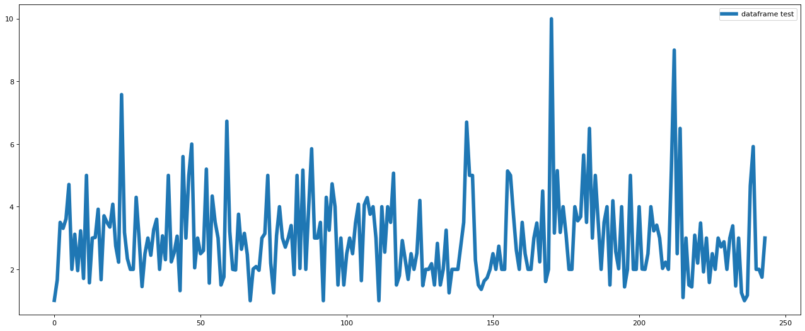
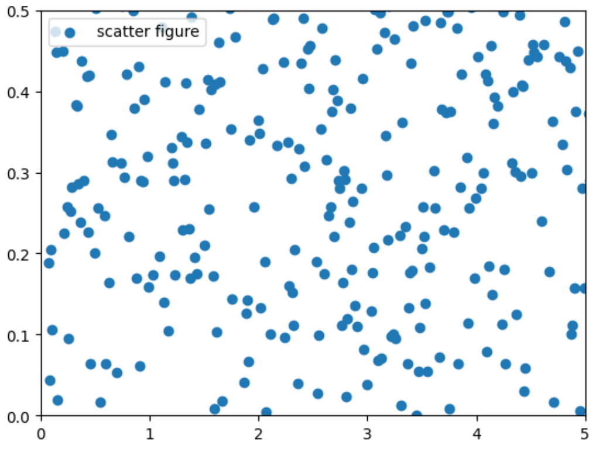
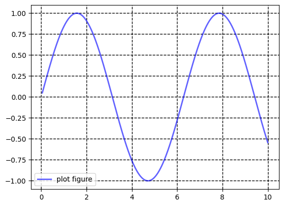
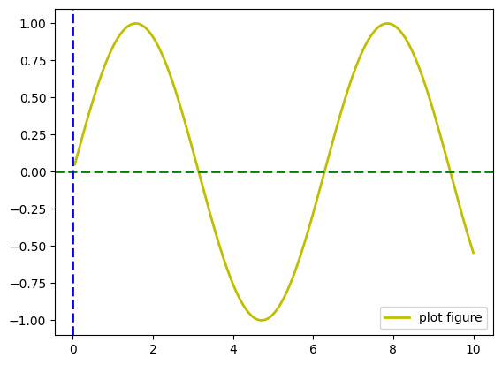
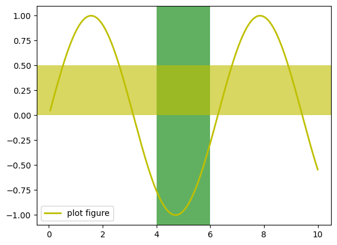
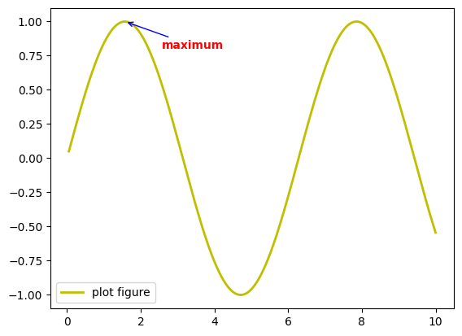
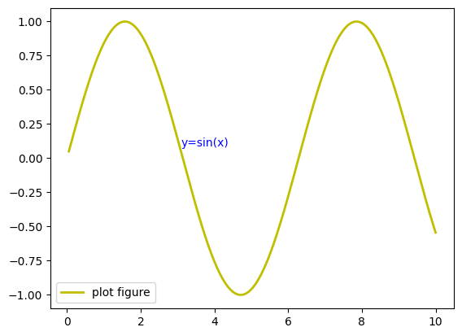
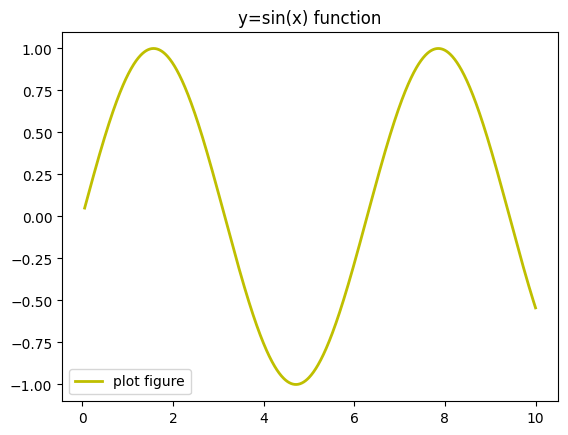

# 1.Matplotlib简介

## 1.1 Matplotlib 简介

`Matplotlib` 是 `Python` 编程语言及其数值数学扩展包 `NumPy` 的可视化操作界面。它为利用通用的图形用户界面工具包，如 `Tkinter`、`wxPython`、`Qt` 或 `GTK+` 向应用程序嵌入式绘图提供了应用程序接口（`API`）。

此外，`Matplotlib` 还有一个基于图像处理库（如开放图形库 `OpenGL`）的 `pylab` 接口，其设计与 `MATLAB` 非常类似。`SciPy` 就是用 `Matplotlib` 进行图形绘制。

```python
import matplotlib as mpl              # 导入Matplotlib，用于设置全局样式、参数
import matplotlib.pyplot as plt       # 导入绘图接口，用于画图

# 指定具体中文字体
mpl.rcParams['font.family'] = 'sans-serif'
mpl.rcParams['font.sans-serif'] = ['SimHei'] 

# 不使用unicode_minus模式处理坐标轴轴线为负数的情况    
mpl.rcParams['axes.unicode_minus'] = False       
```

## 1.2 Matplotlib 基础函数大全

```python
plot()           # 变量趋势变化
scatter()        # 变量之间关系
xlim()           # x轴数值显示范围
xlabel()         # x轴的标签文本
grid()           # 绘制刻度线的网格线
axhline()        # 绘制平行于x轴的水平参考线
axvspan()        # 绘制垂直于x轴的参考区域
annotate()       # 添加图形内容的指向注释（文本）
text()           # 添加图形内容的非指向文本
title()          # 添加图形内容的标题
legend()         # 标示不同图形的文本标签图例
```

<p align="center"></p>

## 1.3 读入数据

 `pd.read_csv` 函数

1. `!` 后面加 `linux` 命令可以直接在 `notebook` 里面执行
2. `iloc` 方法需要传入行索引（切片）或者列索引（切片），用逗号分隔开

```python
!ls -lr                                          # 列出当前目录内容（按时间逆序）
df = pd.read_csv('./tips_new.csv').iloc[:, 1:]   # 读取CSV文件，并去掉第0列
print(df)                                        # 输出DataFrame内容
```

## 1.4 折线图

`plt.plot` 函数，默认折线图

1. 横纵坐标分别是 `x` 和 `y` 参数（**x，y 长度需一致**）
2. `ls` 代表图线风格，`lw` 代表图线宽度
3. `label` 代表图像标签
4. 因为 `x` 轴数值稠密，所以折线图才会光滑

可以用魔法方法查看 plot 的参数：

| ls     | 效果        | 说明      |
| ------ | --------- | ------- |
| `'-'`  | ───────── | 实线（默认）  |
| `'--'` | ─ ─ ─ ─ ─ | 虚线      |
| `'-.'` | ─ · ─ · ─ | 点划线     |
| `':'`  | ⋯⋯⋯⋯⋯⋯⋯⋯  | 点线（细虚线） |

| lw       | 线条粗细效果  |
| -------- | ------- |
| `lw=0.5` | 很细      |
| `lw=1`   | 默认      |
| `lw=2~3` | 较常用，适中  |
| `lw=5以上` | 很粗，用于强调 |

| c     | 全名          | 颜色  |
| ----- | ----------- | --- |
| `'r'` | `'red'`     | 红色  |
| `'g'` | `'green'`   | 绿色  |
| `'b'` | `'blue'`    | 蓝色  |
| `'k'` | `'black'`   | 黑色  |
| `'y'` | `'yellow'`  | 黄色  |
| `'m'` | `'magenta'` | 洋红  |
| `'c'` | `'cyan'`    | 青色  |
| `'w'` | `'white'`   | 白色  |

| marker | 描述          |
| ------ | ----------- |
| `'.'`  | 点           |
| `','`  | 像素          |
| `'o'`  | 圆圈          |
| `'v'`  | 下三角         |
| `'^'`  | 上三角         |
| `'<'`  | 左三角         |
| `'>'`  | 右三角         |
| `'1'`  | 下三叉         |
| `'2'`  | 上三叉         |
| `'3'`  | 左三叉         |
| `'4'`  | 右三叉         |
| `'s'`  | 方形          |
| `'p'`  | 五边形         |
| `'*'`  | 星形          |
| `'h'`  | 六边形 1       |
| `'H'`  | 六边形 2       |
| `'+'`  | 加号          |
| `'x'`  | 叉号          |
| `'D'`  | 菱形          |
| `'d'`  | 窄菱形         |
| `'_'`  | 横线, 竖线用“\|” |

```python
%matplotlib inline                     # 在Jupyter中内嵌显示图像，否则会弹出窗口

import matplotlib.pyplot as plt
import numpy as np

x = np.linspace(0.05, 10, 1000)         # x = 0.05到10的等间距1000个点
y = np.cos(x)                           # y = cos(x)

# ls=图线风格, lw=图线宽度, label=图像标签
plt.plot(x, y, ls="-", lw="2", label="plot figure")   # 绘制图
plt.legend()                                          # 绘制图例
plt.show()                                            # 显示图像
```

```python
import matplotlib.pyplot as plt
import numpy as np

ypoints = np.array([1,3,4,5,8,9,6,1,3,4,5,2,4])

plt.plot(ypoints, marker = 'd')
plt.show()
```

在 Chrome 中，可以使用 `Ctrl+Shift+右键` 复制图片

<div style="display: flex; justify-content: center; gap: 10px; align-items: center;">
  
  
</div>

## 1.5 绘制 df 数据

1. `plt.figure` 可以预先设置图形大小和清晰度
2. `plt.plot` 可以对 series 绘图，所以使用 df 指定列即可，横轴为 **索引（index）**
3. 图片可以保存，利用 `plt.savefig` 函数

```python
plt.figure(figsize=(30,12), dpi=80)      # 设置图形大小和清晰度
plt.plot(df['tip'], ls="-", lw="2", label="dataframe test")   # 绘制线图
plt.legend()                             # 绘制图例
plt.savefig('image01.png')               # 保存图片
plt.show()                               # 显示图像
```

<p align="center"></p>

## 1.6 绘制散点图

1. `plt.scatter` 函数需要指定横轴和竖轴
2. 同样支持 dataframe 数据

```python
import matplotlib.pyplot as plt      
import numpy as np                   

x = np.linspace(0.05, 10, 1000)      # 生成 0.05 到 10 的等间距 1000 个点
np.random.seed(2024)                 # 设置随机种子
y = np.random.rand(1000)             # 生成 1000 个随机数作为 y

plt.scatter(x, y, label="scatter figure")   # 绘制散点图
plt.legend()                                # 显示图例
plt.show()                                  # 显示图形
```

<p align="center"></p>

## 1.7 设置坐标显示范围

1. 与上一页使用的数据相同
2. 想展示经过筛选的，用 `xlim`/`ylim`
3. `xlim` 是对横轴范围进行筛选，`ylim` 是对纵轴范围进行筛选
4. *比较像裁剪*，显示的圆点可能被切割

```python
import matplotlib.pyplot as plt      # 导入绘图库
import numpy as np                   # 导入数值计算库

x = np.linspace(0.05, 10, 1000)      # 生成 0.05 到 10 的等间距 1000 个点
np.random.seed(2024)                 # 设置随机种子
y = np.random.rand(1000)             # 生成 1000 个随机数作为 y

plt.scatter(x, y, label="scatter figure")   # 绘制散点图
plt.legend()                                # 显示图例

plt.xlim(0, 10.5)                       # 设置横轴范围
plt.ylim(0, 1)                          # 设置纵轴范围

plt.show()                              # 显示图形
```

<p align="center"></p>

## 1.8 坐标轴命名

1. `xlabel` 为横坐标命名， `ylabel` 为纵坐标命名
2. 几乎所有的可视化的最后阶段产出都需要重命名，才能更清晰地表达图形含义

```python
import matplotlib.pyplot as plt    # 导入绘图库
import numpy as np                 # 导入数值计算库

x = np.linspace(0.05, 10, 1000)    # 生成 0.05 到 10 的等间距 1000 个点
y = np.sin(x)                      # 计算 y = sin(x)

plt.plot(x, y, ls='-', lw='2', label='plot figure')   # 绘制折线图
plt.legend()                        # 显示图例

plt.xlabel("x-axis")                # x轴名称
plt.ylabel("y-axis")                # y轴名称

plt.show()                          # 显示图形
```

<p align="center"></p>

## 1.9 网格线

 `grid` 函数

1. `linestyle` 是网格线的格式
2. `color` 是颜色
3. `linewidth` 是线的粗度
4. 可以通过更改参数来获得最满意的搭配网格

```python
import matplotlib.pyplot as plt      # 导入绘图库
import numpy as np                   # 导入数值计算库

x = np.linspace(0.05, 10, 1000)      # 生成 0.05 到 10 的等间距 1000 个点
y = np.sin(x)                        # 计算 y = sin(x)

plt.plot(x, y, ls='-', lw='2', c='y', label='plot figure')   # 绘制折线图（黄色）
plt.legend()                          # 显示图例 

# 设置网格线格式、颜色、粗细（点状线、黑色、细网格线）
plt.grid(linestyle=':', color='k', linewidth=1)   

plt.show()                            # 显示图形
```

<p align="center"></p>

## 1.10 参考线

1. `axhline` 添加水平线，`axyline` 添加竖直线
2. `c` 是颜色，`ls` 是参考线格式，`lw` 是线的粗度，参数 `x` 和 `y` 分别指定位置

```python
import matplotlib.pyplot as plt      # 导入绘图库
import numpy as np                   # 导入数值计算库

x = np.linspace(0.05, 10, 1000)      # 生成 0.05 到 10 的等间距 1000 个点
y = np.sin(x)                        # 计算 y = sin(x)

plt.plot(x, y, ls='-', lw='2', c='y', label='plot figure')   # 绘制折线图（黄色）
plt.legend()                                                 # 显示图例 
plt.axhline(y=0.0, c='b', ls='--', lw='2')                   # 水平线
plt.axhline(x=0.0, c='b', ls='--', lw='2')                   # 竖直线
plt.show()                                                   # 显示图形
```

<p align="center"></p>

## 1.11 高亮区域

1. `axvspan` 代表竖直区域，`axhspan` 代表水平区域
2. `facecolor` 代表了区域的颜色，`xmin`、`xmax`、 `ymin`、`ymax` 代表了区域的范围
3. `alpha` 为透明度

```python
import matplotlib.pyplot as plt      # 导入绘图库
import numpy as np                   # 导入数值计算库

x = np.linspace(0.05, 10, 1000)      # 生成 0.05 到 10 的等间距 1000 个点
y = np.sin(x)                        # 计算 y = sin(x)

plt.plot(x, y, ls='-', lw='2', c='y', label='plot figure')   # 绘制折线图（黄色）
plt.legend()                                                 # 显示图例 
plt.axvspan(xmin=4.0, xmax=6.0, facecolor='g', alpha=0.3)    # 竖直区域（绿色）
plt.axhspan(ymin=0.0, ymax=0.5, facecolor='y', alpha=0.3)    # 水平区域（黄色）
plt.show()                                                   # 显示图形
```

<p align="center"></p>

## 1.12 指向型注释文本

`annotate` 函数

1. `xy` 给出被标记坐标位置，`xytext` 给出文本的位置
2. `color` 文本代表颜色，`weight` 代表是否加粗，`arrowprops` 指定了箭头类型、连接方式和颜色

```python
import matplotlib.pyplot as plt              # 导入绘图库
import numpy as np                           # 导入数值计算库

x = np.linspace(0.05, 10, 1000)              # 生成等间距点
y = np.sin(x)                                # 计算 y = sin(x)

plt.plot(x, y, ls='-', lw='2', c='y', label='plot figure')   # 绘制折线图
plt.legend()                                  # 显示图例

plt.annotate(
    "maximum",                                # 注释文本
    xy=(np.pi/2, 1.0),                        # 被标记点位置
    xytext=((np.pi/2)+1.0, 0.8),              # 文本显示位置
    weight='bold',                            # 文本加粗
    color='r',                                # 文本颜色
    arrowprops=dict(arrowstyle='->',          # 箭头样式
                    connectionstyle='arc3',
                    color='b')                # 箭头颜色
)

plt.show()                                    # 显示图形
```

<p align="center"></p>

## 1.13 非指向型注释文本

`text` 函数

1. 首先给出坐标位置，然后给出文本
2. 颜色用 `color` 来指定
3. `weight` 是指文本是否加粗

```python
import matplotlib.pyplot as plt      # 导入绘图库
import numpy as np                   # 导入数值计算库

x = np.linspace(0.05, 10, 1000)      # 生成等间距点
y = np.sin(x)                        # 计算 y = sin(x)

plt.plot(x, y, ls='-', lw='2', c='y', label='plot figure')   # 绘制折线图
plt.legend()                          # 显示图例

plt.text(3.1, 0.09, 'y=sin(x)',       # 文本位置与内容
         weight='bold',               # 文本加粗
         color='b')                   # 文本颜色

plt.show()                            # 显示图形
```

<p align="center"></p>

## 1.14 图形标题

 `title` 指定文本，会默认绘制在图形上侧

```python
import matplotlib.pyplot as plt      # 导入绘图库
import numpy as np                   # 导入数值计算库

x = np.linspace(0.05, 10, 1000)      # 生成等间距点
y = np.sin(x)                        # 计算 y = sin(x)

plt.plot(x, y, ls='-', lw='2', c='y', label='plot figure')   # 绘制折线图
plt.legend()                          # 显示图例

plt.title('y=sin(x) function')        # 添加图形标题

plt.show()                            # 显示图形
```

<p align="center"></p>

## 1.15 文本标签位置

`plt.legend` 函数

 参数 `loc` 有种选择，按照位置去选择

| loc 值            | 位置            |
| ---------------- | ------------- |
| `'best'`         | 自动选择最不遮挡数据的位置 |
| `'upper right'`  | 右上角           |
| `'upper left'`   | 左上角           |
| `'lower left'`   | 左下角           |
| `'lower right'`  | 右下角           |
| `'center'`       | 正中央           |
| `'center left'`  | 中左            |
| `'center right'` | 中右            |
| `'right'`        | 中右            |
| `'upper center'` | 上中            |
| `'lower center'` | 下中            |

```python
import matplotlib.pyplot as plt      # 导入绘图库
import numpy as np                   # 导入数值计算库

x = np.linspace(0.05, 10, 1000)      # 生成等间距点
y = np.sin(x)                        # 计算 y = sin(x)

plt.plot(x, y, ls='-', lw='2', c='y', label='plot figure')   # 绘制折线图

# plt.legend(loc='upper right')      # 可选位置示例（被注释掉）
plt.legend(loc='best')               # 使用 best 自动选择最优位置

plt.show()                            # 显示图形
```

<p align="center"></p>

## 1.16 组间函数组合应用

1. `plt.figure(figsize=(20,12))` 可以设置图片长宽尺寸
2. `plt.xticks(xlist, fontsize=20)` 可以指定 x 轴的刻度和字体大小

示例：

```python
import matplotlib.pyplot as plt

plt.figure(figsize=(8, 4), dpi=100) # 默认figsize=(6.4, 4.8), dpi=100
plt.xticks([0, 1, 2], ['一月', '二月', '三月'], rotation=45)
```

组合实现复杂功能：

```python
import matplotlib.pyplot as plt        # 导入绘图库
import numpy as np                     # 导入数值计算库
from matplotlib import cm as cm        # 导入matplotlib色图模块并简写为cm

# define data
x = np.linspace(0.5, 3.5, 100)         # 生成 0.5 到 3.5 的等间距 100 个点
y = np.sin(x)                          # 计算 y = sin(x)
np.random.seed(2024)                   # 设置随机种子
y1 = np.random.rand(100) * 3           # 生成 0~3 范围内的100个随机数作为散点y值

plt.figure(figsize=(20, 12))           # 设置图形尺寸

# scatter figure
plt.scatter(x, y1, c='0.25', label='scatter figure')    # 绘制散点图

# plot figure
plt.plot(x, y, ls='--', lw=2, label='plot figure')      # 绘制折线图

# set x,yaxis limit
plt.xlim(0.0, 4.0)                      # 设置x轴范围
plt.ylim(-3.0, 3.0)                     # 设置y轴范围

plt.xticks(np.arange(0, 4.5, 0.5), fontsize=20)   # 设置x轴刻度及字体大小
plt.yticks(np.arange(-3, 3+1, 1), fontsize=20)    # 设置y轴刻度及字体大小

# set axes labels
plt.xlabel('x_axis', fontsize=20)       # 设置x轴标签
plt.ylabel('y_axis', fontsize=20)       # 设置y轴标签

# set x,yaxis grid
plt.grid(ls=':', color='r')             # 设置网格线格式和颜色

# add a horizontal line across the axis
plt.axhline(y=0.0, c='r', ls='--', lw=2)   # 添加水平参考线

# add a vertical span across the axis
plt.axvspan(xmin=1.0, xmax=2.0, facecolor='r', alpha=0.3)   # 添加竖向区域

# set annotating information
plt.annotate('maximum', xy=(np.pi/2, 1.0),                  # 标记最大值点
             xytext=((np.pi/2)+0.15, 1.5), weight='bold', color='b',
             arrowprops=dict(arrowstyle='->', connectionstyle='arc3', color='r'),
             fontsize=30)

plt.annotate('spines', xy=(0.75, -3),                       # 标记spines说明
             xytext=(0.35, -2.25), weight='bold', color='b',
             arrowprops=dict(arrowstyle='->', connectionstyle='arc3', color='r'),
             fontsize=30)

plt.annotate('', xy=(0, -2.78),                             # 指向左下刻度线
             xytext=(0.4, -2.32), weight='bold', color='r',
             arrowprops=dict(arrowstyle='->', connectionstyle='arc3', color='r'),
             fontsize=20)

plt.annotate('', xy=(3.5, -2.98),                           # 指向右下刻度线
             xytext=(3.6, -2.7), weight='bold', color='r',
             arrowprops=dict(arrowstyle='->', connectionstyle='arc3', color='r'),
             fontsize=20)

# set text information
plt.text(3.6, -2.7, "'|' is tickline", weight='bold', color='b', fontsize=20)     # 文本：刻度线说明
plt.text(3.6, -2.95, "3.5 is ticklabel", weight='bold', color='b', fontsize=20)   # 文本：刻度值说明

# set title
plt.title("structure of matplotlib", fontsize=20)       # 设置标题

# set legend
plt.legend(loc='upper right', fontsize=15)              # 设置图例位置及字体大小

plt.show()                                             # 显示图形
```

<p align="center"></p>

