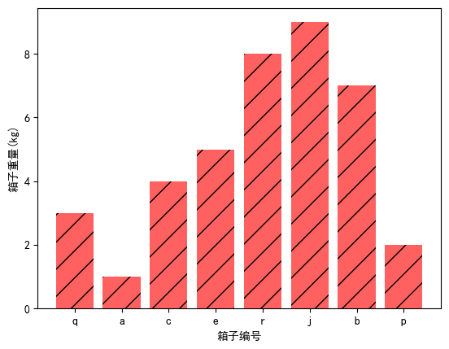
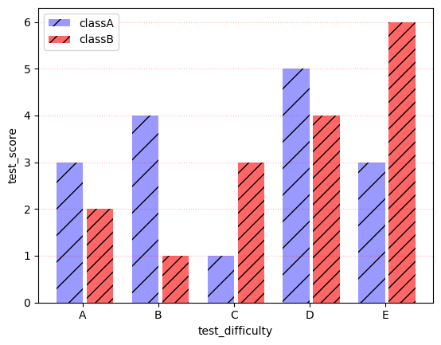
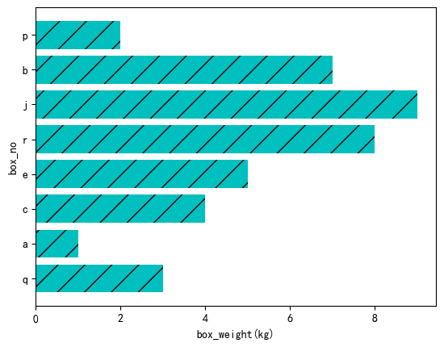
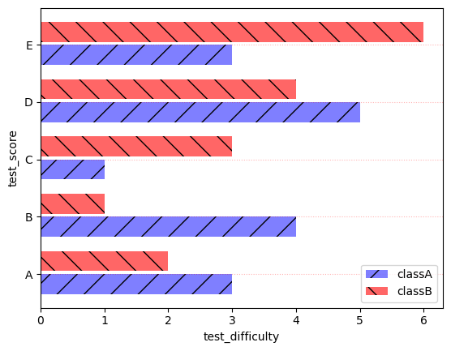
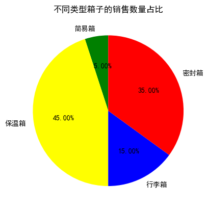

# 2.Matplotlib绘图函数

## 2.1 柱状图

 `bar` 函数

1. 可以通过 `rcparams` 设置字体和中文符号显示
2. `tick_label` 是对横轴进行的重命名
3. `hatch` 是柱状图上的花纹格式
4. `color` 是柱子的颜色，`align` 是指柱子对齐的参数

```python
# some simple data
x = [1, 2, 3, 4, 5, 6, 7, 8]                        # x轴数据
y = [3, 1, 4, 5, 8, 9, 7, 2]                        # y轴数据

# create bar
plt.bar(x, y, align='center', color='r',            # 绘制柱状图
        tick_label=['q', 'a', 'c', 'e', 'r', 'j', 'b', 'p'],  # 横轴标签
        hatch='/')                                  # 柱状图花纹

plt.xlabel("箱子编号")                               # x轴标签
plt.ylabel("箱子重量(kg)")                           # y轴标签
plt.show()                                          # 显示图形
```

<p align="center"></p>

## 2.2 堆积柱状图

1. 大部分设置于普通柱状图相同
2. 区别在于：首先要画 2 次柱状图; 其次第二个柱状图要使用参数 `bottom` 来实现堆积

```python
# some simple data
x = [1, 2, 3, 4, 5]                            # x轴数据
y = [3, 4, 1, 5, 3]                            # 第一组柱状数据
y1 = [2, 1, 3, 4, 6]                           # 第二组柱状数据
tick_label = ['A', 'B', 'C', 'D', 'E']         # 横轴标签

# create bar
plt.bar(x, y, align='center',                 # 绘制第一组柱状图
        color='b', tick_label=tick_label,
        label='classA')

plt.bar(x, y1, align='center',                # 绘制第二组柱状图
        color='r', bottom=y,                  # bottom=y 实现堆积效果，y是一个列表
        tick_label=tick_label,
        label='classB')

plt.xlabel('test_difficulty')                  # 设置x轴名称
plt.ylabel('test_score')                       # 设置y轴名称

# set x-axis grid
plt.grid(axis='y', ls=':', color='r', alpha=0.3)   # 设置网格（仅y轴）

plt.legend()                                   # 显示图例
plt.show()                                      # 显示图形
```

<p align="center"></p>

## 2.3 多系列对比柱状图

1. 多系列柱状图是通过改变 x 轴的值来实现并列和对比效果的，可以设定对比系列间距，参数为 `bar_width`
2. 如果 A 和 B 不想紧挨着，可以在横轴基础上再加上一个小间隔，例如 `0.05`
3. `alpha` 可以设置颜色的饱和度

```python
# some simple data
x = np.arange(5)                                  # 生成 x = [0,1,2,3,4]
y = [3, 4, 1, 5, 3]                               # 第一组柱状数据
y1 = [2, 1, 3, 4, 6]                              # 第二组柱状数据
bar_width = 0.35                                  # 柱状条宽度
tick_label = ['A', 'B', 'C', 'D', 'E']            # 横轴标签

# create bar
plt.bar(x, y, bar_width,                          # 绘制第一组柱状图
        align='center', color='b', label='classA',
        hatch='/', alpha=0.4)

plt.bar(x + bar_width + 0.05,                     # 绘制第二组柱状图（并列显示）
        y1, bar_width,
        align='center', color='r', label='classB',
        hatch='//', alpha=0.6)

plt.xlabel('test_difficulty')                      # 设置 x 轴名称
plt.ylabel('test_score')                           # 设置 y 轴名称

# set x-axis grid
plt.grid(axis='y', ls=':', color='r', alpha=0.3)   # 设置 y 轴网格

# set x-axis ticks and tick_labels
plt.xticks(x + bar_width / 2, tick_label)          # 设置刻度位置与标签

plt.legend()                                       # 显示图例
plt.show()                                         # 显示图形
```

<p align="center"></p>

## 2.4 水平柱状图

1. `barh` 用于绘制 水平柱状图，与 `bar`（垂直柱状图）相对
2. 水平柱状图特别适合类别名称较长、或垂直空间不足的场景

```python
import matplotlib as mpl                     # 导入matplotlib主模块
import matplotlib.pyplot as plt              # 导入绘图库

# 解决matplotlib无法显示中文问题
mpl.rcParams['font.sans-serif'] = ['SimHei']        # 指定中文字体为黑体
mpl.rcParams['axes.unicode_minus'] = False          # 解决负号显示问题

# some simple data
x = [1, 2, 3, 4, 5, 6, 7, 8]                        # y轴对应的类别
y = [3, 1, 4, 5, 8, 9, 7, 2]                        # 每个类别的数值

# create bar
plt.barh(x, y,                                      # 绘制水平柱状图
         align='center',
         color='c',                                 # 青色
         tick_label=['q', 'a', 'c', 'e', 'r', 'j', 'b', 'p'],
         hatch='/')

# set x,y_axis label
plt.ylabel("box_no")                                # y轴标签（仍为竖直方向）
plt.xlabel("box_weight(kg)")                        # x轴标签（仍为水平方向）

plt.show()                                          # 显示图形
```

<p align="center"></p>

## 2.5 水平堆积柱状图

1. 第二个柱状图要使用参数 `left` 来实现堆积效果
2. 其余设置与普通水平柱状图完全相同（如 `color`、`tick_label`、`align`）

```python
# some simple data
x = [1, 2, 3, 4, 5]                               # y轴对应类别
y = [3, 4, 1, 5, 3]                               # 第一组数据
y1 = [2, 1, 3, 4, 6]                              # 第二组数据
tick_label = ['A', 'B', 'C', 'D', 'E']            # 标签

# create bar
plt.barh(x, y,                                     # 第一组水平柱状图
         align='center',
         color='b',
         tick_label=tick_label,
         label='classA')

plt.barh(x, y1,                                     # 第二组水平柱状图
         align='center',
         color='r',
         left=y,                                    # 关键参数：实现水平堆积
         tick_label=tick_label,
         label='classB')

plt.xlabel('test_difficulty')                       # x轴名称
plt.ylabel('test_score')                            # y轴名称

# set x-axis grid
plt.grid(axis='x', ls=':', color='r', alpha=0.3)    # 设置网格线

plt.legend()                                        # 显示图例
plt.show()                                          # 显示图形
```

<p align="center"></p>

## 2.6 多系列水平对比柱状图

1. 多系列水平柱状图是通过控制 y 轴的值（*这里 y 轴的值仍然是列表 x*）来实现并列和对比效果的，可以设定对比系列间距，参数为 `bar_width`
2. 如右图，如果 A 和 B 不想紧挨着，可以在横轴基础上再加上一个小间隔，例如 `0.05`

```python
# some simple data
x = np.arange(5)                              # y轴位置
y = [3, 4, 1, 5, 3]                            # 第一组数据
y1 = [2, 1, 3, 4, 6]                           # 第二组数据
bar_width = 0.35                               # 柱宽
tick_label = ['A', 'B', 'C', 'D', 'E']         # 标签

# create horizontal bar
plt.barh(x, y, bar_width,                      # 第一组水平柱状图
         align='center', color='b',
         label='classA', alpha=0.5, hatch='/')

plt.barh(x + bar_width + 0.05,                 # 第二组水平柱状图
         y1, bar_width, align='center',
         color='r', label='classB', alpha=0.6, hatch='\\')

plt.xlabel('test_difficulty')                  # x轴标签
plt.ylabel('test_score')                       # y轴标签

# set x-axis grid
plt.grid(axis='y', ls=':', color='r', alpha=0.3)   # 网格

# set x-axis ticks and tick_labels
plt.yticks(x + bar_width / 2, tick_label)      # 设置y轴刻度标签

plt.legend()                                   # 图例
plt.show()                                     # 显示图形
```

<p align="center"></p>

## 2.7 直方图

`hist` 函数

1. `bins` 是柱子的个数
2. `rwidth` 是间隔
3. `histtype` 是指直方图的形式
4. `color` 是柱子颜色
5. 更改 `histtype` 参数来决定外观选择
`histtype` 参数值：

| 值              | 描述           |
| -------------- | ------------ |
| `'bar'`        | 传统直方图条形      |
| `'barstacked'` | 堆叠直方图    |
| `'step'`       | 线框直方图    |
| `'stepfilled'` | 填充的线框直方图 |

```python
# 解决matplotlib无法显示中文问题
mpl.rcParams['font.sans-serif'] = ['SimHei']        # 设置中文字体
mpl.rcParams['axes.unicode_minus'] = False          # 解决负号显示问题

# set test scores
np.random.seed(2024)                                # 随机种子
boxWeight = np.random.randint(0, 10, 100)           # 生成0–9的100个随机数
x = boxWeight                                       # 数据

# plot histogram
plt.hist(x, bins=10,                                # 柱子数量
         color='green',                             # 柱子颜色
         histtype='bar',                            # 直方图类型
         rwidth=0.8,                                # 柱子之间的距离，下雨1才会有间隔
         alpha=0.6)                                 # 透明度

# set x,y_axis label
plt.xlabel("box_no")                                # x轴标签
plt.ylabel("box_weight(kg)")                        # y轴标签

plt.show()                                          # 显示图形
```

<p align="center"></p>

## 2.8 饼图

`pie` 函数

1. 指定数据和 `labels`
2. `autopct` 指定百分比的显示形式
3. 可以指定 `colors` 配置
4. `startangle` 第一个扇形的起始角度
5. 主要用于*宏观分析*

```python
# 解决matplotlib无法显示中文问题
mpl.rcParams['font.sans-serif'] = ['SimHei']        # 设置中文字体
mpl.rcParams['axes.unicode_minus'] = False          # 解决负号显示问题

# kinds 数据
# kinds = ['jianyi', 'baowen', 'xingli', 'mifeng']    
kinds = ["简易箱", "保温箱", "行李箱", "密封箱"]      # 标签 
colors = ['green', 'yellow', 'blue', 'red']         # 颜色
soldNums = [0.05, 0.45, 0.15, 0.35]                 # 数据

# pie chart
plt.pie(soldNums,
        labels=kinds,              # 标签
        autopct="%5.2f%%",         # 前面的数字表示往右移动，后面的数字表示小数点位数
        startangle=90,             # x正轴为0度
        colors=colors)             # 颜色

# title
# plt.title("sales_percentage_of_boxes")
plt.title("不同类型箱子的销售数量占比")               # 标题

plt.show()                                          # 显示图形
```

<p align="center"></p>

## 2.9 气泡图

`scatter` 函数

1. 与散点图一样，需要指定两列数据
2. `s` 参数是指定气泡大小，支持用函数表达式
3. `c` 代表颜色
4. `marker` 代表形状

```python
np.random.seed(2024)                          # 设置随机种子
x = np.random.randn(100)                      # 生成 x 数据
y = np.random.randn(100)                      # 生成 y 数据
size_n = np.power(10*x + 20*y, 2)             # 计算气泡大小
# s=np.power(10*x+20*y,2)                     
# colormap:RdYlBu                       

plt.scatter(x, y, s=size_n,                   # 数组的次方，标签size
            c=np.random.rand(100),            # 小数表示灰度，0-1颜色逐渐变浅
            # cmap=mpl.cm.RdYlBu,       
            marker='o')                       # 标签形状

plt.ylim(-5, 5)                               # 设置 y 轴范围
plt.title("matplotlib也可以画气泡图！！！")     # 设置标题
plt.show()                                    # 显示图形
```

> [!TIP] 💡 提示
> 气泡大小计算公式：`size_n=(10*x + 20*y)**2`，当 `10*x+20*y≈0` 时，平方后气泡大小非常小，对应点大约落在直线 `y≈-0.5 x` 上，所以看到一条小气泡线

<p align="center"></p>

## 2.10 棉棒图

 `stem` 函数

1. 需要指定坐标 `x`、`y`
2. `linefmt` 是棉棒的样式
3. `markerfmt` 是棉棒末端的样式
4. `basefmt` 是基线（`y=0`）的样式

| 参数          | 值                                                        |
| ----------- | -------------------------------------------------------- |
| `linefmt`   | `'-'` 实线， `'--'` 虚线， `'-.'` 点划线， `':'` 点线， `'r-.'` 红色点划线 |
| `markerfmt` | `'o'` 圆圈， `'s'` 方块， `'^'` 三角， `'*'` 星号， `'ro'` 红色圆圈      |
| `basefmt`   | `'-'` 实线， `'--'` 虚线， `':'` 点线， `'k-'` 黑色实线               |

```python
np.random.seed(2024)                       # 设置随机种子
x = np.linspace(0.5, 2*np.pi, 20)          # x 数据
y = np.random.randn(20)                    # y 数据

plt.stem(x, y,
         linefmt='-.',                     # 竖直线样式
         markerfmt='o',                    # 尾部标记样式
         basefmt='-')                      # 基线样式
# plt.stem(x,y,linefmt='-.',markerfmt='o',basefmt='--')  

plt.show()                                 # 显示图形
```

<p align="center"></p>

## 2.11 堆积折线图

 `stackplot` 函数

1. 需要指定横轴 `x` 和所有的纵轴指标
2. `labels` 是堆积的系列的名字
3. `colors` 是每个指定系列的颜色配置，如果没有配置就按照默认分配

```python
x = np.arange(5)                             # x 轴数据
y = [0, 4, 3, 5, 6]                          # 第一组数据
y1 = [1, 3, 4, 2, 7]                         # 第二组数据
y2 = [3, 4, 1, 6, 5]                         # 第三组数据
y3 = (np.array(y1) + np.array(y2)) / 2       # 第四组数据

labels = ['A', 'B', 'C', 'D']                # 标签
colors = ['b', 'orange', 'g', 'k']           # 颜色

# plt.stackplot(x,y,y1,y2,labels=labels,colors=colors)     
plt.stackplot(x,y,y1,y2,y3,labels=labels,colors=colors,alpha=0.618)  # 绘制堆积折线图
# plt.plot(x,y)                       

plt.legend(loc='upper left')                 # 图例放置在左上角
plt.show()                                   # 显示图形
```

<p align="center"></p>

