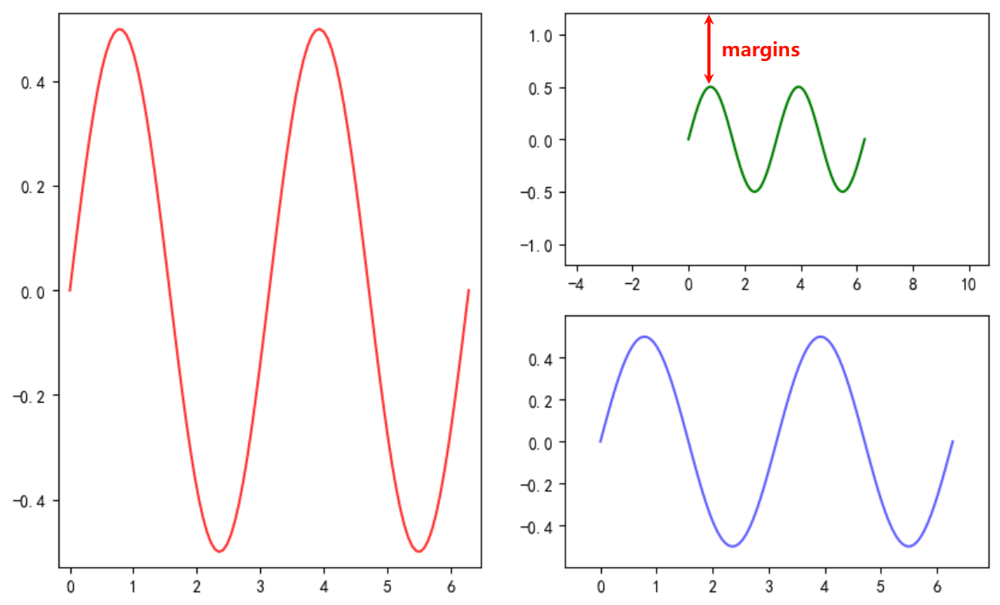
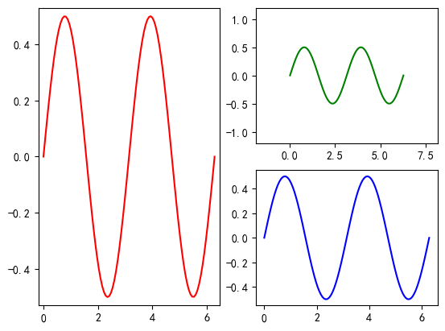
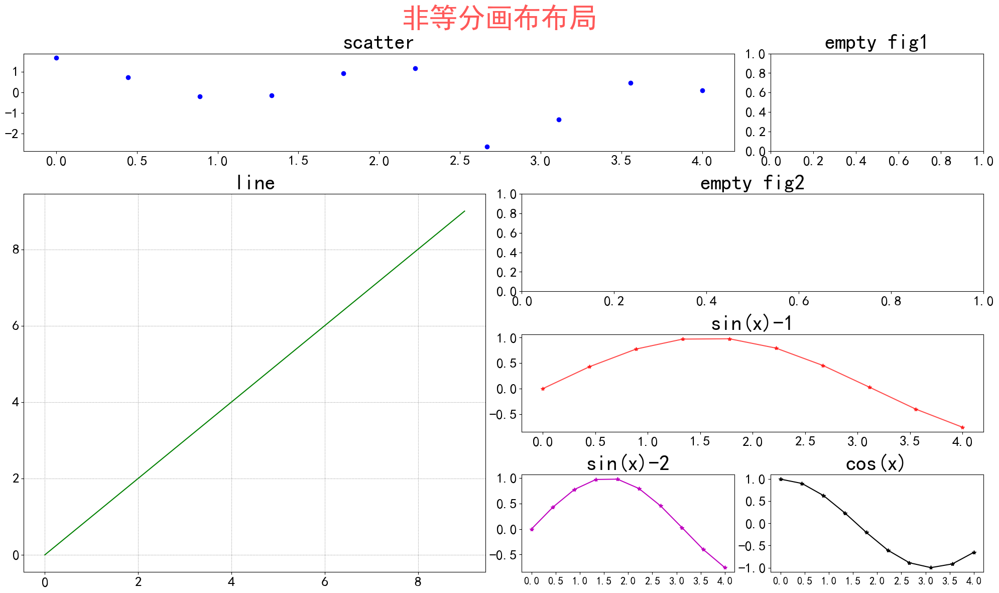

# 3.Matplotlib Subplot

## 3.1 Subplot 等分画布绘图

### 3.1.1 面向对象风格

1. `plt.figure` 创建画布
2. `fig.add_subplot` 添加画布
3. `ax.margins` 画布中留白的大小
4. `ax.plot` 与 `plt.plot` 等价，在小画布上绘图

```python
x = np.linspace(0, 2*np.pi, 100)           # x 数据
y = np.cos(x) * np.sin(x)                  # y 数据

fig = plt.figure()                         # 创建画布

ax1 = fig.add_subplot(1,2,1)              3 # 画布分成 1 行 2 列，取第 1 列
ax1.margins(0.03)                          # 设置数据的空白区域
# ax1.margins(3)                         
ax1.plot(x, y, color='r', alpha=0.8)       # 绘图

ax2 = fig.add_subplot(2,2,2)               # 画布分成 2 行 2 列，取第 2 个
ax2.margins(0.7, 0.7)                      # 设置数据的空白区域
ax2.plot(x, y, color='g')                  # 绘图

ax3 = fig.add_subplot(2,2,4)               # 画布分成 2 行 2 列，取第 4 个
ax3.margins(0.1, 0.1)                      # 设置留白
ax3.plot(x, y, color='b', alpha=0.618)     # 绘图

plt.show()                                 # 显示
```

<p align="center"></p>

### 3.1.2 pyplot 风格

 `plt.subplot` 函数

1. `subplot(121)` 可理解为 1×2 画布，当前绘制在第一个
2. 整体效果与 `fig.add_subplot` 一致

```python
# 也可以直接使用 plt
plt.subplot(121)                         # 创建 1×2 布局，位置 1
plt.margins(0.03)                        # 留白
plt.plot(x, y, color='r')                # 绘图

plt.subplot(222)                         # 2×2 布局，位置 2
plt.margins(0.3, 0.7)                    # 留白
plt.plot(x, y, color='g')

plt.subplot(2,2,4)                       # 2×2 布局，位置 4
# plt.subplot(4,4,11)                    
plt.plot(x, y, color='b')

plt.show()
```

<p align="center"></p>

## 3.2 Subplot 非等分画布绘图

1. `plt.subplot2grid` 创建画布，`shape` 为形状
2. 每次可以创建不同长度宽度的子画布，实现任意形状组合
3. `colspan` 指定占几列，`rowspan` 指定占几行，`loc` 指定位置
4. `plt.tight_layout(w_pad=0.5, h_pad=1.0)` 分别指定左右、上下的边距

```python
# ## subplot只能等分画布，不能设置不同大小
# ## subplot2grid的`rowspan`,`colspan`可以实现非等分画布
# subplot2grid(shape, loc, colspan, rowspan)
# 实现非等分画布

plt.figure(figsize=(20, 12))  # 创建画布并设置整体大小

plt.subplot2grid((4,4),(0,0), colspan=3)  # 整个画布分均为4行4列，从（0，0）开始，占3列
x = np.linspace(0,4,10)
np.random.seed(2024)
y = np.random.randn(10)
plt.scatter(x,y,c='b')
plt.title('scatter',fontsize=30)
plt.xticks(fontsize=20)
plt.yticks(fontsize=20)

plt.subplot2grid((4,4), (0,3))  # 整个画布分均为4行4列，从（0,3）开始，默认占1行1列
plt.title('empty fig1',fontsize=30)
plt.xticks(fontsize=20)
plt.yticks(fontsize=20)

plt.subplot2grid((4,4),(1,0), rowspan=3,colspan=2)  # 整个画布分均为4行4列，从（1,0）开始，占3行2列
plt.plot(range(10), range(10),color='g')
plt.grid(color='gray',alpha=0.9, linestyle=':')
plt.title('line',fontsize=30)
plt.xticks(fontsize=20)
plt.yticks(fontsize=20)

plt.subplot2grid((4,4), (1,2),colspan=2)  # 整个画布分均为4行4列，从（1,2）开始，占2列
plt.title('empty fig2',fontsize=30)
plt.xticks(fontsize=20)
plt.yticks(fontsize=20)

plt.subplot2grid((4,4), (2,2), colspan=2)  # 整个画布分均为4行4列，从（2,2）开始，占2列
plt.plot(x, np.sin(x), marker='*',c='r',alpha=0.7)
plt.title('sin(x)-1',fontsize=30)
plt.xticks(fontsize=20)
plt.yticks(fontsize=20)

plt.subplot2grid((4,4), (3,2))  # 整个画布分均为4行4列，从（3,2）开始，默认占1行1列
plt.plot(x, np.sin(x), marker='*',c='m')
plt.title('sin(x)-2',fontsize=30)
plt.xticks(fontsize=15)
plt.yticks(fontsize=20)

plt.subplot2grid((4,4), (3,3))  # 整个画布分均为4行4列，从（3,3）开始，默认占1行1列
plt.plot(x, np.cos(x), marker='*',c='k')
plt.title('cos(x)',fontsize=30)
plt.xticks(fontsize=15)
plt.yticks(fontsize=20)

# 整个画布的title
plt.suptitle("非等分画布布局",fontsize=50,color='r',alpha =0.65)  # 设置整体标题
plt.tight_layout(w_pad=0.5, h_pad=1.0)  # 自动调整子图间距
plt.show()  # 显示图形
```

<p align="center"></p>
