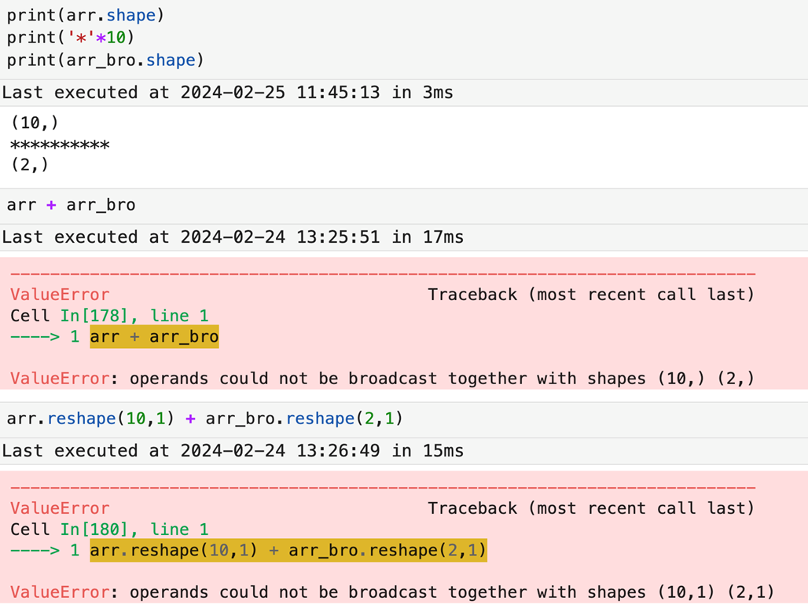
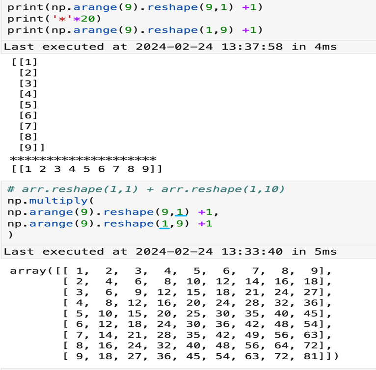

# 3.NumPy数组广播机制与进阶操作

## 3.1 NumPy 广播机制

### 3.1.1 广播机制

定义：指不同形状的数组之间执行算术运算的方式

原则：

1. 让所有的输入数组向其中 `shape` 最长的数组看齐，`shape` 中不足的部分通过在前面加 1 补齐
2. 输出数组的 `shape` 是输入数组 `shape` 的各个轴上的最大值
3. 如果输入数组的某个轴和输出数组的对应轴的长度相同或者其长度为 1，则这个数组能够用于计算，否则出错
4. 当输入数组的某个轴的长度为 1 时，沿着此轴运算时使用此轴上的第一个组值

```python
arr = np.array([0, 1, 2, 3, 4, 5, 6, 7, 8, 9])   # 创建示例数组
print(arr)                                      # 打印原始数组
arr + 1                                         # 数组与数字广播计算
arr + np.array([1])                             # shape 不同也能广播计算
np.array([1]).shape                              # 查看 shape：为 (1,)
```

### 3.1.2 广播报错

Tips:

当两个数组的对应位置的 shape，既不满足相等，也没有任何一个是 1 的时候，那么广播会报错。下方图片显示，两个数组的 shape 是 (10,1) 和 (2,1) 在第一个维度上，shape 分为 10 和 2，不满足广播原则。但是假如两个数组的 shape 是 (10,1) 和 (1,10)，那么可以满足广播原则。

<p align="center"></p>

### 3.1.3 广播加法和广播乘法

左：广播加法，右：广播乘法

<div style="display: flex; justify-content: center; gap: 10px; align-items: center;">
  
  
</div>

## 3.2 NumPy 数组转置

1. 数组转置变化，即视觉上对称旋转之后为转置
2. 实际上行列互换
3. 体现在索引上是数组的（i，j）元素变成转置数组的（j,i）元素

```python
# 数组转置
arr = np.arange(15).reshape((3, 5))      # 创建 0~14 并 reshape 成 3×5
print(arr)                               # 打印原数组
print(arr.T)                             # 使用 .T 得到转置后的数组

print(arr.transpose())                   # transpose() 方法实现转置                
print(arr.T)                             # 再次打印转置结果
```

## 3.3 NumPy 数组组合

### 3.3.1 hstack 函数

1. 观察 2 个原始数组
2. `hstack` 代表*左右合并*
3. `hstack` 的一个替代方法是 `concatenate`，然后限定在 `axis=1` 条件下

```python
# 组合数组
a = np.arange(9).reshape(3, 3)    # 创建 0~8 并 reshape 为 3×3
print(a)                          # 打印 a
b = 2 * a                         # b 是 a 的两倍
print(b)                          # 打印 b
print(np.hstack((a, b)))          # hstack 左右合并
print(np.concatenate((a, b), axis=1))   # concatenate 指定 axis=1 也能左右合并
```

### 3.3.2 vstack 函数

1. 观察 2 个原始数组
2. `vstack` 代表*上下合并*
3. `vstack` 的一个替代方法是 `concatenate`，然后限定在 `axis=0` 条件下

```python
# 组合数组
print(np.vstack((a, b)))
print(np.concatenate((a, b), axis=0))
```

### 3.3.3 dstack 函数

1. 观察合并后的数组，是在原来的数组基础上，每个元素都进行了*扩展*
2. 所以合并后的数据是在维度上增加了
3. 即 dstack 使 2 个 2 维数组合并后成为了 3 维

```python
# 深度拼接 dstack
print(a)                           # 打印原数组 a
print(b)                           # 打印原数组 b
print(np.dstack((a, b)))           # dstack：在“深度方向”拼接，新增第三维
print(np.dstack((a, b)).shape)     # 查看拼接后数组的 shape
```

### 3.3.4 row_stack/column_stack

1. `hstack` 与 `column_stack` 方法等价
2. `vstack` 与 `row_stack` 方法等价
3. 根据数组对比结果发现，合并后结果相同

```python
# 用column_stack按列合并a和b
print(np.column_stack((a, b)))                     
# 对比column_stack和hstack是否完全相同
print(np.column_stack((a, b)) == np.hstack((a, b))) 

# 用row_stack按行合并a和b
print(np.row_stack((a, b)))                
# 对比row_stack与vstack是否完全相同
print(np.row_stack((a, b)) == np.vstack((a, b))) 
```

## 3.4 NumPy 数组分割

### 3.4.1 hsplit 函数

1. `hsplit` 代表按照*左右*切分二维数组，切完后每块的行数不变，只是列被拆开
2. `hsplit` 等价于 `split` 加上 `axis=1` 参数
3. 结合输出结果，对比理解函数的作用逻辑

```python
# 数组的分割
a = np.arange(9).reshape(3, 3)     # 创建3x3数组
print(a)                           # 查看原始数组
print(np.hsplit(a, 3))             # hsplit 将数组按列切成3份
print(np.split(a, 3, axis=1))      # split(axis=1) 与 hsplit 效果相同
```

### 3.4.2 vsplit 函数

1. `vsplit` 代表按照*上下*切分数组，左右长度不变
2. 使用 `split` 函数时，加上 `axis=0` 参数即可实现同样效果
3. 通过对比结果来理解函数的作用

```python
# 创建示例数组
a = np.arange(9).reshape(3, 3)
print(a)
print(np.vsplit(a, 3))           # 使用 vsplit 进行上下切分（行方向切分）
print(np.split(a, 3, axis=0))    # 使用 split，并指定 axis=0（行方向），等价于 vsplit
print(type(np.split(a, 3, axis=0)))  # 查看 split 返回的数据类型（结果为 list）
```

### 3.4.3 dsplit 函数

1. `dsplit` 代表在数组的第 3 个维度上进行拆分，即在 `axis=2` 方向切分
2. `dsplit` 适用于至少三维数组，否则会报错
3. 可以根据拆出来的结果理解函数的切分逻辑：每一层是把原来数组在第三维的对应切片取出来形成新数组

```python
c = np.arange(27).reshape(3, 3, 3)  # 创建3×3×3数组
print(c)                           # 打印原数组
print(np.dsplit(c, 3))            # dsplit在第三维拆成3份
print(np.dsplit(c, 3)[0])         # 查看第1块拆分结果
```

## 3.5 NumPy 数组拷贝

### 3.5.1 数组拷贝（浅拷贝）

1. 用变量赋值的方式直接拷贝数组，那么多个数组都指向同一个对象，其中任意一个改变，全体都会改变
2. 所以右图中四个 array 完全相同
3. 这种拷贝数组的方式也叫做**浅拷贝**，即只是多增加了一个变量名字和内存的对应关系

```python
# 创建初始数组
a_init = np.arange(4)

# 多个变量指向同一个数组（浅拷贝）
b_init = a_init
c_init = a_init
d_init = b_init

# 修改其中一个数组的值
a_init[0] = 11

# 四个变量内容都会被一起修改
print(a_init)  # [11, 1, 2, 3]
print(b_init)
print(c_init)
print(d_init)
```

### 3.5.2 深拷贝

1. `array.copy()` 代表拷贝一份相同的数组，在另外一处存储
2. 所以其中一个进行改动，另外一份不受影响
3. 要精确区分浅拷贝与深拷贝的异同
4. 实际使用时可根据情况来决定到底使用哪种

```python
# deep copy示例
a_init1 = np.arange(4)        # 创建数组[0 1 2 3]
b_init1 = a_init1.copy()      # 深拷贝一份

print(a_init1, b_init1)       # 两个数组内容相同

a_init1[3] = 44               # 修改a_init1第3个元素
print(a_init1, b_init1)       # b_init1不受影响

b_init1[1] = 52               # 修改b_init1第1个元素
print(a_init1, b_init1)       # a_init1不受影响
```


