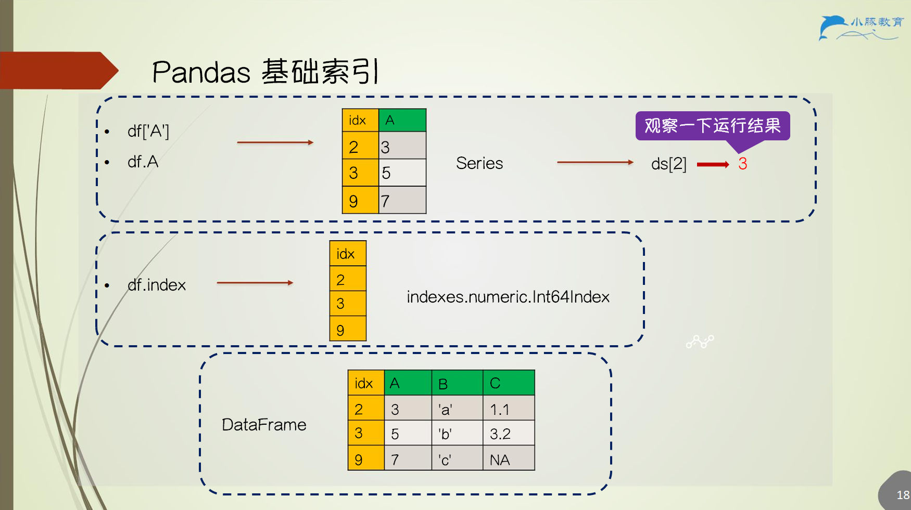
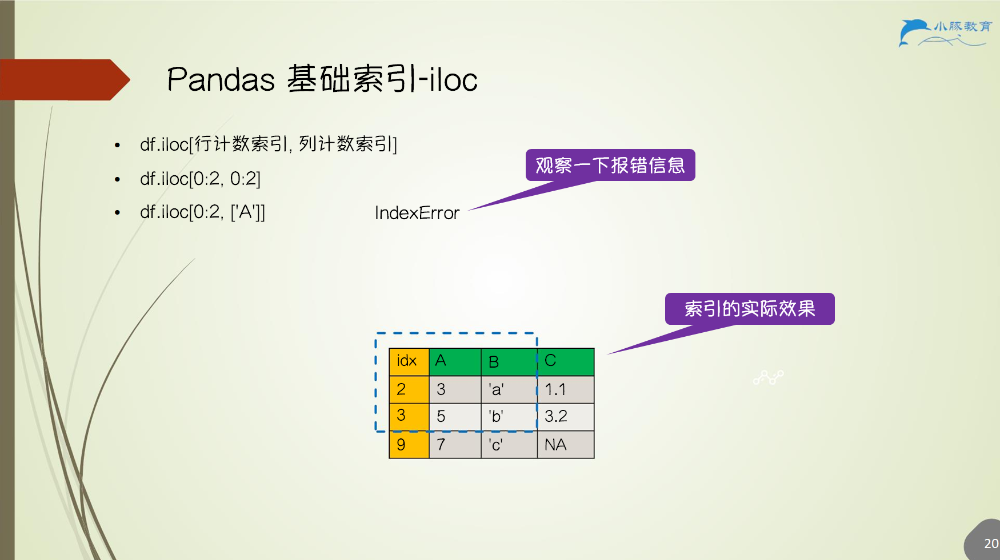

# 2.Pandas基础结构与读写

## 2.1 Pandas 简介

- `Python` 开源的数据分析、处理、可视化库
- `pip3 install pandas` 实现安装

> [!TIP] 💡 为什么需要 pandas
>  - 不但能处理数值型数据，也可以处理字符串、时序等其他数据
>  - 数据的展示
>  - 聚合等丰富的数据处理函数，可实现类 SQL 对应功能

## 2.2 Pandas VS MySQL

| 特性    | Pandas                                  | MySQL                             |
| ----- | --------------------------------------- | --------------------------------- |
| 定位    | **内存中 (In-memory)** 的数据分析库              | **磁盘上 (On-disk)** 的关系型数据库 (RDBMS) |
| 主要用途  | 数据清洗、探索性分析 (EDA)、处理、可视化                 | 数据的持久化存储、管理、高效查询                  |
| 数据规模  | 适用于 **1000 万行以下** (受限于单机内存)             | 可处理海量数据 (TB/PB 级)，性能更优            |
| 灵活性   | **极高**，函数库丰富，处理逻辑可以非常复杂                 | 较高，但受限于 SQL 语法和表结构                |
| 上手速度  | 上手快 (30 分钟)，但 API 庞大，**精通较难**           | SQL 语法学习成本低，但数据库运维 (ETL, 赋权) 复杂   |
| 生态/更新 | 更新快，与 PyData (NumPy, Scikit-learn) 紧密集成 | 相对稳定、成熟                           |

## 2.3 Pandas 数据结构

- `pandas.` 等价于 `pd.`
- `pandas.DataFrame` 和 `pandas.Series` 是 `Pandas` 最重要的两个数据结构
- `pandas.DataFrame` 表格，是常见概念
- `pandas.Series` 序列是新概念，可以理解为一列

### 2.3.1 pandas.DataFrame

创建数组 `pandas.DataFrame(data, index, columns)`

1. `index` 定义行索引
2. `columns` 定义列索引
3. `data` 可为 python 列表、字典、或 `numpy` 数组
4. 字典 `keys` 为*列索引名*，可以依旧设置 `columns`
5. 输出列以 `columns` 优先，字典中未定义数据的列填充 `NaN`

### 2.3.2 pandas.Series

 创建序列 `pandas.Series`

1. `index` 定义序列索引
2. 类似 列表，但索引可自定义
3. `data` 可为 `python` 列表、字典或 `numpy` 数组
4. 注意字典的 `key` 为*行索引值*！

### 2.3.3 比较

- `pandas.DataFrame`
    - `df.shape`
    - `df.reshape`
- `pandas.Series`
    - `ds.shape`
- `pandas.DataFrame` or `Series` or `NumPy`
    - `df.values` or `ds.values` → `numpy.ndarray`
    - `df[column]` → `pandas.Series`
    - `pandas.DataFrame(ds)` → `pandas.DataFrame`

### 2.3.4 描述 DataFrame 和 Series 的信息

1. 基本信息
    - `shape` 形状
    - `dtypes` 数据类型
    - `ndim` 维度
    - `index` 行索引
    - `columns` 列索引
    - `values` 元素值 `numpy` 数组
2. 整体信息
    - `head(n)/tail(n)` ：展示前 n 行 / 后 n 行
    - `df.info()` ：行数、列数、行索引、列索引、数据类型、列非空值个数、占用内存大小
    - `df.describe()`： 计数、均值、标准差、最大值、最小值、四分位数

## 2.4 Pandas 数据读写

### 2.4.1 Pandas 从文件中读数据

读取支持 `csv`, `excel`, `txt`, `parquet`, `json`, `sql_table`, `sql_query` 等格式 (优点)

函数 `pandas.read_csv(file_path, sep, header, names, index_col)`

1. `sep` 一般为 `','`
2. `header` 取决于数据第一行是否为列名
3. `names` 优先级高于 `header`，定义列索引名
4. `index_col` 决定特定列是否被识别为 `pandas index`

### 2.4.2 Pandas 写入到文件

写入支持的数据格式与读取的数据格式一一对应

| 读取函数           | 写入函数         | 说明         |
| -------------- | ------------ | ---------- |
| read_csv       | to_csv       | CSV 文本     |
| read_excel     | to_excel     | Excel 文件   |
| read_hdf       | to_hdf       | HDF5 存储    |
| read_sql       | to_sql       | 数据库        |
| read_json      | to_json      | JSON 格式    |
| read_html      | to_html      | 网页表格       |
| read_stata     | to_stata     | Stata 数据   |
| read_clipboard | to_clipboard | 剪贴板        |
| read_pickle    | to_pickle    | Python 序列化 |

➤ 案例 1：读取 3 个 csv 文件并且输出到 1 个 excel 文件

- 需要额外安装 `xlrd` 包
- 三个 `df`，输出到 excel 的三个 sheet
- 代码见 notebook
- 大家可以尝试完成逆操作（1 个 excel 写入到 3 个 csv）

## 2.5 Pandas 数据类型

- `datetime`：日期时间类型（表示具体的年月日、时分秒）
- `timedelta`：时间差类型（表示两个时间之间的差值，例如 3 天、5 小时）
- `category`：分类类型（用于存储有限类别值，例如“男/女”“高/中/低”）

| Pandas dtype | NumPy dtype    | Python type | Usage |
| ------------ | -------------- | ----------- | ----- |
| object       | string_unicode | str         | 字符串   |
| int64        | intx, uintx    | int         | 整数    |
| float64      | floatx         | float       | 浮点数   |
| bool         | bool_          | bool        | 布尔型   |
| datetime64   | datetime64     | NA          | 时间    |
| timedelta    | timedelta      | NA          | 时间差   |
| category     | NA             | NA          | 类别    |

## 2.6 Pandas 基础索引

> [!TIP] 💡 为什么使用索引
> 方便的数据查询
> 性能提升
> 数据对齐
> 更多数据结构

函数：

1. `df[]`
2. `df.index` 或 `df.column_name`
    - 注意当列名与 DataFrame 方法名相同时，无法使用 `df.column_name`
    - 如 `df.min`，但可使用 `df['min']` 取列数据
3. `df.loc[行键索引, 列键索引]`
4. `df.iloc[行计数索引, 列计数索引]`
5. `df.where(条件)`

### 2.6.1 Pandas 基础索引 - loc

### 2.6.2 Pandas 基础索引 - iloc

### 2.6.3 Pandas 基础索引 - where

### 2.6.4 Pandas 基础索引 - 扩展说明

1. `df.where` 与 `numpy.where`
2. `df.where(条件, other)` 不满足条件的填充 `other`
3. `numpy.where(条件, x, y)` 满足条件填 `x`，不满足填 `y`
4. 多重列条件时可用 `numpy.select(条件列表, 填充值列表, default)`

### 2.6.5 Pandas 基础索引 - query

筛选行

1. `df.query(字符串)`
2. `df[(df['a'] < df['b']) & (df['b'] < df['c'])]`
3. 可改写为 `df.query('a < b and b < c')`
4. 与 `df.query('a < b & b < c')` 相同吗（×）
5. `df.query('b == ["a", "b", "c"]') == df[df['b'].isin(['a', 'b', 'c'])]`

