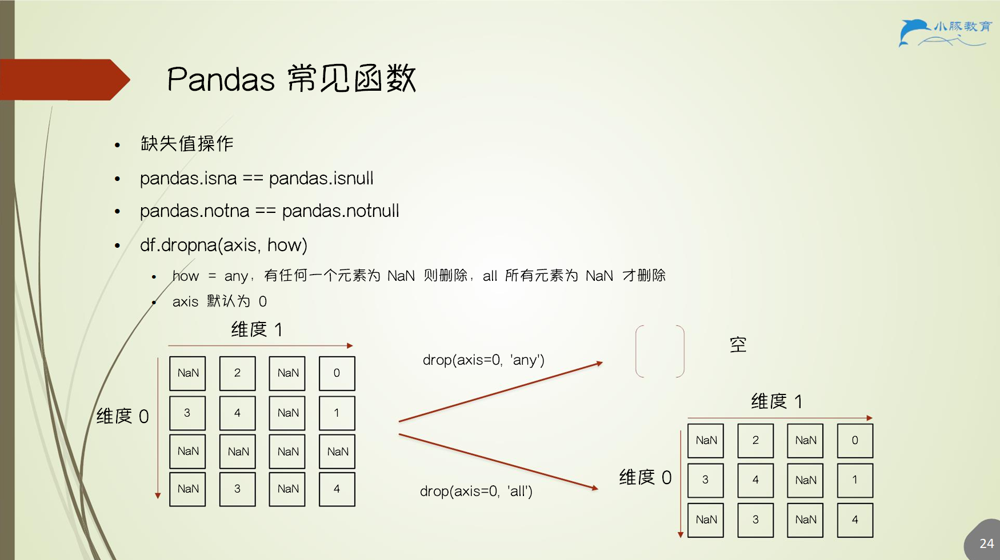
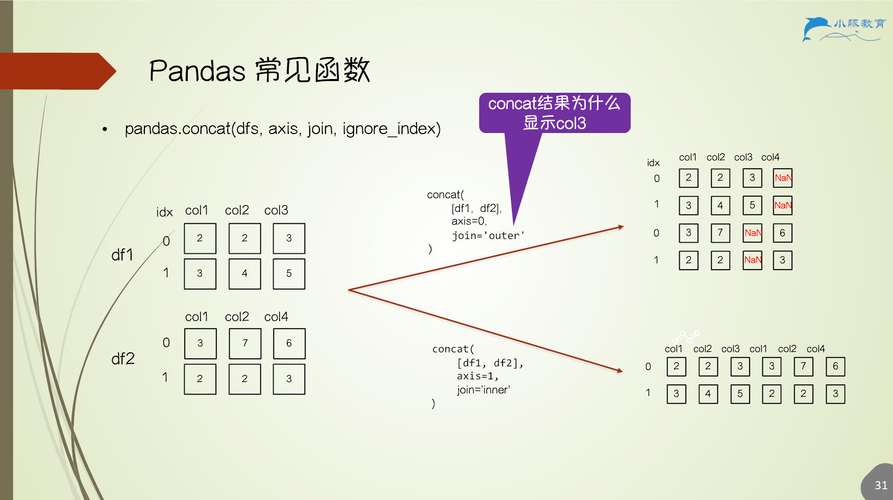

# 3.Pandas常见函数与数据处理

## 3.1 缺失值操作

## 3.2 赋值操作

1. 赋值操作
    - `df.loc[] = values`
    - `df.loc[] = df.apply(func, axis)`
        - `df.apply` 返回 `Series`
    - `df.loc[] = df.applymap(func)`
        - 针对 `DataFrame` 每个元素进行函数操作
    - `df.assign(col_name=func)`
        - 返回新的包含更新的 `col_name` 的 `DataFrame`
    - 尽量使用 `df.loc[]`，避免使用 `df[]` 赋值
        
2. `SettingWithCopyWarning`
    - 尝试修改一个从 `DataFrame` 选择出来的引用对象 `view`
    - `df[condition][column] = values` `df.loc[condition, column] = values`

## 3.3 统计函数

1. `df.describe()`
2. `df.info()`
3. `df.min()`
4. `df.max()`
5. `df.mean()`
6. `df.value_counts()`
    - 统计每一行元素数据出现的次数
    - 将列变为 `index`
    - 生成 `Series`
7. `df.corr()`： 数值列之间的*皮尔逊相关系数*
8. `df.cov()`：数值列之间的*协方差*

## 3.4 排序

1. `sort_index(axis, level)`
2. `sort_values(by, ascending)`
    - 依据哪些维度进行升序或降序排序
    - `by` 可以是多个列，`ascending` 对应每一列升降，不同列可以指定不同的顺序
    - 类比 SQL 的 `order by col1 asc, col2 desc`

## 3.5 数据合并

1. `pandas.concat(dfs, axis, join, ignore_index)`
    - 一般用做数据点拼接，行方向数据拼接
    - 列拼接时需要 `index` 对齐
    - `join` 默认 `outer join`，`inner/outer`
    - `ignore_index` `True` 重设 index `0, …, k`，否则按照原 index 拼接
2. `pandas.append`（将废弃）
    - 按行方向的 concat，等价于 `concat(axis=0)`
3. `pandas.merge`
    - 一般用做特征拼接，列方向拼接

### 3.5.1 concat 函数

### 3.5.2 merge 函数

1. `pandas.merge( left, right, how='inner', on=None, left_on=None, right_on=None, left_index=False, right_index=False, suffixes=('_x','_y') )`
2. `left`, `right`，两个需要拼接的 DataFrame 或 Series
3. `how`，以何种方式拼接，`left/right/outer/inner/cross`
4. `on`，以哪一列为基准对齐拼接，需 left 和 right 均包含该列
5. `left_on`, `right_on`，左侧 DataFrame 以 `left_on` 为基，右侧以 `right_on` 为基
6. `left_index`, `right_index`，左侧 DataFrame 以 `left_index` 为基，右侧以 `right_index` 为基
7. `left_index` 可与 `right_on` 配对，反之亦然
8. `suffixes`，若 DataFrame 重名，则添加后缀

## 3.6 groupby 函数

1. `df.groupby(列名)`
    - 返回 `pandas.core.groupby.generic.DataFrameGroupBy`
    - 可遍历得到每组 DataFrame，`for key, group_df in df.groupby()`
        - 其中 `key` 为分组值，`group_df` 为分组值对应数据
    - 可聚合统计
    - 可多个列同时分组
    - 可以对 `DataFrameGroupBy` 进行取值操作 `df.groupby()[列名]`
2. `agg(func[s]) == aggregate(func[s])`
    - 聚合 `DataFrameGroupBy` 对象
    - 若是 DataFrame 则聚合全部数据
    - 类比 sql `sum` 等聚合函数
    - 若多个聚合函数，列索引将多一级聚合函数的索引

## 3.7 inplace 参数

1. 修改原 `DataFrame` 还是生成新 `DataFrame`
2. Pandas 基本所有数据操作都可以在原 `DataFrame` 上修改数据
3. 默认 `inplace=False`，需明确 `inplace=True` 以修改原数据

## 3.8 Pandas 数据处理案例

案例：100 个日报 csv 文件合并，见 notebook

