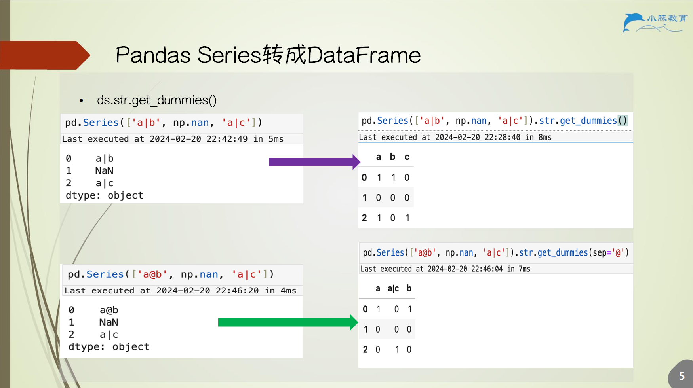
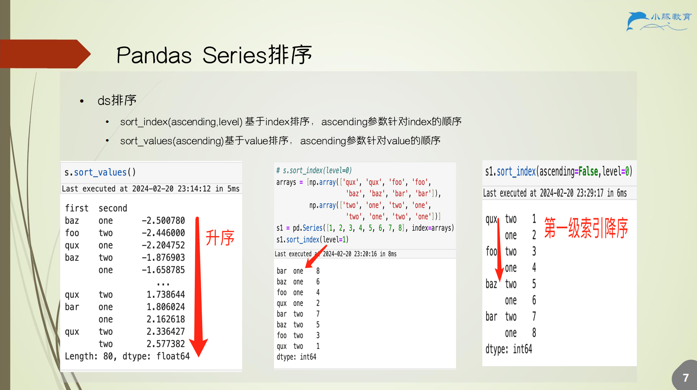

# 4.PandasSeries介绍

## 4.1 函数（数值篇）

统计函数

1. `ds.describe()` 总体描述
2. `ds.count()` 计数
3. `ds.min()`
4. `ds.max()`
5. `ds.mean()`
6. `ds.value_counts()`
    - 统计 Series 中每个元素数据出现的次数
    - 将元素变为 `index`，并且生成新 `Series`
7. `ds.quantile()` 分位数
8. `ds.std()` 标准差
9. `ds.median()` 中位数
10. `ds.cumsum()` 累计求和
11. `ds.cumprod()` 累计乘积

其他函数参考 notebook

## 4.2 函数（字符串篇）

1. `ds.str.replace(value1, value2)` 字符串替换
2. `ds.str.contains(value)` 判断字符串是否包含 value
3. `ds.str.split(sep)` 按照分隔符 sep 把字符串分割
4. `ds.str.join()` 字符间填充
5. `ds.str.slice()` 字符串切片
6. `ds.str.count()` 统计 Series 中指定元素数据出现的次数，可以设定位置范围
7. `ds.str.startswith(value)` 判断字符串是否以 value 开头
8. `ds.str.endswith(value)` 判断字符串是否以 value 结尾
9. `ds.str.len()` 返回字符串的长度
10. `ds.str.strip()` 去除字符串的空格
11. `ds.str.lower()` 字符全部小写
12. `ds.str.upper()` 字符全部大写

## 4.3 Series 转成 DataFrame

## 4.4 apply 自定义函数

## 4.5 排序

