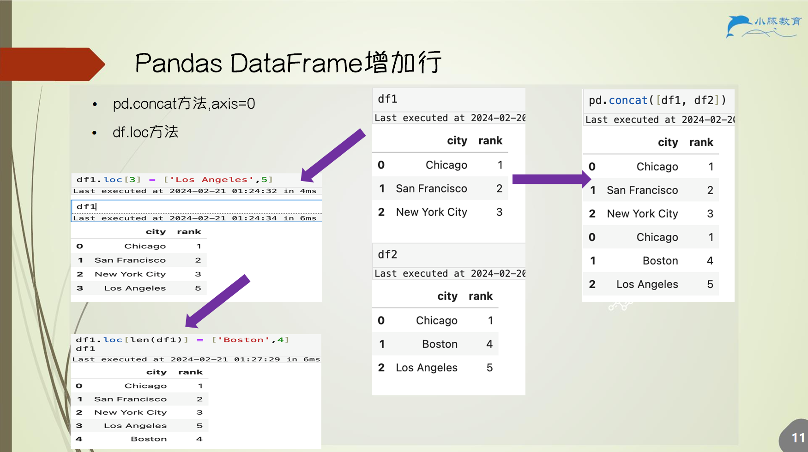
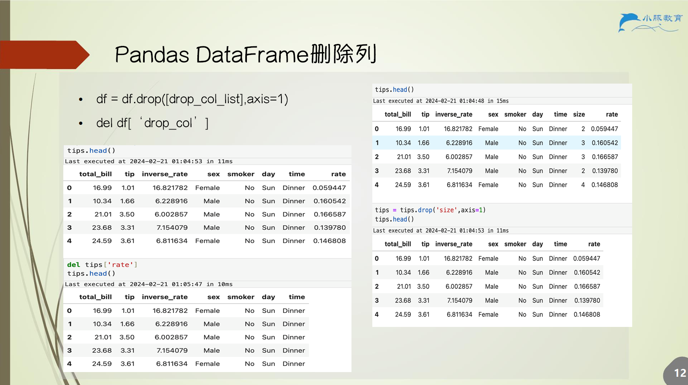
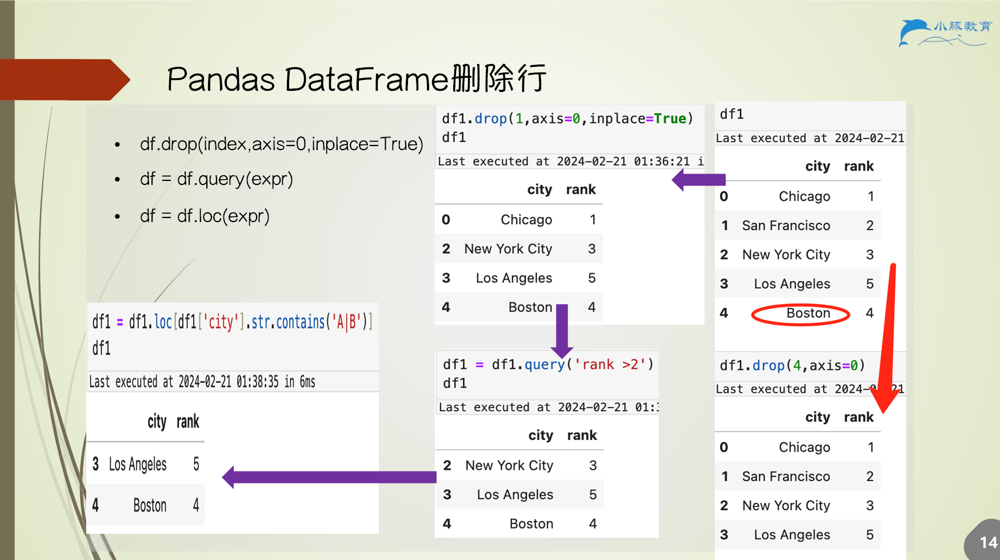
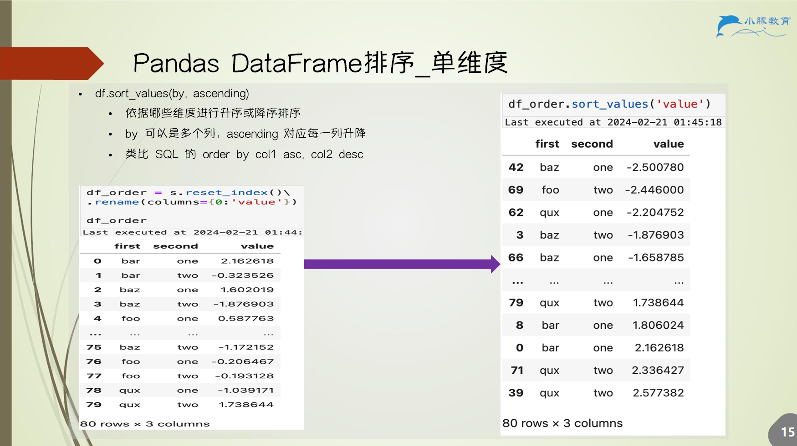
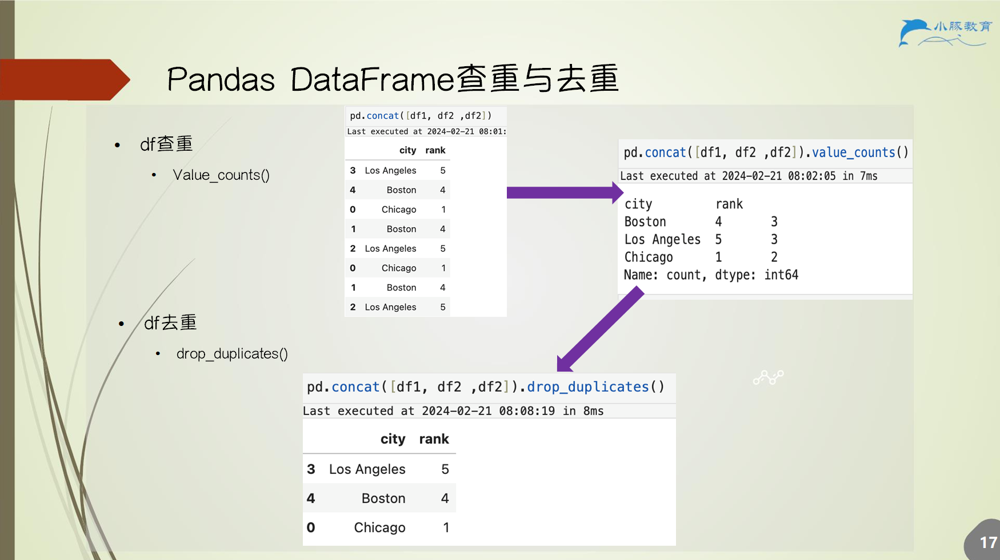
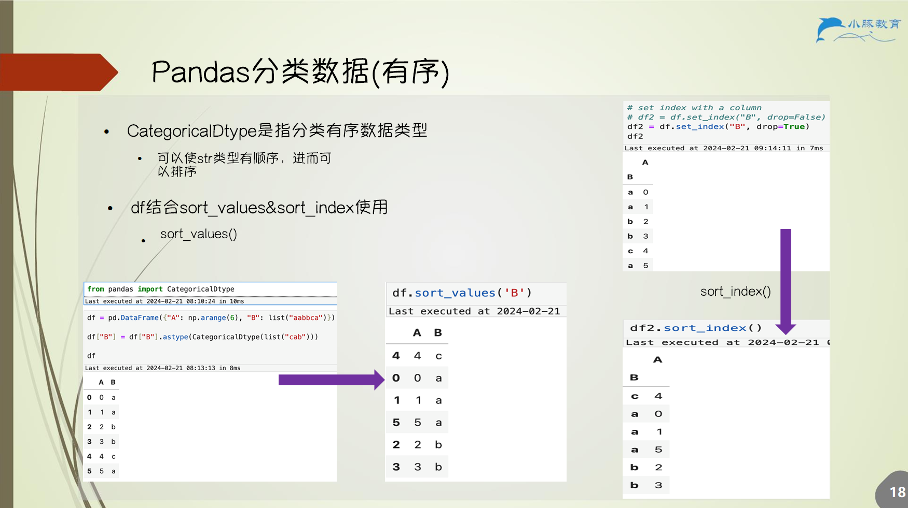
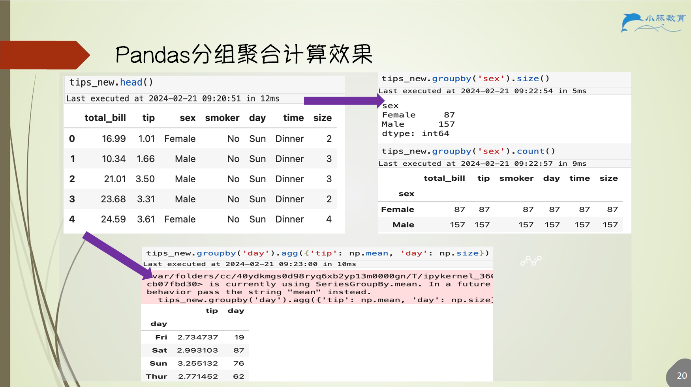
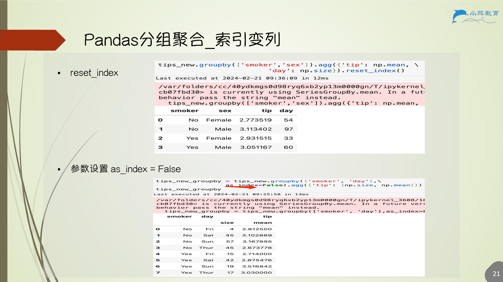
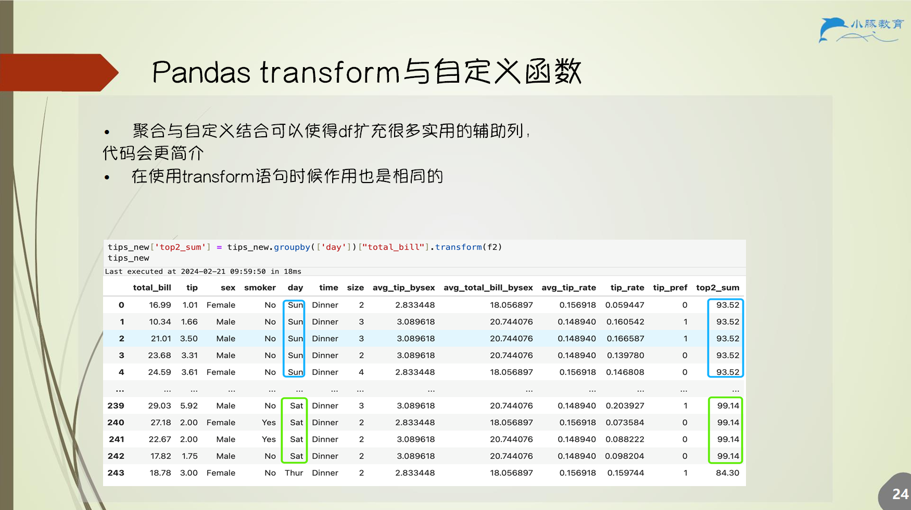

# 5.Pandas分组聚合

## 5.1 增加列

## 5.2 增加行

## 5.3 删除列

## 5.4 删除行

## 5.5 排序（单维度）

## 5.6 排序（多维）

## 5.7 查重与去重

## 5.8 分类数据（有序）

## 5.9 分组聚合

### 5.9.1 函数

1. `df.groupby(列名)`
    - 返回 `pandas.core.groupby.generic.DataFrameGroupBy`
    - 可遍历到每组 DataFrame，`for key, group_df in df.groupby()`
        - 其中 `key` 为分组值，`group_df` 为分组值对应数据
    - 可聚合统计
    - 可多个列同时分组
    - 可以对 `DataFrameGroupBy` 进行列取值操作 `df.groupby()[列名]`
2. `agg(func[s]) == aggregate(func[s])`
    - 聚合 `DataFrameGroupBy` 对象
    - 若是 DataFrame 则聚合全部数据
    - 类比 sql `sum` 等聚合函数
    - 若多个聚合函数，列索引将多一级聚合函数的索引

### 5.9.2 分组聚合计算效果

### 5.9.3 分组聚合 - 索引变列

## 5.10 Pandas transform

## 5.11 聚合与自定义函数

## 5.12 Pandas transform 与自定义函数

