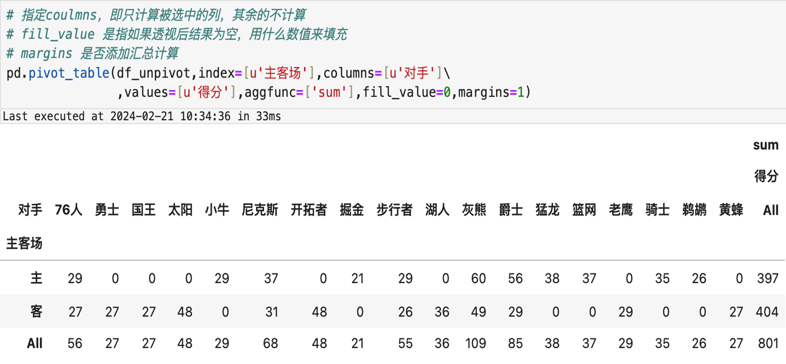
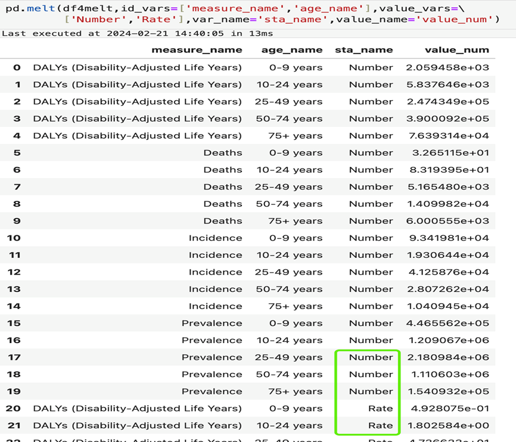
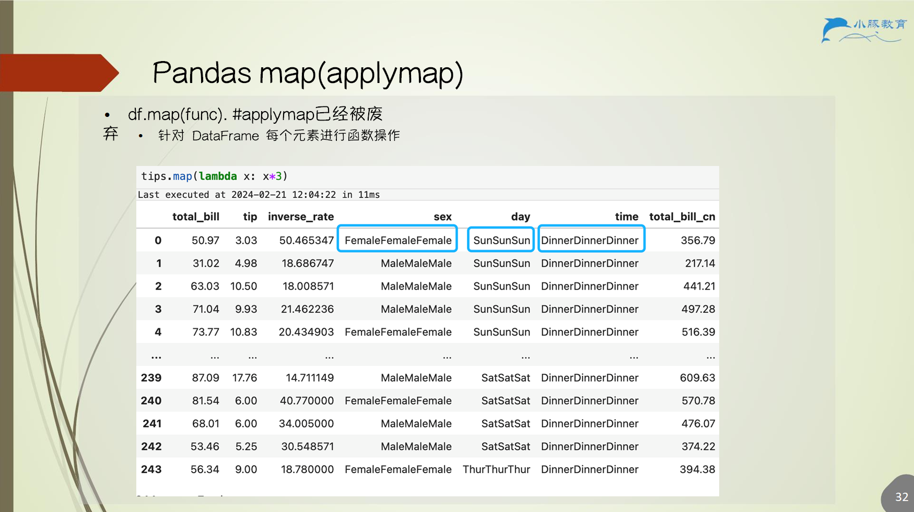

# 6.Pandas数据变形

## 6.1 long2wide

### 6.1.1 pivot_table 参数解读

```python
pd.pivot_table(
    data,
    values=None,          # 数值 计算完成应该用来作为取值内容
    index=None,           # 索引 计算完成应该作为行
    columns=None,         # 列名 计算完成应该作为列名
    aggfunc='mean',       # 聚合函数 如果在索引和列的条件下 values 不唯一 可以进行聚合
    fill_value=None,      # 如果有空值 可以填补为设置的参数
    margins=False,        # 是否加入边际计算
    dropna=True,          # 是否去除所有值为空的列
    margins_name='All'    # 在 margins 为 True 的时候 margins 列的名字
)
```

### 6.1.2 pivot_table 效果展示

<div style="display: flex; justify-content: center; gap: 10px; align-items: center;">
  
  
</div>

<div style="display: flex; justify-content: center; gap: 10px; align-items: center;">
  
  
</div>

## 6.2 wide2long

### 6.2.1 melt 参数解读

```python
pd.melt(
    frame,                  # 数据框
    id_vars=None,           # 不参与宽变长（列变行）的列名
    value_vars=None,        # 参与宽变长（列变行）的列名
    var_name=None,          # 列变行后的新列名
    value_name='value',     # 原来所有列的数据被赋予的新列名
    col_level=None          # 列层级（多层列时使用）
)
```

➤ 长数据 VS 宽数据

1. 计算需要，在与其他数据框关联的时候，*至少一个数据框*需要进行长宽变形
2. **长**数据个别的时候可以*节省循环*，在案例中会有体现
3. **长**数据格式更*方便存储*，如果需要写入数据库，建议用长数据
4. **宽**数据更容易*匹配机器学习模型*
5. **宽**数据更容易进行*对比分析*，适合作图

### 6.2.2 melt 效果展示

<div style="display: flex; justify-content: center; gap: 10px; align-items: center;">
  
  
</div>

## 6.3 apply 函数

<p align="center"></p>

## 6.4 map(applymap)

<p align="center"></p>

## 6.5 df 关联

### 6.5.1 函数

```python
pandas.merge(
    left,                       # 两个需要拼接的 DataFrame 或 Series
    right,
    how='inner',                # 以何种方式拼接 left/right/outer/inner/cross
    on=None,                    # 以哪一列为基准对齐拼接 需 left 和 right 均包含该列
    left_on=None,               # 左侧 DataFrame 以 left_on 为基
    right_on=None,              # 右侧 DataFrame 以 right_on 为基
    left_index=False,           # 左侧以 index 为基
    right_index=False,          # 右侧以 index 为基
                                # left_index 可与 right_on 配对 反之亦然
    suffixes=('_x', '_y')       # 若 DataFrame 重名 则添加后缀
)
```

### 6.5.2 df 关联效果

<p align="center"></p>

<p align="center"></p>

## 6.6 Pandas 数据处理案例

案例 1：葡萄酒感官评分分析

- Pandas 遍历 excel 的 sheet
- 样品感官评分与样本信息关联

案例 2：班级偏科学生查询

- 偏科学生定义
- 方法 1 实现：df 关联
- 方法 2 实现：groupby+transform


