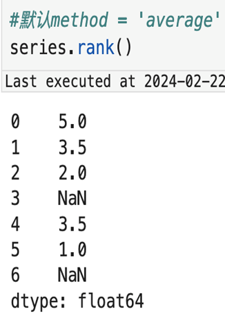
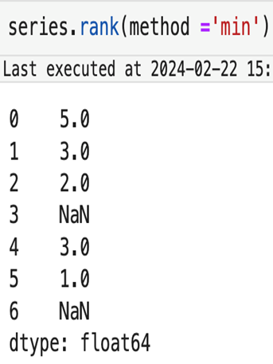
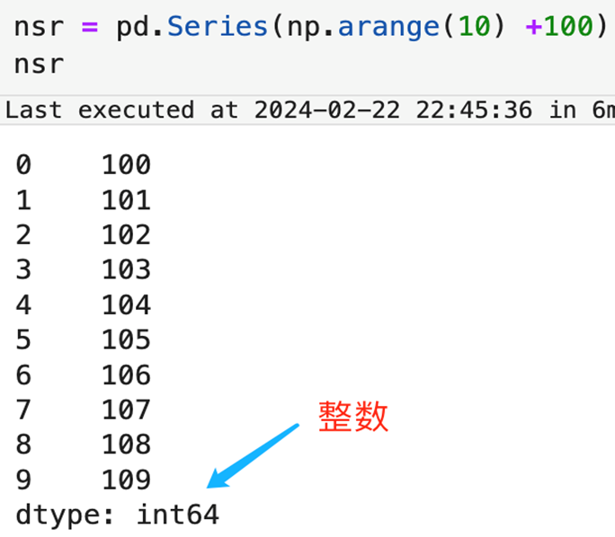
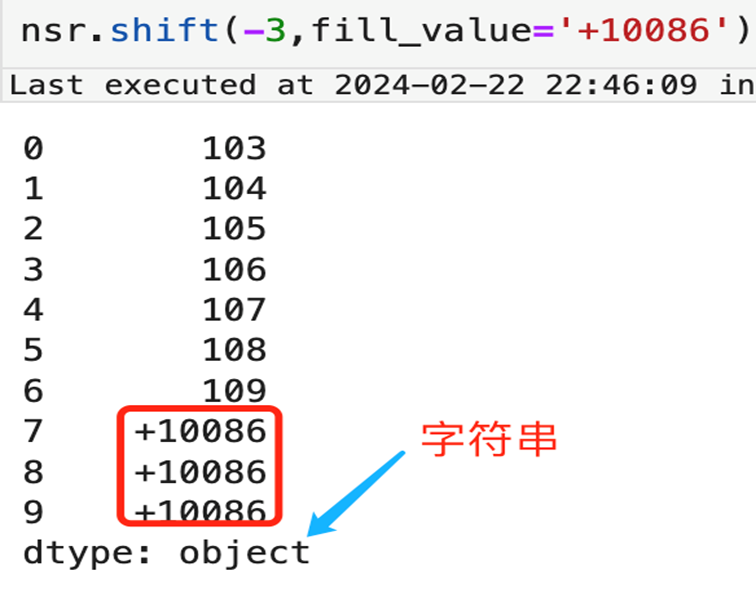

# 7.Series排名函数、位移函数与可视化

## 7.1 排名函数

```python
Series.rank(
    method='average',    # 排名方法 选项 ['average','min','max','first','dense'] 默认 'average'
    na_option='keep',    # 空值处理方式 选项 ['keep','top','bottom'] 默认 'keep'
    ascending=True,      # 是否升序排列 默认 True
    pct=False            # 是否使用百分比排名 默认 False
)
```

<div style="display: flex; justify-content: center; gap: 10px; align-items: center; flex-wrap: wrap;">
  
  
  
  
</div>

1. `na_option` 参数为 top 是优先对空值进行排序，`bottom` 是最后对空值进行排序
2. `pct` 为 `True` 则返回百分比排名，否则反馈默认的数值排名，百分比排名的计算公式为排名值/最大排名值

<p align="center"></p>

## 7.2 位移函数

```python
Series.shift(
    periods,            # 要移动的周期数 可以是正数或负数
    fill_value=None     # 用于新引入的缺失值的标量值
)

# shift 函数对于处理日期连续行为的数据处理上有着非常高的被引用频率
# 可以说是 Series 的一个明星函数
```

<div style="display: flex; justify-content: center; gap: 10px; align-items: center; flex-wrap: wrap;">
  
  
  
  
</div>

**注意**：填充缺失值可能会导致*数据类型改变*

<div style="display: flex; justify-content: center; gap: 10px; align-items: center;">
  
  
</div>

## 7.3 画图

### 7.3.1 plot 简介

`Series.plot` 支持条线图、柱状图、水平柱状图、直方图、箱线图、密度图、饼图、散点图等

```python
Series.plot(
    kind=None,            # 图像样式 核举值在右侧
                          # 'line'：折线图（默认）
                          # 'bar'：柱状图
                          # 'barh'：水平柱状图
                          # 'hist'：直方图
                          # 'box'：箱线图
                          # 'kde'：核密度图
                          # 'density'：同 'kde'
                          # 'area'：面积图
                          # 'pie'：饼图
                          # 'scatter'：散点图
                          # 'hexbin'：六边形图
    figsize=(x, y),       # 图像大小 (长, 宽)
    color=None            # 颜色 例如 'green','orange' 等
)
```

### 7.3.2 条线图

1. `Series.plot` 默认是条线图
2. 条线图一般是与时间序列为搭配，查看指标趋势
3. `figsize` 参数可以指定图像大小，参考 notebook

<p align="center"></p>

### 7.3.3 柱状图

1. `Series.plot` 默认为条线图，柱状图参数为 `bar/barh`
2. 一般用于不同系列的对比
3. 在本例子中用柱状图不如用时序图来表达趋势直观

<p align="center"></p>

### 7.3.4 直方图

1. 参数为 `hist`
2. 与柱状图不同的是，这是一个聚合结果的可视化
3. `bins` 是代表分桶数，值越大，每个柱子的区间范围就越小

<p align="center"></p>

### 7.3.5 密度图

1. 与直方图类似，但是结果展示是平滑曲线
2. 可以找出集中分布的区域（优于直方图）
3. 横轴可能会溢出枚举值，有时候需要处理，可以加参数 `xlim` 进行约束
4. `kind` 参数值为 `kde`

<p align="center"></p>

