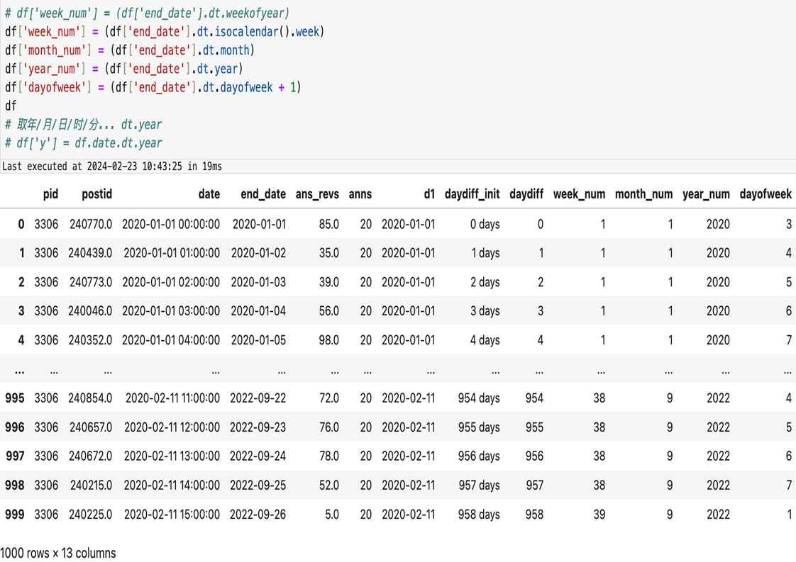
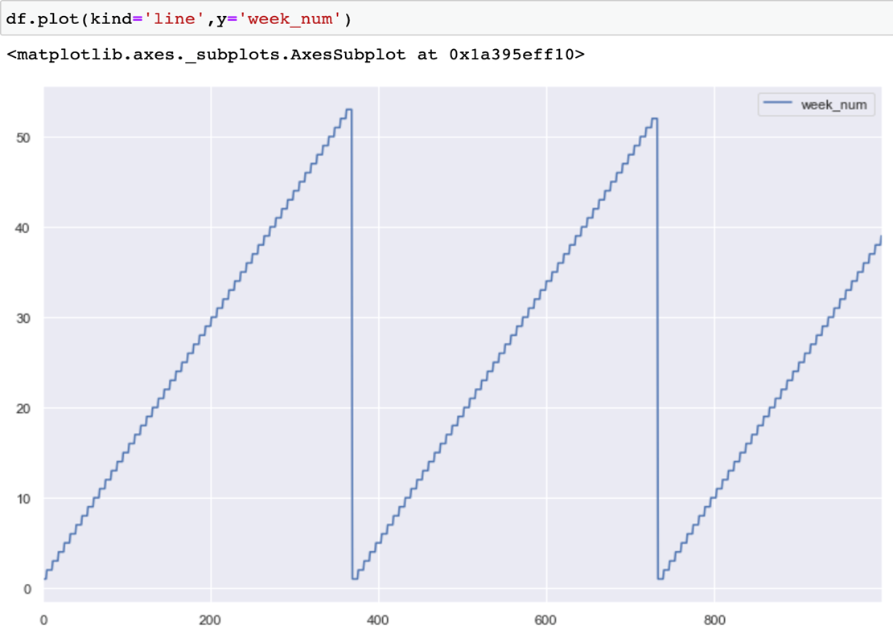
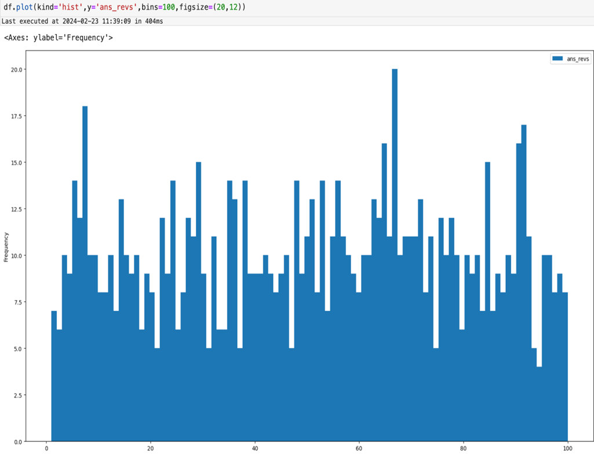
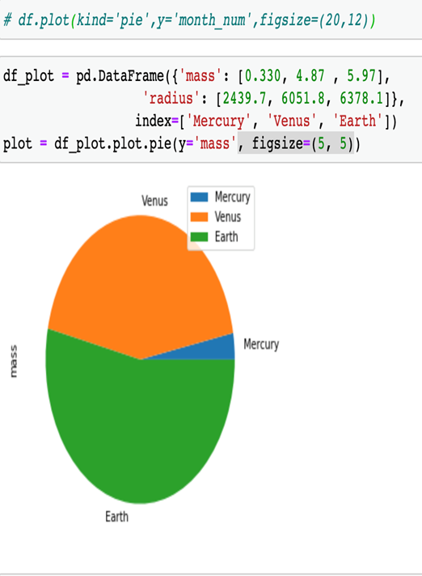
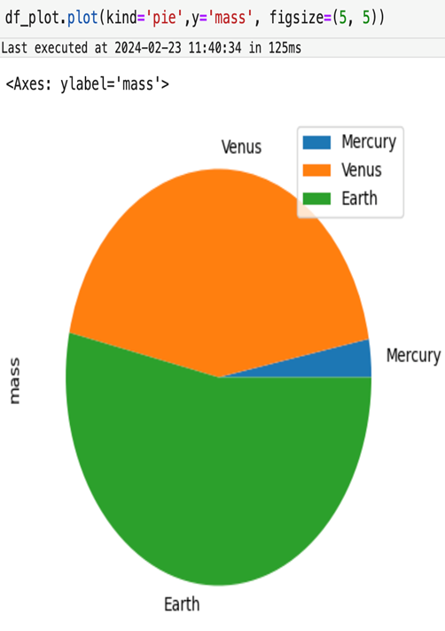
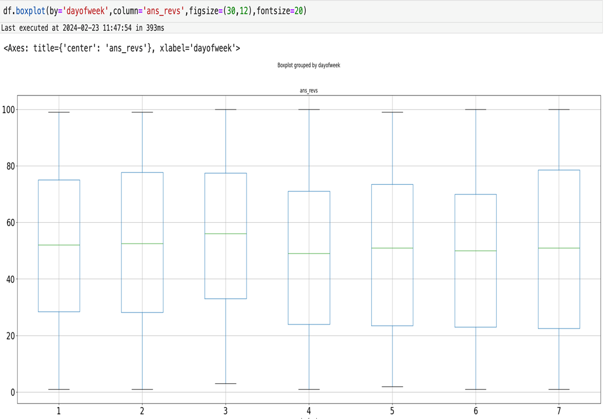
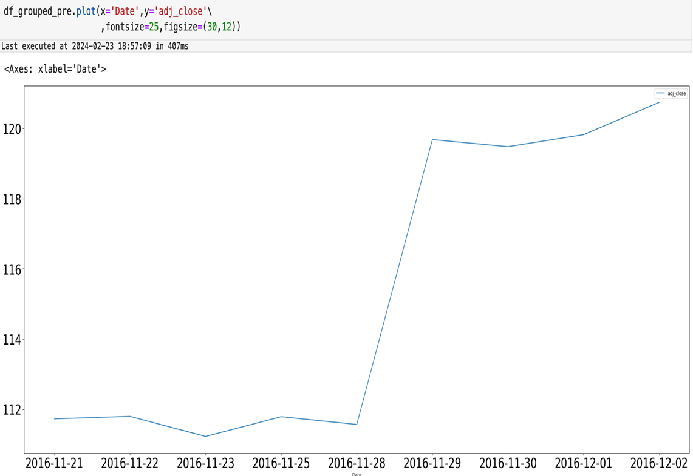

# 8.DataFrame时间序列处理与可视化

## 8.1 时间序列处理

### 8.1.1 dt 函数

1. `dt.date` 可以生成短日期形式数据
2. 两个 datetime 类型数据相减，可以利用 `dt.days` 计算日期差

<p align="center"></p>

### 8.1.2 日期转年月周

1. 参考下方示例和代码判断函数作用
2. 日期可以计算年/月/周序号/每周的日序号等
3. 一般在数据分析中很常见把日期转化成*周/月/序号*来聚合分析

<p align="center"></p>

### 8.1.3 小例子

1. 某个网站某分类每周 7 天的汇总回答人数
2. 可以看到周五是低点，周日，周一是高点，比如举办一些运营活动，不建议在周五举办，用户活跃较差，效果会打折扣

<p align="center"></p>

### 8.1.4 pd.to_datetime()

1. 某个网站某分类每周 7 天的平均回答人数
2. 可以看到周五是低点，周日，周一是高点，比如举办一些运营活动，不建议在周五举办，用户活跃较差，效果会打折扣

<p align="center"></p>

### 8.1.5 df.resample()

1. 关键参数 `rule`，按照数字 + 单位的规则
2. 必须具有 `datetime` 类似的索引

<div style="display: flex; justify-content: center; gap: 10px; align-items: center;">
  
  
</div>

## 8.2 画图

### 8.2.1 条线图

1. 参数与 `Series.plot` 比较接近，基本上在 `Series` 中的参数 `df.plot` 都有
2. 指定 `y =` ，是传递要绘制二维图像的纵列
3. `kind = line` 是默认值，也可以不写

<p align="center"></p>

### 8.2.2 直方图

1. `df.plot` 参数中，需要指定要绘制的系列，例如 `y=`
2. 需要指定 `kind` 参数
3. 其余参数例如调节图像大小等与 `Series.plot` 相似度比较高，可以参考 `Series.plot`

<p align="center"></p>

### 8.2.3 饼图

1. 饼图适用于对比某个特征下不同枚举值对应的次数分布，一般是聚合后的数据
2. 例如 `df_plot` 中三个 `index` 分别对应统计后的数值
3. 饼图会画出占比的大概情况
4. `plot.pie` 和 `plot` 可以实现相同的效果，pandas 画图的函数并非一一对应，还是比较灵活的

<div style="display: flex; justify-content: center; gap: 10px; align-items: center;">
  
  
</div>

### 8.2.4 箱线图

1. `df.boxplot` 可以画箱线图
2. 需要指定横轴，通过参数 `by`，这个列的含义是观察 y 的其中一个视角
3. 指定纵轴，通过参数 `column`
4. 对比不同 x 的枚举值下 y 的分布情况，往往会得出结论

<p align="center"></p>

## 8.3 剪切板复制数据

```python
pd.read_clipboard(
    sep=' '   # 分隔符 默认是空格 读取最近复制的内容 解析成 DataFrame
)
```

<div style="display: flex; justify-content: center; gap: 10px; align-items: center;">
  
  
</div>

## 8.4 画图

### 8.4.1 时间序列图

1. 与折线图接近
2. 区别在于横轴特定为日期
3. 日期可以解析为周，月，年等信息，又可以看出新的解读
4. 指标排查的分析中常用的就是时间序列图

<p align="center"></p>

### 8.4.2 可视化包学习建议

1. 必须掌握的是 **Matplotlib** 和 **Seaborn** 常见图形的画法
2. **Pyecharts / Bokeh / Plotly / Altair** 是不错的补充，尤其适合 **动态图** 场景
3. 低频工具包，在遇到特定的可视化问题时可参考使用

⭐ 常用工具包：

1. Matplotlib
2. Seaborn
3. Pyecharts
4. Bokeh
5. Plotly
6. Altair

📉 低频使用工具包：

7. ggplot
8. Pygal
9. VisPy
10. NetworkX
11. HoloViews
12. GeoPlotLib
13. Folium
14. Gleam
15. Vincent
16. mpld3
17. python-igraph
18. missingno
19. Mayavi2
20. Leather

