# 2.Seaborn统计关系绘图

## 2.1 统计关系图

`relpot` 函数

1. `x`, `y`：data 中的变量名
2. `hue`：将会产生具有不同颜色的元素的变量进行分组
3. `size`：将会产生具有不同尺寸的元素的变量进行分组
4. `style`：将会产生具有不同风格的元素的变量进行分组
5. `data`：`DataFrame` 长格式的 `DataFrame`
6. `palette`：色盘名、列表、或者字典，可选，用于 hue 变量的不同级别的颜色
7. `legend`：`"brief"`，`"full"`，或者 `False`，可选，用于决定如何绘制坐标轴
    - 当参数值为 `"brief"` 时，数值型的 hue 以及 size 变量将会被用等间隔采样值表示
    - 当参数值为 `"full"` 时，每组都会在坐标轴中被记录
    - 当参数值为 `False` 时，不会添加坐标轴数据，也不会绘制坐标轴
8. `kind`：类型，可选项为 `scaater` 及 `line`

```python
# 默认散点图
# plt.figure(figsize=(20,12))

tips = pd.read_csv('./tips_new.csv').iloc[:,1:]
sns.relplot(x="total_bill", y="tip", data=tips)

# sns.scatterplot(x="total_bill", y="tip", data=tips);
```

`tips.head ()`：

<p align="center"></p>

<p align="center">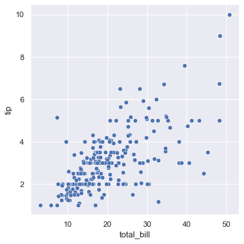</p>

## 2.2 散点图

（1） scatterplot 绘制

`scatterplot` 函数，大部分参数与 `relplot` 相同，不同的参数主要有：

1. `estimator`：pandas 方法的名称，或者可调用的方法，可以对纵轴变量进行聚合
2. `ci`：整数型或 `"sd"` 或 `None`，可以给出置信区间；新版本替换成 `errorbar`，下同
3. `ax`：绘制图像的坐标对象，否则使用当前坐标轴，方便结合 subplot
4. `hue` 控制了颜色，`style` 控制点的形状（可以不是一个参数，这个案例只是巧合）

```python
sns.scatterplot(x="total_bill", y="tip", hue="smoker", data=tips, legend='full')
sns.scatterplot(x="total_bill", y="tip", hue="smoker", style="smoker", data=tips)
```

<div style="display: flex; justify-content: center; gap: 10px; align-items: center;">
  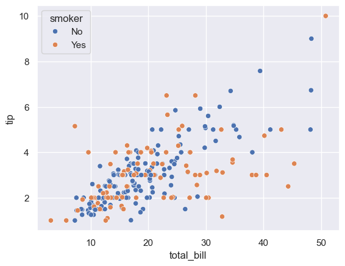
  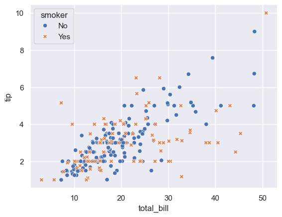
</div>

（2） relplot 绘制

1. `relplot` 默认绘制*散点图*而不是折线图
2. 当 `hue` 和 `style` 使用不同列的时候，在图形视觉上我们可以认为我们具备了多个维度观测图形的能力，例如分别按照颜色和图形的形状去展开分析
3. 注意：人的视觉对于*颜色*的敏感程度很高，对于*形状*的敏感程度较为一般
4. 当 `hue` 被指定为数值型变量的时候，那么颜色会按照深浅去绘制，从而在颜色上保留数值类型的大小关系，例如较小的数值颜色浅，较大的数值颜色深
5. 注意：当我们用 `relplot` 绘图的时候，系列的信息都会展会在*图形外侧*

```python
sns.relplot(x="total_bill", y="tip", hue="smoker", style="time", data=tips)
sns.relplot(x="total_bill", y="tip", hue="size", data=tips)
```

<div style="display: flex; justify-content: center; gap: 10px; align-items: center;">
  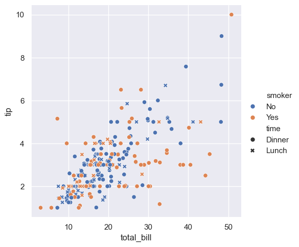
  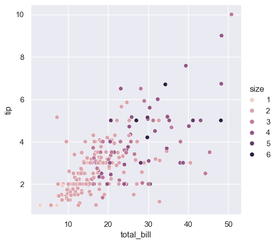
</div>

## 2.3 气泡图

 `relplot` 绘制气泡图

1. 当使用 `size` 参数时，会按照对应列决定气泡大小
2. 如果我们对气泡大小有要求，可以通过 `sizes` 参数来制定一个元组，其中依次包含最小值和最大值
3. 当 `size` 和 `hue` 指定相同的列，可以认为我们有两个信息去对数据进行分类与可视化，这种效果一般是更好的

```python
sns.relplot(x="total_bill", y="tip", size="size", hue='size',
            sizes=(15, 500), data=tips);        #sizes 接收元组，代表气泡最小和最大
```

<p align="center">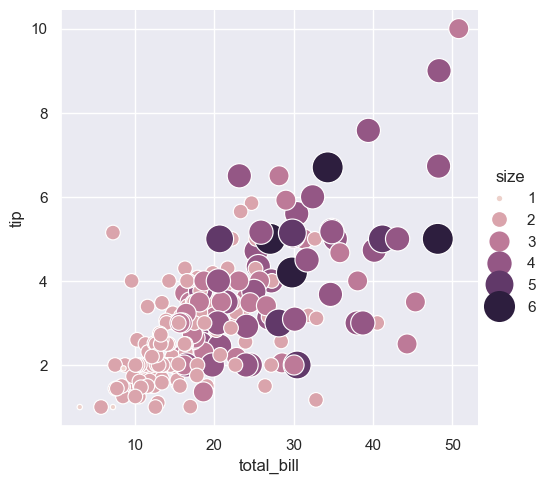</p>

## 2.4 折线图

### 2.4.1 基础折线图

（1） lineplot 绘制

1. `lineplot` 参数与 `scatterplot` 大多数相同，以下几点不同需要注意：
2. `dashes`：线的类型
    - 设置为 `True` 将使用默认的短划线代码
    - `dashes` 参数用列表时，列表长度必须和 `style` 分组个数相同
3. 横轴为时间的时候较多

```python
# 固定随机种子
np.random.seed(2024)

# 构造示例数据
# time 为 0~499 的序列，value 为标准正态随机数的累计和（随机游走）
df = pd.DataFrame(dict(
    time=np.arange(500),
    value=np.random.randn(500).cumsum()
))

# x 轴为 time，y 轴为 value，kind="line" 指定为折线图
g = sns.relplot(x="time", y="value", kind="line", data=df)
```

<p align="center"></p>

（2） relplot 绘制

1. 如果使用 `relplot` 画折线图，**需要指定** `kind='line'`
2. 当在 `x` 值唯一，但 `y` 值不唯一的情况下，折线图会默认给出均值和置信区间（如图中*阴影*所示）
3. 这一类情况一般适用于横轴数值为离散型
4. 如果实际绘图不需要置信区间，可以通过 `ci=None` 来取消置信区间

```python
sns.relplot(x="int_value", y="time", kind="line",
    		data=df.assign(int_value=np.ceil(df['value'])) # int_value为value列取整
)
```

<p align="center">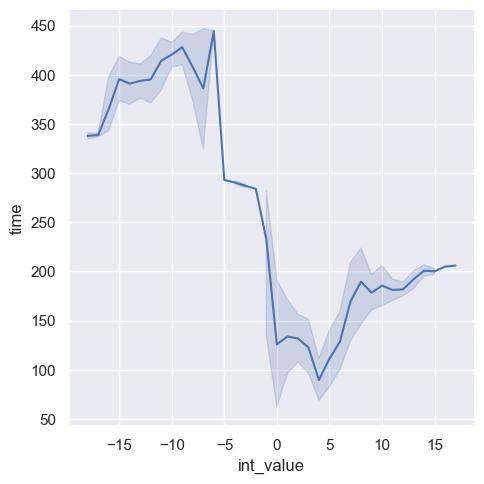</p>

### 2.4.2 分组折线图

（1） lineplot 绘制

1. `lineplot` 的参数 `hue` 会使得数据分组再后分别绘制图像，这与 `scatterplot` 有所不同
2. 默认情况下，只要 `x` 与 `y` 并非一一对应，`lineplot` 都会给出带有置信区间的折线图

```python
fmri = pd.read_csv('./seaborn_data/fmri.csv')
sns.lineplot(x="timepoint", y="signal", hue="event", data=fmri)
```

`fmri.head()`:

<p align="center"></p>

<p align="center">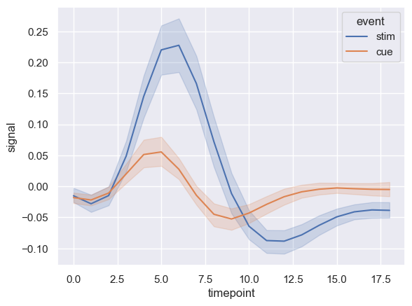</p>

（2） relplot 绘制

1. `style` 参数是可以指定利用哪个变量来决定折线的样式
2. 所以当同时指定了 `hue` 和 `style` 两个参数时，我们会得到 `2*2 = 4` 条折线图
3. 同时也是默认带置信区间
4. 当 `hue` 与 `style` 取相同列时候，可以画出 2 条折线，而且两条折现的颜色和形状分别因为 `hue` 参数和 `style` 参数而不同
5. 当我们想加强系列间对比效果的时候，可以指定 `hue` 和 `style` 为*相同参数*，适合做汇报

```python
sns.relplot(x="timepoint", y="signal", hue="region", style="event",
			kind="line", data=fmri)
			
sns.relplot(x="timepoint", y="signal", hue="event", style="event",
            kind="line", data=fmri)					
```

<div style="display: flex; justify-content: center; gap: 10px; align-items: center;">
  
  
</div>

### 2.4.3 多水平折线图

（1） relplot 绘制

1. 当 `hue` 参数为离散变量时，折线会根据数值大小显示同颜色的深浅
2. `style` 参数为离散变量，决定了折线形状的不同
3. `size` 参数决定了折线的*粗细*不同
4. 主要是突出 `hue` 列数值较大的系列的变化趋势，对于较小值系列趋势的变化呈现不那么明显
5. 如果没有颜色参数，想快速准确定位某条曲线，还是有一定难度

```python
dots = pd.read_csv('./seaborn_data/dots.csv').query("align=='dots'")

# hue和style都来自离散变量
sns.relplot(x="time", y="firing_rate", hue="coherence", style="choice", 
    		kind="line",data=dots)
    		
sns.relplot(x="time", y="firing_rate", size="coherence", style="choice",
            kind="line", data=dots)    		
```

`dots.head()`:

<p align="center"></p>

<div style="display: flex; justify-content: center; gap: 10px; align-items: center;">
  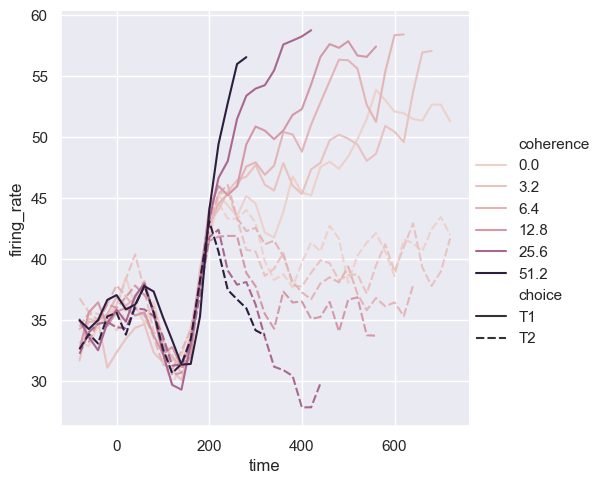
  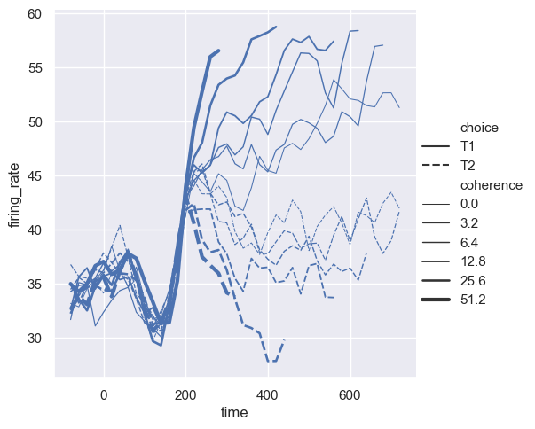
</div>

（2） lineplot 绘制

1. 为了弥补上一幅图的缺点，我们新加入了 `hue` 参数，并且指定了调色板 `palette` 参数
2. 当前的效果，可以认为，我们有能力快速指认一条折线，例如<font color="#548dd4">蓝色</font>实线/<font color="#d99694">粉色</font>虚线

```python
sns.lineplot(x="time", y="firing_rate", size="coherence", style="choice",
             hue = 'coherence', palette = 'Accent', data=dots)  		
```

<p align="center"></p>

## 2.5 多面绘图

1. 通过参数 `col` 对数据按列分组绘图每一列图对应参数列中不同取值下的*数据子集*不同取值生成不同列
2. 列的排列方向是按列展开当使用 `col=xxx` 时多个子图会*横向排列*每个图都是独立的数据绘制
3. 适用于想查看变量在不同分类下的分布差异时常用于对比不同组之间趋势或相关性区别当分析重点在*组内结构*而非组间关系时更合适
4. 参数 `row` 是按照 `row` 参数列分组绘图排列，按照*行的方向*展开
5. `height` 参数指定了图形高度
6. `estimator` 指定为 `None`，含义是不返回置信区间，默认为 `'mean'` 取平均

```python
sns.relplot(x="total_bill", y="tip", hue="smoker",
            col="time", data=tips)
          
# estimator=None不使用数据聚合              
sns.relplot(x="timepoint", y="signal", hue="subject",
            col="region", row="event", height=3,
            kind="line", estimator=None, data=fmri) 
```

<p align="center"></p>

<p align="center">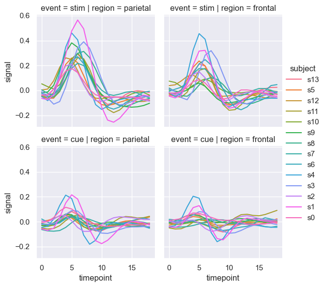</p>

