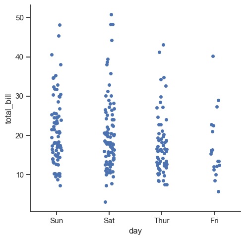
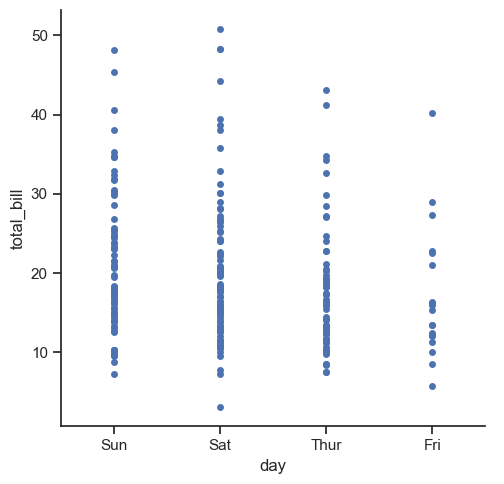
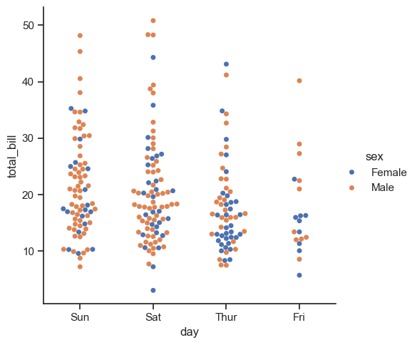
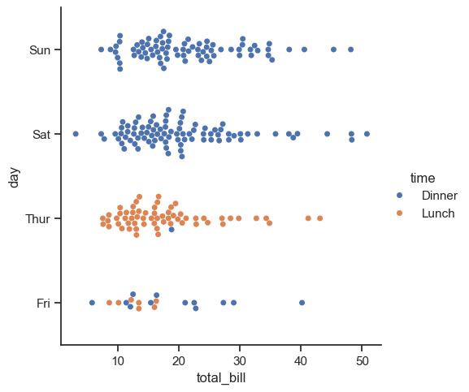
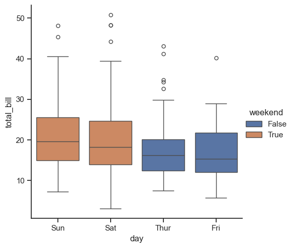
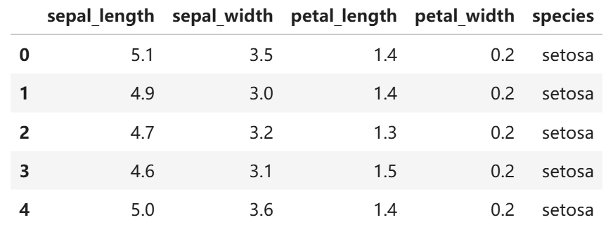
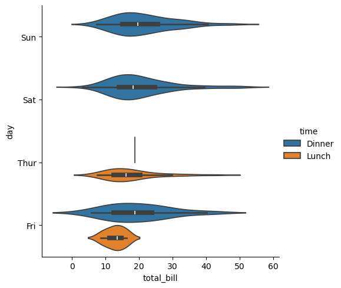
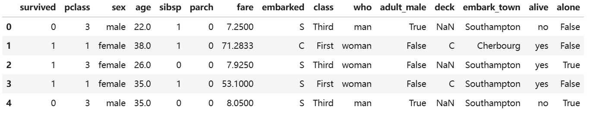
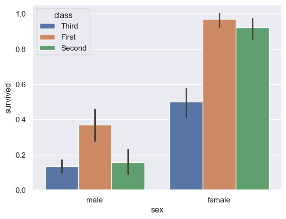

# 3.Seaborn分类数据绘图

## 3.1 catplot 类型

主要包含：

- 分类散点图
	- `stripplot()` (with kind="strip"; the default) catplot 默认图
	- `swarmplot()` (with kind="swarm")
- 分类分布图
	- `boxplot()` (with kind="box")
	- `violinplot()` (with kind="violin")
	- `boxenplot()` (with kind="boxen")
- 分类估计图
	- `pointplot()` (with kind="point")
	- `barplot()` (with kind="bar")
	- `countplot()` (with kind="count")

## 3.2 分类散点图

`catplot` 参数与 `relplot` 绝大部分相同，主要不同参数如下

1. `aspect` 每个面的纵横比
2. `orient` 方向，“v” | “h” 分别单标竖直方向和水平方向
3. 可以通过 `jitter` 参数来控制重复点是否抖动绘制
4. 注意：`catplot` 默认绘制分类散点图（左右有*发散*）

```python
sns.catplot(x="day", y="total_bill", data=tips)
sns.catplot(x="day", y="total_bill", jitter=False, data=tips) #jitter=False关闭抖动
```

<div style="display: flex; justify-content: center; gap: 10px; align-items: center;">
  
  
</div>

## 3.3 蜂群图

1. 关键参数 `x` 和 `y` 共同指定了分类基准
2. `hue` 决定了颜色
3. 如果想绘制 swarm 散点图（非重叠分类散点图），需要指定 `kind='swarm'`
4. swarm 散点图的限制是*数据集不能太大*，否则无法完成**不重叠**的要求
5. 调整 `x` 和 `y`，可以在视觉上使得分类散点图实现*转置*
6. `hue` 参数可以使得颜色成为一个区分维度
7. catplot 绘图后，系列信息会展示在画板外侧

```python
sns.catplot(x="day", y="total_bill", hue="sex", kind="swarm", data=tips)
# x与y对调即可绘制水平扫把图/蜂群图
sns.catplot(x="total_bill", y="day", hue="time", kind="swarm", data=tips);
```

<div style="display: flex; justify-content: center; gap: 10px; align-items: center;">
  
  
</div>

➤ 分组蜂群图：

1. 参数 `col` 使得数据按照 `time` 列分组绘图 然后按照列的方向展开
2. `aspect` 为图形的宽长比 (子图)

```python
# 显示与facet的多种关系
sns.catplot(x="day", y="total_bill", hue="smoker",
            col="time", aspect=.6,
            kind="swarm", data=tips)  # 按time展开列方向子图
```

<p align="center"></p>

➤ 分组蜂群图（2×2）：

1. 参数 `row` 使得数据按照 `sex` 列分组绘图 然后按照行的方向展开
2. 如果同时设置了 `col` 和 `row` 参数 则会展示矩阵形状的图形集
3. 观察右侧蓝色圆圈中的图例信息，可以判断出图形是先对数据集按照 row、col、hue 所对应的变量进行分组，再分别在各子图中绘制的

```python
sns.catplot(x="day", y="total_bill", hue="smoker",
            col="time", aspect=1.5, row="sex",
            kind="swarm", data=tips)  # 行列双维度展开图形矩阵
```

<p align="center"></p>

## 3.4 箱线图

1. 指定参数 `kind='box'`  , `catplot` 可以绘制箱线图
2. 指定 `x` 为分类基准
3. `y` 为被计算的列需要计算 `y` 的中位数、上四分位数、下四分位数
4. 箱线图常用在*数据 EDA* 过程中来判断分类变量和连续变量见的相关关系
5. 参数 `hue` 会实现 2 个功能
	- 实现分组，并且分别绘制箱线图用颜色
	- 将 `hue` 列不同组的数据区分开
	- 总结：可以实现“day” 和”smoker”两列交叉对比
6. 如果 `hue` 参数和 x 列存在包含关系，可以认为 `hue` 是针对 x 列进行一次强化展示 (新增了颜色信息)
7. `dodge` 参数：使用色调嵌套时，元素是否应沿分类轴移动,在这个例子中，因为 day 和 weekend 存在真包含关系，所以应该*禁用 dodge*，设置为 False
8. `boxenplot` 是*增强箱线图*，针可以理解为在 `boxplot` 基础上新增了很多分位数的计算，其余功能与 `boxplot` 相同
9. 如果想让每个系列颜色不同，可以指定 `palette` 参数

```python
sns.catplot(x="day", y="total_bill", kind="box", data=tips)
# sns.boxplot(x="day", y="total_bill", data=tips)

sns.catplot(x="day", y="total_bill", hue="smoker", kind="box", data=tips)

tips["weekend"] = tips["day"].isin(["Sat", "Sun"])
sns.catplot(x="day", y="total_bill", hue="weekend",
            kind="box", dodge=False, data=tips)

sns.boxenplot(x="color", y="price",
              data=diamonds.sort_values("color"), palette='Set2',
              hue='color', legend=False)
```

> [!NOTE] 📝 信息
> 箱子中间的线为中位数，上方的点为一些异常点

<div style="display: flex; justify-content: center; gap: 10px; align-items: center;">
  
  
</div>

<div style="display: flex; justify-content: center; gap: 10px; align-items: center;">
  
  
</div>

➤ 水平箱线图：

1. 水平方向的箱线图通过参数 `orient` 来指定
2. 如果没有指定 `x` 和 `y` 那么就默认按照 `DataFrame` 的各个列来绘图 且自动区分颜色

```python
sns.catplot(data=iris, orient="h", kind="box")  # 绘制水平箱线图，自动按列分组上色
```

`iris.head()`：

<p align="center"></p>

<p align="center"></p>

## 3.5 小提琴图

1. 小提琴图是通过展示密度曲线的方式来展示分布
2. `hue` 参数会实现分组绘制小提琴图
3. 通过 `catplot` 绘制小提琴图要指定 `kind='violin'`

`catplot` + `swarmplot` 叠加图：

- `catplot` 的 `inner` 参数决定了小提琴图中间的箱子是否被画出来 `None` 意味着不画
- 通过 `ax=g.ax` 使得 `swarmplot` 也在小提琴图上绘图
- `size` 参数为标记的直径大小控制 `swarmplot` 点的大小

```python
sns.catplot(x="total_bill", y="day", hue="time",
            kind="violin", data=tips)  
            
g = sns.catplot(x="day", y="total_bill", kind="violin", inner=None, data=tips)
sns.swarmplot(x="day", y="total_bill", color="k", size=3, data=tips, ax=g.ax)               
```

> [!NOTE] 📝 信息
> 隆起的地方越靠右代表平均值越大，白色的线代表中位数

<div style="display: flex; justify-content: center; gap: 10px; align-items: center;">
  
  
</div>

## 3.6 柱状图

（1） barplot 绘制

1. `barplot` 参数 `hue` 作用与 `catplot` 相同
2. `barplot` 绘图后，系列信息的展示是在画板内部的

```python
sns.barplot(x="sex", y="survived", hue="class", data=titanic)
```

`titanic.head()`：

<p align="center"></p>

<p align="center"></p>

（2） catplot 绘制

1. `palette` 参数为指定的调色板
2. `legend` 参数设置为 `False` 则不显示系列信息
3. 参数 `kind='count'` 则为计数统计图
4. 其中 `palette` 参数为 Matplotlib Colormap 的名字，例如 `ch:` 、`hls`、 `husl` 等

```python
sns.catplot(x="deck", kind="count", palette="ch:.25",
            data=titanic, hue="deck", legend=False)    # legend=False不展示系列信息
```

<p align="center"></p>

（3） countplot 绘制

1. `countplot` 参数与 `barplot` 完全相同
2. 指定 `y` 参数 那么就按照 `y` 为分类变量去做统计 `count`
3. `hue` 作用与 `catplot` 相同
4. `edgecolor` 为柱子边缘参数

```python
sns.countplot(y="deck", hue="class",
              palette="pastel", edgecolor=".6",      # edgecolor设置边框
              data=titanic)  
```

<p align="center"></p>

