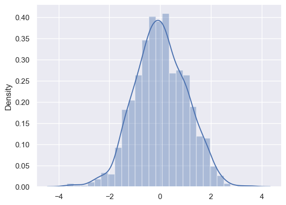
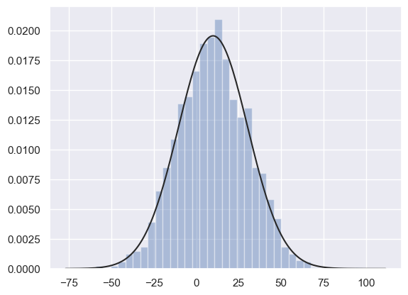
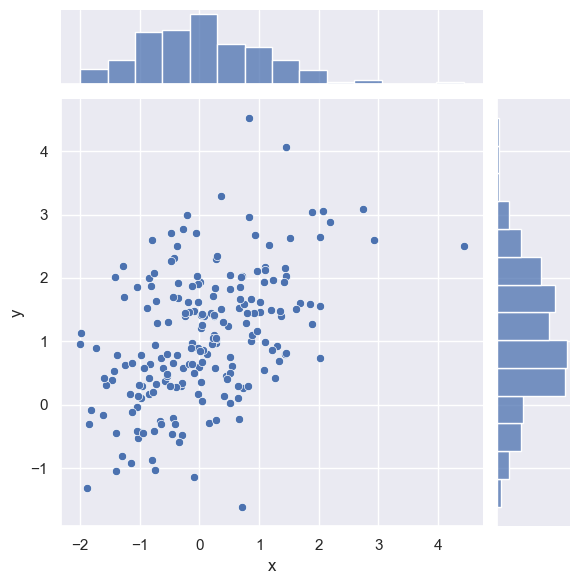
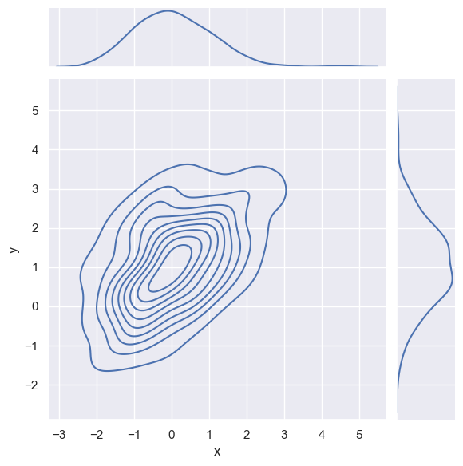
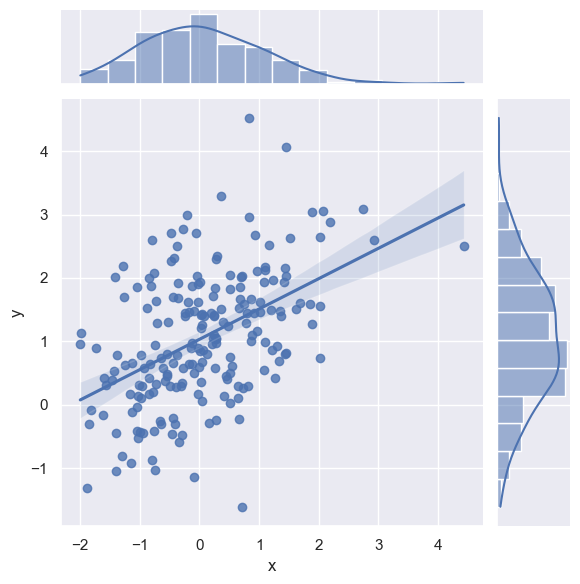

# 4.Seaborn变量分布绘图

## 4.1 直方图和密度图

（1） distplot 绘制

1. `a` : 可以是 Series、1 维数组或者列表
2. `bins` : 桶数
3. `hist`: 是否绘制直方图
4. `kde` : 是否绘制密度图，一定程度上和竖线*重复*
5. `rug` : 是否绘制竖线
6. `fit` : 拟合指定分布
7. `vertical` : 是否在 y 轴显示结果
8. 当前版本中 `distplot` 属于被警告函数，在 Seaborn 后续版本中会被取消，可以根据需求用 `histplot`/`kdeplot`/`rugplot` 来替换

说明：默认情况下 会绘制直方图和密度图 但是不会绘制竖线

```python
np.random.seed(2024)                    # 设置随机种子
x = np.random.normal(size=1000)         # 生成正态分布数据

sns.distplot(x)                         # 默认绘制直方图和密度曲线
sns.distplot(x, kde=True, rug=True)     
```

<div style="display: flex; justify-content: center; gap: 10px; align-items: center;">
  
  
</div>

➤ 拟合正态分布：

1. `fit` 参数后面给定的分布例如正态分布 可以给定 `stats.norm`
2. 结合结果来看变量还是比较符合正态分布的
3. `fit` 参数后面可以接其他的分布

```python
from scipy import stats                     # 导入统计分布
np.random.seed(2024)  
x = np.random.normal(10, 20, size=2000)   

sns.distplot(x, kde=False, fit=stats.norm)  # 拟合正态分布并绘图
```

<p align="center"></p>

（2） histplot 绘制

1. `histplot` 与 `distplot` 参数大多数相同
2. `stat` 为统计方法 包含 `count` `frequency` `probability` `percent` `density`
3. `histplot`/`kdeplot` 都可以接收 `DataFrame` 和指定列的方式绘图 这一点与前面的分类绘图/关系绘图已经对齐

```python
sns.histplot(x, kde=True, bins=20)        # 绘制直方图并叠加密度曲线
```

<p align="center"></p>

（3） kdeplot 绘制（密度图）

参数 `fill` 是否填充曲线下方

```python
np.random.seed(2024)
x = np.random.normal(0, 1, size=300)

sns.kdeplot(x, fill=True)               # 绘制密度曲线并填充下方区域
```

<p align="center"></p>

## 4.2 联合变量分布图

1. `x`、 `y` : 横轴和纵轴变量
2. 默认在 `x` 轴和 `y` 轴周边绘制直方图，用 `x` 和 `y` 绘制散点图
3. `kind` 可选：`'scatter'`、`'reg'`、`'resid'`、`'kde'`、`'hex'`
	- 参数 `kind='kde'`，指定用密度曲线去绘制图表
	- 参数 `kind='reg'`
		- 指定用密度图和直方图绘制 `x` 和 `y` 的边界
		- 用散点图 + 回归直线的方式来绘制主画板
		- 总体来说，`reg` 参数下图形使用频率更高

```python
np.random.seed(2024)  # 设置随机种子
mean, cov = [0, 1], [(1, .5), (.5, 1)]                # 设置均值和协方差矩阵
data = np.random.multivariate_normal(mean, cov, 200)  # 生成二维正态分布数据
df = pd.DataFrame(data, columns=["x", "y"])           # 构建DataFrame

sns.jointplot(x="x", y="y", data=df)           # 绘制联合分布图 默认散点+边缘直方图
sns.jointplot(x="x", y="y", data=df, kind='kde')      # 二维密度图+边缘密度曲线
sns.jointplot(x="x", y="y", data=df,kind='reg')       # 散点回归图+密度直方图
```

<div style="display: flex; justify-content: center; gap: 10px; align-items: center;">
  
  
</div>

<p align="center"></p>

## 4.3 成对关系图

主要辅助作 EDA 探索分析

（1） pairplot 绘制

1. `data`：数据框
2. `vars` ：变量名列表（参与绘图的列）
3. `kind` ：非对角线图形，可选 `'scatter'`、 `'reg'`
4. `diag_kind` : 对角线图形，可选 `'auto'`、 `'hist'` 、`'kde'`
5. `height` : 高度（子图）
6. `aspect` : 宽长比

```python
# sns.load_dataset("iris")
g = sns.pairplot(iris)            # 绘制成对关系图
g.fig.set_size_inches(10, 6)      # 设置整体图长度和高度
```

<p align="center"></p>

（2） PairGrid 绘制

1. 与 `pairplot` 参数大部分相同，但是少了 `diag_kind` 和 `kind`
2. 需要通过 `map_diag` 和 `map_offdiag` 方法去指定绘图形状
3. 这两个方法只需要传入 Seaborn 或者 Matplotlib 的绘图函数
4. 可以通过 `hue` 参数来指定分组标准

```python
# g.map_diag(sns.histplot)
# g.map_offdiag(sns.kdeplot, n_levels=6)
# g.map(sns.kdeplot)

g = sns.PairGrid(iris,hue='species')      # 创建PairGrid对象，按species分组
g.map_diag(sns.kdeplot)                   # 对角线绘密度图
g.map_offdiag(sns.scatterplot)            # 非对角线绘散点图
g.fig.set_size_inches(10,7)              # 设置整体图长度和高度
```

<p align="center"></p>

