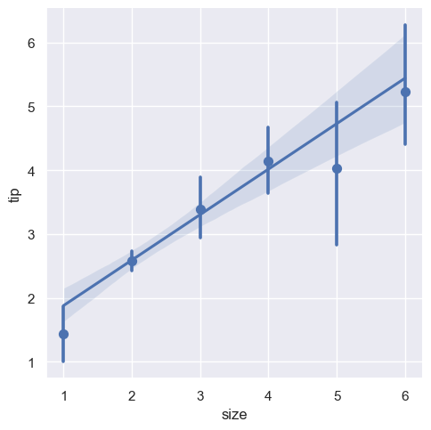
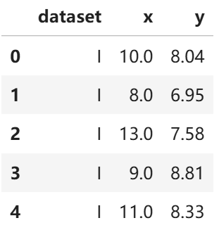
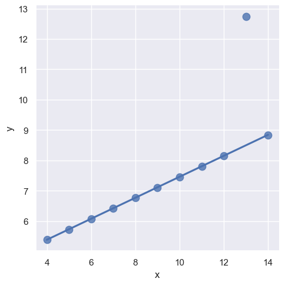
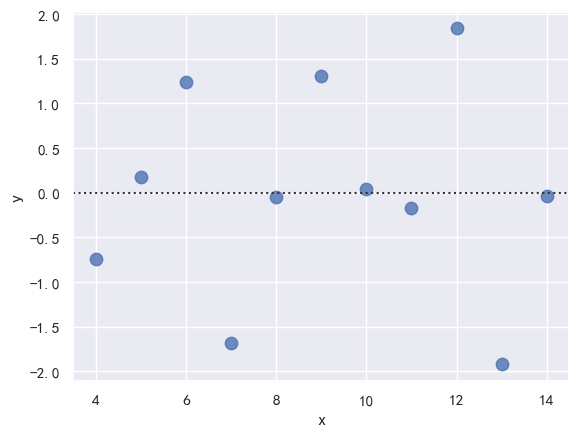
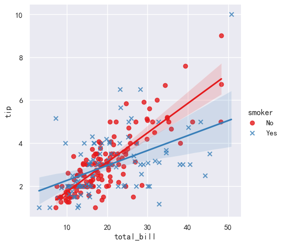
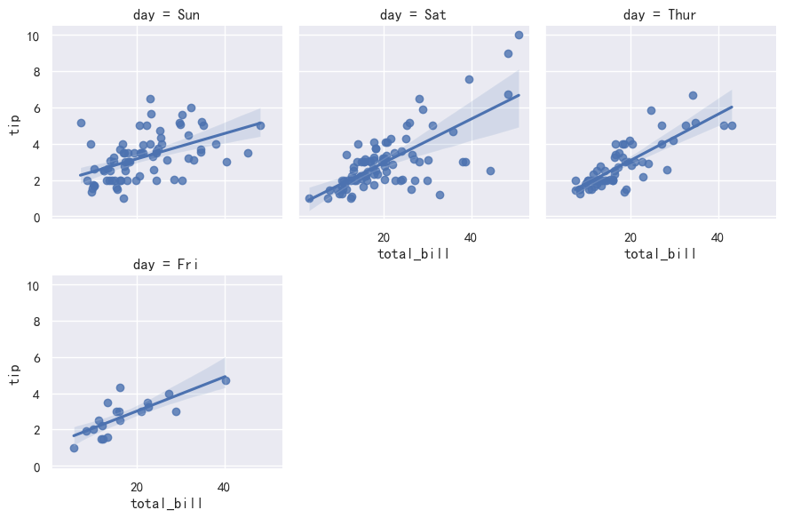

# 5.Seaborn曲线拟合绘图

## 5.1 线性关系图

### 5.1.1 单图绘制

（1） regplot 绘制

1. `data` ：DataFrame
2. `x_ci`： 可选置信区间计算方法 , `'ci'`、 `'sd'`
3. `fit_reg`: 是否拟合线性方程
4. `ci` : 置信水平（0~100）
5. `logistic` : 是否用逻辑回归拟合
6. `lowess` : 启用非参数拟合
7. `robust` : 是否使用*稳健估计*
8. `logx` : 是否使用 `y~log(x)` 的线性回归

```python
sns.regplot(x="total_bill", y="tip", data=tips)    # 散点图+线性回归拟合
```

<p align="center"></p>

（2） lmplot 绘制

➤ lmplot vs regplot：

1. `regplot` 接受多种格式的 `x` 和 `y` 变量 包括简单的 numpy 数组 pandas Series 对象 或者作为对传递给 `data` 的 pandas DataFrame 对象
2. 这种数据格式被称为“长格式”或“整齐”数据
3. 除了这种输入的灵活性之外 `regplot` 拥有 `lmplot` 一个子集的功能 所以我们将使用后者来演示它们

```python
# lmplot要求x和y是列名字符串，size虽然为数值，但是属于离散型
sns.lmplot(x="size", y="tip", data=tips)
```

<p align="center"></p>

➤ x_estimator 用法：

1. `x_estimator` 是指需要对纵轴统计的统计函数，可以接受 numpy 的函数
2. 默认情况下，会绘出回归直线和置信区间
3. 默认情况下，拟合一元一次方程曲线

```python
# 指定对x分组后的y均值再做回归
sns.lmplot(x="size", y="tip", data=tips, x_estimator=np.mean)  
```

<p align="center"></p>

➤ scatter_kws + ci 用法：

1. `scatter_kws` 参数指定了点的大小
2. `ci` 确定了是否返回置信区间

```python
sns.lmplot(x="x", y="y", data=anscombe.query("dataset == 'III'"),
           ci=None, scatter_kws={"s": 80})  # 不显示置信区间，点大小为80

sns.lmplot(x="x", y="y", data=anscombe.query("dataset == 'III'"),
           scatter_kws={"s": 80})           # 默认显示置信区间，点大小为80
```

anscombe.head()：

<p align="center"></p>

<div style="display: flex; justify-content: center; gap: 10px; align-items: center;">
  
  
</div>

➤ robust 用法：

1. `robust` 参数为 `True` 代表对于当前数据集，会先去除掉异常点后再进行回归方程
2. 这个功能在做 2 个变量线性关系探查的过程中，是需要指定的避免被异常值影响回归估计

```python
sns.lmplot(x="x", y="y",
           data=anscombe.query("dataset == 'III'"),
           robust=True, ci=None,
           scatter_kws={"s": 80})          # 使用稳健回归，去除异常点后再拟合
```

<p align="center"></p>

### 5.1.2 多图对比

（1） regplot + subplot2grid

1. 使用 `subplot2grid` 可以在一个大画布中灵活放置多个子图
2. `regplot` 可以通过 `ax` 参数将图绘制到指定子图上
3. 通过控制 `scatter_kws`、`ci` 和 `order` 可以观察不同数据集的拟合效果差异

```python
anscombe = pd.read_csv('./seaborn_data/anscombe.csv')  # 读取数据
plt.figure(figsize=(20, 12))  # 设置画布大小

a1 = plt.subplot2grid((4, 4), (0, 0), rowspan=2, colspan=2)  # 左上子图
a2 = plt.subplot2grid((4, 4), (0, 2), rowspan=2, colspan=2)  # 右上子图
a3 = plt.subplot2grid((4, 4), (2, 0), rowspan=2, colspan=2)  # 左下子图

sns.regplot(x="x", y="y", data=anscombe.query("dataset == 'I'"),
            ci=None, scatter_kws={"s": 80}, ax=a1)  # Data1线性关系散点图
a1.set_xticklabels(labels=np.arange(4, 16, 2), fontsize=20)  # 设置x刻度
a1.set_yticklabels(labels=np.arange(4, 12, 1), fontsize=20)  # 设置y刻度
a1.set_title('Data1: 线性关系散点图', fontsize=30)

sns.regplot(x="x", y="y", data=anscombe.query("dataset == 'II'"),
            ci=None, scatter_kws={"s": 80}, ax=a2)  # Data2线性拟合效果差
a2.set_title('Data2: 线性拟合效果差', fontsize=30)

sns.regplot(x="x", y="y", data=anscombe.query("dataset == 'II'"),
            order=2, ci=None, scatter_kws={"s": 80}, ax=a3)  # Data2二次拟合效果
a3.set_title('Data2: 二次拟合效果', fontsize=30)

plt.suptitle('reg拟合效果', fontsize=50, color='g', alpha=1)  # 总标题
plt.tight_layout(w_pad=0.5, h_pad=1.0)  # 调整布局
plt.show()
```

<p align="center"></p>

（2） 多种拟合图对比

线性拟合 vs 逻辑曲线拟合

```python
tips["big_tip"] = (tips.tip / tips.total_bill) > .15  # 生成big_tip分类变量

sns.lmplot(x="total_bill", y="big_tip",
           data=tips, y_jitter=.03)  # 线性拟合，y值抖动
           
sns.lmplot(x="total_bill", y="big_tip",
           data=tips, logistic=True,y_jitter=.03) # 逻辑曲线拟合，逻辑曲线实际在分类                 
```

<div style="display: flex; justify-content: center; gap: 10px; align-items: center;">
  
  
</div>

## 5.2 拟合残差图

`residplot` 函数

1. `residplot` 参数与 `lmplot` 参数相同
2. 观察残差在 `y=0` 上下的分布 可以确认残差是否随机
3. 如果残差有明显规律 可以认为拟合曲线效果欠佳

```python
sns.residplot(x="x", y="y",data=anscombe.query("dataset == 'I'"),
              scatter_kws={"s": 80})      # 绘制残差图，点大小为80
```

> [!TIP] 💡 提示
>
> 残差（residual） = 真实值 - 拟合值
>
> 理想情况：残差应该随机分布在 0 附近，没有规律
>
> 非理想情况：残差呈现明显规律（曲线、锯齿、波动），说明模型没有捕捉到数据的趋势

<p align="center"></p>

➤ 拟合残差图对比：

```python
sns.residplot(x="x", y="y",
              data=anscombe.query("dataset == 'II'"),
              scatter_kws={"s": 80})           # 残差曲线规律明显
              
 sns.residplot(x="x", y="y",
              data=anscombe.query("dataset == 'II'"),
              order=2, scatter_kws={"s": 80})  # 二次拟合后，曲线规律减弱          
```

<div style="display: flex; justify-content: center; gap: 10px; align-items: center;">
  
  
</div>

## 5.3 分组线性回归图

1.`hue` 参数会在同一个画板上完成两份数据集的拟合、实现分组回归
2.`markers` 是可以指定不同数据点的形状、配合 `hue` 可以指定颜色、所以右图的两份拟合曲线区分更明显

```python
# 使用hue分组、markers区分形状、palette区分颜色
sns.lmplot(x="total_bill", y="tip", hue="smoker", data=tips,
           markers=["o","x"], palette="Set1")  
```

<p align="center"></p>

## 5.4 矩阵线性关系图

1. `col` 和 `row` 参数可以让 `lmplot` 绘制矩阵结构的图形集
2. `hue` 参数作用不变
3. 相当于一张图展示了 8 份数据的散点与回归拟合曲线

```python
g = sns.lmplot(x="total_bill", y="tip", hue="smoker",
               col="time", row="sex", data=tips)
g.fig.set_size_inches(10, 7)  # 设置整体图集大小
```

<p align="center"></p>

➤ col_wrap 用法：

1. 指定了 `col` 参数同时、指定了 `col_wrap` 数量、那么排列会按照参数进行
2. 这里面就是不能与 `row` 参数一起使用了

```python
sns.lmplot(x="total_bill", y="tip", col="day", data=tips,
           col_wrap=3, height=3)          # 每行3列
```

<p align="center"></p>

➤ aspect 用法：

1. 可以通过设置宽长比来使得整体图集大小合适
2. `aspect` 参数没有绝对合适的默认值、需要调整来判断合适的大小

```python
sns.lmplot(x="total_bill", y="tip", col="day", data=tips,
           aspect=.5)
```

<p align="center"></p>

## 5.5 多变量图集

`pairplot` 函数

1. 参数指定 `x_vars` 和 `kind`，就会按照 `x_vars` 每一列绘制一张图
2. 通过设置 `height` 和 `aspect` 来使得整体图集大小合适

```python
sns.pairplot(tips, x_vars=["total_bill", "size"], y_vars=["tip"],
             hue="smoker", height=5, aspect=.8, kind="reg")
```

<p align="center"></p>


